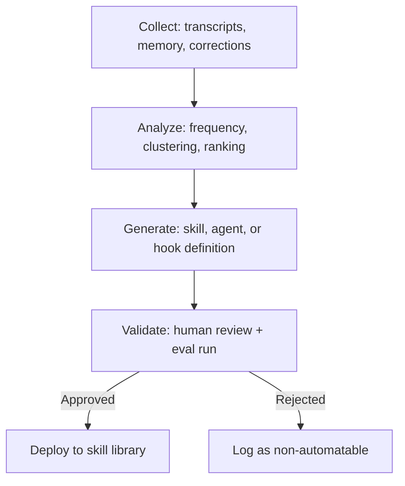

# Introspective Skill Generation: Mining Agent Patterns to Create New Skills and Agents

> Introspective skill generation is a workflow where a dedicated analysis agent mines session transcripts and persistent memory for recurring corrections, manual interventions, and repeated task sequences — then produces concrete skill files, agent definitions, or hook configurations to automate them.

## The Manual Bottleneck in Agent Improvement

Most agent improvements start the same way: a human reads session transcripts, notices a recurring correction, and writes a new skill or instruction to prevent it. Rather than waiting for someone to notice that every session runs lint after edit, the agent itself can surface that pattern and scaffold the automation directly.

The [continuous improvement loop](continuous-agent-improvement.md) depends on a human noticing patterns, categorizing root causes, and writing the fix. This works when teams are small and sessions are few. As agent usage scales — more sessions, more developers, more repositories — the observation step becomes the bottleneck. Manual review does not scale: the volume of transcript data grows faster than any individual's capacity to read it systematically.

Introspective skill generation closes that gap by delegating the pattern-mining step to the agent itself.

## How It Works

The workflow has four stages: collect, analyze, generate, and validate.



### Collect

Gather raw material from agent sessions:

- **Transcripts** — full session logs showing tool calls, corrections, and outcomes. Claude Code stores subagent transcripts at `~/.claude/projects/{project}/{sessionId}/subagents/` as JSONL files. [Source: [Claude Code sub-agents docs](https://code.claude.com/docs/en/sub-agents)]
- **Persistent memory** — corrections and constraints accumulated across sessions. Claude Code subagents with the `memory` field enabled maintain a persistent directory that survives across conversations. [Source: [Claude Code sub-agents docs](https://code.claude.com/docs/en/sub-agents)]
- **User interventions** — points where a human corrected, redirected, or overrode the agent mid-session

The collection step does not require new tooling. Transcripts already exist. The gap is that no one systematically reads them.

### Analyze

Feed the collected material to an analysis agent — a read-only subagent with access to transcript files and memory directories. The agent identifies:

- **Repeated corrections** — the same fix applied across multiple sessions (e.g., "always add error handling to API calls," "run tests before committing")
- **Frequent manual steps** — tasks the user performs every session that the agent could handle (e.g., checking for broken links, validating imports)
- **Recurring failure-then-fix sequences** — patterns where the agent makes a predictable mistake and the user applies the same correction

Agents can analyze evaluation transcripts and refactor tools based on the results — Anthropic reports using this approach internally to optimize tool implementations. [Source: [Anthropic — Writing Tools for Agents](https://www.anthropic.com/engineering/writing-tools-for-agents)] The same transcript-analysis capability applies directly to mining session logs for recurring corrections and manual steps: the agent reads transcripts, identifies patterns by frequency, and proposes automations in the same way it proposes tool improvements.

Rank candidates by frequency and impact. A correction that appears in 80% of sessions is a stronger automation candidate than one that appears in 10%.

### Generate

For each high-ranking pattern, the agent produces one of three artifacts:

| Pattern Type | Output Artifact | Example |
|---|---|---|
| Repeated single-step action | Skill definition | "Run lint after every file edit" |
| Multi-step recurring workflow | Agent definition | "Review PR, check test coverage, validate links" |
| Predictable mistake with known fix | Hook or rule | "Block commits with unresolved merge markers" |

Claude Code supports creating custom subagents as markdown files with YAML frontmatter defining the name, description, tools, model, and system prompt. [Source: [Claude Code sub-agents docs](https://code.claude.com/docs/en/sub-agents)] The generation step produces these files directly — a skill markdown file, an agent markdown file at `.claude/agents/`, or a hook configuration entry.

The `/agents` command in Claude Code can also generate subagent configurations from natural language descriptions, which means the analysis agent can describe the needed agent and delegate the scaffolding to Claude Code's built-in generation. [Source: [Claude Code sub-agents docs](https://code.claude.com/docs/en/sub-agents)]

### Validate

Generated artifacts require human review before deployment. This is the critical gate that prevents over-automation.

Review criteria:

- **Is this actually automatable?** Some corrections are context-dependent and require judgment. An agent that always applies a rule that only sometimes applies makes things worse.
- **Does it conflict with existing skills or agents?** New skills that overlap with existing ones create ambiguity in tool selection.
- **Does it generalize?** A pattern observed in one project may not apply across projects. Scope the generated skill or agent appropriately — project-level (`.claude/agents/`) vs. user-level (`~/.claude/agents/`). [Source: [Claude Code sub-agents docs](https://code.claude.com/docs/en/sub-agents)]

After approval, run the new skill or agent against a held-out set of tasks to confirm it resolves the target pattern without introducing regressions.

## Building the Analysis Agent

A practical implementation uses a read-only Claude Code subagent:

```markdown
---
name: pattern-miner
description: Analyze agent transcripts and memory to identify automation candidates
tools: Read, Grep, Glob, Bash
model: sonnet
memory: project
---

You analyze agent session transcripts and persistent memory files.

1. Read transcript files from the provided session directory
2. Identify repeated corrections, manual interventions, and recurring failures
3. Rank patterns by frequency across sessions
4. For each top pattern, propose a skill, agent, or hook definition
5. Save findings to your memory for cross-session accumulation
```

This agent uses persistent project-scoped memory so its findings accumulate across analysis runs. [Source: [Claude Code sub-agents docs](https://code.claude.com/docs/en/sub-agents)]

## Risks of Over-Automation

Not every pattern should become a skill. Automating context-dependent decisions removes human judgment from situations that need it. Warning signs:

- The correction depends on information outside the transcript (business context, user intent, deployment environment)
- The pattern appears frequently but the correct response varies each time
- The proposed automation changes behavior the user might want to control case-by-case

When the analysis agent surfaces these, log them as "non-automatable patterns" rather than forcing a skill definition. These patterns may still inform instruction updates or documentation rather than automated tooling.

## When This Backfires

Three specific conditions where the workflow produces negative returns:

- **Sensitive data in transcripts.** Session logs frequently contain API keys, credentials, database connection strings, and PII entered during debugging. Feeding these transcripts to an analysis agent exposes that data. Before running pattern-miner, audit transcript retention and redact or exclude sessions containing credentials.
- **False-positive pattern noise.** The analysis agent ranks candidates by frequency, but frequency is not the same as automatable. A correction that appears in 60% of sessions may reflect a project-specific quirk that resolves once a refactor completes — not a durable automation target. Human review of ranked candidates is mandatory, not optional.
- **Analysis cost at scale.** Reading and analyzing 40 transcript files with a Sonnet-class model consumes substantial tokens. Running pattern-miner on every session directory daily quickly becomes expensive. Schedule analysis runs on a cadence (weekly or after a threshold of new sessions) and scope them to the most active repositories.

## Integration with Existing Workflows

This workflow connects to established patterns:

- **Input**: [Agent Transcript Analysis](../verification/agent-transcript-analysis.md) provides the method for feeding transcripts back to agents
- **Loop**: [Continuous Agent Improvement](continuous-agent-improvement.md) defines the observe-categorize-update-verify cycle that this workflow accelerates
- **Output**: [Skill Library Evolution](../tool-engineering/skill-library-evolution.md) is where generated skills land
- **Memory**: [Agent Memory Patterns](../agent-design/agent-memory-patterns.md) accumulates the non-obvious corrections that serve as analysis input

## Example

A team notices that developers manually run `npm run lint -- --fix` after nearly every Claude Code edit session. The pattern-miner agent confirms this by scanning 40 recent transcripts:

```bash
# Run the pattern-miner agent against the last 40 sessions
claude -a pattern-miner "Analyze transcripts in ~/.claude/projects/acme-app/ for recurring manual steps"
```

The agent reports:

```
Pattern: "Run lint --fix after file edit" — found in 34/40 sessions (85%)
Type: Repeated single-step action
Recommendation: Skill definition — PostToolUse hook on file writes
```

The team reviews the recommendation, approves it, and the agent generates a hook configuration:

```json
{
  "hooks": {
    "PostToolUse": [
      {
        "matcher": "Write|Edit",
        "command": "npm run lint -- --fix $CLAUDE_FILE_PATH"
      }
    ]
  }
}
```

After deploying the hook, the team re-runs the pattern-miner on 20 new sessions and confirms the manual lint step drops to 0%.

## Key Takeaways

- Delegate pattern-mining to a dedicated analysis agent rather than relying on humans to read all transcripts
- Rank automation candidates by frequency and impact — automate the 80% patterns, not the edge cases
- Generate concrete artifacts (skill files, agent definitions, hook configs) rather than abstract recommendations
- Gate every generated artifact with human review to prevent over-automation of context-dependent decisions
- Use persistent memory so the analysis agent accumulates findings across sessions rather than starting fresh

## Related

- [Agent Transcript Analysis](../verification/agent-transcript-analysis.md)
- [Continuous Agent Improvement](continuous-agent-improvement.md)
- [Skill Library Evolution](../tool-engineering/skill-library-evolution.md)
- [Agent Memory Patterns](../agent-design/agent-memory-patterns.md)
- [Eval-Driven Tool Development](eval-driven-tool-development.md)
- [Content Skills Audit](content-skills-audit.md)
