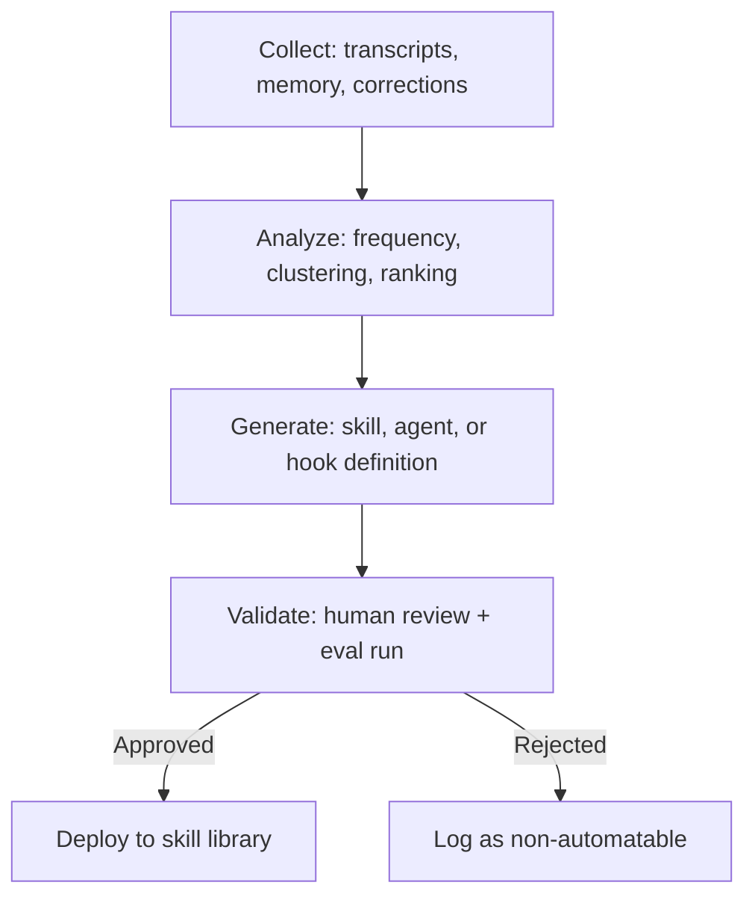

# Introspective Skill Generation: Mining Agent Patterns to Create New Skills and Agents

> Introspective skill generation is a workflow where an analysis agent mines session transcripts and memory for recurring patterns, then generates skills or agents automatically.

## The manual bottleneck in agent improvement

Most agent improvements start the same way. A human reads session transcripts, notices a recurring correction, and writes a new skill or instruction to prevent it. Rather than wait for someone to notice that every session runs lint after an edit, the agent itself can surface that pattern and scaffold the automation directly.

The [continuous improvement loop](continuous-agent-improvement.md) depends on a human noticing patterns, sorting root causes, and writing the fix. This works when teams are small and sessions are few. As agent use grows — more sessions, more developers, more repositories — the observation step becomes the bottleneck. Manual review does not scale. The volume of [transcript data](../verification/agent-transcript-analysis.md) grows faster than any one person can read it systematically.

Introspective skill generation closes that gap by delegating the pattern-mining step to the agent itself.

## How it works

The workflow has four stages: collect, analyze, generate, and validate.


```mermaid
graph TD
    A[Collect: transcripts, memory, corrections] --> B[Analyze: frequency, clustering, ranking]
    B --> C[Generate: skill, agent, or hook definition]
    C --> D[Validate: human review + eval run]
    D -->|Approved| E[Deploy to skill library]
    D -->|Rejected| F[Log as non-automatable]
```

## Collect: gathering raw material from agent sessions

Gather raw material from agent sessions:

- Transcripts — full session logs showing tool calls, corrections, and outcomes. Claude Code stores subagent transcripts at `~/.claude/projects/{project}/{sessionId}/subagents/` as JSONL files. [Source: [Claude Code sub-agents docs](https://code.claude.com/docs/en/sub-agents)]
- Persistent memory — corrections and constraints gathered across sessions. Claude Code subagents with the `memory` field enabled keep a directory that survives across conversations. [Source: [Claude Code sub-agents docs](https://code.claude.com/docs/en/sub-agents)]
- User interventions — points where a human corrected, redirected, or overrode the agent mid-session

The collection step needs no new tooling. Transcripts already exist. The gap is that no one reads them systematically.

## Analyze: mining sessions for recurring patterns

Feed the collected material to an analysis agent — a read-only subagent with access to transcript files and memory directories. The agent finds:

- Repeated corrections — the same fix applied across multiple sessions, for example "always add error handling to API calls" or "run tests before committing"
- Frequent manual steps — tasks the user performs every session that the agent could handle, for example checking for broken links or validating imports
- Recurring failure-then-fix sequences — patterns where the agent makes a predictable mistake and the user applies the same correction

Agents can analyze evaluation transcripts and refactor tools based on the results. Anthropic reports using this approach internally to improve tool implementations. [Source: [Anthropic — Writing Tools for Agents](https://www.anthropic.com/engineering/writing-tools-for-agents)] The same transcript-analysis works for mining session logs. The agent reads transcripts, finds patterns by frequency, and proposes automations the same way it proposes tool improvements.

OpenAI describes a production self-improving agent loop in the same shape — an agent that mines its own runs and generates improvements, built on Codex. [Source: [OpenAI — Building self-improving tax agents with Codex](https://openai.com/index/self-improving-tax-agents/)]

A second variant skips autonomous transcript-mining and captures a demonstrated workflow instead. The user performs a task once and the tool turns that demonstration straight into a reusable skill. OpenAI Codex shipped a "Record & Replay" feature in this shape, capturing a demonstrated workflow and converting it into a reusable skill. [Source: [OpenAI Codex changelog (2026-06-18)](https://developers.openai.com/codex/changelog)] Cursor's `/automate skill` confirms the same demonstration-to-skill direction, likewise turning a demonstrated workflow into a reusable skill. [Source: [Cursor changelog (2026-06-18)](https://cursor.com/changelog)] The two approaches complement each other. Demonstration-capture needs an explicit demonstration but no historical corpus; transcript-mining mines patterns from sessions already on disk.

Rank candidates by frequency and effect. A correction that appears in 80% of sessions is a stronger automation candidate than one that appears in 10%.

## Generate: producing a concrete artifact

For each high-ranking pattern, the agent produces one of three artifacts:

| Pattern type | Output artifact | Example |
|---|---|---|
| Repeated single-step action | Skill definition | "Run lint after every file edit" |
| Multi-step recurring workflow | Agent definition | "Review PR, check test coverage, validate links" |
| Predictable mistake with known fix | Hook or rule | "Block commits with unresolved merge markers" |

Claude Code supports creating custom subagents as markdown files with YAML frontmatter defining the name, description, tools, model, and system prompt. [Source: [Claude Code sub-agents docs](https://code.claude.com/docs/en/sub-agents)] The generation step produces these files directly — a skill markdown file, an agent markdown file at `.claude/agents/`, or a hook configuration entry.

The `/agents` command in Claude Code can also generate subagent configurations from natural language descriptions, so the analysis agent can describe the needed agent and let Claude Code's built-in generation do the scaffolding. [Source: [Claude Code sub-agents docs](https://code.claude.com/docs/en/sub-agents)]

## Validate: human review before deployment

Generated artifacts need human review before deployment. This is the critical gate that prevents over-automation.

Review criteria:

- Is this actually automatable? Some corrections depend on context and need judgment. An agent that always applies a rule that only sometimes applies makes things worse.
- Does it conflict with existing skills or agents? New skills that overlap with entries already in the [skill library](../tool-engineering/skill-library-evolution.md) make tool selection ambiguous.
- Does it generalize? A pattern seen in one project may not apply across projects. Scope the generated skill or agent to fit — project-level (`.claude/agents/`) or user-level (`~/.claude/agents/`). [Source: [Claude Code sub-agents docs](https://code.claude.com/docs/en/sub-agents)]

After approval, run the new skill or agent against a held-out set of tasks to confirm it resolves the target pattern without introducing regressions.

## Building the analysis agent

A practical implementation uses a read-only Claude Code subagent:

```markdown
---
name: pattern-miner
description: Analyze agent transcripts and memory to identify automation candidates
tools: Read, Grep, Glob, Bash
model: sonnet
memory: project
---

You analyze agent session transcripts and persistent memory files.

1. Read transcript files from the provided session directory
2. Identify repeated corrections, manual interventions, and recurring failures
3. Rank patterns by frequency across sessions
4. For each top pattern, propose a skill, agent, or hook definition
5. Save findings to your memory for cross-session accumulation
```

This agent uses persistent project-scoped memory so its findings accumulate across analysis runs. [Source: [Claude Code sub-agents docs](https://code.claude.com/docs/en/sub-agents)]

## Risks of over-automation

Not every pattern should become a skill. Automating context-dependent decisions removes human judgment from situations that need it. Warning signs:

- The correction depends on information outside the transcript (business context, user intent, deployment environment)
- The pattern appears often but the correct response varies each time
- The proposed automation changes behavior the user might want to control case-by-case

When the analysis agent surfaces these, log them as "non-automatable patterns" rather than forcing a skill definition. These patterns may still feed the [continuous-improvement loop](continuous-agent-improvement.md) as instruction updates or documentation rather than automated tooling.

## When this backfires

Three specific conditions where the workflow produces negative returns:

- Sensitive data in transcripts. Session logs often contain API keys, credentials, database connection strings, and PII entered during debugging. Feeding these transcripts to an analysis agent exposes that data. Before you run the `pattern-miner` agent, audit transcript retention and redact or exclude sessions that contain credentials.
- False-positive pattern noise. The analysis agent ranks candidates by frequency, but frequency is not the same as automatable. A correction that appears in 60% of sessions may reflect a project-specific quirk that resolves once a refactor completes — not a durable automation target. Human review of ranked candidates is mandatory, not optional.
- Analysis cost at scale. Reading and analyzing 40 transcript files with a Sonnet-class model uses many tokens. Running pattern-miner on every session directory daily quickly becomes expensive. Schedule analysis runs on a cadence (weekly or after a threshold of new sessions) and scope them to the most active repositories.

## Integration with existing workflows

This workflow connects to established patterns:

- Input: [Agent Transcript Analysis](../verification/agent-transcript-analysis.md) provides the method for feeding transcripts back to agents
- Loop: [Continuous Agent Improvement](continuous-agent-improvement.md) defines the observe-categorize-update-verify cycle that this workflow accelerates
- Output: [Skill Library Evolution](../tool-engineering/skill-library-evolution.md) is where generated skills land
- Memory: [Agent Memory Patterns](../agent-design/agent-memory-patterns.md) accumulates the non-obvious corrections that serve as analysis input

## Example

A team notices that developers manually run `npm run lint -- --fix` after nearly every Claude Code edit session. The pattern-miner agent confirms this by scanning 40 recent transcripts:

```bash
# Run the pattern-miner agent against the last 40 sessions
claude -a pattern-miner "Analyze transcripts in ~/.claude/projects/acme-app/ for recurring manual steps"
```

The agent reports:

```
Pattern: "Run lint --fix after file edit" — found in 34/40 sessions (85%)
Type: Repeated single-step action
Recommendation: Skill definition — PostToolUse hook on file writes
```

The team reviews the recommendation, approves it, and the agent generates a hook configuration:

```json
{
  "hooks": {
    "PostToolUse": [
      {
        "matcher": "Write|Edit",
        "command": "npm run lint -- --fix $CLAUDE_FILE_PATH"
      }
    ]
  }
}
```

After deploying the hook, the team re-runs the pattern-miner on 20 new sessions and confirms the manual lint step drops to 0%.

## Key Takeaways

- Delegate pattern-mining to a dedicated analysis agent rather than relying on humans to read all transcripts
- Rank automation candidates by frequency and impact — automate the 80% patterns, not the edge cases
- Generate concrete artifacts (skill files, agent definitions, hook configs) rather than abstract recommendations
- Gate every generated artifact with human review to prevent over-automation of context-dependent decisions
- Use persistent memory so the analysis agent accumulates findings across sessions rather than starting fresh

## Related

- [Agent Transcript Analysis](../verification/agent-transcript-analysis.md)
- [Continuous Agent Improvement](continuous-agent-improvement.md)
- [Skill Library Evolution](../tool-engineering/skill-library-evolution.md)
- [Agent Memory Patterns](../agent-design/agent-memory-patterns.md)
- [Eval-Driven Development: Write Evals Before Building Agent Features](eval-driven-development.md)
- [Skill Library Refinement Loops](skill-library-refinement-loops.md) — complementary feedback mechanisms that keep generated skills accurate once deployed
- [Daily-Use Skill Library](daily-use-skill-library.md) — the target library where approved generated skills accumulate
- [Skill Authoring Patterns](../tool-engineering/skill-authoring-patterns.md) — the canonical home for authoring rules generated skills must follow
