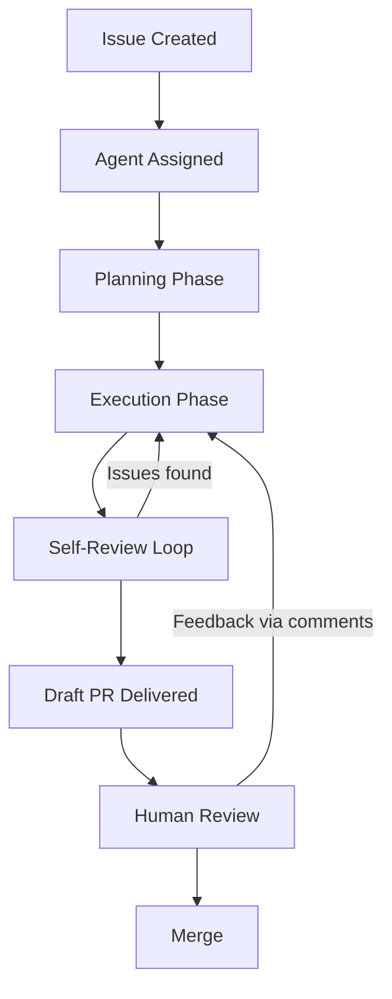

# Issue-to-PR Delegation Pipeline

> Issue-to-PR delegation routes a GitHub issue to an AI coding agent that plans, executes, self-reviews, and delivers a draft pull request — a pipeline with controllable levers at each phase.

## Pipeline Shape

Regardless of tool (Copilot coding agent, Claude Code Actions, or similar), the issue-to-PR pipeline follows a consistent five-phase shape:



Pipeline reliability depends on the harness built around each phase — issue quality, environment configuration, validation depth, and review protocols — not model capability alone.

## Phase 1: Issue Design

Issue description quality is the primary lever for delegation success. Effective issues provide:

- **Background context** — what the system does, why the change is needed
- **Expected outcomes** — concrete acceptance criteria the agent can verify
- **File and function references** — specific locations to reduce search time
- **Formatting and linting rules** — so the agent produces conforming output
- **Images** — for visual requirements (UI changes, layout expectations)

Start with low-complexity tasks (tests, documentation, refactors) to calibrate trust before delegating feature work ([GitHub Blog: Coding Agent 101](https://github.blog/ai-and-ml/github-copilot/github-copilot-coding-agent-101-getting-started-with-agentic-workflows-on-github/)).

## Phase 2: Entry Point Selection

The Copilot coding agent accepts work via multiple channels, each suited to different contexts ([GitHub Blog: Assigning Issues](https://github.blog/ai-and-ml/github-copilot/assigning-and-completing-issues-with-coding-agent-in-github-copilot/)):

| Entry Point | When to Use |
|-------------|-------------|
| Issue assignment on github.com / Mobile | Standard delegation — scoped work described in an issue |
| `@copilot` mention in PR comments | Mid-review corrections — agent iterates on existing PR |
| Agents panel (github.com/copilot/agents) | Monitoring and managing active agent sessions |
| VS Code / CLI handoff | Switching from local exploration to cloud execution |

Claude Code uses `@claude` mentions in issue/PR comments as triggers, with support for custom trigger phrases and scheduled automation ([Claude Code docs](https://code.claude.com/docs/en/github-actions)).

Both systems acknowledge receipt (Copilot: eye emoji reaction; Claude: comment response) and begin autonomous work.

## Phase 3: Environment Preparation

The agent's execution environment determines what it can build and validate.

**Copilot** uses [`copilot-setup-steps.yml`](agent-environment-bootstrapping.md) at `.github/workflows/` to define a setup job — dependencies, runners, services — that runs before the agent starts work. Secrets and environment variables go in the `copilot` environment in repo settings ([GitHub Docs](https://docs.github.com/en/copilot/customizing-copilot/customizing-the-development-environment-for-copilot-coding-agent)).

**Custom agents** (`.github/agents/AGENT-NAME.md`) give the coding agent specialized instructions, tools, and MCP servers for team-specific workflows ([GitHub Blog: What's New](https://github.blog/ai-and-ml/github-copilot/whats-new-with-github-copilot-coding-agent/)).

The agent runs in an ephemeral GitHub Actions environment with restricted internet access via firewall rules and can only push to branches it creates (prefixed `copilot/*`) ([GitHub Blog: Coding Agent 101](https://github.blog/ai-and-ml/github-copilot/github-copilot-coding-agent-101-getting-started-with-agentic-workflows-on-github/)).

## Phase 4: Agent Lifecycle

Once triggered, the agent operates through a structured sequence ([GitHub Blog: Assigning Issues](https://github.blog/ai-and-ml/github-copilot/assigning-and-completing-issues-with-coding-agent-in-github-copilot/)):

**Planning** — reads the issue, creates a task checklist, opens a draft PR tagged `[WIP]`. The checklist provides visibility into the agent's plan before execution begins.

**Execution** — modifies code, runs tests and linters if present in the repo, pushes commits iteratively as tasks complete. Session logs show reasoning and progress in real time.

**Self-review** — reviews its own changes using Copilot code review, iterates on feedback, and improves the patch before requesting human review ([GitHub Blog: What's New](https://github.blog/ai-and-ml/github-copilot/whats-new-with-github-copilot-coding-agent/)).

**Security validation** — CodeQL code scanning, secret scanning, and dependency vulnerability checks run automatically before the PR is opened. No GitHub Advanced Security license is required for this built-in validation ([GitHub Changelog](https://github.blog/changelog/2025-10-28-copilot-coding-agent-now-automatically-validates-code-security-and-quality/)).

## Phase 5: Review and Iteration

The agent delivers a draft PR with descriptive title and description. Reviewers provide feedback via standard PR comments. Mentioning `@copilot` (or `@claude` for Claude Code) in a review comment triggers additional agent iterations on the feedback.

This multi-round review cycle follows the same mechanics as human PR reviews — the agent reads the comment, makes changes, and pushes new commits.

## Governance Guardrails

The Copilot coding agent enforces structural constraints that prevent autonomous merging ([GitHub Blog: Coding Agent 101](https://github.blog/ai-and-ml/github-copilot/github-copilot-coding-agent-101-getting-started-with-agentic-workflows-on-github/)). For enterprise-wide policy controls (agent mode access, MCP allowlists, model availability), see [Agent Governance Policies](agent-governance-policies.md).

- Cannot approve or merge its own PRs
- CI/CD checks in GitHub Actions require human approval before execution
- Existing org policies and branch protections apply automatically
- All commits are co-authored for traceability

## Cross-Platform Delegation

The Copilot coding agent supports Jira Cloud integration (public preview March 2026), enabling delegation from Jira issues without requiring migration to GitHub Issues. The agent analyzes Jira descriptions and comments, implements changes, creates draft PRs in GitHub, and posts updates back to Jira ([GitHub Changelog](https://github.blog/changelog/2026-03-05-github-copilot-coding-agent-for-jira-is-now-in-public-preview/)).

## Cost Considerations

Copilot delegation consumes premium requests plus GitHub Actions minutes. Concurrent sessions are possible but each incurs cost. Model selection allows trading speed for capability — faster models for routine tasks (unit tests), more capable models for complex refactoring ([GitHub Blog: What's New](https://github.blog/ai-and-ml/github-copilot/whats-new-with-github-copilot-coding-agent/)).

## Why It Works

The five-phase structure limits error propagation by inserting checkpoints between phases. Each boundary forces the agent to produce a concrete artifact — task checklist, commits, self-review feedback — that the next phase consumes. Failures surface at phase transitions rather than at final delivery. The self-review loop exploits the same mechanism as human code review: a second pass with a different frame catches regressions that execution mode misses. Human approval is deferred until after self-check passes, concentrating reviewer attention on logic and intent rather than mechanical correctness.

## When This Backfires

Delegation degrades or fails under several conditions:

- **Underspecified issues** — Vague acceptance criteria cause the agent to fill gaps with assumptions. The plan phase conceals these behind a plausible checklist; divergence only surfaces at review, after full execution cost is paid.
- **Missing test infrastructure** — The self-review loop cannot verify correctness without runnable tests. Without them, the agent ships changes that pass its own pattern-matching but fail actual behavior requirements.
- **Cross-cutting changes** — Tasks requiring simultaneous edits to interfaces, callers, and tests across a large codebase can exceed the agent's working-context window. The agent completes one side of the change and misses others, producing a partially applied patch.
- **Novel architecture** — Delegation assumes the agent can infer correct patterns from the existing codebase. Greenfield code with no established precedents produces inconsistent output that is harder to review than a human draft.
- **High-security contexts** — The agent operates with the permissions of the triggering account. In repositories with broad write access or sensitive data, a misunderstood requirement can cause damage before human review occurs.
- **Context-window overflow** — Practitioners report the Copilot Cloud Agent hitting its ~64K-token prompt limit when diffs, file snippets, and tool outputs accumulate during multi-file reasoning, crashing the task rather than degrading gracefully ([GitHub community #184952](https://github.com/orgs/community/discussions/184952), [#180198](https://github.com/orgs/community/discussions/180198)). The failure is a hard crash, not a partial patch — retry only succeeds after the issue is narrowed or split.

## Example

The following shows a well-structured issue delegated to the Copilot coding agent, and the environment setup that enables it to run tests autonomously.

**Issue #284** — assigned to Copilot:

```markdown
## Background

The `UserSession` model currently stores `created_at` as a Unix timestamp integer.
All new models use ISO 8601 strings. This inconsistency breaks the shared `DateDisplay`
component in the dashboard.

## Task

Migrate `UserSession.created_at` to ISO 8601 string format.

## Acceptance Criteria

- [ ] `UserSession.created_at` stores and returns ISO 8601 strings (e.g. `"2026-02-14T09:30:00Z"`)
- [ ] Existing tests in `tests/models/test_user_session.py` pass
- [ ] Migration script in `db/migrations/` updates existing rows
- [ ] `DateDisplay` component renders without error for both old and new session records

## Relevant Files

- `app/models/user_session.py` — model definition
- `db/migrations/` — migration scripts (follow naming convention: `YYYYMMDD_description.py`)
- `tests/models/test_user_session.py` — existing test coverage
- `components/DateDisplay.tsx` — consuming component

## Constraints

- Do not change the column name — only the stored format
- Use the project's `isoformat()` helper from `app/utils/dates.py`, not `datetime.isoformat()` directly
```

**Environment setup** (`.github/workflows/copilot-setup-steps.yml`) that lets the agent run tests and linting before opening the PR:

```yaml
name: Copilot Setup Steps
on:
  workflow_dispatch:

jobs:
  setup:
    runs-on: ubuntu-latest
    steps:
      - uses: actions/checkout@v4
      - uses: actions/setup-python@v5
        with:
          python-version: '3.12'
      - run: pip install -e ".[dev]"
      - run: cp .env.example .env.test
        # agent runs pytest and ruff during execution — both must be available
```

When assigned, Copilot opens a draft PR tagged `[WIP]` with a task checklist derived from the acceptance criteria, runs the test suite after each commit, and requests human review once self-review passes. A reviewer can comment `@copilot the migration script doesn't handle NULL created_at values` to trigger an additional iteration without restarting the pipeline.

## Key Takeaways

- Issue quality is the primary lever — specific context, acceptance criteria, and file references directly affect delegation success
- The pipeline shape (plan, execute, self-review, deliver) is consistent across tools; the harness quality determines reliability
- Start with low-risk tasks to calibrate trust before scaling delegation to feature work
- Governance guardrails (no self-merge, co-authored commits, mandatory human review) are structural, not advisory
- Multi-round review via `@copilot` or `@claude` comments enables iterative refinement without restarting the pipeline

## Related

- [Copilot Coding Agent](../tools/copilot/coding-agent.md)
- [Delegation Decision](../agent-design/delegation-decision.md)
- [Agent Harness](../agent-design/agent-harness.md)
- [Agent Self-Review Loop](../agent-design/agent-self-review-loop.md)
- [Agent Environment Bootstrapping](agent-environment-bootstrapping.md)
- [Agent Governance Policies](agent-governance-policies.md)
- [QA Session to Issues Pipeline](qa-session-to-issues-pipeline.md)
- [Pre-Execution Codebase Exploration](pre-execution-codebase-exploration.md)
