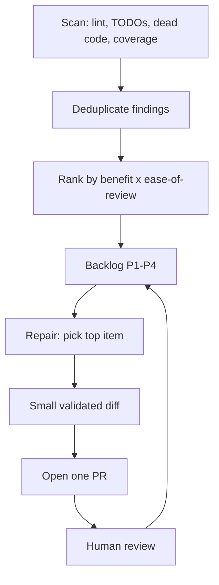

# Kaizen-Style Continuous Code Quality Loop (Pomona)

> Run an agent as a scan-then-repair loop that files small, single-purpose code-quality PRs a reviewer can accept quickly.

A Kaizen-style quality loop pairs a Scanning skill that finds and ranks quality tasks with a Repair skill that opens one small pull request at a time. Bloomberg's Pomona tool is the worked example: over a three-month team deployment it opened 39 PRs, 32 merged (82.1%), at a median time-to-close of 2h14m ([Pomona, arXiv:2606.06752](https://arxiv.org/abs/2606.06752)). The payoff is reviewer acceptance and trust for autonomous agent work, not raw merge speed — so the loop earns its place only under specific conditions.

## When this loop pays off

The value is conditional. Reach for it when all of these hold:

- The tasks are mechanical and well-scoped: lint and type-checker violations, TODO comments, dead code, and coverage gaps — the discovery areas Pomona's Scanning skill targets ([arXiv:2606.06752](https://arxiv.org/abs/2606.06752)). Large-scale refactoring is explicitly out of scope.
- Reviewer bandwidth, not generation speed, is the constraint you are optimizing. Pomona's adopting team capped output at one PR per day and its survey found engineers willing to review two to three agent PRs per week ([arXiv:2606.06752](https://arxiv.org/abs/2606.06752)). The loop only works if human review keeps pace.
- Your goal is a higher acceptance rate for agent-authored changes, not faster merges. Agents outpace humans on speed but their PRs are accepted less often — a trust and utility gap ([AIDev, arXiv:2507.15003](https://arxiv.org/abs/2507.15003)). Small, obviously-correct diffs are how you close that gap.

If you expect the loop to make merges faster because the diffs are small, stop: a study of 845,316 GitHub PRs plus 401,790 Gerrit and Phabricator reviews found PR size has no relationship with time-to-merge ([Do Small Code Changes Merge Faster?, arXiv:2203.05045](https://arxiv.org/abs/2203.05045v1)). The gain is acceptance, not velocity. See [when this backfires](#when-this-backfires).

## The scan-then-repair loop



The cycle draws on Kaizen — continuous improvement through small, consistent changes rather than large one-off projects ([arXiv:2606.06752](https://arxiv.org/abs/2606.06752)). It splits into three layers.

### Layer 1: Detection

The Scanning skill fans out parallel sub-agents across separate discovery areas — linter and type-checker output (ruff, mypy), TODO comments, dead code, test-coverage gaps, and coding-standard compliance ([arXiv:2606.06752](https://arxiv.org/abs/2606.06752)). Findings are deduplicated so the same underlying issue does not enter the backlog twice.

### Layer 2: Orchestration

Each finding is priced on a benefit-by-ease-of-review matrix and assigned a priority from P1 to P4, which populates a persistent backlog ([arXiv:2606.06752](https://arxiv.org/abs/2606.06752)). The backlog is the seam between discovery and repair: it lets the loop tackle high-benefit, low-friction tasks first and defer anything a reviewer could not validate at a glance. A per-day PR cap sits here too, because the binding constraint is review bandwidth.

### Layer 3: Action

The Repair skill takes the top backlog item, generates a targeted change, validates it against the project's tests and linters, updates the backlog, and opens a single PR with a clear motivation statement ([arXiv:2606.06752](https://arxiv.org/abs/2606.06752)). Pomona first aimed for roughly 10-line diffs, later raised to a 100-line cap after evaluation. The size limit is enforced deterministically, not left to the model: the agent frequently overshot the intended size on repetitive refactors, so a code-based size check gates each diff ([arXiv:2606.06752](https://arxiv.org/abs/2606.06752)).

## Why it works

A small, single-purpose diff lets a reviewer confirm correctness quickly and with little scepticism, so the change stays mergeable even during high-workload weeks. Pomona reports the effect directly: 25 of 32 merged PRs drew no reviewer comments beyond the mandatory review, and 28 of 32 needed no follow-up commits ([arXiv:2606.06752](https://arxiv.org/abs/2606.06752)). The causal lever is reviewer cognitive load and trust, not merge latency. That distinction matters because size does not move time-to-merge in the large-scale data ([arXiv:2203.05045](https://arxiv.org/abs/2203.05045v1)), while agent PRs specifically suffer a lower acceptance rate ([arXiv:2507.15003](https://arxiv.org/abs/2507.15003v1)). Keeping each agent change small and obviously-correct recovers the acceptance that large agent diffs lose.

## When this backfires

The conditions above are load-bearing. Drop one and the loop costs more than it returns.

- Cohesive large changes. Splitting one logical refactor into many small PRs forces branch-stacking and sequencing, and scatters context a reviewer would rather see in one place. Pomona scopes large-scale refactoring out for this reason ([arXiv:2606.06752](https://arxiv.org/abs/2606.06752)); a single reviewed PR beats five sequenced fragments.
- Valid but not worth reviewing. The agent can produce changes that pass every check yet are not worth a reviewer's attention. Experienced engineers in the Pomona survey distrusted fully-automated relevance filtering and preferred user-controlled triggering over autonomous operation ([arXiv:2606.06752](https://arxiv.org/abs/2606.06752)).
- Saturated review bandwidth. Isolated maintenance PRs get deprioritized against feature work. Without the per-day cap, open agent PRs outpace the reviewers and the backlog stops draining.
- Optimizing for speed. A team that adopts the loop expecting faster merges is measuring the wrong thing — size does not predict merge time ([arXiv:2203.05045](https://arxiv.org/abs/2203.05045)).
- Missing deterministic guards. Without a size check and duplicate-PR detection the agent overshoots limits and files duplicates. Four early Bloomberg rejections were duplicate PRs from the Repair skill running twice before human review, and two more came from undesirable generated formatting ([arXiv:2606.06752](https://arxiv.org/abs/2606.06752)).

## Example

A representative cycle on a Python service. The Scanning skill's sub-agents return findings from each discovery area, which the orchestrator prices and files:

```
Backlog (benefit x ease-of-review)
  P1  mypy: 3 missing return-type annotations in orders/handler.py   (~8 lines)
  P2  dead code: unused _legacy_parse() in billing/parse.py          (~15 lines)
  P3  coverage gap: retry path in client.py has no test              (~40 lines)
  P4  TODO: replace hand-rolled date parse with stdlib in report.py  (~60 lines)
```

The Repair skill picks P1, adds the three annotations, runs mypy and the test suite to confirm they pass, and opens one PR titled "Add missing return-type annotations in orders/handler.py" with a one-line motivation. The diff is small enough that a reviewer validates it without follow-up questions — the shape Pomona reports for most of its merged PRs ([arXiv:2606.06752](https://arxiv.org/abs/2606.06752)). The next run picks P2, and so on, one PR at a time under the daily cap.

## Key Takeaways

- Pair a Scanning skill (find and rank quality tasks) with a Repair skill (open one small PR) to run continuous code-quality improvement as a Kaizen loop ([arXiv:2606.06752](https://arxiv.org/abs/2606.06752)).
- The payoff is reviewer acceptance and trust, not merge speed — PR size does not predict time-to-merge ([arXiv:2203.05045](https://arxiv.org/abs/2203.05045)).
- Scope it to mechanical tasks (lint, types, dead code, coverage) and cap output at roughly one PR per day, because review bandwidth is the binding constraint.
- Enforce the diff-size limit deterministically; the model overshoots it on repetitive edits.
- It backfires on cohesive large refactors, saturated review queues, and any team measuring speed instead of acceptance.

## Related

- [Agent-Driven PR Slicing](../code-review/agent-driven-pr-slicing.md) — The complementary move for large branches: an agent decomposes one big diff into reviewable PRs, where this loop generates small ones from the start.
- [Agent PR Volume vs. Value: The Productivity Paradox](../code-review/agent-pr-volume-vs-value.md) — Quantifies the acceptance gap this loop exists to close: agents produce more PRs but get them merged less often.
- [Discovery-Only Refactor Pass: Surface Candidates Before Touching Code](discovery-only-refactor-pass.md) — Sibling scan-then-act discipline, applied to refactor candidates rather than mechanical quality fixes.
- [Backlog Triage as a Named Agent Skill](backlog-triage-skill.md) — The prioritization half as a standalone skill — turning raw findings into a ranked, actionable backlog.
