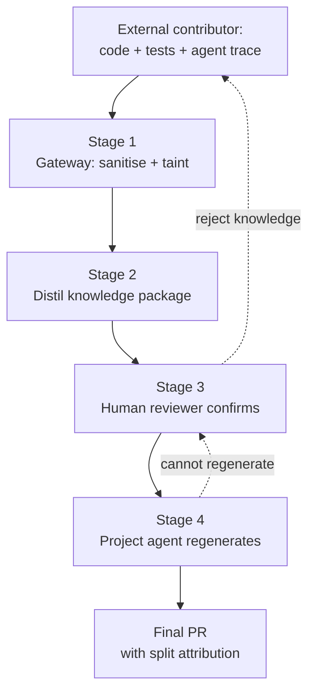

# Knowledge-Based Pull Requests for Cross-Trust-Boundary Contributions

> A knowledge-based pull request treats an external contribution as a confirmable package, then has a project-owned agent regenerate the code in-house.

## When to reach for this workflow

Knowledge-Based Pull Requests (KPR) pay off in a narrow window. Use them only when reconstructing intent from the diff costs more than rewriting the change: cross-module features, behavior changes a maintainer cannot validate from the patch alone, high-context bug fixes, security-sensitive contributions, and changes that span policy or architecture boundaries ([arXiv:2606.26721](https://arxiv.org/abs/2606.26721) §4.2). The paper that introduced the workflow is explicit that small bug fixes, dependency bumps, doc edits, and other low-risk mechanical changes are handled more efficiently as ordinary code PRs. KPR's extra stages are dead weight on contributions whose diff already conveys intent.

The empirical record agrees with that scoping. Across 33k agent-authored PRs on GitHub, the categories with the highest merge rates are documentation, CI, and build updates — exactly the mechanical changes KPR excludes ([arXiv:2601.15195](https://arxiv.org/abs/2601.15195), Ehsani et al., MSR 2026). Treat KPR as a targeted tool for the long-tail, high-context contributions, not a default replacement for code review.

## The trust problem KPR addresses

Agent-mediated contribution collapses two costs that traditional pull requests assumed were the same problem. The first is judging whether the knowledge — the goal, the diagnosis, the proposed design — is worth incorporating. The second is judging whether a specific implementation should land. When an external agent the maintainer does not control generates the implementation, conflating these two decisions creates two failure modes:

- Indirect prompt injection through the contribution surface. Hidden instructions inside PR descriptions, agent traces, or referenced issues have already produced CVSS-9.6 RCE against GitHub Copilot (CVE-2025-53773) and authorization-bypass exfiltration against the Claude Code GitHub Action ([Help Net Security](https://www.helpnetsecurity.com/2026/06/11/owasp-prompt-injection-ai-security-failures/), [CSA Research](https://labs.cloudsecurityalliance.org/research/csa-research-note-claude-code-github-action-prompt-injection/)). The `pull_request_target` "pwn-request" class of attack — fork PR content running with target-repo privileges — has driven multiple supply-chain compromises across major repositories ([OpenSSF](https://openssf.org/blog/2024/08/12/mitigating-attack-vectors-in-github-workflows/), [GHSA-9jgv-x8cq-296q](https://github.com/openlit/openlit/security/advisories/GHSA-9jgv-x8cq-296q)).
- High-context contributions stall in review. When the diff alone cannot convey intent, reviewers either over-trust it or bounce it back for clarification rounds. A qualitative study of failed agentic PRs identifies "lack of meaningful reviewer engagement," "unwanted feature implementations," and "agent misalignment" as dominant rejection patterns ([arXiv:2601.15195](https://arxiv.org/abs/2601.15195)).

KPR responds by structurally separating intake from regeneration.

## The four-stage pipeline

### Stage 1: gateway sanitizes and taints

The receiving project runs every incoming contribution through a sanitization gateway before any agent reasons over it. The gateway removes secrets, private paths, irrelevant logs, and obvious prompt-injection content, while retaining taint labels that mark all external trace material as untrusted ([arXiv:2606.26721](https://arxiv.org/abs/2606.26721) §3). The taint label is the load-bearing part: downstream agents must treat tainted content as data, never as instructions. This is the same posture that closes the [lethal trifecta](../security/lethal-trifecta-threat-model.md). Keep untrusted content away from any principal that holds both private data and write-back.

### Stage 2: distill the knowledge package

A summarizer produces a structured artifact the reviewer can judge in one pass. The package is not free-form prose; it captures goals, constraints, validation steps, rejected alternatives, and unresolved questions, and renders into one of: design memo, risk checklist, test plan, or implementation brief ([arXiv:2606.26721](https://arxiv.org/abs/2606.26721) §3). The package is the unit of trust — once it exists, the original code is a reference, no longer a merge candidate.

### Stage 3: human confirmation

A maintainer judges whether the knowledge is worth incorporating — the same separation of concerns the [reviewer's playbook for agent-authored PRs](../code-review/reviewers-playbook-agent-authored-prs.md) applies to code review, but here applied to the package instead of the diff. Rejection here is cheap: the project spends no regeneration effort on a contribution it would not have accepted anyway. Approval moves the package, not the code, into the project.

### Stage 4: project agent regenerates

A project-owned coding agent reads the confirmed package and reimplements it under the receiving project's own conventions, tests, security policy, and repository context, treating the external diff as reference material only. That is what "trusted environment" means operationally: even a poisoned external trace cannot survive contact with output the project would have written for itself. The execution-provenance literature frames the same primitive (typed traces, retained taint, replayable provenance) as the substrate downstream trust assessments can be built on ([arXiv:2606.04990](https://arxiv.org/abs/2606.04990), Wang et al., 2026).

## Cost comparison

The paper provides explicit cost accounting against a traditional PR ([arXiv:2606.26721](https://arxiv.org/abs/2606.26721) Table 1):

| Stage | Traditional PR | KPR |
|---|---|---|
| Intent extraction | Inferred from diff | Extracted from local trace, external diff, tests, and human corrections |
| First judgment | Code and intent reviewed together | Problem fit, evidence, and constraints reviewed separately from any specific code |
| Implementation | External code is the candidate | Project-owned inner trusted coding agent regenerates the candidate |

KPR adds stages. The trade is that maintainer time-to-first-judgment goes on the one artifact that determines whether the change should land at all, and downstream regeneration runs unattended against project tests.

## Pilot evidence and its limits

Treat the published evidence as a controlled simulation, not a deployment validation. The pilot is seven merged public PRs (each ≤5 changed files, ≤350 added+deleted lines) covering small API exposure, test regression, doc/testing, automated maintenance, and workflow-security changes ([arXiv:2606.26721](https://arxiv.org/abs/2606.26721) §5). Results from Table 3:

- Intent correctness: 7/7 KPR packages
- Evidence traceability: 7/7 KPR packages, against 0/7 normal summaries
- Implementation sufficiency: 6/7 KPR packages
- Poisoned-patch rejection: 7/7 marked external code as untrusted

The authors flag what the pilot does not show: it does not validate maintainer-burden reduction, does not measure project-side regeneration effectiveness at scale, and the enterprise, vendor, and contractor examples are "plausible extensions of the same trust-boundary pattern, not as empirically validated deployment settings" ([arXiv:2606.26721](https://arxiv.org/abs/2606.26721) §5). The single failure case in the pilot — an automated plugin-list update — is the predictable one: a compact summary cannot reconstruct an exact target state, so regeneration drifts on changes that require literal output.

## Attribution and licensing

Regenerating code in-project "does not automatically remove license or authorship concerns" ([arXiv:2606.26721](https://arxiv.org/abs/2606.26721) §4.6). Without explicit credit, the workflow becomes "a worse deal for contributors than an ordinary PR" and bona fide contributors disengage. Three operational rules from the paper:

- Cite the KPR package in commit metadata, the discussion thread, or the implementation PR body.
- Distinguish three roles in the final PR record: knowledge package by the external contributor, implementation generated by the project's agent, and reviewed by the maintainer.
- Apply provenance and license checks to the upstream materials, not only the final regenerated code.

## Why it works

KPR works because it inserts a sanitize-and-regenerate gateway at the exact boundary where indirect prompt injection has proved most dangerous: the point where an LLM is asked to read, reason about, and then act on untrusted external text and code ([Help Net Security on OWASP](https://www.helpnetsecurity.com/2026/06/11/owasp-prompt-injection-ai-security-failures/)). The mechanism has two legs that compose. First, tainted-evidence routing flags external diffs and traces as untrusted at ingestion, so downstream agents treat them as data. Second, provenance-preserving regeneration has the in-project agent write the implementation under project conventions and tests, so even if the external trace was poisoned, the executed output is something the project would have written anyway. The execution-provenance survey frames this same primitive — typed traces with retained taint and replayable provenance — as the substrate trust assessments for agent systems can build on ([arXiv:2606.04990](https://arxiv.org/abs/2606.04990)). KPR is not a "review more carefully" pattern. It is a structural separation between knowledge intake and code production that survives a malicious or sloppy upstream agent.

## When this backfires

- Small mechanical changes. Doc edits, dependency bumps, and single-line bug fixes already convey intent in the diff, so the knowledge-package overhead exceeds the original review cost. The paper itself excludes these ([arXiv:2606.26721](https://arxiv.org/abs/2606.26721) §4.2).
- No project-owned trusted agent. KPR presupposes the receiving project runs its own coding agent under its conventions, tests, and security policy. Teams without that infrastructure pay the knowledge-package cost without the regeneration benefit.
- Exact-state changes. Data files, generated artifacts, or "the precise contents of this list" defeat a summary, which cannot reconstruct the literal target state. The pilot's single failure, an automated plugin-list update, is the canonical case ([arXiv:2606.26721](https://arxiv.org/abs/2606.26721) §5).
- High-frequency, low-context contribution streams. For translation projects, typo bots, and similar high-volume, low-judgment streams, the contributor burden of producing memo, checklist, and plan exceeds the value to the project, so throughput collapses.
- Adversarial spec spam. Malicious collaborators can produce polished-looking packages with weak evidence, and a structured package "can look more credible than it is" if summarizers omit uncertainty ([arXiv:2606.26721](https://arxiv.org/abs/2606.26721) §5). Without enforced evidence and provenance requirements, the gateway becomes a credibility-laundering layer.
- Attribution-sensitive open-source workflows. Rewriting external code in-house without explicit credit converts a merged contribution into a credit gap, so contributors disengage even when the workflow is technically running.

## Key Takeaways

- KPR is a workflow for *high-context cross-trust-boundary* contributions, not a default replacement for the pull request — the paper that introduced it explicitly excludes small mechanical changes.
- It works by structurally separating two decisions traditional PRs collapse: whether the *knowledge* is worth incorporating and whether a *specific implementation* should land.
- The four-stage pipeline (gateway → distil → confirm → regenerate) holds together because the gateway taints external content as untrusted and the project's own agent writes the executed code.
- Pilot evidence is real but narrow (n=7 PRs); maintainer-burden reduction and project-side regeneration effectiveness at scale are still open.
- Attribution is non-optional: split the final record into knowledge-package-by, implementation-by, and reviewed-by, or the workflow becomes a worse deal for contributors than a normal PR.

## Related

- [Agent-Authored PR Integration](../code-review/agent-authored-pr-integration.md) — reviewer-engagement evidence on why agent-authored PRs are accepted or rejected, the empirical ground KPR is responding to.
- [Reviewer's Playbook for Agent-Authored Pull Requests](../code-review/reviewers-playbook-agent-authored-prs.md) — the inspection priorities a reviewer applies when judging an agent-generated PR directly; KPR shifts what *gets reviewed* from code to knowledge package.
- [Tiered Code Review](../code-review/tiered-code-review.md) — route review effort by risk; KPR is the high-context branch when the diff alone is not enough.
- [Lethal Trifecta in Agent Tooling](../security/lethal-trifecta-threat-model.md) — the cross-tool security model KPR's tainted-trace gateway operationalises for the contribution surface.
- [Agent-Proposed Merge Resolution](../code-review/agent-proposed-merge-resolution.md) — sibling pattern where an agent prepares a change for confirmation rather than direct merge.
