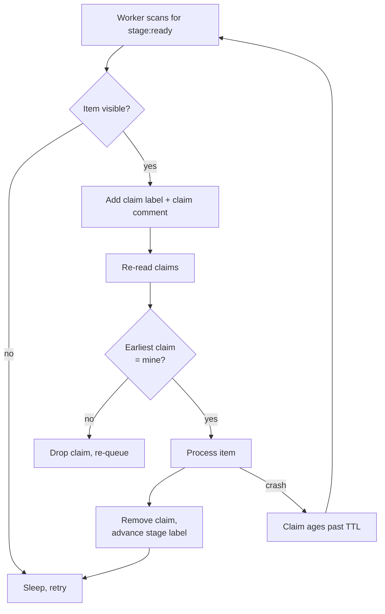

# Labels as Locks: Pipelined Backlog Processing with Stage Gates

> Stage labels gate pipeline steps; a claim label plus a timestamped claim comment forms a lease-based lock that prevents concurrent agents from double-processing.

## When this pattern applies

The pattern only works under four preconditions; outside them, reach for an external atomic store (Redis `SETNX` with fencing, DynamoDB conditional writes, Postgres `SELECT FOR UPDATE`) instead.

| Precondition | Why it is load-bearing |
|---|---|
| Idempotent work item | TTL-based recovery cannot recover from a side effect already taken; the work itself must be safe to run twice. |
| Minutes-scale duration | Tracker latencies (label-write + comment-write + re-read on GitHub is roughly 1–5 s round-trip) put any sub-second contention *inside* the tiebreaker window — both workers race past the same checks and both claim. |
| Best-effort, not correctness-critical | For payments, deploys, emails, or any irreversible side effect, label-based locks are unsafe. Kleppmann's critique of TTL-only locks applies: a GC pause or network delay longer than the TTL lets a "released" holder still write ([Kleppmann 2016: How to do distributed locking](https://martin.kleppmann.com/2016/02/08/how-to-do-distributed-locking.html)). |
| Single-tracker backlog | Cross-tracker coordination needs a shared atomic primitive; one issue tracker with one set of labels is the unit of coordination. |

When all four hold, the tracker doubles as observable, queryable, human-visible state — and the alternative (standing up Redis just to coordinate two agents) loses on simplicity.

## Three implementation layers



### Layer 1: Stage labels as gates

Each pipeline stage is a label: `stage:ready` → `stage:processing` → `stage:review` → done (close the item). The worker's scan query (`label:stage:ready -label:claimed`) is the dispatch trigger, and adding or removing labels is the state transition. The model is the same one issue trackers already use for human workflow — every issue has a status, every status transition is tracked — and modern coordination tooling treats the tracker as the agent control plane precisely so that human workflow infrastructure and agent infrastructure are the same thing ([SocioFi Labs: State Machine Orchestration for Agent Workflows](https://sociofitechnology.com/labs/blog/state-machine-orchestration-for-agent-workflows)).

The Kanban-on-GitHub literature ships the same pattern with `labeled`/`unlabeled` webhooks as the trigger ([Andela: Kanban power-up for GitHub Project board](https://medium.com/the-andela-way/how-to-build-a-power-up-for-your-github-project-board-for-project-management-344d5b380a68)).

### Layer 2: Claim-on-start as a lease

Before working an item, the worker performs three writes:

1. Add a `claimed` label.
2. Post a claim comment in a machine-parseable form: `<!-- claim run=<nonce> ttl=600s --> claimed by worker-7`.
3. Re-read the comments and pick the earliest-`created_at` claim as the winner.

Step 3 is the tiebreaker. Label writes are not a compare-and-swap primitive — two workers concurrently issuing "add claim label" can both succeed, and the GitHub Issues API gives no atomicity guarantee across them. The tracker sets `comment.created_at` server-side and immutably, so a total order over claim comments exists without trusting any worker's local clock. Earliest-claim-wins resolves the rare double-claim by letting the loser drop its label and re-queue.

This is the same shape as Bull's `SETNX`+`PX` stalled-job recovery: an atomic claim with a TTL, where the TTL exists to recover from worker crashes ([Mastering Bull: Redis atomic operations](https://app.studyraid.com/en/read/12483/403578/redis-atomic-operations)). The structural difference: the tracker's "atomic claim" is the comment-timestamp tiebreaker, not a single CAS write.

### Layer 3: Lease-based recovery

A claim comment older than its declared TTL (600 s in the example below) means the worker crashed before completing. The next scan treats stale-claimed items as re-claimable — the worker checks the timestamp, drops the old claim, and starts the claim sequence itself. Crashed runs self-heal without human unsticking. Release-on-completion is the converse: finishing a stage removes the claim label together with the stage-label advance, so no item looks claimed forever.

This is the lease pattern documented broadly in distributed systems literature: by making the default state of a resource unlocked after a timeout, leases solve the deadlock problem, and recovery is no longer dependent on a potentially crashed or partitioned client ([Mastering Bull](https://app.studyraid.com/en/read/12483/403578/redis-atomic-operations), [Kleppmann 2016](https://martin.kleppmann.com/2016/02/08/how-to-do-distributed-locking.html)).

## Why it works

The pattern works because each leg degrades to "no work was done" rather than "wrong work was done." Three structural properties carry the correctness argument: (a) the dispatch query is a server-side filter, so each worker reads a consistent snapshot at scan time even if subsequent reads lag the cluster's eventual consistency; (b) the claim tiebreaker uses `comment.created_at`, which is server-issued and immutable, giving a total order without local clocks; (c) the work item is required to be idempotent, so the rare case where two workers process the same item before the tiebreaker resolves still produces one consistent end state. This is the "best-effort distributed lock" Kleppmann calls out as acceptable when correctness is not on the line ([Kleppmann 2016](https://martin.kleppmann.com/2016/02/08/how-to-do-distributed-locking.html)).

The complementary mechanism — observable Kanban-shaped state for humans — is why teams reach for this over an external lock service. The tracker already shows what is queued, what is in progress, what is stuck; adding Redis duplicates that view at the cost of a second source of truth.

## When this backfires

- Sub-second contention. Work items shorter than the claim round-trip put the tiebreaker inside the contention window. The cal.com `getNextBatch` bug (#24186) is the same failure at the database layer: two workers run the same `findMany` and both claim identical work because the read had no row lock ([cal.com #24186](https://github.com/calcom/cal.com/issues/24186)). Move to atomic claim-and-select (or a queue with broker-side delivery) for high-fan-out short tasks.
- Correctness-critical side effects. Payments, deploys, emails. Prefect's Global Concurrency Limits had this exact bug in the HTTP `/increment-with-lease` endpoint: read of `active_slots` was not row-locked, so two requests could both observe `active_slots=0` and both claim a slot, yielding `active_slots=2` despite `limit=1`. The fix was external Redis locking or moving to deployment-level limits with atomic `bulk_increment_active_slots` ([Prefect Discussion #20520](https://github.com/PrefectHQ/prefect/discussions/20520)). The same constraint applies here.
- Strict read-after-write requirements. The tracker API has documented eventual-consistency behavior — `labeled` webhooks can fire before the API reflects the new label set, and post-webhook 404s are routine enough that production GitHub apps budget retries for them ([Aviator: How we built one of the most complex apps on GitHub](https://www.aviator.co/blog/how-we-built-one-of-the-most-complex-apps-on-github/)).
- Sustained legitimate work exceeding TTL. A healthy worker on a long task is treated as crashed. Tuning the `TTL` trades crash-recovery latency for over-claim risk; both sides hurt if tuned wrong. Stick to minutes-scale work or add explicit heartbeat-renewal logic.
- Heavy multi-bot environments. Many automations (dependency bots, custom workflows) react to `labeled`/`unlabeled` events; label flips can spawn cascading workflow runs and surface event-ordering races ([GitHub Community Discussion #69337](https://github.com/orgs/community/discussions/69337)).
- Cross-tracker or multi-region coordination. TTL based on a claimer's local clock breaks under skew. Comment-timestamp ordering sidesteps this only if comparison stays server-side.

When you graduate out, the conventional escalation is an external atomic store: comment-based deploy locks already exist on GitHub (`deploy-lock` uses `.lock` / `.unlock` comments) and DynamoDB-backed locks use conditional writes for guaranteed atomicity ([deploy-lock](https://github.com/marketplace/actions/deploy-lock), [abatilo/github-action-locks](https://github.com/abatilo/github-action-locks)). Both treat the tracker as observable state but do not rely on label semantics for the atomic claim.

## Example

The mechanism is tracker-agnostic — any tracker with labels and server-timestamped comments works (GitLab, Jira, Linear, GitHub Issues). The example below uses the GitHub CLI on a documentation backlog. Each issue carries `stage:ready` when ingested; the worker claims, processes, and advances the label.

```bash
#!/usr/bin/env bash
# label-lock-worker.sh — one worker process; run N copies in parallel.
set -euo pipefail

WORKER_ID="worker-$(hostname)-$$"
TTL_SECONDS=600
NONCE=$(openssl rand -hex 8)

# 1. Scan for unclaimed ready items, oldest first.
ITEM=$(gh issue list --label "stage:ready" \
  --json number,labels,comments \
  --jq '[.[] | select(.labels | map(.name) | index("claimed") | not)][0]')

[ -z "$ITEM" ] || [ "$ITEM" = "null" ] && { echo "no work"; exit 0; }
NUM=$(echo "$ITEM" | jq -r .number)

# 2. Claim: add label + post comment with nonce and TTL.
gh issue edit "$NUM" --add-label "claimed"
gh issue comment "$NUM" --body \
  "<!-- claim run=$NONCE ttl=${TTL_SECONDS}s --> claimed by $WORKER_ID"

# 3. Tiebreaker: re-read claims, earliest wins.
EARLIEST=$(gh issue view "$NUM" --json comments \
  --jq '.comments | map(select(.body | startswith("<!-- claim run="))) | sort_by(.createdAt) | .[0].body')

if ! grep -q "run=$NONCE" <<< "$EARLIEST"; then
  echo "lost the race; dropping claim"
  gh issue edit "$NUM" --remove-label "claimed"
  exit 0
fi

# 4. Do the idempotent work, then advance.
process_item "$NUM"   # must be safe to re-run
gh issue edit "$NUM" --remove-label "stage:ready,claimed" --add-label "stage:review"
```

A separate sweep (cron or the same worker on idle) reclaims expired leases: find issues with `claimed` whose latest claim comment is older than its declared TTL, remove the `claimed` label, and let normal scan pick them up.

## Key Takeaways

- Labels are not a compare-and-swap primitive — pair them with a server-timestamped claim comment so the tiebreaker total-orders concurrent claims.
- TTL on the claim is for crash recovery, not for mutual exclusion. Crashed workers self-heal because the claim ages past its lease.
- The work item must be [idempotent](../patterns/agent-design/idempotent-agent-operations.md). The pattern degrades to "no work done" or "work done twice with the same result," never "incorrect work done."
- Suitable for minutes-scale, best-effort coordination on a single tracker. For correctness-critical or sub-second contention, graduate to an external atomic store with fencing tokens.
- The benefit over Redis or a database lock is observability — the tracker is already the team's Kanban board, so coordination state is human-readable for free.

## Related

- [Idempotent Agent Operations: Safe to Retry](../patterns/agent-design/idempotent-agent-operations.md) — the upstream correctness property the work item must satisfy for label-based locks to be safe
- [Continuous Autonomous Task Loop](continuous-autonomous-task-loop.md) — the single-worker version of this pattern, where label-based locking is unnecessary
- [Issue-Tracker as Agent Dispatch Surface](issue-tracker-agent-dispatch-surface.md) — the broader convention of treating the issue tracker as the agent control plane
- [Issue-to-PR Delegation Pipeline](issue-to-pr-delegation-pipeline.md) — the five-phase delegation pipeline this locking discipline lets you parallelize safely
- [Continuous Triage](continuous-triage.md) — the upstream classification workflow that produces the labeled items this pattern then dispatches
- [Concurrent Agent Pull Requests and Merge-Conflict Cost](concurrent-agent-pr-merge-conflicts.md) — the empirical merge-conflict cost that claim-label leasing serializes away for contended work
