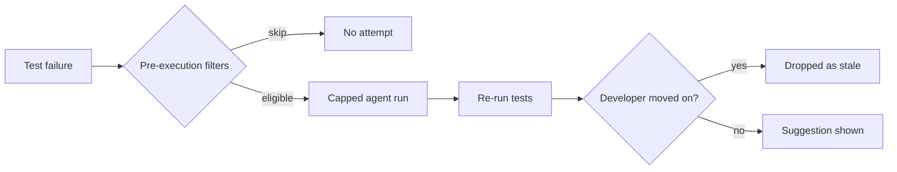

# Latency-Budgeted Repair: Size the Run to the Wait

> A pre-submit repair suggestion expires on the developer's next edit, so budget wall clock and count the correct fixes you throw away.

Latency-budgeted repair caps an agent's wall-clock run against a measured distribution of how long developers wait before fixing the failure themselves. It applies where the suggestion expires on the developer's next edit, and its metric is the share of successful fixes discarded as obsolete. That share is the latency number that matters, because a fix arriving after the next edit is dropped whatever its correctness. Mean agent runtime does not measure it.

## Why a late fix is a wasted fix

A pre-submit repair suggestion is pinned to one revision of one change. The moment the developer edits or submits, the suggestion is obsolete regardless of whether it was right.

Google's FlowAgent, deployed across its monorepo on pre-submit test failures, resolves that with two post-execution filters. Stale fires when "the developer modified the change while the agent was processing the failing version". Submitted fires when the change already landed. Neither filter looks at the fix. Over the reported deployment the agent obtained a fix for 421,818 changes, and "126,310 successful fixes were dropped by post-execution filters, as the developers modified or submitted their changes already, and the agent's fixes were obsolete" ([Ziftci et al., 2026](https://arxiv.org/abs/2610.07289v1)). Roughly 30% of working fixes expired before a human saw them.

The authors read their own number the same way: "Even though FlowAgent is optimized for low latency, a non-negligible share of successful fixes are still dropped by the post-execution filters, pointing to a need for further latency improvements to catch developers in their change modification flows." One interviewed developer who eventually saw a late suggestion told them: "I can confirm that your agent's output is correct, and it would have saved me a lot of time if I had seen it before manually digging through the logs."

## When the budget is worth paying

A wall-clock cap costs capability. Test-time scaling "has been widely adopted to enhance the capabilities of Large Language Model (LLM) agents in software engineering (SWE) tasks" ([SWE-Replay, 2026](https://arxiv.org/abs/2601.22129v2)), so capping the run gives some of that up by construction. Pay that price only when all three conditions hold:

- A human is waiting. For post-submit, nightly, or queued repair, nothing expires and the cap buys nothing.
- The suggestion is pinned to a version, and you discard it rather than rebase it when that version moves.
- You have enough failures to estimate a percentile. A wait distribution needs a census, not a handful of incidents.

FlowAgent satisfies all three, which is why it can report what the cap bought and what it cost.

## Three implementation layers

### Layer 1: Filter before the clock starts

Spend the budget only on failures an agent can plausibly fix. FlowAgent skipped 1,785,955 of 2,567,829 changes with failing tests at this stage, leaving 781,874 attempts ([Ziftci et al., 2026](https://arxiv.org/abs/2610.07289v1)). The filters reject build failures, already-failing tests, known flaky tests, tool-authored changes, stale changes, unsupported file types, changes over 100 files, and changes over 1000 lines.

That list is the part which does not transfer for free. It was "created based on institutional knowledge, manual evaluations and observations on a set of failures, and developer feedback in production" ([Ziftci et al., 2026](https://arxiv.org/abs/2610.07289v1)), so an adopting team builds its own. The shape is a [tool-boundary abstention gate](../patterns/agent-design/informed-abstention-tool-boundary-gate.md): decide not to act before acting costs anything.

### Layer 2: Cap the run against the measured wait

FlowAgent's cap came from a census. The team analyzed changes submitted across Google over a 30-day window in September 2025 and measured what they call fix attempt latency, "the wall clock time between TAP reporting test failures on a version of the change and a developer making any additional edits and moving the change to the following version". That distribution "is 6.72 minutes at p25, and 27.48 minutes at p50" ([Ziftci et al., 2026](https://arxiv.org/abs/2610.07289v1)).

The team then set the cap against it directly: "A maximum runtime of 30 minutes, in line with fix attempt latency discussed in Section 2.2 to avoid running for too long and to catch developers in their coding flow." In production, "from TAP failure notification to obtaining a successful fix", the agent took "9.85 minutes in the median (p50), and 25.83 minutes in the 90th percentile (p90) wall clock time" ([Ziftci et al., 2026](https://arxiv.org/abs/2610.07289v1)). That distribution covers only runs that produced a fix.

The two sets of percentiles do not line up as neatly as that framing suggests. A 9.85-minute median time to a successful fix sits well inside the 27.48-minute median wait and well outside the 6.72-minute p25. Budgeting to the median concedes the quarter of failures where the developer moves fastest. The figure also skips the capped-out runs, so the real gap is wider than it looks.

A second cap guards the tail. The system limits the agent to 100 tool calls, "to avoid excessive runtime and tool calling", against an observed mean of 21.37 per execution ([Ziftci et al., 2026](https://arxiv.org/abs/2610.07289v1)). Roughly five times typical usage bounds the runaway run and leaves the ordinary one alone, the usual shape of a [bounded agent step](../patterns/agent-design/bounded-agent-step.md).

Wait tolerance is not a Google artifact. A survey of 103 practitioners found that 63% would not wait longer than one hour for a repair tool, and 72% of that group would not wait longer than 30 minutes ([Noller et al., 2022](https://arxiv.org/abs/2108.13064v4)).

### Layer 3: Re-validate deterministically before showing

Do not accept the agent's word that it validated. After the loop produces a diff, FlowAgent confirms the agent executed the tests in its last validation cycle or re-executes them itself, because "LLMs are known to hallucinate, and without final deterministic validation, there is a risk of showing a potentially invalid fix to developers" ([Ziftci et al., 2026](https://arxiv.org/abs/2610.07289v1)).

This layer competes with Layer 2 for the same wall clock. A re-run costs minutes you were trying to save, and skipping it converts a latency win into a trust loss.

## Why it works

Because the expiry clock belongs to the human, wall-clock latency affects yield independently of accuracy. Raising accuracy moves fixes from wrong to right. Finishing sooner moves fixes from discarded to delivered. Two separate levers, and only one shows up in a benchmark score.

The discard is what makes the second lever real. FlowAgent drops a stale fix unconditionally: "such fixes may confuse developers, and potentially cause conflicts with the developer's changes. As a result, they are dropped entirely by post-execution filters" ([Ziftci et al., 2026](https://arxiv.org/abs/2610.07289v1)). No partial credit, no queue for later. A system that rebased its fix onto the developer's newer version would change this calculus, and nothing in the paper does that.

## Triggers and constraints

The trigger is a push event, not a schedule: the agent listens for test-failure notifications from the CI system and starts without the developer asking ([Ziftci et al., 2026](https://arxiv.org/abs/2610.07289v1)). That is what makes the race real, and what makes Layer 1 load-bearing: nobody is there to decline a hopeless attempt.

The agent's authority stops at a suggestion a developer previews and applies. It does not commit. The shape is tool-agnostic: any CI system that emits failure events, any runner enforcing a wall-clock and tool-call limit, any review surface that can show a diff.

## When this backfires

No human is waiting. The paper scopes its result to "the pre-submit workflow, before faulty code or tests are submitted to the repository" ([Ziftci et al., 2026](https://arxiv.org/abs/2610.07289v1)). Move the same agent to a nightly queue and the cap is pure loss, because there is no next edit to race.

The cap eats attempts. FlowAgent attempted 781,874 changes and obtained a fix for 421,818. The authors attribute the remaining 360,056 to the limits: "Unsuccessful attempts are due to the limits placed on the agent execution to avoid running for too long, as users may get notified of the failing tests and attempt to fix them manually themselves" ([Ziftci et al., 2026](https://arxiv.org/abs/2610.07289v1)). That attribution carries no breakdown, so treat it as their reading rather than a measurement.

Your test suite does not fit. Layer 3 re-runs tests inside the same wall clock, and the paper's scope is "test failures only" on unit tests run by Google's CI platform, with build failures filtered out at Layer 1 ([Ziftci et al., 2026](https://arxiv.org/abs/2610.07289v1)). A twenty-minute suite leaves no room for a generate-and-validate loop plus a final check inside a thirty-minute cap.

Quality is not yet worth the attention. A manual evaluation of 195 randomly selected failures by three expert developers across 37 teams found 131 correct fixes, a 67.18% success rate; for the other 64, "the fixes were either incorrect or not exactly correct" ([Ziftci et al., 2026](https://arxiv.org/abs/2610.07289v1)). Delivering faster raises the rate at which developers meet the third that is wrong. The interviews name the sharpest version: the agent sometimes suggests reverting the change or commenting out the failing test, which the authors call "a critical user trust problem".

The numbers come from one organization, and the authors say so: "our findings may not be generalizable to other organizational settings" ([Ziftci et al., 2026](https://arxiv.org/abs/2610.07289v1)). The accuracy figure rests on three raters who "did not own the production or test code of the failing tests". Measure your own wait distribution rather than importing 30 minutes.

## Key Takeaways

- Derive the cap from a measured wait distribution. Google measured 6.72 minutes at p25 and 27.48 minutes at p50 over a 30-day census, then capped the agent at 30 minutes.
- Budget to the quartile you care about, not the median. A 9.85-minute median time to a successful fix is inside the 27.48-minute median wait and outside the 6.72-minute p25, so the fast quarter is conceded by design.
- Report the share of successful fixes discarded as stale, not mean runtime. At Google it was 126,310 of 421,818, about 30%.
- Spend the budget on eligible failures only. Pre-execution filters removed 1,785,955 of 2,567,829 failing changes before the agent started.
- Set the tool-call cap above typical usage, not at it. A cap of 100 against a mean of 21.37 bounds the runaway run.
- Re-run the tests yourself, and price the re-run against the budget it spends.
- None of this applies where nothing expires. Without a human waiting, a wall-clock cap only gives up capability.

## Related

- [Execution Budgeting in Agentic Program Repair](../verification/execution-budgeting-program-repair.md) — budgets test executions inside the loop rather than wall clock around it
- [Bounded Repair-Loop Iterations](../verification/bounded-repair-loop-iterations.md) — the iteration-count version of the same cap, with evidence that gains concentrate early
- [Bounded Agent Steps Inside a Deterministic Workflow](../patterns/agent-design/bounded-agent-step.md) — the single-agent building block the capped run is an instance of
- [Closed-Loop CI Failure Remediation with Cloud Coding Agents](closed-loop-ci-failure-remediation.md) — the dispatcher controls deciding which CI failures reach an agent at all
- [Staged Evidence Gates for Agentic Program Repair](../verification/staged-evidence-gates-program-repair.md) — what the agent must prove before a fix is shown
- [Monitor or Wait: The Supervision Choice During Agent Execution](monitor-or-wait-during-agent-execution.md) — the same wait, priced from the supervising human's side
