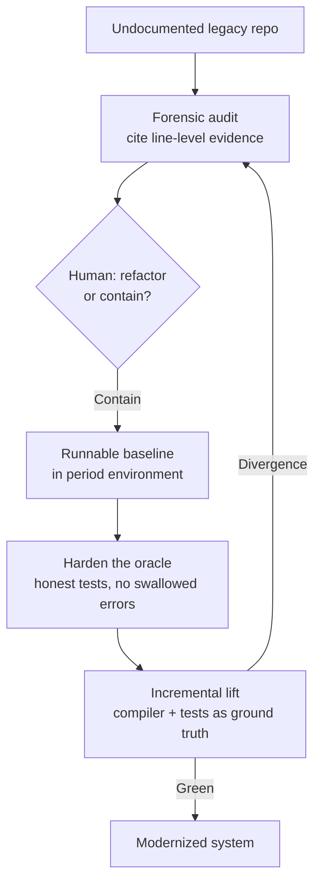

# Legacy Code Archaeology: Reconstruct Intent Before Migrating

> Excavate a legacy system's real behaviour with a coding agent before modernizing it — but only under adversarial prompting and a runnable baseline.

Legacy code archaeology points a coding agent at an undocumented legacy codebase to reconstruct what it actually does — its structure, implicit contracts, and intent — as a distinct phase before any modernization. It earns its place only under three conditions: the agent is prompted adversarially rather than helpfully, it cites line-level evidence rather than narrating a plausible story, and its findings are checked against a runnable baseline of the original system. Skip those conditions and the phase produces confident fiction that is worse than no understanding at all. This is the comprehension-first case where the documentation needed to guide a migration does not yet exist and has to be dug out of the code.

## The comprehension gap

Most modernization guidance assumes a reasonably modern target and existing docs. The common reality is harder: a repository written in 2005, built with Ant, using Java 1.5, that has not compiled since and does not run on current hardware ([Malykhin, martinfowler.com](https://martinfowler.com/articles/archaeologist-copilot.html)). There is no blueprint to hand a migration agent, so teams reach for the LLM as a universal translator and ask the natural question: "how do I run this?"

That question is the trap. Asked to help, an agent defaults to optimism — Malykhin calls it the "hallucination of competence." Prompted for a friendly overview of an undocumented Java project, a standard LLM produced a pristine modern build file that hallucinated a dependency version with an incompatible API, assumed a standard directory layout that did not exist, and hid that the core class was not thread-safe and the "unit tests" secretly needed a live database ([martinfowler.com](https://martinfowler.com/articles/archaeologist-copilot.html)). Acting on that summary would have meant refactoring fragile parsing logic blind. The underlying tendency is documented: agents generate from common training patterns rather than the specific context, so gaps in undocumented code get filled with plausible convention instead of recovered fact ([arXiv:2409.20550](https://arxiv.org/abs/2409.20550)).



## The archaeology-first workflow

### Phase 1: Forensic audit, not a guided tour

Reframe the request from "help me get started" to "why did this fail." Assign the agent a critical persona — a legacy systems architect running a forensic code audit — and forbid it from summarizing the README, which is often a lie in legacy projects. Order it to cite specific lines as evidence across a fixed set of pillars: dating the code from its syntax and build tools, identifying god classes and structural rot, tracing how data flows, and checking error handling and threading ([martinfowler.com](https://martinfowler.com/articles/archaeologist-copilot.html)). The output is a risk assessment grounded in the code as it is, not the code the agent wishes it were.

The human owns the decision this audit feeds. In the worked case the verdict was containment over repair: halt all changes rather than start fixing bugs against an opaque, fragile system.

### Phase 2: Establish a verifiable baseline

Reconstructed understanding is unverifiable until the original runs. Before touching a byte of source, get the legacy system building and its tests passing in a period-accurate environment — a Docker "time capsule" matching the original toolchain — so that any later failure is attributable to your modernization, not pre-existing rot ([martinfowler.com](https://martinfowler.com/articles/archaeologist-copilot.html)).

The oracle has to be made honest first. Existing tests can lie: in the worked case they passed against a local mock that bypassed the volatile networking code, and a test swallowed its own exception and exited green over a dead backend ([martinfowler.com](https://martinfowler.com/articles/archaeologist-copilot.html)). Hardening the baseline — forcing real failures to surface — is the verification step that catches the agent's confident misreads before they compound.

### Phase 3: Incremental lift against the oracle

Only now modernize, in small steps, with the compiler and honest tests as ground truth. A tight feedback loop works well: enable strict compiler warnings, feed the agent the exact warning log for a few lines, and have it refactor only those lines, repeating file by file ([martinfowler.com](https://martinfowler.com/articles/archaeologist-copilot.html)). Each step is checkable, so a misread shows up as a failing build rather than a silent semantic regression. The human keeps deciding scope — refactor versus rewrite, and when to abort an over-ambitious change in favour of a pragmatic one.

This workflow is tool-agnostic. The leverage is in the prompting discipline and the runnable oracle, not any one agent's features.

## Why it works

An undocumented legacy system is an unverifiable comprehension task, and an LLM asked to "understand" one optimistically fills the gaps with training-data convention rather than recovered fact — the hallucination of competence, visible directly as invented dependency versions and an assumed layout that did not exist ([martinfowler.com](https://martinfowler.com/articles/archaeologist-copilot.html)), and documented more generally as intent-conflict and goal-understanding hallucination in code generation ([arXiv:2409.20550](https://arxiv.org/abs/2409.20550)). Archaeology-first converts that task into an evidence-grounded one in two moves. An adversarial forensic prompt forces the agent to cite lines instead of narrating a happy path, and a period-accurate runnable baseline gives every subsequent claim a ground-truth oracle. Together they turn a confident misread into a failing build you can see, rather than a plausible story you act on.

## When this backfires

The phase adds cost or actively harms in four cases:

- The codebase is small, single-author, or actively maintained. A living maintainer already holds the architecture in their head, and the forensic pass adds overhead their memory already covers — the same skip condition as [documentation-guided legacy migration](documentation-guided-legacy-migration.md).
- No runnable baseline can be recreated. If the build toolchain is lost, the era hardware cannot be emulated reliably, or there are no usable tests, comprehension stays unverifiable and the oracle Phase 2 depends on never materializes.
- The team accepts the agent's plausible summary without demanding line-level evidence. This is the tourist trap, and it is worse than doing nothing: it produces confident, false understanding that justifies a destructive refactor ([martinfowler.com](https://martinfowler.com/articles/archaeologist-copilot.html)).
- Intent lives below module granularity. Bit-level protocol invariants, hardware-register access, inline assembly, or timing-dependent concurrency are exactly where a module-level reading confidently misses the point.

## Example

The reframing is the whole move. The failing "tourist" request and the working "archaeologist" request differ only in stance ([martinfowler.com](https://martinfowler.com/articles/archaeologist-copilot.html)):

```text
Tourist (fails):
  "Act as a Senior Developer. Read the repo, give me a high-level
   summary and a simple Hello World example."
  → produces a plausible modern starter kit that does not match reality.

Archaeologist (works):
  "Act as a Senior Legacy Systems Architect. Do not summarize the README.
   Perform a Forensic Code Audit. For each finding, cite specific lines as
   evidence:
     1. Date the code from syntax and build tools.
     2. Flag god classes and structural rot.
     3. Trace how data flows; find stringly-typed and leaky abstractions.
     4. Check error handling and thread-safety.
   Output a risk assessment for a refactor-or-rewrite decision."
  → produces evidence-cited findings a human can verify against the code.
```

## Key Takeaways

- Reconstruct intent before modernizing, but treat comprehension as unverifiable until the original runs.
- Prompt adversarially: order a forensic audit that cites line-level evidence, and forbid README summaries.
- Establish and harden a runnable baseline in a period-accurate environment so the compiler and honest tests become the oracle.
- The naive "how do I run this?" version backfires — confident, false understanding is worse than none.
- Keep the human on the judgment gates: containment over repair, refactor versus rewrite, and when to abort.

## Related

- [Documentation-Guided Legacy Migration](documentation-guided-legacy-migration.md) — The docs-first sibling: generate an architecture blueprint up front for a cross-language port. Archaeology-first is the case where that documentation does not yet exist.
- [Discovery-Only Refactor Pass](discovery-only-refactor-pass.md) — Related read-only stance: surface candidates without editing, then let the human pick — applied to refactor opportunities rather than legacy comprehension.
- [Pre-Execution Codebase Exploration](pre-execution-codebase-exploration.md) — The upstream principle: invest in understanding before launching an agent, measured on resolution rates.
- [Verification-Centric Development](verification-centric-development.md) — Where the value shifts once the baseline exists: designing the checks that prove modernized code is correct.
- [The Grill-Me Technique](../patterns/agent-design/grill-me-technique.md) — The single-agent building block Phase 1 specializes: direct the agent to challenge and interrogate rather than help, surfacing hidden assumptions instead of a happy path.
