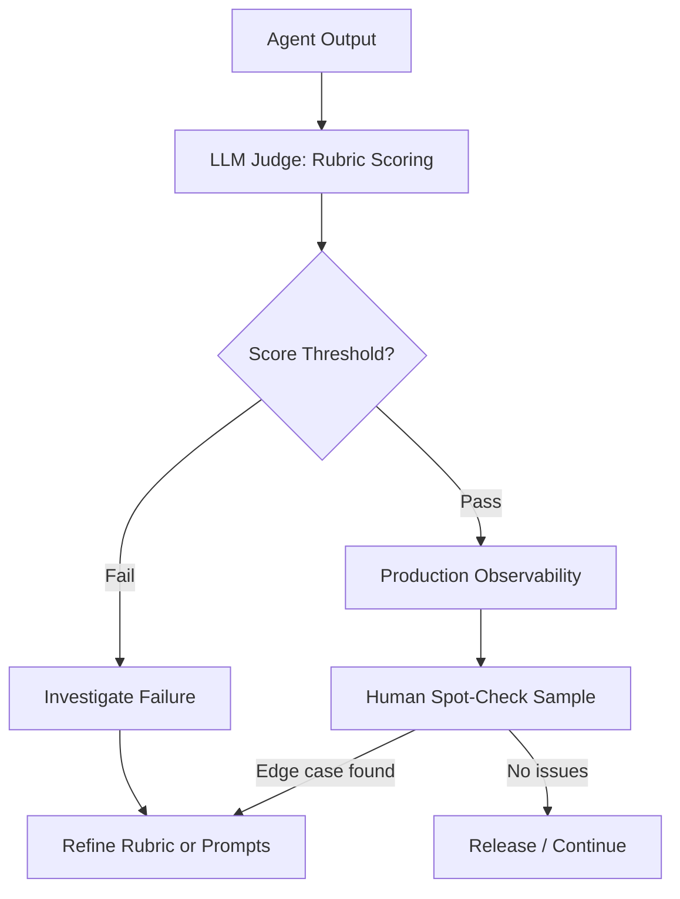

# LLM-as-Judge Evaluation with Human Spot-Checking

> Combine automated LLM rubric scoring with targeted human review to evaluate multi-agent output at scale without sacrificing quality on edge cases.

## The Problem

Multi-agent outputs resist traditional programmatic evaluation. Research reports, synthesized answers, and generated code are free-form; they rarely have a single correct answer. Evaluating them manually at scale is not feasible — but handing evaluation entirely to automation misses the subtle failures that matter most in production.

The solution is layered: automated LLM-as-judge scoring handles volume, human review handles edge cases, and observability tooling surfaces the systematic failures that neither catches individually.

## The Evaluation Pipeline



## Automated LLM-as-Judge Scoring

The judge evaluates each output against a rubric with independent dimensions. Anthropic's [multi-agent research system](https://www.anthropic.com/engineering/multi-agent-research-system) evaluated outputs across five dimensions:

- **Factual accuracy** — do claims match their cited sources?
- **Citation accuracy** — do cited sources actually support the claims made?
- **Completeness** — does the output cover all requested aspects?
- **Source quality** — are primary sources preferred over secondary ones?
- **Tool efficiency** — did the agent use tools appropriately, without excessive calls?

Each dimension produces a score from 0.0–1.0 and a pass/fail grade. Scoring dimensions independently matters: an output can be factually accurate but incomplete, or complete but citing low-quality sources. Aggregating into a single score hides which dimension failed.

Anthropic found that a single LLM call with a single prompt outputting scores and pass/fail grades was "the most consistent and aligned with human judgements" — more than deploying multiple specialized judges ([source](https://www.anthropic.com/engineering/multi-agent-research-system)). Using the same rubric criteria for the LLM judge and human reviewers is the approach Anthropic used to produce that alignment.

## Starting Small: 20 Queries

Full evaluation suites of hundreds of test cases are not required before systematic testing can begin. Anthropic recommends starting with "20-50 simple tasks drawn from real failures" ([source](https://www.anthropic.com/engineering/demystifying-evals-for-ai-agents)). Early-stage agents have "abundant low-hanging fruit" where prompt changes produce large improvements — effect sizes are large enough that small sample sizes suffice to detect them. Signal is high when each change produces a noticeable, measurable shift.

Build the test case library incrementally: start with the 20 queries most representative of your actual usage, add edge cases as human review surfaces them, and expand as improvements become smaller and harder to detect.

## Human Spot-Checking

Human review catches what automation misses. Anthropic's human testers identified:

- Hallucinations on unusual queries that the LLM judge scored as passing
- System-level failures not visible in individual output scores
- Subtle source-selection biases — early agents consistently chose SEO-optimized content farms over authoritative but less highly-ranked academic sources

The source-selection bias is instructive: it was not detectable from output text alone. The outputs looked well-cited. Only human testers who recognized the sources as low-quality caught it. This class of failure — plausible-looking outputs with structural biases — is invisible to a judge scoring factual accuracy from the text.

Human spot-checking is not a review of every output. It is a targeted sample: review a fixed set of known-hard queries each release, review outputs flagged by the automated judge as borderline, and rotate in novel queries that test distribution edges.

## Observability Without Privacy Compromise

Production observability provides a third signal: patterns across many interactions, not just individual outputs.

Monitor agent decision patterns and interaction structures without logging the contents of individual conversations — Anthropic describes this as maintaining user privacy while still capturing diagnostic signal ([source](https://www.anthropic.com/engineering/multi-agent-research-system)). The focus is on structural behavior: which tools were invoked, sequencing patterns, and where the agent stalled — not the content of user messages.

This structural logging surfaces systematic failures that neither rubric scoring nor human spot-checking catches: an agent that consistently uses a particular tool in the wrong order, or that stalls on a specific query type at high frequency. These are root causes, not symptoms.

## Aligning Judge and Human Reviewers

The LLM judge and human reviewers should use the same rubric. Alignment degrades when the judge is scoring on dimensions that human reviewers do not consider, or vice versa. Before deploying automated scoring:

1. Define rubric dimensions explicitly — each dimension should be independently scorable
2. Have human reviewers score a sample set using the rubric
3. Have the LLM judge score the same sample set
4. Compare scores and resolve disagreements by refining the rubric or the judge prompt
5. Treat ongoing disagreement between judge and humans as a signal to investigate

Calibration is not a one-time step. When new query types enter the distribution, re-run the calibration process against a fresh human-scored sample before relying on automated scoring for those types.

## When This Backfires

LLM-as-judge evaluation degrades or fails in several conditions:

- **Shared model bias**: LLM judges often share stylistic and verbosity biases with the models they evaluate. A fluent but factually incorrect output can score higher than a terse but correct one because the judge rewards surface coherence. This is especially acute when judge and subject are the same model family.
- **Distribution shift without recalibration**: A rubric calibrated against one query distribution will drift as usage patterns change. New query types that weren't in the original calibration set can have systematically miscalibrated scores — producing false confidence in a judge that no longer aligns with human reviewers.
- **Subtlety ceiling**: The single-judge approach performs well on dimensions with clear criteria (citation accuracy, factual accuracy against cited sources) but struggles with nuanced quality signals — tone appropriateness, reasoning soundness, or whether a source is authoritative in context. Human spot-checking remains essential for these dimensions.
- **Cost at scale**: Running a separate LLM call per output adds latency and cost. For high-volume pipelines where outputs are mostly pass and human review is infrequent, simpler deterministic heuristics (length checks, citation presence, known-bad pattern detection) may catch the same failures at a fraction of the cost before escalating to LLM scoring.

## Handling Rubric Failures

When an output fails a rubric dimension, the failure source may be anywhere in the pipeline: the orchestrator, a subagent, a tool call, or the final synthesis step. Rubric scoring identifies what failed; observability data helps locate where.

Routing investigations:

- **Factual or citation accuracy failures** — check tool outputs and source retrieval; the subagent may be selecting the wrong sources upstream
- **Completeness failures** — check orchestrator task decomposition; required subtasks may not be delegated
- **Tool efficiency failures** — review traces for repeated tool calls or circular loops
- **Bias failures (human-identified)** — update source quality heuristics or add explicit rubric criteria

## Example

The following shows a single-call LLM judge scoring a research agent's output against a rubric with independent dimensions, as described in Anthropic's multi-agent research system.

**Judge prompt** (sent as a single call to the evaluating model):

```python
JUDGE_PROMPT = """
You are evaluating the output of a research agent. Score each dimension independently from 0.0 to 1.0 and give a pass (>=0.7) or fail grade.

## Output to evaluate
{agent_output}

## Reference sources used
{sources}

## Rubric

1. **Factual accuracy** — Do all factual claims in the output match the cited sources?
2. **Citation accuracy** — Does each citation actually support the specific claim it is attached to?
3. **Completeness** — Does the output address all aspects of the original research question?
4. **Source quality** — Are primary sources (official docs, peer-reviewed papers, primary data) preferred over secondary ones?
5. **Tool efficiency** — Based on the tool call log, did the agent avoid redundant or circular tool calls?

## Required output format (JSON)
{
  "factual_accuracy":  {"score": 0.0, "pass": false, "note": "..."},
  "citation_accuracy": {"score": 0.0, "pass": false, "note": "..."},
  "completeness":      {"score": 0.0, "pass": false, "note": "..."},
  "source_quality":    {"score": 0.0, "pass": false, "note": "..."},
  "tool_efficiency":   {"score": 0.0, "pass": false, "note": "..."}
}
"""
```

**Evaluation script** that runs the judge and routes failures:

```python
import anthropic, json

client = anthropic.Anthropic()

def evaluate(agent_output: str, sources: list[str], tool_log: list[dict]) -> dict:
    response = client.messages.create(
        model="claude-opus-4-5",
        max_tokens=1024,
        messages=[{
            "role": "user",
            "content": JUDGE_PROMPT.format(
                agent_output=agent_output,
                sources="\n".join(sources),
            )
        }]
    )
    scores = json.loads(response.content[0].text)

    failures = [dim for dim, result in scores.items() if not result["pass"]]
    if failures:
        print(f"FAIL on: {failures}")
        # route to human review queue; do not release
    else:
        print("PASS — sample for human spot-check")
    return scores
```

Running this against 20 representative queries before a release surfaces whether factual accuracy or citation accuracy is the failing dimension — keeping scores separate ensures the right subagent or prompt is targeted for improvement rather than applying a broad fix that may degrade passing dimensions.

## Key Takeaways

- Score evaluation dimensions independently — an aggregated single score hides which dimension failed
- Start with ~20 representative queries; small sample sizes detect large effect sizes from early-stage improvements
- A single LLM judge with a unified rubric produces more consistent scores than multiple specialized judges
- Human spot-checking catches structural biases and subtle failures that text-scoring misses
- Log agent decision patterns and tool usage in production, not conversation contents, to preserve privacy while surfacing systematic failures
- Align the judge and human reviewers on the same rubric before deploying automated scoring

## Related

- [Incremental Verification: Check at Each Step, Not at the End](../verification/incremental-verification.md)
- [Layered Accuracy Defense](../verification/layered-accuracy-defense.md)
- [Simulation and Replay Testing for Agent Workflows](simulation-replay-testing.md)
- [Agent-Assisted Code Review: Agents as PR First Pass](../code-review/agent-assisted-code-review.md)
- [Eval-Driven Development](eval-driven-development.md)
- [Eval-Driven Tool Development](eval-driven-tool-development.md)
- [Closed-Loop Agent Training](closed-loop-agent-training.md)
- [Continuous Agent Improvement](continuous-agent-improvement.md)
