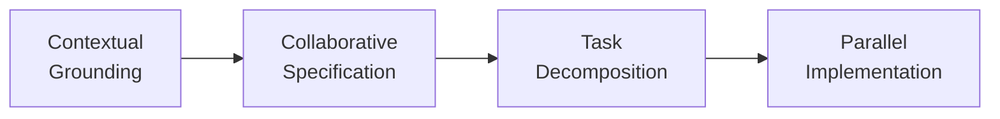

# Mise en Place for Agentic Coding

> Mise en place front-loads grounding, specification, and task decomposition before agents touch code, giving concurrent agents a shared written ground-truth to align on.

Andrew Zigler proposes mise en place (MEP) as a three-phase preparation methodology for agentic coding, named after the culinary practice of arranging every ingredient before cooking starts ([Zigler, 2026 — arxiv 2605.05400](https://arxiv.org/abs/2605.05400)). The argument: code generation is rarely the bottleneck — alignment is. Agents working from thin context produce code that diverges from intent, conventions, or domain semantics, and the subsequent debugging cycle dominates total time. MEP shifts effort from reactive correction to proactive preparation.

## The Three Phases



### 1. Contextual Grounding

Externalize tacit knowledge into structured documents that agents read. The hackathon case in Zigler's paper produced ten planning documents totalling 9,386 words — including API exploration notes, competitive analysis, and "an extended dictation on pedagogical design philosophy drawn from the practitioner's teaching experience" ([Zigler, 2026](https://arxiv.org/abs/2605.05400)). The artifacts here are CLAUDE.md/AGENTS.md-style instruction files plus domain-specific notes; the goal is converting expert judgment into something agents can act on. This is the same elicitation problem covered by [encoding tacit knowledge](encoding-tacit-knowledge.md) — MEP wires it to the front of a single project rather than to a long-running improvement loop.

### 2. Collaborative Specification

Human-agent dialogue produces design artifacts capturing screens, interactions, data flows, quality standards, and — critically — the *why* behind each decision. The pattern: "the practitioner describes intent, the agent proposes details, the practitioner accepts, rejects, or modifies" ([Zigler, 2026](https://arxiv.org/abs/2605.05400)). This is the same loop formalized by [spec-driven development with Spec Kit](spec-driven-development.md), with one emphasis: the spec must capture rationale, not just behaviour, so concurrent agents can make aligned micro-decisions without supervision.

### 3. Task Decomposition

Convert the specification into structured, dependency-aware task records. The paper uses [Beads](https://github.com/steveyegge/beads) — JSONL records committed to git carrying priorities, dependencies, and acceptance criteria — explicitly because Anthropic's harness research found models inappropriately modify Markdown more than JSON ([Anthropic, 2025](https://www.anthropic.com/engineering/effective-harnesses-for-long-running-agents)). Sixty-four task records covered the hackathon platform; four parallel subagents picked them up by dependency order. The decomposition turns specification into a parallelizable work queue with explicit boundaries.

## Context Fluency

Zigler names the underlying skill *context fluency* — "the ability to create rich, structured context that AI agents can act on" — with four components: decomposition (parallelizable tasks), specification (what *and* why), constraint definition (what to exclude or defer), and domain encoding (externalising tacit knowledge) ([Zigler, 2026](https://arxiv.org/abs/2605.05400)). Anthropic's 2026 Agentic Coding Trends Report frames context engineering as the dominant skill shift for AI-assisted developers ([Anthropic, 2026](https://resources.anthropic.com/hubfs/2026%20Agentic%20Coding%20Trends%20Report.pdf)). MEP is one concrete operationalisation of that skill.

## When MEP Pays Off

MEP's preparation cost is real — two hours in the case study, before any code was written. The payoff conditions are narrow and specific:

- **Parallel agent fan-out.** Concurrent agents have no shared session memory; the spec and task graph become their alignment substrate. The hackathon ran four parallel subagents; without externalised intent each would have re-derived the design independently.
- **Unfamiliar or domain-heavy work.** When the agent cannot infer conventions from training data — pedagogical design, regulated domains, novel architectures — externalised tacit knowledge prevents confident-sounding hallucinated patterns.
- **Irreversible or expensive implementation.** When an implement-fail-fix cycle burns a large context window or ships incorrect code that compounds, upfront alignment cost is cheaper than downstream rework. This is the same cost asymmetry covered by the [research-plan-implement pattern](research-plan-implement.md).

## When MEP Backfires

The paper's evidence is a single hackathon, a single practitioner, no control group, no other-team instrumentation, and a five-hour competitive timeframe — the authors explicitly classify the work as exploratory and call for empirical validation ([Zigler, 2026, §6.1](https://arxiv.org/abs/2605.05400)). The methodology breaks down under several conditions:

- **Tight feedback loops.** When tests run in seconds and errors are cheap to surface, two hours of preparation buys little — try-and-fix converges faster than plan-and-verify. AICE Labs' reading: "no matter how much work you put into the upfront design, there will be deviations during implementation" ([AICE Labs, 2025](https://www.aicelabs.com/articles/upfront-specification-vs-fast-feedback)).
- **Exploratory or discovery work.** A spec written before the problem shape is known ossifies premature structure. Kent Beck's critique of pre-spec methodologies generalises here: encoding the assumption that nothing learned during implementation should change the plan contradicts how software actually evolves ([Kindred, 2026](https://brandonkindred.medium.com/same-patterns-new-hype-spec-driven-development-5183d8e8f704)).
- **Evolving requirements.** Static specs drift from implementation; Augment Code argues a stale spec misleads agents more dangerously than a stale design doc misleads humans, because agents execute the plan confidently without flagging divergence ([Augment Code, 2026](https://www.augmentcode.com/blog/what-spec-driven-development-gets-wrong)). MEP needs an explicit replan gate, not a frozen spec.
- **Single-agent sequential work.** The methodology's payoff scales with concurrent agents needing shared ground-truth. A solo agent doing one task at a time can use lighter patterns — the [plan-first loop](plan-first-loop.md) provides most of the alignment benefit at a fraction of the preparation tax.

The operator-expertise confound is also acknowledged in the paper itself: "we cannot separate the methodology's contribution from operator expertise" ([Zigler, 2026, §6.1](https://arxiv.org/abs/2605.05400)). Treat MEP as a synthesis of established practices (instruction files, spec-driven dialogue, structured task graphs), not a validated multiplier in its own right.

## Example

The hackathon platform — teachers curating bounded research environments from The Atlantic's archive for students using a Socratic AI tutor — was built in five hours after roughly two hours of preparation, producing 8,496 lines across 43 TypeScript/TSX files via four parallel subagents ([Zigler, 2026, §5](https://arxiv.org/abs/2605.05400)).

The preparation artifacts:

```
preparation/
  CLAUDE.md                          # agent instructions, conventions
  pedagogy.md                        # tacit teaching-design knowledge
  api-exploration.md                 # vendor-API notes
  competitive-analysis.md            # what existing tools do and don't
  spec.md                            # screens, data flows, quality bars, rationale
  beads/                             # 64 JSONL task records
    classroom-creation.jsonl
    research-workspace.jsonl
    demo-toggle.jsonl
    socratic-tutor.jsonl
```

Each subagent loads `CLAUDE.md` plus `spec.md`, queries Beads for ready tasks in its feature area, and implements against acceptance criteria. The spec carries the *why* (Socratic method, age-appropriate scaffolding, archive licensing constraints) so subagents make aligned micro-decisions without coordinating. Without the externalised pedagogy notes, agents would default to generic chatbot patterns; without Beads' JSON dependency graph, parallel implementation would step on shared interfaces.

## Key Takeaways

- MEP is three sequential phases — contextual grounding, collaborative specification, task decomposition — that produce written artifacts agents read before any code is generated.
- The mechanism is alignment, not generation: parallel agents working from shared externalised intent make consistent micro-decisions that reactive correction would otherwise have to fix.
- The paper's evidence is one practitioner, one hackathon, no control group; treat MEP as a useful synthesis of established practices, not a validated speedup.
- Apply it when implementation is parallel, irreversible, or domain-heavy. Skip it for tight-loop scripting, exploratory prototyping, and well-mapped single-agent work where the [plan-first loop](plan-first-loop.md) provides most of the alignment benefit at lower cost.
- Pair MEP with an explicit replan gate so the spec evolves with the implementation rather than misleading agents when reality diverges from the plan.

## Related

- [The Research-Plan-Implement Pattern](research-plan-implement.md)
- [The Plan-First Loop: Design Before Code](plan-first-loop.md)
- [Spec-Driven Development with Spec Kit](spec-driven-development.md)
- [Encoding Tacit Knowledge into Agent Improvement Loops](encoding-tacit-knowledge.md)
- [Beads Task Graph for Agent Memory](../agent-design/beads-task-graph-agent-memory.md)
- [Agent-Driven Greenfield Product Development](agent-driven-greenfield.md)
- [Vibe Coding: Outcome-Oriented Agent-Assisted Development](../anti-patterns/vibe-coding.md)
- [Parallel Agent Sessions](parallel-agent-sessions.md)
