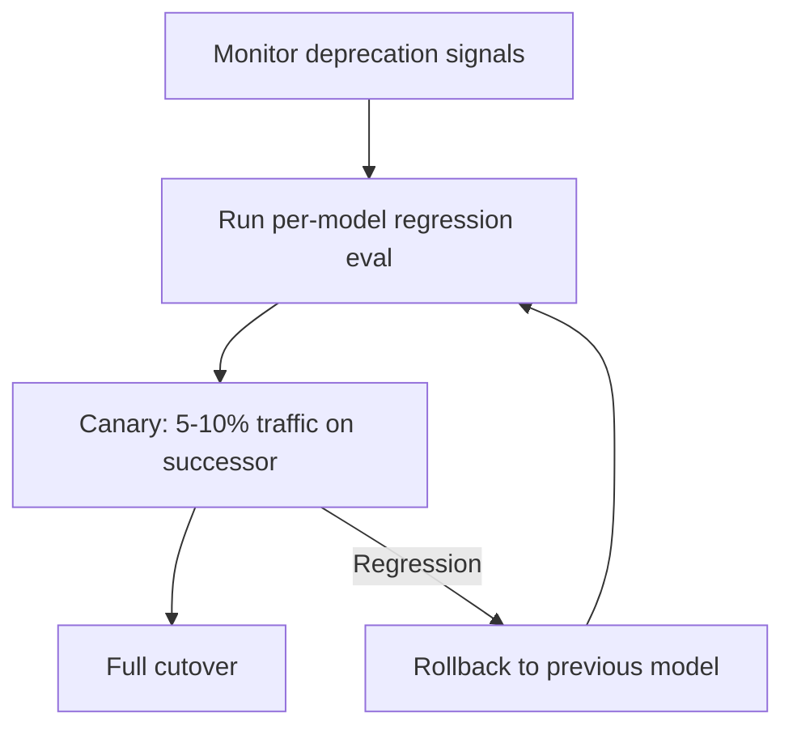

# Model Deprecation Lifecycle for Agent Workloads

> Treat LLM deprecation as a recurring supply-chain event: monitor announcements, run per-model regression evals, stage cutover with canary traffic, and keep a tested fallback to the previous model until the successor passes evals.

## Why Deprecation Is an Operational Problem

Model IDs have finite lifespans. Anthropic defines a four-stage lifecycle — Active, Legacy, Deprecated, Retired — and commits to at least 60 days notice before retirement for publicly released models ([Anthropic: Model deprecations](https://platform.claude.com/docs/en/about-claude/model-deprecations)). After the retirement date, requests to the retired ID fail; the API does not transparently reroute to a successor ([Anthropic: Model deprecations](https://platform.claude.com/docs/en/about-claude/model-deprecations)).

Deprecation windows are short and getting shorter. As of 2026-04-23, `claude-sonnet-4-20250514` and `claude-opus-4-20250514` were deprecated on 2026-04-14 with retirement scheduled for 2026-06-15 — a 62-day window ([Anthropic: Model deprecations](https://platform.claude.com/docs/en/about-claude/model-deprecations)). On GitHub Copilot, deprecation windows are tighter: GPT-5.1 and its Codex variants were deprecated on 2026-04-03 with migration to GPT-5.3-Codex ([GitHub Changelog: GPT-5.1 deprecated](https://github.blog/changelog/2026-04-03-gpt-5-1-codex-gpt-5-1-codex-max-and-gpt-5-1-codex-mini-deprecated)), and Opus 4.6 Fast was retired from the Pro+ tier on the same day it was announced, 2026-04-10 ([GitHub Changelog: Opus 4.6 Fast retired](https://github.blog/changelog/2026-04-10-enforcing-new-limits-and-retiring-opus-4-6-fast-from-copilot-pro)).

The operational wrapper sits above model-routing patterns like [cost-aware agent design](../agent-design/cost-aware-agent-design.md) and [cross-vendor competitive routing](../agent-design/cross-vendor-competitive-routing.md). Routing chooses which model handles a task; lifecycle management keeps that choice viable when providers force a change.

## Two Failure Modes

Migrations break workloads through two independent mechanisms. The workflow has to address both.

**API-level breakage.** Retired model IDs return errors. Hardcoded `claude-3-5-haiku-20241022` stopped working on 2026-02-19; `claude-3-haiku-20240307` stopped on 2026-04-20 ([Anthropic: Model deprecations](https://platform.claude.com/docs/en/about-claude/model-deprecations)). This is detectable at request time and easy to fix — swap the ID — but only if the deadline is tracked before it hits.

**Behavioral drift on the successor.** A model-ID swap across a major generation is not a drop-in replacement. The Opus 4.6 → 4.7 migration introduced breaking API changes: `temperature`, `top_p`, and `top_k` return a 400 error; `thinking: {type: "enabled", budget_tokens: N}` is replaced by `thinking: {type: "adaptive"}` plus the `effort` parameter; prefill returns a 400 error; and a new tokenizer uses 1.0× to 1.35× as many tokens on the same text ([Anthropic: Migration guide](https://platform.claude.com/docs/en/about-claude/models/migration-guide)). Behaviorally, Opus 4.7 interprets prompts more literally, spawns fewer subagents by default, uses tools less often, and respects effort levels strictly — Anthropic's own guide states that "a prompt and harness review may be especially helpful for migration" ([Anthropic: Migration guide](https://platform.claude.com/docs/en/about-claude/models/migration-guide)).

Behavioral drift is the harder failure mode: the request succeeds, but the agent silently under-reasons, fails to delegate, or exceeds its token budget. Static review cannot detect it.

## The Four-Stage Workflow

### 1. Monitor Deprecation Signals

Subscribe to every primary source. Provider changelogs publish retirements before emails arrive, and emails are easy to miss on shared distribution lists.

- Anthropic: the [model deprecations page](https://platform.claude.com/docs/en/about-claude/model-deprecations) lists every publicly released model with current state, deprecation date, and tentative retirement date.
- Anthropic Console → Usage → Export CSV: the [audit path](https://platform.claude.com/docs/en/about-claude/model-deprecations) for identifying which of your API keys are still calling deprecated IDs.
- GitHub Copilot: the [Copilot-labelled changelog](https://github.blog/changelog/label/copilot/) announces deprecations, retirements, and new-model availability on the same feed.
- Anthropic Models API: the `/v1/models/list` endpoint returns current model IDs programmatically ([Anthropic models overview](https://platform.claude.com/docs/en/docs/about-claude/models)), usable in a daily CI job that diffs the current list against the expected one.

Use display-name aliases (`claude-opus-4-7`) where possible, and pin full dated IDs (`claude-opus-4-7-20260416`) only when reproducibility requires it ([Anthropic models overview](https://platform.claude.com/docs/en/docs/about-claude/models)).

### 2. Maintain a Per-Model Regression Eval

The regression suite runs a fixed set of representative tasks against the current production model and records outputs as the baseline. Before any migration, the same suite runs against the candidate successor. Behavioral drift surfaces as eval deltas; API-level changes surface as request failures.

Keep evals covering the dimensions Anthropic flags as drift-prone in the migration guide: response length calibration, literal instruction following, tool-call frequency, subagent spawning, and effort-level honouring ([Anthropic: Migration guide](https://platform.claude.com/docs/en/about-claude/models/migration-guide)). These five dimensions distinguish a "same-model-ID-different-number" migration from a true drop-in replacement. Pair this with general eval-design practice from [golden query pairs regression](../verification/golden-query-pairs-regression.md) and [LLM-as-judge evaluation](./llm-as-judge-evaluation.md).

### 3. Canary Migration

Traffic splitting limits blast radius when the eval misses a regression. Apply the discipline from [canary rollout for agent policy changes](canary-rollout-agent-policy.md): deploy the successor to a small slice (5–10%), monitor for error rates, latency, cost, and qualitative goal achievement, and compare against the baseline slice running the incumbent.

Two canary-specific concerns arise for model migrations. First, new tokenizers change cost: Opus 4.7's tokenizer uses up to 35% more tokens on the same text, so cost comparison requires normalising against actual token counts rather than message counts ([Anthropic: Migration guide](https://platform.claude.com/docs/en/about-claude/models/migration-guide)). Second, retirement deadlines constrain how long the canary can run. A 60-day window from deprecation to retirement is the hard ceiling; staged traffic ramps have to finish before the incumbent disappears.

### 4. Fallback Routing

Until the successor passes the eval suite and completes a successful canary, keep the previous model reachable. Two fallback patterns:

- **Deprecation-aware fallback**: when the successor is the default and the incumbent is deprecated-but-not-retired, fall back to the incumbent on successor failure. This terminates at the retirement date.
- **Cross-provider fallback**: if both Anthropic and a provider-routed Copilot path are configured, failing one provider's successor routes to the other. This is cheap when [provider abstraction](../agent-design/cost-aware-agent-design.md) is already in place.

Fallback is not a substitute for the eval. If the successor silently regresses a behavior without throwing an error, the fallback is never triggered and the regression ships.

## When This Backfires

- **Single low-stakes workload with rare invocations.** Maintaining a standing eval suite, a canary split, and fallback routing costs more than absorbing the occasional reactive migration. When the blast radius is one engineer fixing a failed request, the ceremony is waste.
- **Provider-managed harnesses.** Anthropic's migration guide states that for Claude Managed Agents, "no changes beyond updating model name are required" ([Anthropic: Migration guide](https://platform.claude.com/docs/en/about-claude/models/migration-guide)). Copilot consumer tiers route users to successor models automatically. Teams operating entirely inside these boundaries have little to migrate.
- **Same-day retirements.** Copilot's Opus 4.6 Fast was retired on the day it was announced ([GitHub Changelog: Opus 4.6 Fast retired](https://github.blog/changelog/2026-04-10-enforcing-new-limits-and-retiring-opus-4-6-fast-from-copilot-pro)). When notice is zero, the canary step is impossible. The eval and fallback still matter; the traffic-split step compresses to an immediate cutover with rollback as the only safety net.
- **Non-repeatable workloads.** Regression evals require a stable reference output. Agents handling novel, non-deterministic tasks (exploratory research, open-ended refactors) cannot produce a comparable signal run-to-run. Pair with [behavioral testing](../verification/behavioral-testing-agents.md) rather than output-match regression.

## Example

The `claude-sonnet-4-20250514` deprecation announced 2026-04-14 with retirement on 2026-06-15 ([Anthropic: Model deprecations](https://platform.claude.com/docs/en/about-claude/model-deprecations)) is a concrete case. The recommended successor is `claude-sonnet-4-6`. The workflow timeline:

- **Day 0 (2026-04-14)**: deprecation notice arrives. Audit Console usage export to identify which API keys call `claude-sonnet-4-20250514`. Confirm the 62-day window to 2026-06-15.
- **Day 1–7**: run the regression eval suite against `claude-sonnet-4-6`. Sonnet 4.6 is a minor-version successor, so breaking API changes from Opus 4.6 → 4.7 do not apply here — but behavioral drift on tool-call frequency and response length still needs verification.
- **Day 8–21**: deploy canary at 10% traffic. Compare error rate, p95 latency, and token cost against the 90% slice still on `claude-sonnet-4-20250514`. Normalise cost on output tokens since the tokenizer is stable across Sonnet 4.x.
- **Day 22–45**: if canary metrics match or beat baseline, ramp to 50%, then 100%. Leave `claude-sonnet-4-20250514` wired as a fallback until Day 55.
- **Day 55 (2026-06-08)**: remove the fallback path — the deprecated ID goes dark on Day 62 regardless.
- **Day 62 (2026-06-15)**: retirement date. Any remaining call to `claude-sonnet-4-20250514` returns an error.

This timeline fits inside Anthropic's 60-day notice. For a Copilot same-day retirement like Opus 4.6 Fast, the same workflow compresses: regression eval runs before the announcement (pre-calibrated against an alternative tier), canary becomes an immediate cutover, and fallback is the only safety net.

## Key Takeaways

- Anthropic commits to at least 60 days notice before retirement, but Copilot has shipped same-day retirements — build the workflow before the announcement, not in response to it.
- Two failure modes, both in scope: retired IDs fail at request time, and successors drift behaviorally even when the ID swap is clean.
- The Opus 4.6 → 4.7 migration lists nine specific behavioral differences in Anthropic's own guide — a successful ID swap is not a successful migration.
- Regression evals must cover drift-prone dimensions: response length, literal instruction following, tool-call frequency, subagent spawning, effort-level honouring.
- Keep the previous model as a tested fallback until the successor passes evals; the fallback terminates at the retirement date regardless.
- Use display-name aliases where possible, and reserve pinned dated IDs for reproducibility-sensitive workloads.

## Related

- [Cost-Aware Agent Design](../agent-design/cost-aware-agent-design.md) — tier selection within a single vendor; lifecycle management is the operational wrapper
- [Cross-Vendor Competitive Routing](../agent-design/cross-vendor-competitive-routing.md) — platform-level fallback when one vendor's successor fails eval
- [Canary Rollout for Agent Policy Changes](canary-rollout-agent-policy.md) — the traffic-split discipline reused in the migration step
- [Golden Query Pairs Regression](../verification/golden-query-pairs-regression.md) — regression eval structure for per-model baselines
- [Behavioral Testing for Agents](../verification/behavioral-testing-agents.md) — covers non-deterministic workloads where output-match regression is not viable
- [LLM-as-Judge Evaluation](llm-as-judge-evaluation.md) — scoring successor output against baseline
- [Eval-Driven Development](eval-driven-development.md) — standing eval infrastructure that a deprecation workflow extends
- [Reasoning Budget Allocation](../agent-design/reasoning-budget-allocation.md) — effort-level tuning changes between generations
