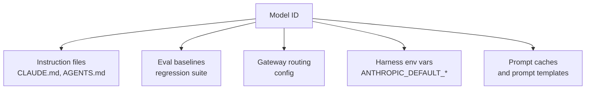

# Model-ID-as-Dependency: Migration Protocol for Deprecation Churn

> Treat every model ID as a versioned dependency: inventory each surface, propagate the migration atomically, and gate it behind a regression eval before deprecation hits.

The protocol is the codebase-side complement to [`model-deprecation-lifecycle`](model-deprecation-lifecycle.md). Where the lifecycle workflow covers monitor, eval, canary, and fallback over time, this protocol covers the spatial dimension: every place a model ID is pinned in the codebase, treated as one inventory and updated atomically. A model ID in an agent-driven codebase is a distributed reference like a package version, and the same lockfile-style discipline applies.

## When the Protocol Earns Its Overhead

Run this only when at least three of the following are true. Otherwise a single grep-and-replace is the proportionate response.

- The codebase references model IDs in three or more surfaces — instruction files, eval baselines, gateway routing, harness env vars, prompt-caching keys, prompt templates that quote model behavior.
- More than one provider changelog feeds the codebase — for example Anthropic plus GitHub Copilot, where notice windows differ by an order of magnitude.
- The team runs its own gateway, eval suite, or instruction file that names models (consumer-tier Copilot users have no such surfaces to maintain).
- Provider notice has been shorter than reactive migration tolerates at least once. Anthropic commits to 60 days notice ([Anthropic: Model deprecations](https://platform.claude.com/docs/en/about-claude/model-deprecations)). GitHub Copilot has shipped seven-day windows: Grok Code Fast 1 was announced 2026-05-08 for deprecation 2026-05-15 ([GitHub Changelog: Grok Code Fast 1](https://github.blog/changelog/2026-05-08-upcoming-deprecation-of-grok-code-fast-1/)).

## What Cadence Looks Like

Between 2026-05-01 and 2026-05-08, GitHub Copilot announced four model deprecations:

| Announced | Model | Deprecation date | Replacement | Source |
|-----------|-------|------------------|-------------|--------|
| 2026-05-01 | GPT-5.2, GPT-5.2-Codex | 2026-06-01 | GPT-5.5, GPT-5.3-Codex | [GitHub Changelog](https://github.blog/changelog/2026-05-01-upcoming-deprecation-of-gpt-5-2-and-gpt-5-2-codex/) |
| 2026-05-07 | Claude Sonnet 4 | 2026-05-06 | Claude Sonnet 4.6 | [GitHub Changelog](https://github.blog/changelog/2026-05-07-claude-sonnet-4-deprecated/) |
| 2026-05-07 | GPT-4.1 | 2026-06-01 | GPT-5.5 | [GitHub Changelog](https://github.blog/changelog/2026-05-07-upcoming-deprecation-of-gpt-4-1/) |
| 2026-05-08 | Grok Code Fast 1 | 2026-05-15 | GPT-5 mini or Claude Haiku 4.5 | [GitHub Changelog](https://github.blog/changelog/2026-05-08-upcoming-deprecation-of-grok-code-fast-1/) |

The Claude Sonnet 4 row deprecation date *precedes* the announcement date — the announcement notified after the fact. The Grok Code Fast 1 window is seven days. Anthropic's own table shows `claude-sonnet-4-20250514` and `claude-opus-4-20250514` deprecated 2026-04-14 for retirement 2026-06-15 — a 62-day window that fits inside the 60-day commitment ([Anthropic: Model deprecations](https://platform.claude.com/docs/en/about-claude/model-deprecations)). A codebase that sits on both providers' substrate must accommodate the tighter window, not the looser one.

## The Five Surfaces



Each surface fails on a different timeline when the ID retires:

- **Instruction files** — phrases like "Sonnet 4 follows X" go stale silently. No request error. The agent operates on false premises about its own model's behavior.
- **Eval baselines** — recorded outputs become non-reproducible. The suite still runs, but its comparison reference no longer exists, so regression detection breaks. The Anthropic migration guide flags response length, literal instruction following, tool-call frequency, subagent spawning, and effort-level honouring as drift-prone dimensions to keep covered ([Anthropic: Migration guide](https://platform.claude.com/docs/en/about-claude/models/migration-guide)).
- **Gateway routing config** — API requests start failing at the retirement date. This is the loudest failure mode and the easiest to detect, but only if monitoring is in place.
- **Harness env vars** — Claude Code reads `ANTHROPIC_DEFAULT_OPUS_MODEL`, `ANTHROPIC_DEFAULT_SONNET_MODEL`, `ANTHROPIC_DEFAULT_HAIKU_MODEL` and provider-specific equivalents. A stale value silently routes to a deprecated model until the retirement date.
- **Prompt caches and prompt templates** — Anthropic prompt caching requires "100% identical prompt segments" for a hit ([Anthropic: Prompt caching](https://platform.claude.com/docs/en/build-with-claude/prompt-caching)). Prompt templates that name the model in the system prompt invalidate when the name changes. Templates that cite model behavior become incorrect on a cross-generation hop where the successor reads prompts differently — see [`prompt-rewrite-on-cross-generation-migration`](../instructions/prompt-rewrite-on-cross-generation-migration.md) for the rewrite discipline.

## Protocol

### 1. Inventory in One Pass

Build a single search index of every model reference, on demand or scheduled. The protocol turns five drift events into one diff.

```bash
# Run from repo root — example pattern, extend for the model IDs you ship
git grep -nE 'claude-(opus|sonnet|haiku)-[0-9]|gpt-[0-9]\.[0-9]|grok-' \
  -- '*.md' '*.yaml' '*.yml' '*.json' '*.env*' '*.toml' \
     '.claude/' 'docs/' 'evals/' 'gateway/' 'src/'
```

The output is the canonical inventory. Commit it to the migration ticket — every surface that returned a hit must be updated atomically in one PR or be explicitly listed as out-of-scope.

### 2. Single Source of Truth Per Role

Pin the per-role model in one file the other surfaces import from. For Claude Code, that is the harness env block; for self-hosted gateways, it is the routing config. Instruction files, eval suites, and prompt templates reference the role by name (`reasoning_model`, `execution_model`), not by literal ID.

Pin specific dated versions when reproducibility matters. Display-name aliases (`claude-opus-4-7`) are acceptable when the cost of an unannounced minor-version bump is lower than the cost of pinning maintenance ([Anthropic models overview](https://platform.claude.com/docs/en/docs/about-claude/models)).

### 3. Watch Surfaces, Not Just Provider Pages

Subscribe to every changelog the inventory references. Provider changelogs publish retirements before emails arrive, and emails are easy to miss on shared distribution lists. The audit step uses the provider's own data:

- Anthropic Console → Usage → Export CSV identifies which API keys still call deprecated IDs ([Anthropic: Model deprecations](https://platform.claude.com/docs/en/about-claude/model-deprecations)).
- Anthropic's `/v1/models/list` endpoint returns current model IDs programmatically — usable in a daily CI job that diffs against an expected manifest.
- GitHub Copilot changelog under the `copilot` label publishes deprecations on the same feed as new-model availability ([GitHub Changelog: copilot label](https://github.blog/changelog/label/copilot/)).

Gateway logs are the second source: a sudden rise in fallback events for a particular model ID indicates the provider has flipped state ahead of the changelog post.

### 4. Update Atomically, Gate Behind Eval

When a deprecation lands:

1. Branch from main.
2. Update every surface in the inventory in a single PR. Resist the temptation to update one surface and ship.
3. Re-run the regression eval against the successor. The eval is the gate — the PR does not merge until the suite passes against the new ID. Coverage tracks the dimensions Anthropic flags as drift-prone: response length calibration, literal instruction following, tool-call frequency, subagent spawning, effort-level honouring ([Anthropic: Migration guide](https://platform.claude.com/docs/en/about-claude/models/migration-guide)).
4. For canary, traffic-split, and fallback mechanics, follow [`model-deprecation-lifecycle`](model-deprecation-lifecycle.md) — that page covers the runtime cutover; this protocol covers the codebase-side inventory and propagation.

### 5. Audit and Sweep on a Cadence

When provider churn is weekly, re-run the inventory weekly. Diff the output against the manifest of expected IDs. Any unexpected hit is either drift (a developer hand-edited a model name in a file the protocol does not track) or a new surface that should be added to the inventory. Build the sweep into the same scheduled job that diffs the models API endpoint.

## When This Backfires

- **Single-vendor, single-reference codebase.** A CLAUDE.md with one model name and a default harness setting needs a grep, not a protocol. The overhead exceeds the failure cost.
- **Consumer-tier Copilot or Claude Code users.** Provider transparently routes to successors; the user pins nothing they own.
- **Workloads behind a Managed Agent.** Anthropic's migration guide states that for Claude Managed Agents, "no changes beyond updating model name are required" ([Anthropic: Migration guide](https://platform.claude.com/docs/en/about-claude/models/migration-guide)). The inventory has one entry.
- **Short-lived prototypes.** A two-week build does not need standing migration discipline. The deprecation cliff is unlikely to land before the project ends.
- **Cross-generation hops.** Inventory-and-propagation alone is insufficient when the successor reads prompts differently. Pair with [`prompt-rewrite-on-cross-generation-migration`](../instructions/prompt-rewrite-on-cross-generation-migration.md) — the prompt stack itself needs rebuilding, not just renaming.

## Example

A team runs Claude Code, a self-hosted Anthropic gateway, and CI evals against a daily regression suite. The 2026-04-14 deprecation of `claude-sonnet-4-20250514` (retirement 2026-06-15, replacement `claude-sonnet-4-6`) ([Anthropic: Model deprecations](https://platform.claude.com/docs/en/about-claude/model-deprecations)) triggers the protocol.

**Inventory hits**:

```text
CLAUDE.md:14:  Reasoning: claude-opus-4-7. Execution: claude-sonnet-4-20250514.
.claude/settings.json:8:  "ANTHROPIC_DEFAULT_SONNET_MODEL": "claude-sonnet-4-20250514"
evals/baseline.yaml:3:  model: claude-sonnet-4-20250514
gateway/routes.toml:12:  execution = "claude-sonnet-4-20250514"
docs/internal/agent-notes.md:42: "Sonnet 4 batches tool calls more aggressively..."
```

Five surfaces. One atomic PR:

1. Update `.claude/settings.json` env var to `claude-sonnet-4-6`.
2. Update `gateway/routes.toml` execution route.
3. Update `evals/baseline.yaml` model ID; re-run the suite to record a fresh baseline under the new ID.
4. Update `CLAUDE.md` reasoning/execution block.
5. Delete the model-specific behavioral assertion in `docs/internal/agent-notes.md` — it cannot be re-verified against the successor without testing, and untested claims fail accuracy review.

The eval suite is the gate. If response length or tool-call frequency drifts beyond tolerance, the PR stays open and the team falls back to [`model-deprecation-lifecycle`](model-deprecation-lifecycle.md) for the canary and rollback mechanics. The 62-day window from 2026-04-14 to 2026-06-15 fits inside Anthropic's 60-day notice — the same protocol on a seven-day Copilot window like Grok Code Fast 1 compresses every step, but the inventory + atomic update remains correct.

## Key Takeaways

- Model IDs sit in five surfaces an agent-driven codebase rarely audits together: instruction files, eval baselines, gateway routing, harness env vars, prompt caches and templates. Inventory consolidates them.
- Provider notice windows vary by an order of magnitude. Build the protocol around the tightest window the codebase touches, not the average.
- Pin per-role models in a single source of truth; reference roles by name in instruction files, eval suites, and templates.
- Atomic update gated by regression eval is the unit of migration. One surface at a time is drift in slow motion.
- Run the inventory on a cadence at least as frequent as provider deprecation announcements — weekly when the codebase rides Copilot.
- Skip this protocol when there is one model reference in one file. It earns its overhead at three surfaces plus two changelogs, not before.

## Related

- [Model Deprecation Lifecycle for Agent Workloads](model-deprecation-lifecycle.md) — the runtime side: monitor, eval, canary, fallback. This protocol is the codebase side.
- [Prompt-Rewrite Discipline on Cross-Generation Model Migration](../instructions/prompt-rewrite-on-cross-generation-migration.md) — required pairing when the successor changes how prompts are interpreted.
- [Harness Impermanence](../agent-design/harness-impermanence.md) — scaffolding that wraps current-generation limits also expires; same supply-chain framing applied to harness code.
- [Eval-Driven Development](eval-driven-development.md) — standing eval infrastructure the migration gate reuses.
- [Canary Rollout for Agent Policy Changes](canary-rollout-agent-policy.md) — discipline reused when the migration warrants traffic-split.
