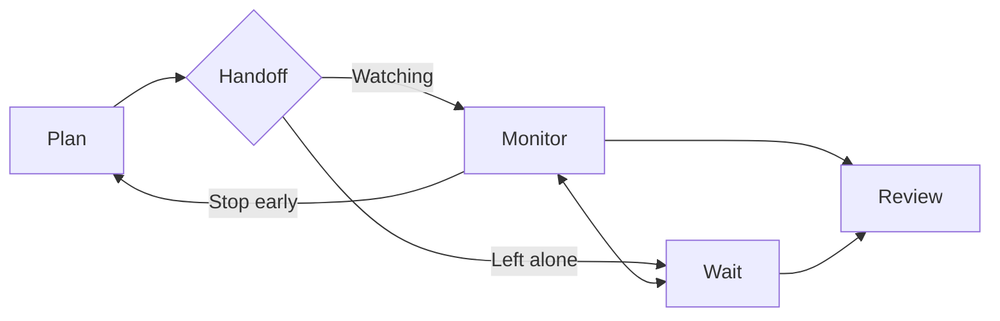

# Monitor or Wait: The Supervision Choice During Agent Execution

> Leaving a running agent is a supervisory stage with its own cost, and containment pays for it rather than a better plan.

Three things decide whether you can stop watching a run: what the agent can do irreversibly while nobody is looking, how far wrong work travels before review catches it, and whether the plan carries an end condition a machine can check. Satisfy all three and the unattended stretch is a bet you have priced. Satisfy none and you have only stopped paying attention.

Park and colleagues observed 19 developers with at least three years of experience working on their own tasks with their own agent setups, had them draw their supervision workflows, then applied the resulting framework to 102 Reddit threads carrying 12,912 comments from May to August 2026 ([Park et al., 2026](https://arxiv.org/abs/2609.24234v1)). Their framework reconfigures Sheridan's human supervisory control into seven stages: Plan, Monitor, Wait, Review, Teach, Manual Fix, and Update Assets. Monitor and Wait sit apart because participants explicitly distinguished them. Sheridan's original framework has no Wait stage.

## Why the stage split matters

Developers in the study named the split themselves. The authors report that "when an agent can continue working for extended periods without human input, participants sometimes left it running and turned their attention elsewhere, describing this as a distinct Wait stage. They explicitly distinguished these periods from Monitor" ([Park et al., 2026](https://arxiv.org/abs/2609.24234v1)). The two alternate inside one execution rather than being a mode you set once. P3 described the alternation: "Sometimes I read them and sometimes I don't. I read for a bit, then go do something else, and then when I read and something seems really off, I stop it."

What Monitor provides is that stop. Developers "monitored the agent during execution to catch these problems before they accumulated into larger amounts of misaligned work," and "when monitoring reveals a fundamental problem, they stop the execution and begin a new cycle from Plan" ([Park et al., 2026](https://arxiv.org/abs/2609.24234v1)). Reading the transcript is the mechanism. The early stop is the product, and it is what Wait gives up.

Collapsing the two into "supervision" hides the trade. You end up believing you supervised a run you never watched.

## Three implementation layers

### Layer 1: Bound what the run can touch

Wait removes the only control that acts on a run in progress. Monitor and Wait both happen while the agent executes, and the paper ties the stop to Monitor, where developers stop the execution "when monitoring reveals a fundamental problem" ([Park et al., 2026](https://arxiv.org/abs/2609.24234v1)). A push, a deploy, or a deletion that landed unattended is not something Review can undo.

Put the bound at the permission layer rather than in prose. A sandboxed worktree, a branch the agent cannot push, credentials it does not hold. That is [least privilege applied to the agent](../security/blast-radius-containment.md), and it is the only bound that holds while nobody is reading. A permission the agent does not hold cannot be talked around.

### Layer 2: Bound what review must catch

Wait moves all intent-gap detection into Review, and Review reads an artifact. P18 in the study described the limit: "[The plan] cannot capture all of my intent—some things get compressed, or it fills them in by guessing, and those only become visible once you get to this [Review] stage" ([Park et al., 2026](https://arxiv.org/abs/2609.24234v1)).

A diff you can read in ten minutes bounds the exposure. Forty files touched across an afternoon does not, and that is the case where leaving is most tempting. Size the stretch to the review you will actually do.

### Layer 3: Write a stop condition a machine can check

The plan components developers credited were scope bounds rather than quality instructions. They stated non-goals alongside goals, such as "do not start x," "do not rewrite y," and "preserve z," and defined a change contract naming "allowed files, expected behavior, and what it must not touch." One developer gave the end condition in a form that fits on a line: "Write the definition of done before it starts. One line: 'done = this test passes and nothing outside file X changes.' Then anything it wants to do that isn't that is, by definition, a rabbit hole" ([Park et al., 2026](https://arxiv.org/abs/2609.24234v1)).

Each of those settles without you in the room. A test passes or it does not. A file outside the allowed set changed or it did not. Guidance phrased as a preference, such as keep it simple, fails this test because nothing in the run can evaluate it.

## Put a watcher in the Wait

The choice is not binary. One developer in the Reddit corpus assigned other agents to detect when an agent became "hung or stuck in place," so they could "help the original agent out of the hole" ([Park et al., 2026](https://arxiv.org/abs/2609.24234v1)). The paper notes such arrangements require deciding in advance what is watched, how detected problems are handled, and when the corrective cycle stops.

A delegated monitor restores part of the early stop without the human attention cost. It narrows the gap rather than closing it, because it catches the failures you specified and stays quiet about the rest.

## Triggers and constraints

The decision is per execution, not per project, and you make it at handoff. Re-make it whenever the run changes shape: a task that grows new subtasks, or a correction cycle that has already looped twice.

The agent's authority during Wait is whatever its permissions allow, so the permission set is the real contract and the plan text is a request. The stages describe what a developer does, so nothing here depends on which agent runs the work.

## Why it works

Monitor's causal value is a shorter detection interval, not better agent output. The developer is present to stop the run before misaligned work accumulates and to restart from Plan when the divergence is fundamental ([Park et al., 2026](https://arxiv.org/abs/2609.24234v1)). Wait trades that interval for parallel capacity, so what makes Wait survivable is whatever bounds how far wrong work travels before Review sees it. A non-touch list and a one-line definition of done limit blast radius. Neither makes the agent more correct.

SlopCodeBench confirms that split from the other direction. Across 36 problems and 196 checkpoints where agents repeatedly extended their own solutions, "explicit quality guidance reduces initial verbosity and erosion by up to a third, without affecting degradation rates" ([Orlanski et al., 2026](https://arxiv.org/abs/2603.24755v2)). Price the unattended decision on containment rather than on how good the plan feels.

## When this backfires

Long iterative runs where the agent extends its own output. SlopCodeBench measured structural erosion rising in 77% of trajectories and verbosity in 75.5%, with the best of 15 agents passing 14.8% of checkpoints. Agent code came out 2.3 times more verbose and 2.0 times more eroded than 473 open-source Python repositories ([Orlanski et al., 2026](https://arxiv.org/abs/2603.24755v2)). A longer unattended stretch buys more of that, and the plan does not slow it.

Correction loops drift too, so a Wait that ends in a long Teach cycle has saved nothing. One developer described "scope drift over long sessions," where the agent "starts building on its own previous assumptions" across successive fixes ([Park et al., 2026](https://arxiv.org/abs/2609.24234v1)).

The freed time goes into supervising more agents. P2: "I instruct from the planning stage, then wait, and while waiting I go on to another round of planning and instructing" ([Park et al., 2026](https://arxiv.org/abs/2609.24234v1)). That is a throughput gain, and total supervisory load moves rather than falls. On single-agent work there is no second task to absorb the Wait, so the only effect is a longer feedback loop.

You lose the map. Developers retained supervision to keep understanding code they had not written. One "still code[s] the tricky architectural decisions myself, the stuff where you need to think through the full system implications," and another periodically rewrites "one risky function or migration without the agent, just to keep the map in my head" ([Park et al., 2026](https://arxiv.org/abs/2609.24234v1)). Where a design is still forming, watching is how you stay able to review it later.

Monitor is not free either, which is the honest version of the trade. Six LLM backbones evaluated on mid-task revision, addition, and retraction in long-horizon web navigation were measured on adapting to updated intent and recovering from the change, and the authors conclude that handling interruptions "remains challenging for powerful large-scale LLMs" ([InterruptBench](https://arxiv.org/abs/2604.00892v1)). A developer who interrupts on every small deviation can damage a run that would have converged.

## Evidence quality

The Monitor and Wait stages come from participant language in a 19-person qualitative study, which is solid ground for the distinction. The claim that a stronger plan earns unattended time is weaker: it rests on anonymous Reddit self-reports quoted in the paper, including one account of agents running "for days without interruption" ([Park et al., 2026](https://arxiv.org/abs/2609.24234v1)). No outcome was measured.

The authors flag their own anchoring risk: participants saw Sheridan's framework before drawing their diagrams, and the paper concedes that "prior exposure may still have anchored how they segmented or represented their supervision" ([Park et al., 2026](https://arxiv.org/abs/2609.24234v1)). Treat the seven stages as a working vocabulary rather than a discovered structure.

## Key Takeaways

- Name the stage you are in. Watching a run and leaving it are different acts with different costs, and one word for both hides the decision.
- The stop is what you give up. Monitor's value is ending a bad run early, so ask what stops the run when nobody is reading.
- Write the end condition as something a machine can check. "This test passes and nothing outside file X changes" survives your absence. "Keep it clean" does not.
- Bound the blast radius at the permission layer, not in the prompt. Review cannot undo an action that already landed.
- A stronger plan improves where the run starts, not how fast it degrades. Explicit quality guidance cut initial erosion by up to a third and left the degradation rate unchanged.

## Related

- [Developer Control Strategies for AI Coding Agents](../human/developer-control-strategies-ai-agents.md) — the plan-supervise-validate loop this decision sits inside
- [Human-in-the-Loop Placement: Where and How to Supervise](human-in-the-loop.md) — where the approval gates go once you have decided how closely to watch
- [Blast Radius Containment: Least Privilege for AI Agents](../security/blast-radius-containment.md) — the permission bounds that make an unattended stretch affordable
- [Developer as CPU Scheduler: Attention Management with Parallel Agents](../human/attention-management-parallel-agents.md) — where the capacity freed by Wait normally goes
- [Escape Hatches: Unsticking Stuck Agents](escape-hatches.md) — the cost of interrupting a run once you decide to
