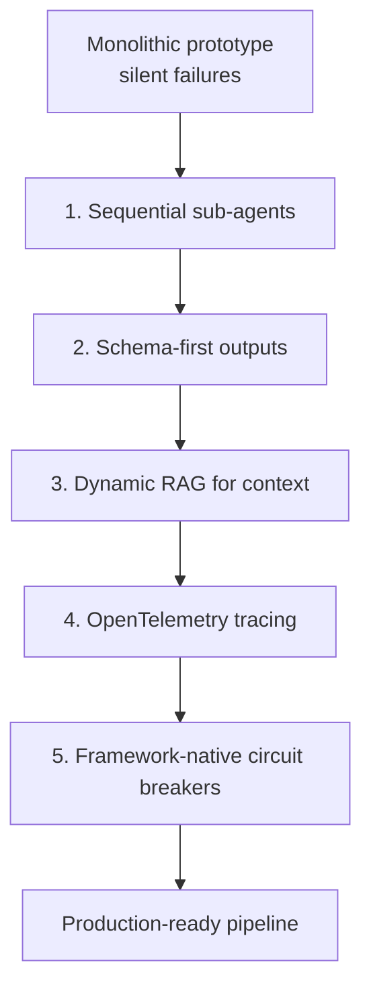

# Monolith-to-Sub-Agents Refactor

> A five-step migration checklist for taking a brittle monolithic agent prototype to a production-grade orchestrated pipeline — ordered so each step surfaces the failure modes the next step fixes.

A monolithic agent is a single linear script that calls one LLM with one large prompt. It works locally on small inputs. It fails silently in production. Google's Agent Development Kit team documented this exact transition in April 2026 by rebuilding "Titanium" — a sales-research agent whose job was to research a target company and draft an outreach email — from a monolithic `for` loop into a five-node `SequentialAgent` pipeline ([Production-Ready AI Agents: 5 Lessons from Refactoring a Monolith](https://developers.googleblog.com/production-ready-ai-agents-5-lessons-from-refactoring-a-monolith/)).

The five lessons generalize across orchestration frameworks — they describe the shape of the refactor, not ADK-specific mechanics. Apply them in order: each step reveals the failure modes the next step addresses.

## When to Apply This Refactor

The refactor assumes your prototype's sub-tasks are **loosely coupled and independently verifiable** — research a company, plan a search, pick a case study, draft an email. If your workflow's steps share dense mutable state (a coding agent editing interconnected files; a conversational agent whose turns depend on nuanced history), decomposition will serialize state across schemas and lose context the monolith carried implicitly. [Cognition's argument against parallel multi-agent architectures](https://cognition.ai/blog/dont-build-multi-agents) applies to those workflows: context isolation produces incoherent outputs the orchestrator cannot reconcile.

Unstructured decomposition is also worse than a monolith. Splitting into sub-agents without a defined topology — sequential, orchestrator-worker, or evaluator — amplifies errors because each agent's hallucinations feed the next. One analysis measured up to a 17.2× error multiplier in "bag of agents" systems ([Why Your Multi-Agent System Is Failing](https://towardsdatascience.com/why-your-multi-agent-system-is-failing-escaping-the-17x-error-trap-of-the-bag-of-agents/)).

## The Five-Step Checklist

### 1. Replace the Monolithic Loop with Sequenced Sub-Agents

The monolith's primary failure mode is silent collapse: "If one sub-task failed (an API timeout or hallucination), the entire process stalled out and failed silently" ([Google](https://developers.googleblog.com/production-ready-ai-agents-5-lessons-from-refactoring-a-monolith/)). A single LLM juggling five responsibilities in one prompt produces one generic error when any one of them breaks, and hallucinations in step 2 silently corrupt step 5's inputs because they share the prompt.

Split the workflow into named nodes, each with one responsibility. Titanium became Company Researcher → Search Planner → Case Study Researcher → Selector → Email Drafter. Each boundary is a *failure seam*: a step either succeeds under contract or raises, and the pipeline surfaces which step failed rather than which prompt.

This is the sequential form of the split described in [Cognitive Reasoning vs Execution](../agent-design/cognitive-reasoning-execution-separation.md) — extend the two-layer seam to N nodes. For the per-node role design principles, see [Specialized Agent Roles](../agent-design/specialized-agent-roles.md).

### 2. Push Structured Outputs into the Schema, Not the Prompt

Monolithic prototypes encode output shape in the prompt string: "Give me the answer in this JSON format: {...}". The result is dirty code, fragile parsing, and wasted tokens repeating the schema on every call.

Move the contract from natural language into a typed object the runtime validates. In the ADK refactor, Pydantic `BaseModel` classes were injected directly as schema definitions; [Vertex AI Structured Outputs](https://cloud.google.com/vertex-ai/docs/generative-ai/multimodal/configure-model-outputs) enforced adherence at runtime ([Google](https://developers.googleblog.com/production-ready-ai-agents-5-lessons-from-refactoring-a-monolith/)). The equivalent primitive exists across major providers — Anthropic's [structured outputs](https://platform.claude.com/docs/en/build-with-claude/structured-outputs), OpenAI's JSON schema mode, and framework-level Pydantic support.

The monolith's prompt-as-schema approach is the exact anti-pattern [Structured Output Constraints](../verification/structured-output-constraints.md) documents: without a machine-validatable contract, the agent can hedge, omit fields, or produce plausible-but-wrong shapes undetectably.

### 3. Replace Hardcoded Context with a Dynamic Retrieval Pipeline

Titanium's original corpus was 12 case studies written inline in the Python source. No refresh path. Every product update required a code change. The ADK refactor replaced this with a Playwright async crawler feeding [Google Cloud Vector Search](https://cloud.google.com/vertex-ai/docs/vector-search/overview), queried by the Case Study Researcher at runtime with Hybrid Search (semantic + keyword).

The generalized lesson: hardcoded context is fine for a prototype's first week and fails for its second month. Any corpus the agent depends on — case studies, product catalogs, policy documents — needs a refresh path that does not require re-deploying the agent.

### 4. Add Distributed Tracing Before, Not After, Production

A standard monolithic script is a black box under failure: something broke, but which of the five responsibilities caused it? Fix this before deploying, not in response to the first incident.

The ADK refactor used [OpenTelemetry-based Cloud Trace instrumentation for ADK](https://google.github.io/adk-docs/observability/cloud-trace/) — emitting distributed traces for model requests, tokens, and tool executions out of the box — paired with Server-Sent Events for a live dashboard ([Google](https://developers.googleblog.com/production-ready-ai-agents-5-lessons-from-refactoring-a-monolith/)). OpenTelemetry is the cross-framework primitive: LangChain, LlamaIndex, and Claude Code all support it.

See [Agent Observability in Practice](../observability/agent-observability-otel.md) for the concrete OTel setup on Claude Code and LangChain. The rule the Google team states directly: "You cannot put an agent into production without live diagnostics."

### 5. Delegate Loop Boundaries to the Orchestration Framework

Agentic loops burn tokens fast: "If an agent hits an error and continually retries a prompt without strict boundaries, it will burn through your token budget in minutes" ([Google](https://developers.googleblog.com/production-ready-ai-agents-5-lessons-from-refactoring-a-monolith/)). Hand-written try/catch/retry logic is both verbose and fragile — every bug in the retry handler is its own failure mode.

Use the orchestration framework's built-in primitives: exponential backoff, timeout ceilings, configurable retry caps. ADK provides these; LangChain's runnable retries, Anthropic SDK's built-in retries, and dedicated circuit-breaker libraries cover the same ground. See [Agent Circuit Breaker](../agent-design/agent-circuit-breaker.md) for the pattern and [Self-Healing Production Agent](../agent-design/self-healing-production-agent.md) for complementary recovery strategies.

## Trade-offs

| | Monolith | Orchestrated pipeline |
|--|----------|----------------------|
| Iteration speed at prototype stage | Fast — one file, one prompt | Slower — schema, framework, traces up front |
| Failure visibility | Silent; generic errors | Per-step; typed failures at seams |
| Context window pressure | High — all logic shares one prompt | Low — each node sees only its inputs |
| Cost on sustained runs | Unbounded on retry loops | Bounded by framework primitives |
| Best fit | Loosely coupled experiments | Loosely coupled production workloads |
| Worst fit | Long-running production workloads | Tightly-coupled stateful workflows |

The refactor is not free. Adopting a framework, designing schemas, wiring OTel, and standing up a vector index are real upfront cost. The return is operational: failures become attributable, retries become bounded, and the context corpus stops being a deploy blocker.

## Key Takeaways

- Apply the five steps in order — each surfaces the failure modes the next fixes; skipping the sub-agent split leaves the other four without clear boundaries to target.
- Decomposition is only safe when sub-tasks are loosely coupled; tightly-coupled or conversational workflows degrade under sub-agent context isolation.
- Structured outputs belong in the schema, not the prompt — prompt-encoded JSON shapes produce fragile parsing and waste tokens.
- Hardcoded context is a prototype shortcut; production pipelines need a refresh path that does not require re-deploying the agent.
- OpenTelemetry goes in before the first production incident, not after — black-box monoliths are debuggable only in retrospect.
- Use the orchestration framework's retry, backoff, and timeout primitives rather than hand-written try/catch — custom retry logic is where token budgets go to die.

## Related

- [Cognitive Reasoning vs Execution: A Two-Layer Agent](../agent-design/cognitive-reasoning-execution-separation.md) — the foundational split this workflow extends to N sequential nodes
- [Structured Output Constraints](../verification/structured-output-constraints.md) — why schema-first outputs reduce hallucination surface
- [Agent Observability in Practice](../observability/agent-observability-otel.md) — concrete OTel setup for production agents
- [Agent Circuit Breaker](../agent-design/agent-circuit-breaker.md) — loop-boundary pattern for the fifth step
- [Self-Healing Production Agent](../agent-design/self-healing-production-agent.md) — complementary recovery patterns for production pipelines
- [Prototype Before Optimizing](prototype-before-optimizing.md) — when to defer optimization constraints during the prototype phase
- [The 7 Phases of AI-Assisted Feature Development](7-phases-ai-development.md) — where prototype-to-production refactors fit in the broader feature lifecycle
- [Eval-Driven Development](eval-driven-development.md) — define the success criteria this refactor needs to preserve across the migration
