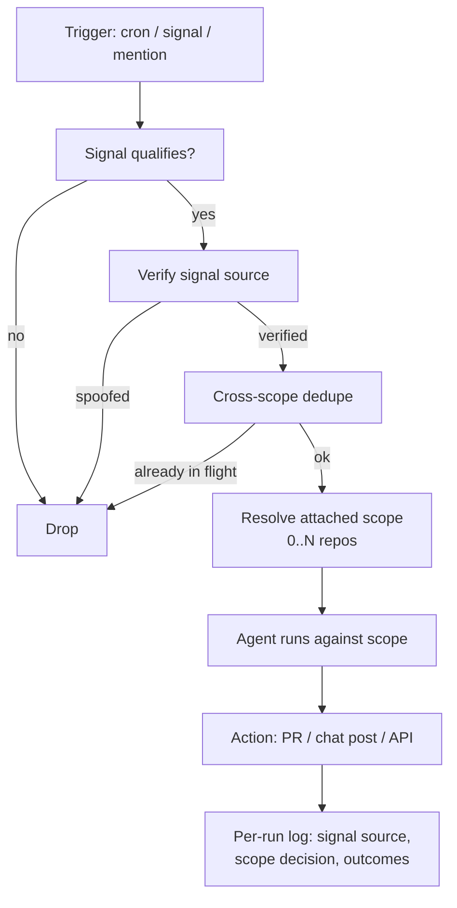

# Multi-Repo and No-Repo Coding Agent Automation Templates

> Adopt trigger/scope-decoupled automation templates only when your vendor exposes the primitive natively and you have rebuilt the four safeguards single-repo dispatch supplied implicitly.

A multi-repo or no-repo automation template is a coding-agent automation whose trigger is a signal (cron, chat event, data-warehouse threshold) and whose scope is declared separately as zero or more attached repositories. Cursor Automations v3.5 (2026-05-20) was the first vendor surface to expose it as a first-class primitive: "You can now attach multiple repos to an automation so agents reason across all required context and work across repos to deliver, test, and verify tasks" and "Many useful automations exist apart from code, where agents monitor your tools and act on key signals. You can now create automations without an attached repository." ([Cursor changelog 05-20-26](https://cursor.com/changelog/05-20-26))

## When the Pattern Applies

The pattern is **Qualified** — it applies only when both conditions hold. Adopt it otherwise as caller-side fan-out around the single-repo primitive ([Programmatic Cloud-Agent Dispatch via REST API and Webhooks](programmatic-cloud-agent-dispatch.md)).

| Condition | Why it is load-bearing |
|-----------|----------------------|
| Vendor exposes trigger/scope decoupling natively | Today only Cursor Automations does. GitHub Copilot cloud agent dispatch is per-repo (`POST /agents/repos/{owner}/{repo}/tasks`, user-to-server token only) ([GitHub Docs](https://docs.github.com/en/copilot/how-tos/use-copilot-agents/cloud-agent/use-cloud-agent-via-the-api)). Claude Code headless mode (`claude -p`) has no first-party scheduler ([Claude Code docs](https://code.claude.com/docs/en/headless)). On those tools the same shape exists only if you build the trigger/scope layer yourself. |
| You can reconstruct the four implicit safeguards at the automation level | Single-repo dispatch implied dedupe, credential scoping, signal-source verification, and audit attribution by construction. Decoupling trigger from scope removes each — see [When This Backfires](#when-this-backfires). |

## Template Anatomy

The shape decomposes into five elements. Every template — multi-repo or no-repo — instantiates each one.

| Element | Multi-repo template | No-repo template |
|---------|--------------------|-----------------|
| **Trigger** | Cron, signal from chat/issue tracker, manual run | Cron, polled SaaS event, chat-channel event |
| **Signal** | What event qualifies — e.g. dependency CVE, failing CI on shared library | What metric crosses a threshold — Slack mention, billing anomaly, churn risk score |
| **Scope** | The attached repository list (declared on the automation, not on the trigger) | Empty — the agent decides which downstream surface to write to |
| **Action** | Open PRs across N attached repos | Post to chat, write to a doc, call a SaaS API |
| **Log** | Per-run record with the originating signal, scope decision, and outcomes per repo | Per-run record with signal source, action target, and any data the agent read in between |

Cursor's five 2026-05-20 no-repo templates each fit this shape: Slack digest (signal = unread DMs; action = summary in Slack), Product analytics (signal = scheduled cron; action = data-warehouse query + delivered digest), Product FAQ (signal = channel question; action = first-response post), Product finance (signal = scheduled cron; action = billing-provider pull + report), Customer health monitoring (signal = system metric shift; action = account flag). ([Cursor changelog 05-20-26](https://cursor.com/changelog/05-20-26))

## Diagram



## Why It Works

The mechanism is **trigger/scope decoupling**: traditional cloud-agent dispatch binds the trigger to one repository — assignment of issue #123 in repo A invokes the agent on repo A, and `POST /agents/repos/{owner}/{repo}/tasks` makes the binding explicit in the URL. The trigger *is* the scope. Cursor's automations introduce a level of indirection where the trigger is a signal and the scope is a separately-declared list of attached repos (or zero). That matches a real-world topology — "a lot of engineering work spans more than one codebase" and "agents monitor your tools and act on key signals" ([Cursor changelog 05-20-26](https://cursor.com/changelog/05-20-26)) — that per-repo dispatch cannot express without caller-side glue. Multi-root environments shipped one week earlier on 2026-05-13 made the implementation viable: a single development environment definition can clone all attached repos, install shared dependencies once, and persist build caches across the bundle ([Cursor changelog 05-13-26](https://cursor.com/changelog/05-13-26)). The pattern works because it makes the trigger-scope mapping a first-class configuration object instead of an implicit assumption.

## When This Backfires

| Failure | Concrete shape |
|---------|--------------|
| **No-repo templates default to the lethal trifecta** | A Slack-watching agent with read access to private DMs (private data), reading attacker-controlled Slack messages (untrusted content), and posting/calling APIs externally (external communication) has all three legs by default ([Willison, 2025](https://simonwillison.net/2025/Jun/16/the-lethal-trifecta/), [Lethal Trifecta Threat Model](../security/lethal-trifecta-threat-model.md)). The Cursor Product-FAQ template — "watches a Slack channel for questions and writes a first response based on docs, codebase context, and past threads" ([Cursor changelog 05-20-26](https://cursor.com/changelog/05-20-26)) — instantiates exactly that shape. Adopt no-repo templates only after removing one leg explicitly. |
| **Multi-repo lock contention and parallel-write hazards** | One automation attached to repos A, B, C, triggered twice on overlapping signals, can open conflicting PRs against repo A. The 2026-05-13 multi-root release added per-environment audit logs and version history but does not document a cross-repo write-coordination primitive ([Cursor changelog 05-13-26](https://cursor.com/changelog/05-13-26)). The dedupe pattern from the single-repo case ([Programmatic Cloud-Agent Dispatch](programmatic-cloud-agent-dispatch.md)) must be reconstructed with a key that spans the full attached-repo set, not one repo at a time. |
| **Cross-repo permission sprawl** | An automation attached to N repos needs the union of permissions across all N. Cursor's environment-level secret scoping ([Cursor changelog 05-13-26](https://cursor.com/changelog/05-13-26)) prevents leaks *between* environments but not *within* one environment that intentionally spans several repos. A credential one repo needs becomes visible to agent runs touching every other attached repo. |
| **Signal-source spoofing on no-repo automations** | Anyone with post permission in the watched channel can manufacture a "qualifying" signal. The Product-FAQ template will respond to attacker-authored questions with attacker-controlled context unless the trigger pipeline verifies the source identity and sanitises the question before it reaches the prompt — the same payload-to-prompt sanitisation discipline single-repo webhook dispatch already requires ([Programmatic Cloud-Agent Dispatch](programmatic-cloud-agent-dispatch.md)). |
| **Audit attribution gap** | A single-repo issue assignment attributes the run to the assigning user in GitHub's audit log. A no-repo automation triggered by a Slack event has no equivalent — the audit trail is whatever the automation runtime emits. Without an out-of-band principal log (signal source, automation ID, action target) compliance teams cannot answer "what triggered this action". |
| **Single-vendor portability cliff** | Documented capability is Cursor-specific as of 2026-05-20. GitHub Copilot cloud agent's third-party integrations (Azure Boards, Jira, Linear, Slack, Teams) "only support creating a pull request directly" ([GitHub Docs](https://docs.github.com/en/copilot/concepts/agents/cloud-agent/about-cloud-agent)) — the action surface is still a single repo's PR. Teams standardised on Copilot or Claude Code cannot adopt this pattern today without bridging through caller-side dispatch. |

## Example

A no-repo customer-health automation, instantiated against the template anatomy with the four safeguards reconstructed:

```yaml
# Cursor Automation (no-repo, scheduled)
trigger:
  type: schedule
  cron: "0 8 * * 1-5"        # weekday mornings
signal:
  source: databricks
  query: "SELECT account_id, health_delta FROM weekly_health
           WHERE ABS(health_delta) > 0.15"
  verify_source: "require databricks SSO-signed result set"
scope: []                     # no-repo
action:
  target: slack
  channel: "#cs-account-health"
  format: "thread with one card per flagged account"
safeguards:
  dedupe_key: "health-alert:{account_id}:{iso_week}"
  trifecta_leg_removed: "no inbound DMs read; the agent's only
                         input is the verified Databricks payload"
  audit_log: "write run_id, signal hash, action target, accounts
              touched to compliance store; do not rely on Cursor's
              audit log alone"
```

The configuration is fictional in syntax — the substance is real. The trigger is scheduled, the signal verification requires a signed payload from a single source, the dedupe key is week-scoped per account so a Tuesday rerun cannot duplicate Monday's posts, the trifecta is closed by removing untrusted-input ingestion (the agent does not read DMs; only the Databricks result), and the audit log is written to a compliance store the automation runtime cannot edit.

## Key Takeaways

- The pattern is trigger/scope decoupling: the trigger is a signal, the scope is a separately-declared list of attached repos (multi-repo) or empty (no-repo).
- Adoption is Qualified — confirmed on Cursor Automations (2026-05-20), not yet exposed on GitHub Copilot cloud agent or Claude Code headless without caller-side glue.
- Four safeguards that single-repo dispatch supplied implicitly must be reconstructed explicitly: dedupe across the attached scope, signal-source verification, per-repo credential scoping, audit attribution.
- No-repo templates ship the lethal trifecta as the default posture — adopt them only after removing one leg per template.
- For tools without the native primitive today, stay on caller-side fan-out around the single-repo REST surface and revisit when Copilot or Claude Code ships an equivalent.

## Related

- [Programmatic Cloud-Agent Dispatch via REST API and Webhooks](programmatic-cloud-agent-dispatch.md) — The single-repo dispatch primitive this pattern decouples from; covers caller-side dedupe, payload sanitisation, budget caps, and principal logging.
- [Chat-Platform Agent Delegation](chat-platform-agent-delegation.md) — Adjacent surface: `@mention` in Slack or Teams concentrates the trifecta on the chat principal; relevant to the no-repo "watch a channel" templates.
- [Lethal Trifecta Threat Model](../security/lethal-trifecta-threat-model.md) — The three-leg framing that the no-repo template anatomy must honour.
- [One-Click CI Auto-Fix](one-click-ci-auto-fix.md) — Adjacent bounded-autonomy pattern: human-triggered cloud-agent remediation for failing GitHub Actions, single-repo scope.
- [Continuous Autonomous Task Loop](continuous-autonomous-task-loop.md) — Self-directed loop variant: the agent selects and executes from a task backlog without external dispatch.
