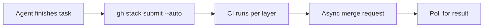

# Native Pull Request Stacks in an Agent Pipeline

> Native pull request stacks end the third-party tool requirement for shallow same-repo chains and move the remaining cost onto your automation.

GitHub made stacked pull requests generally available on 2026-10-06, so a chain of dependent pull requests no longer needs Graphite, ghstack, or spr to hold it together ([GitHub Changelog, 2026-10-06](https://github.blog/changelog/2026-10-06-stacked-pull-requests-generally-available)). For an unattended pipeline the change is narrower than the headline.

## The unattended pipeline problem

A pipeline that opens stacked pull requests unattended gets three failures that a human at a terminal would catch: an editor prompt that blocks, a merge call that reports success before branch protection runs, and CI that bills once per layer.

## Where native stacking applies

- Every branch lives in one repository. "Stacked pull requests require all branches to be in the same repository. Cross-fork stacks are not supported" ([About stacked pull requests](https://docs.github.com/en/pull-requests/get-started/about-stacked-prs)).
- The host is github.com. General availability covers "all github.com plans and will be included in an upcoming GitHub Enterprise Server release" ([GitHub Changelog, 2026-10-06](https://github.blog/changelog/2026-10-06-stacked-pull-requests-generally-available)), and stacks "are not supported in GitHub Desktop" ([About stacked pull requests](https://docs.github.com/en/pull-requests/get-started/about-stacked-prs)).
- The stack stays shallow. One practitioner rule puts the ceiling at three or four layers, because "Every extra level multiplies the rebasing and coordination overhead when a lower PR changes", and it says third-party tools "are still worth a look for deep stacks" ([SSW Rules](https://www.ssw.com.au/rules/stacked-pull-requests)).

## What general availability covers

GitHub now manages the chain where a local tool used to. A rebase preserves approvals on unchanged code "even in repositories that dismiss stale approvals", and the replacement commits are signed with original authorship intact. A deleted base branch retargets the stack instead of closing its bottom pull request, and a stack "enters and lands through the merge queue as a single merge group" ([GitHub Changelog, 2026-10-06](https://github.blog/changelog/2026-10-06-stacked-pull-requests-generally-available)).

That splits the force-push warning in two. The dependent pull requests no longer break, because the cascading rebase runs server-side and retargets what sits above it. History above the change is still rewritten, and anyone holding one of those branches locally still pays: "Rebase stack rewrites and force-pushes every branch above the change. Anyone with one of those branches checked out will need to reset their local copy" ([SSW Rules](https://www.ssw.com.au/rules/stacked-pull-requests)).

GitHub's two sources disagree about auto-merge. The release notes list "Auto-merge for stacks rolling out over the next few weeks" while the merging documentation still states "Auto-merge is not supported for stacked pull requests" ([Merging stacked pull requests](https://docs.github.com/en/pull-requests/how-tos/merge-and-close-pull-requests/merging-stacked-pull-requests)). Treat it as unavailable until it works in your repository.

## Three implementation layers

### Layer 1: Submit without a terminal

`gh stack submit` opens a full-screen editor in an interactive terminal. An unattended run skips it: "Pass `--auto`, or run the command in a non-interactive terminal such as CI, to skip the editor and use automatically generated titles" ([Stacked pull requests CLI commands](https://docs.github.com/en/pull-requests/reference/stacked-prs-cli-commands)). With `--auto`, new pull requests are created as drafts unless you also pass `--open`.

`gh stack sync` pulls down a clean remote-ahead update without prompting. A genuine divergence behaves differently: "In a non-interactive terminal, a divergence aborts the sync, exiting successfully, without pushing branches or updating pull requests." The CLI reference gives other failures their own codes, including 3 for a rebase conflict and 8 for a stack locked by another process. The failure that does nothing at all is the one that returns zero. Read the stack state after a sync, not the exit status.

### Layer 2: Gate CI on stack position

GitHub checks every layer against the trunk: "Every pull request in a stack is evaluated as if it targets the base of the stack, such as `main`" ([Optimizing CI for stacked pull requests](https://docs.github.com/en/pull-requests/how-tos/merge-and-close-pull-requests/optimizing-ci-for-stacked-pull-requests)). That is the quality guarantee and the bill: "Because a workflow runs once per pull request, a large stack multiplies your CI usage." Split one pull request into six and a forty-minute suite spends four hours of runner time instead of forty.

A hand-rolled chain had the opposite problem: "Branch protection rules and CI checks often only trigger for the bottom pull request in the chain, making it hard to know the true status of the rest" ([About stacked pull requests](https://docs.github.com/en/pull-requests/get-started/about-stacked-prs)).

The CI reference supplies the control: workflow expressions read `github.event.pull_request.stack`, which carries `size`, `position`, and `base.ref`. An expensive job can then run only on the top layer (`position == size`), or only on the lowest unmerged one, where `stack.base.ref` equals the pull request's own `base.ref`.

### Layer 3: Merge through the async API

An existing merge call stops working. "A stack cannot be merged with the legacy synchronous merge endpoints or mutations" ([Stacked pull requests APIs and webhooks](https://docs.github.com/en/pull-requests/reference/stacked-pull-requests-apis-and-webhooks)), and the asynchronous merge API is "the only merge API that supports stacked pull requests" ([GitHub Changelog, 2026-10-01](https://github.blog/changelog/2026-10-01-github-async-merge-api-generally-available)). The call shape is two steps: "Submit a merge request with `PUT`, then poll with `GET` using the returned request ID to check its status."

When the rules get judged is the part that catches a pipeline. The API reference is explicit: "Only the basic pull request state is checked when you submit an open PR. Branch protection and repository rules are evaluated later, when the merge actually runs, and a rule failure is reported as a failed result while polling." An automation that reads the submit response and moves on never learns that the merge failed. The outcome is at least all-or-nothing: "A stack merge request is atomic, meaning either the whole group of pull requests merges, or is added to the merge queue, or none of it is."

## Why it works

Two causes, and only one of them is new. Review capacity is the old one. SSW reports that SmartBear's study of 2,500 code reviews at Cisco found reviewers catch fewer defects beyond about 400 lines of code ([SSW Rules](https://www.ssw.com.au/rules/stacked-pull-requests), citing [SmartBear](https://smartbear.com/learn/code-review/best-practices-for-peer-code-review/)). Small per-layer diffs stay under that size. The new one is that the wait disappears. Stacks "let you open a new pull request on top of one that is still open", and GitHub maps the agent case straight onto that: "An agent completes one task, then starts the next task that builds on it. That sequence maps directly onto a stack: one pull request per task, each based on the one below" ([About stacked pull requests](https://docs.github.com/en/pull-requests/get-started/about-stacked-prs)).

General availability moves the cascading rebase from a local tool to the server. GitHub reports that repositories using stacks "have seen a 9% increase in merged code compared to peers", which is first-party telemetry with no published methodology.

## Triggers and constraints

A finished agent task triggers `gh stack add` and `gh stack submit`. Pull request events trigger CI on every layer. The merge stays policy-bound, and three things limit the authority there.

- One merge action lands every layer beneath it: "You cannot merge a mid-stack pull request in isolation, the pull requests below it will always merge with it" ([Merging stacked pull requests](https://docs.github.com/en/pull-requests/how-tos/merge-and-close-pull-requests/merging-stacked-pull-requests)). One merge action on the top layer of a four-layer stack lands all four. Each layer still needs its own approval first: the merge requirements list "All pull requests below it are approved and have passing checks" ([Merging stacked pull requests](https://docs.github.com/en/pull-requests/how-tos/merge-and-close-pull-requests/merging-stacked-pull-requests)). Branch protection rules "are enforced on every pull request in the stack" ([About stacked pull requests](https://docs.github.com/en/pull-requests/get-started/about-stacked-prs)).
- Mutating `gh stack` commands "are serialized across the whole clone", and a competing agent gets exit code 8, "Stack is locked by another process" ([Stacked pull requests CLI commands](https://docs.github.com/en/pull-requests/reference/stacked-prs-cli-commands)).
- Webhooks carry a `stack` property on the `pull_request` object, which lets automation "inspect the stack's target branch, not just the direct parent branch of the pull request" ([Stacked pull requests APIs and webhooks](https://docs.github.com/en/pull-requests/reference/stacked-pull-requests-apis-and-webhooks)).

Implementation is tool-agnostic: the integration point is the host, not the assistant. Any agent that can run `gh` or call the REST API drives the same stack, and GitHub lists agent access "via the `gh-stack` skill" ([About stacked pull requests](https://docs.github.com/en/pull-requests/get-started/about-stacked-prs)).

## When this backfires

- Fork-based contribution. Cross-fork stacks are unsupported, so an open-source project reviewing third-party pull requests cannot use this at all.
- Deep stacks. Above three or four layers the coordination cost returns and third-party tooling is still worth considering, so the tooling cost narrows without disappearing.
- Expensive test suites. One workflow run per layer multiplies runner spend until workflows are gated on stack position, and that gating is work you did not previously have to do.
- A merge gate that runs before submission. GitHub evaluates rules when the merge runs, so a pre-flight check passes and the merge still fails, reported only in the poll result.
- Reviewer attention as the real constraint. If the queue is slow because reviewers have no time, not because diffs are too large, restructuring branch topology collects none of the benefit and pays the whole migration cost.
- Branches shared mid-review. A rebase force-pushes every branch above the change, so anyone working from one has to reset.

## Example

A fleet finishes four dependent tasks on one service: a schema migration, the data-access change, the API route, and the client call. The pipeline runs `gh stack submit --auto` and gets four stacked pull requests, all as drafts because `--open` was not passed. CI then runs the full suite four times, once per layer, where one pull request would have run it once.

Every layer is approved. The pipeline submits an async merge request for the top layer, reads the accepted response, marks the issue done, and exits. Branch protection on the schema migration had gone red in the meantime, so the merge failed during a poll the pipeline never made. Nothing merged, the stack is intact, and the only record of the failure sits in a request status nobody read.

## Key Takeaways

- Native support removes the third-party tool requirement for same-repo stacks of three or four layers on github.com. Deeper stacks and fork-based work still pay it.
- Native rebasing fixes half the force-push warning. Dependent pull requests retarget themselves; local checkouts above the change still have to reset.
- CI cost scales with stack depth unless workflows are gated on `github.event.pull_request.stack.position`.
- Stacks merge only through the asynchronous merge API, and GitHub evaluates branch protection after submission, so a pipeline that does not poll cannot tell a failed merge from a successful one.
- One merge action on the top layer lands every layer beneath it, but each layer still needs its own approval and branch protection.

## Related

- [Stacked Agent Sessions on Unmerged Feature Branches](stacked-agent-sessions.md) — the session-chaining shape this platform support now holds together
- [PR Scope Creep as a Human Review Bottleneck](../patterns/anti-patterns/pr-scope-creep-review-bottleneck.md) — the bottleneck stacking relieves, and where the tooling cost used to sit
- [PR-Subscribed Agent Ownership](../patterns/agent-design/pr-subscribed-agent-ownership.md) — the single-agent recipe each layer of the stack runs: the agent that opened the pull request drives it to green
- [Concurrent Agent Pull Requests and Merge-Conflict Cost](concurrent-agent-pr-merge-conflicts.md) — what overlapping agent pull requests cost when they are not ordered into a chain
- [The Bottleneck Migration](../human/bottleneck-migration.md) — why review becomes the binding constraint once generation is cheap
