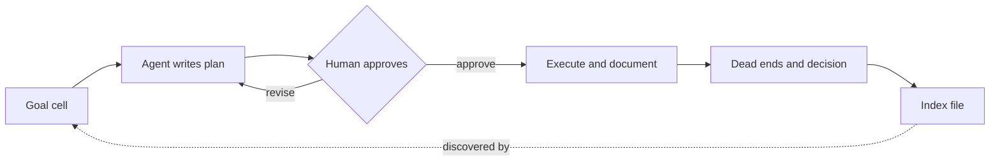

# Notebook-Documented Automation for Repeat Operational Work

> An operational run records its own steps, dead ends, and decision into a notebook, with an index file the next agent discovers it by.

Notebook-documented automation makes the agent produce a durable artifact as a side effect of doing the chore. The agent writes a plan into an executable notebook, waits for approval, then documents each command, its output, and how it read the result. An engineer at OpenAI describes the outcome: "The result is a notebook that documents the steps required to complete the task, along with the dead ends" ([OpenAI Developers](https://developers.openai.com/blog/automating-repetitive-work-at-openai-with-codex)). The failed paths are the part a conventional runbook throws away.

It pays off under four conditions. The work has to recur. The record has to be curated rather than appended. The environment has to be stable enough that last quarter's dead end is still a dead end. A human has to read the decision notes, for a reason covered under [when this backfires](#when-this-backfires).

## The lost-reasoning problem

Runbooks decay because the reasoning behind each step is never written down. It stays in the conversation that produced the procedure, and the procedure ships without it. The next operator inherits a list of commands and no account of the approaches that did not work, so they try some of them again.

Recovering that reasoning is a deliberate step at the end of the run, not a byproduct of it: "Before wrapping up, I work with Codex to capture decisions that would otherwise disappear into the conversation: why one option was chosen, which approach is now preferred, and what someone should do differently next time" ([OpenAI Developers](https://developers.openai.com/blog/automating-repetitive-work-at-openai-with-codex)). The work it is applied to is ordinary infrastructure toil: provisioning Kubernetes clusters against private links, quota, and Terraform, and running model evaluations through grader issues and PyTorch configuration.

## Three implementation layers

### Layer 1: the approved outline

The agent writes its plan into the notebook and stops. The instruction the source uses is short: "Review a previous run to understand the workflow. Write a detailed plan in this notebook. Wait for me to review and approve the plan before beginning" ([OpenAI Developers](https://developers.openai.com/blog/automating-repetitive-work-at-openai-with-codex)). The gate sits on the plan rather than the finished work, which is the cheap place to catch a wrong approach.

### Layer 2: the run record

The same instruction continues: "Document the commands you run, their output, and how you interpret the results." Interpretation is the load-bearing word. A logged command with no reading of its output is a [trajectory log](../observability/trajectory-logging-progress-files.md), useful for debugging and useless as a runbook. Dead ends go in this layer too, alongside the successful path, and the decision record closes it.

### Layer 3: the discovery index

Discovery is a separate mechanism from recording, and skipping it makes the first two layers write-only. Runme emits a companion file for each notebook: "For each notebook, Runme also writes a companion Markdown index named `*.index.md`. Google Drive can index that file, which makes previous notebooks easier for an agent to discover when it needs examples, operational context, or the outcome of an earlier run" ([OpenAI Developers](https://developers.openai.com/blog/automating-repetitive-work-at-openai-with-codex)). Runme is an open-source notebook that combines Markdown, code cells, and shell execution ([Runme](https://github.com/runmedev/runme)); any substrate that produces an indexable pointer alongside the artifact will do.

## Triggers and constraints

The cycle is manually triggered, not scheduled. Someone starts a run when the chore comes round again, and the agent's first act is to read the index for a prior example.

Two constraints bound the agent's authority. It cannot begin executing until the human approves the plan, which is the only hard gate in the loop. During execution the human watches and intervenes rather than reviewing at the end. The source describes a stuck agent being nudged toward an approved option when it exhausts quota ([OpenAI Developers](https://developers.openai.com/blog/automating-repetitive-work-at-openai-with-codex)), which is supervision of a running process rather than sign-off on a finished one.

The implementation is tool-agnostic and depends on no specific assistant. It needs a notebook substrate the agent can write to, an approval step before execution, and a place to put the index where the next run will look.

## Why it works

An agent opening a new session has no memory of the previous one, so a written record is the only thing that prunes the search space before it starts. Reflexion measures that step directly: agents that turn task failure into verbal reflections, store them in an episodic memory buffer, and read them back on the next trial reach 91% pass@1 on HumanEval against GPT-4's 80%, with no weight updates ([Shinn et al., arXiv:2303.11366v4](https://arxiv.org/abs/2303.11366v4)). The dead ends are the reflections and the notebook is the buffer.

The claim is narrow. Written failures cut branches an agent would otherwise re-explore. They do not make it better at the branches that remain.

## When this backfires

### The agent's stated reason may not be the real one

This is the sharpest limit and it lands on the decision record. Model-produced explanations systematically misrepresent the basis for an answer: Turpin et al. biased models with features the explanations never mentioned, and accuracy fell by up to 36% across 13 BIG-Bench Hard tasks while the prose stayed fluent ([Turpin et al., arXiv:2305.04388v2](https://arxiv.org/abs/2305.04388v2)). An unreviewed account of why one option was chosen is a plausible record of something that may not have happened. Write that cell with the agent, not through it.

### The dead-end log decays and nothing expires it

Recording a failure is cheap. Deciding whether last month's failure is still a failure is expensive, and no step in this workflow does it. That is the trap in [reusing a frozen playbook](../patterns/anti-patterns/frozen-playbook-reuse-validation.md) against a target nobody re-validated. Date each dead end and drop the ones older than your environment's drift rate.

### Accumulated context costs the next run

Every retained dead end is input the following agent pays for. Chroma's context-rot study reports that model performance "varies significantly as input length changes, even on simple tasks" ([Chroma](https://github.com/chroma-core/context-rot)). Length alone degrades the read, so a bigger context window does not buy you a bigger log. Feed the next run the index and the decision record, not three prior transcripts. It is the same [attention budget](../patterns/agent-design/orchestrator-attention-budget.md) constraint that bounds any accumulating artifact.

### The approval gate stops being a gate

One plan a week gets read. Twenty a day get approved. The outline gate is the only human check here, so its collapse under volume matters more than the notebook's quality; see [human-in-the-loop](human-in-the-loop.md) for where such gates hold.

### The work does not recur

A [runbook rewritten for agents](runbooks-as-agent-instructions.md) is cheaper for a one-off chore and does the same job. The notebook only earns its bookkeeping across repeat runs.

## Key Takeaways

- The artifact is a side effect of the run, not a documentation task after it. That is what stops it being skipped.
- Dead ends are the payload. A record of the successful path alone is a runbook, and runbooks already exist.
- The index file is a separate layer from the notebook. Skip it and nothing reads the record.
- Have a human write or check the decision cell, because the agent's own account of why it chose an option is unreliable evidence ([Turpin et al., arXiv:2305.04388v2](https://arxiv.org/abs/2305.04388v2)).
- Put an expiry on dead ends. A stale one steers the next run away from a path that now works.

## Related

- [Runbooks as Agent Instructions](runbooks-as-agent-instructions.md) — rewriting human procedures for agent execution, the cheaper option when the work recurs rarely
- [Error Preservation in Context](../context-engineering/error-preservation-in-context.md) — keeping failed actions in context within one session, the same idea at session scope
- [Memory Synthesis: Extracting Lessons from Execution Logs](../patterns/agent-design/memory-synthesis-execution-logs.md) — deriving causal lessons from traces after the fact rather than during the run
- [Human-in-the-Loop Approval Gates](human-in-the-loop.md) — where to place the approval checkpoint and why gates degrade as volume rises
- [Trajectory Logging and Progress Files](../observability/trajectory-logging-progress-files.md) — the raw-record layer beneath a curated notebook
