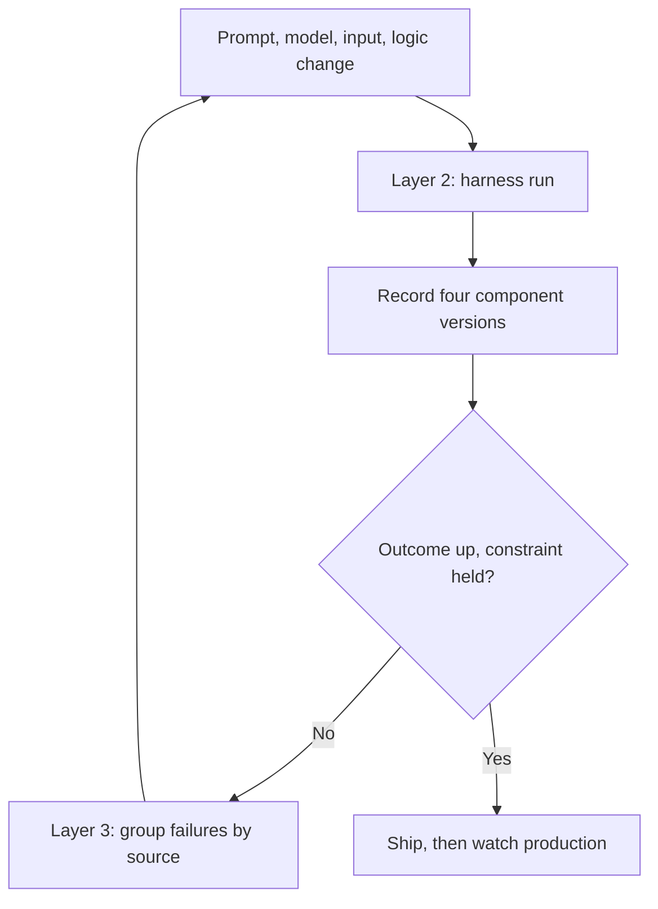

# Offline Evaluation as an Integration Test for LLM Features

> A change to the prompt, model, inputs, or system logic triggers the offline suite, and the run gates the release.

Offline evaluation run as an integration test pushes a fixed dataset through the same pipeline production uses, repeats on every change to the prompt, model, inputs, or system logic, and records the version of each component so a score movement points at one cause. GitHub's team ran their secret-scanning classifier this way and cut false positives by 95% on the offline dataset while holding recall inside a stated bound ([GitHub: How to evaluate LLMs before production](https://github.blog/ai-and-ml/llms/how-to-evaluate-llms-before-production/)).

A green run bounds the risk of one change. It does not certify the feature.

## Why a benchmark score is not a gate

"A language model can perform well on a clean benchmark and still struggle with the cases that matter in production" ([GitHub](https://github.blog/ai-and-ml/llms/how-to-evaluate-llms-before-production/)). Benchmarks carry none of the surrounding context, input formatting, or system logic your feature runs under, and the edge cases they under-sample are where production failures concentrate.

A suite of your own does better than the benchmark under four conditions. Miss one and the gate still returns a number, and a number nobody can interpret is worse than no gate.

- There is a named decision. GitHub wrote theirs as a single question: can the system reduce false positives while preserving enough recall to be safe in a production security workflow ([GitHub](https://github.blog/ai-and-ml/llms/how-to-evaluate-llms-before-production/)). A flat list of equally weighted metrics answers no question.
- The grader has been measured. Across 21 judges and roughly 541,000 judgments, test-retest reliability above 0.95 coexisted with position bias above 0.10 in two production-deployed judges, and chance-corrected agreement ran 33 to 41 percentage points below raw agreement on MT-Bench ([arXiv:2606.19544v1](https://arxiv.org/abs/2606.19544v1)). An unmeasured judge gives you a gate that is repeatable and wrong.
- The suite is large enough for the effect you want to see. The paper reporting the sharpest prompt regression names its own 30-cases-per-task suite as insufficient for production reliability ([arXiv:2601.22025v2](https://arxiv.org/abs/2601.22025v2)), and puts a number on what would be enough: "detecting a 5% absolute difference in pass rate with 95% confidence and 80% power requires approximately 400 to 600 test cases per condition".
- The offline pipeline resembles the production one. "The closer the offline pipeline is to the production pipeline, the more useful the evaluation becomes. When the two differ, a strong offline score may simply reflect an easier problem than the one being deployed" ([GitHub](https://github.blog/ai-and-ml/llms/how-to-evaluate-llms-before-production/)).

## Three implementation layers

### Layer 1: Decision and tiered criteria

State the deployment question in one sentence before choosing a metric. Then sort the criteria into three tiers: the primary outcome you want to move, the safety constraint that must not degrade, and the operational guardrails on latency, cost, and reliability ([GitHub](https://github.blog/ai-and-ml/llms/how-to-evaluate-llms-before-production/)). The asymmetry is the working part. GitHub treated precision as the outcome and recall as a constraint because a missed credential costs more than a noisy alert, so nothing could trade one away for the other.

### Layer 2: A harness shaped like production

Include what production includes: the candidate under evaluation, the surrounding context, the supporting information, the input formatting, and the broader system logic ([GitHub](https://github.blog/ai-and-ml/llms/how-to-evaluate-llms-before-production/)). Every simplification here reappears later as an unexplained gap between the offline score and live behavior.

Dataset provenance belongs to this layer too. A dismissed alert can mean rotated credentials, accepted risk, or a cleared workflow rather than a misclassification ([GitHub](https://github.blog/ai-and-ml/llms/how-to-evaluate-llms-before-production/)). Before a disagreement counts as an error, write down how the label was created and what else it could mean, then hand-review the ambiguous subsets that carry the most weight.

### Layer 3: Change-triggered re-run and failure triage

Fire the suite on any meaningful change to the prompt, model, input construction, or broader system logic. Record prompt version, model version, dataset version, and configuration for each run ([GitHub](https://github.blog/ai-and-ml/llms/how-to-evaluate-llms-before-production/)). A published readiness harness wires the same idea into CI, aggregating workflow success, policy compliance, groundedness, retrieval hit rate, cost, and p95 latency into scenario-weighted scores. On its ticket-routing workflow those regression gates "consistently reject unsafe prompt variants" ([arXiv:2603.27355v2](https://arxiv.org/abs/2603.27355v2)).

When the run goes red, assign each false positive and false negative to a likely source: model, prompt, input, pipeline, dataset, or label. GitHub reports that this turns "a vague quality problem into a concrete engineering task", and that "Manually reviewing dozens or hundreds of examples takes time, but it often leads to faster progress" once a recurring failure pattern is clear ([GitHub](https://github.blog/ai-and-ml/llms/how-to-evaluate-llms-before-production/)). Reasoning about the wrong value points at prompt or input framing. Missing evidence points at [context assembly](../context-engineering/phase-specific-context-assembly.md).

## Triggers and constraints

The trigger is a push, not a schedule. Any commit touching the prompt, the model identifier, the input adapters, or the surrounding system logic runs the suite. Move it to a nightly cron and releases either wait a day for their result or ship without one.

The gate's authority is bounded on two sides. It blocks a release on a failed safety constraint, because that is a comparison against a pinned baseline. It does not approve one on its own for a multi-turn or stateful system, where a human still reads whole conversations. Judge-scored suites also need their grader re-measured whenever the judge model changes, since that is a component version like any other.

The workflow is tool-agnostic. It is CI plus a dataset plus a grader, so Claude Code, Copilot, and Cursor implementations do not diverge.

## Why it works

A score change in a non-deterministic system is only attributable when one component moved and every other version is pinned. Recording prompt, model, dataset, and configuration versions per run is what lets a result be compared against a reproducible baseline instead of blamed on the wrong component ([GitHub](https://github.blog/ai-and-ml/llms/how-to-evaluate-llms-before-production/)).

Re-running on every prompt edit is arithmetic, not caution. Generic prompt additions do not improve monotonically, in the tested local conditions: appending generic rules to the user prompt dropped Qwen 2.5 7B on a RAG task from 26 of 30 cases passing all checks to 9 of 30 ([arXiv:2601.22025v2](https://arxiv.org/abs/2601.22025v2)). An untested prompt improvement is a live regression nobody has looked at yet.

## When this backfires

The gate hides cross-turn defects on stateful systems. On live multi-turn transaction agents, the judge surfaced 2 of 9 human-confirmed problem patterns in one batch, and its operational gate flagged zero of 100 rounds in a batch where humans confirmed 23 distinct defects. Turn-local issues were caught. Cart hallucination and confirm-gate lockout were not ([arXiv:2606.10315v1](https://arxiv.org/abs/2606.10315v1)).

The dataset ages while the gate stays green. A fixed offline set encodes the failures you knew about when you wrote it, so it cannot report a distribution that has moved underneath it. Pair the gate with production monitoring rather than substituting for it.

Mirroring production costs real engineering. For a thin wrapper over one model call the harness is cheap. For a feature spanning retrieval, formatting, and downstream logic, the offline copy is a second system to maintain, and a stale copy scores an easier problem than the deployed one ([GitHub](https://github.blog/ai-and-ml/llms/how-to-evaluate-llms-before-production/)).

Small suites plus a biased judge produce confident noise. Judge rankings moved by as many as 14 positions across benchmarks ([arXiv:2606.19544v1](https://arxiv.org/abs/2606.19544v1)); on a 30-case suite that variance swamps the effect you are gating on.

## Key Takeaways

- Write the deployment question first, then tier the criteria into one primary outcome, one safety constraint, and the operational guardrails.
- Trigger on any meaningful change to prompt, model, input construction, or broader system logic, and pin all four versions per run so a regression is attributable.
- A prompt edit moved one task from 26 of 30 to 9 of 30. There is no safe untested prompt improvement.
- Production dispositions are signals. Record how a label was made before counting a disagreement as an error.
- On multi-turn systems the automated gate is a floor. A measured 22% catch rate means humans still read full conversations.

## Related

- [Eval-Driven Development](eval-driven-development.md) — writing the evaluation before the feature exists, the upstream half of this loop.
- [LLM-as-Judge Evaluation](llm-as-judge-evaluation.md) — how the grader inside this gate is built.
- [Purpose-Built Eval Suites](../verification/purpose-built-eval-suites.md) — sizing and sourcing the dataset the gate scores against.
- [Meta-Evaluate the LLM Judge](../verification/meta-evaluate-llm-judge-rubric-verification.md) — measuring the grader before trusting its verdict.
- [Multi-Turn Conversation Evaluation](../verification/multi-turn-conversation-evaluation.md) — the cross-turn defects a single-turn gate misses.
