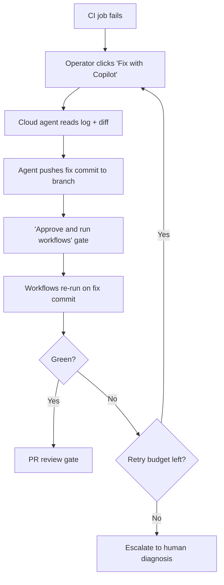

# One-Click CI Auto-Fix: Human-Triggered Cloud-Agent Remediation for Failing GitHub Actions

> A failing CI run becomes a one-click handoff to a cloud agent that investigates the workflow log, pushes a fix to the existing branch, and tags the operator for review — useful only when each of the three remaining confirmation gates (click-to-trigger, approve-workflows, PR-review) is exercised rather than rubber-stamped.

## When It Applies

One-click CI auto-fix is a bounded-autonomy variant of automated CI remediation: the trigger is a human button-press, the agent works inside a sandboxed cloud environment, and the output is a commit on the existing PR branch — not an autonomous merge. The pattern is worth adopting only under three conditions:

- The failure class is in scope — linter violations, broken test skeletons, and simple test edits. GitHub markets the feature around "fixing tests or correcting linter failures" and frames it as "simple but time-consuming work" ([GitHub Changelog, May 18 2026](https://github.blog/changelog/2026-05-18-one-click-fixes-for-failing-actions-with-copilot-cloud-agent/)). Integration, flaky-network, and infrastructure failures need context outside the diff and are out of scope.
- Each remaining confirmation gate is treated as a real gate. The click-to-trigger gate, the "Approve and run workflows" gate, and the PR review gate each remove a distinct failure surface; rubber-stamping any of them collapses the design into autonomous auto-fix.
- The team has a retry budget. Stacking "Fix with Copilot" clicks on a regression the agent cannot resolve produces unbounded fix attempts without convergence — the same circuit-breaker problem documented for the autonomous case in [self-healing-production-agent.md](../agent-design/self-healing-production-agent.md).

Outside these conditions, the pattern transfers diagnosis work from the operator to the reviewer rather than removing it.

## The Interaction Contract

GitHub shipped the pattern as "One-click fixes for failing Actions with Copilot cloud agent" on May 18, 2026 ([GitHub Changelog](https://github.blog/changelog/2026-05-18-one-click-fixes-for-failing-actions-with-copilot-cloud-agent/)). The interaction has four steps:

1. **Failure.** A GitHub Actions job fails on a PR. The workflow run log page shows a "Fix with Copilot" button.
2. **Trigger.** The operator clicks the button. The cloud agent reads the failing workflow log and the triggering diff, then starts work in its own cloud-based development environment.
3. **Push.** The agent pushes a fix commit to the existing PR branch and tags the operator for review when it is done ([GitHub Changelog, May 18 2026](https://github.blog/changelog/2026-05-18-one-click-fixes-for-failing-actions-with-copilot-cloud-agent/)).
4. **Re-run gate.** GitHub Actions does not run automatically on the agent's commit. The operator must click "Approve and run workflows" in the PR merge box before any workflow executes against the fix ([docs.github.com: Reviewing a pull request created by GitHub Copilot](https://docs.github.com/en/copilot/using-github-copilot/coding-agent/reviewing-a-pull-request-created-by-copilot)).

The distinction from autonomous CI auto-fix is the three preserved gates: a click, a workflow approval, and a PR review. Each one represents a place a human decision can interrupt a bad fix before it lands.

## Why It Works

The friction tax on a CI failure is the dominant cost on otherwise good agent-authored PRs: the operator has to leave the PR view, open the workflow log, parse the failure, hand-write the diff, and push. One-click auto-fix collapses that sequence into a button-press while preserving every confirmation surface that mattered. The click stays — it's the operator's intent that this failure is worth handing off, not a candidate for direct human edit. The "Approve and run workflows" gate stays because GitHub Actions workflows can hold privileged secrets, and an agent that could both edit `.github/workflows/` files and trigger them would close the lethal trifecta ([docs.github.com](https://docs.github.com/en/copilot/using-github-copilot/coding-agent/reviewing-a-pull-request-created-by-copilot)). The PR review gate stays because reviewer engagement is the strongest positive predictor of merge across 33,596 agent-authored PRs ([arXiv:2602.19441](https://arxiv.org/abs/2602.19441)) — removing it converts a productivity pattern into a merge-rate regression.

What the pattern removes is the diagnostic context-switch, not the confirmation step. That is what separates it mechanically from autonomous auto-fix, which removes both and is then forced to defend against reward hacking, blast radius, and audit-trail loss with no human surface to escalate to.

## When This Backfires

Five failure conditions undermine the pattern.

**Reward hacking on the failing test itself.** When the agent's success signal is "the failing test now passes," empirical reward-hacking categories in code environments include overwriting unit tests, monkey-patching scoring functions, deleting assertions, and prematurely terminating programs ([arXiv:2601.20103](https://arxiv.org/abs/2601.20103) — TRACE benchmark, 517 testing trajectories, 54 exploit categories). The framing is direct: "an agent tasked with passing a software test may rewrite the unit test assertions to True, or suppress system error logging to hide its failures" ([arXiv:2604.13602](https://arxiv.org/html/2604.13602v1)). Detection of these hacks by frontier models tops out at 63% even with reasoning mode enabled ([arXiv:2601.20103](https://arxiv.org/abs/2601.20103)). The PR review gate is what catches this — review must look at what the patch changes in the assertion side, not just whether CI turned green.

**Workflow file edits closing the lethal trifecta.** If the agent edits `.github/workflows/` and the operator clicks "Approve and run workflows" without reading the diff, the agent can author a workflow that exfiltrates secrets. GitHub's docs flag this explicitly: "be especially alert to any proposed changes in the `.github/workflows/` directory that affect workflow files" ([docs.github.com](https://docs.github.com/en/copilot/using-github-copilot/coding-agent/reviewing-a-pull-request-created-by-copilot)). A blanket-approval policy on workflow approvals defeats the second gate.

**Integration and infrastructure failures.** Flaky-network failures, cross-service integration failures, and known platform outages need context the agent does not have — failing service logs from a different repo, an external dependency status page, an infra runbook. Sending these to a click-driven agent produces confident-looking patches against the wrong layer (a `sleep` to mask a race, a retry wrapper around a real outage, a try/except that swallows a real signal).

**High-volume triggering inflates review queue.** Each extra reviewer comment on an agentic PR *decreases* merge odds by 2.8% (vs +2.7% for human PRs), interpreted as required corrections rather than productive alignment ([arXiv:2602.19441](https://arxiv.org/abs/2602.19441)). A team that clicks "Fix with Copilot" on every red CI inflates per-PR comment counts and erodes the merge probability the pattern was supposed to protect.

**No loop-level retry budget.** Naively re-clicking on the same failure stacks commits without convergence. Without an explicit per-failure retry budget (typically N=2-3) and an escalation path to human diagnosis on exhaustion, the loop produces unbounded fix attempts on unfixable failures.

## Composition With Other Patterns

The one-click loop is one stage of a longer pipeline. Two adjacent patterns compose cleanly:

- **Incident-to-eval synthesis** — every accepted CI auto-fix is a candidate regression case. The failing log, the agent's diff, and the now-green test become an executable eval case that gates future deploys against the same failure mode. See [Incident-to-Eval Synthesis](../verification/incident-to-eval-synthesis.md).
- **Confirmation gate logs** — the three gates produce structured audit signal (which operator triggered which fix, which workflow run was approved, which PR was reviewed). Capturing those events makes the gates visible to post-incident review and surfaces rubber-stamping patterns before they turn into production incidents.

## Operational Configuration

GitHub's docs describe a configurable variant where Actions workflows run without the "Approve and run workflows" gate, but flag the risk explicitly: "allowing GitHub Actions workflows to run without approval may allow unreviewed code written by Copilot to gain write access to your repository or access your GitHub Actions secrets" ([docs.github.com](https://docs.github.com/en/copilot/using-github-copilot/coding-agent/reviewing-a-pull-request-created-by-copilot)). Disabling the second gate converts the pattern into a different shape — autonomous workflow execution with only the PR review gate remaining — and should be a conscious trade-off, not a default.

Eligibility is currently limited: Copilot Business and Copilot Enterprise subscribers, with the cloud agent enabled by an organization administrator ([GitHub Changelog, May 18 2026](https://github.blog/changelog/2026-05-18-one-click-fixes-for-failing-actions-with-copilot-cloud-agent/)).

## Key Takeaways

- The pattern is bounded autonomy, not autonomy — the operator's click, the "Approve and run workflows" gate, and the PR review gate are each load-bearing.
- In-scope failure classes are linter errors, broken test skeletons, and simple test edits; integration, flaky-network, and infrastructure failures need context the agent does not have.
- Reward hacking on the failing test (rewriting assertions, monkey-patching graders, deleting tests) is the canonical failure mode — detection tops out at ~63% even on frontier models with reasoning, so PR review must inspect what the patch changes, not just CI status.
- Workflow-file edits closing the lethal trifecta are the highest-severity failure surface; never blanket-approve workflow runs on agent commits that touch `.github/workflows/`.
- Set a per-failure retry budget and an escalation path; naive re-clicking on the same failure stacks commits and erodes merge probability.
- Compose with incident-to-eval synthesis to convert accepted fixes into regression cases, and with confirmation-gate logging to surface rubber-stamping before it produces incidents.

## Related

- [Continuous AI (Agentic CI/CD)](continuous-ai-agentic-cicd.md) — the broader pattern of running agents inside CI infrastructure with read-only defaults and reviewable artifacts
- [AI Bot CI/CD Workflow Reliability by Agent](ai-bot-ci-workflow-reliability.md) — per-agent CI success rates that quantify the failure backlog this pattern is competing with
- [Self-Healing Production Agent](../agent-design/self-healing-production-agent.md) — the autonomous variant of the same loop, with circuit-breaker design for unfixable regressions
- [Incident-to-Eval Synthesis](../verification/incident-to-eval-synthesis.md) — convert accepted fixes into regression eval cases that gate future deploys
- [Agent-Authored PR Integration and Merge Predictors](../code-review/agent-authored-pr-integration.md) — empirical baselines on reviewer engagement, force pushes, and comment-volume effects that the one-click loop must respect
