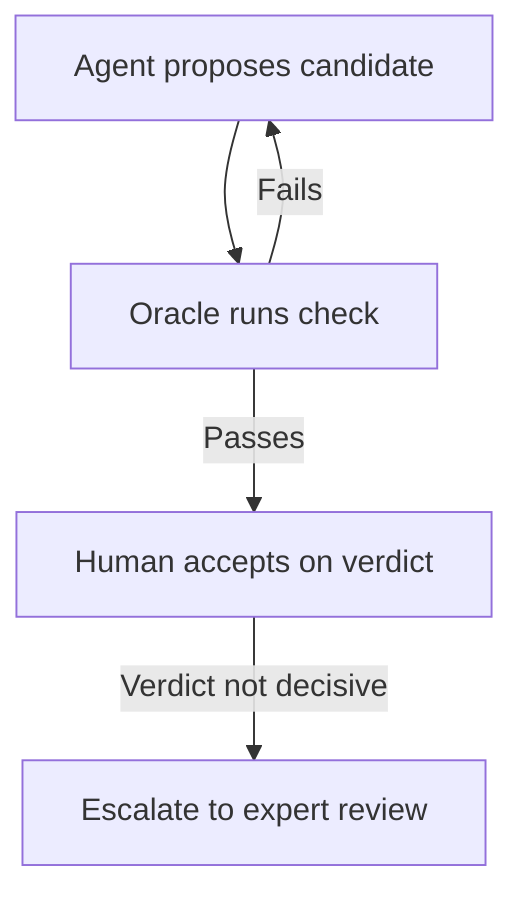

# Oracle-Gated Delegation Beyond Your Domain Expertise

> Oracle-gated delegation runs an agent past your own expertise, but only when a decisive, agent-independent check costs far less than the work.

Oracle-gated delegation puts an agent on a problem you cannot personally reason about, then accepts its output on the strength of a mechanical check instead of a review of its argument. The cycle holds only under three conditions: the check is decisive for the property you want, you can run it without the agent's cooperation, and it costs far less than producing the candidate. Where any condition fails, the expertise requirement has not gone away. It moves to the end of the job, where it costs more.

## Why the loop needs an oracle

Delegation normally rests on review. You read what the agent produced, follow its reasoning, and accept or reject. That breaks down the moment the work sits outside your competence, and it breaks down quietly: a six-month, three-wave longitudinal pilot study of an academic cohort solving analytical problems found participants leaned on AI most for the hardest tasks (73.9%) while their verification confidence fell (68.1%) exactly where accuracy was worst. Participant accuracy declined from 95.2% to 47.8% as difficulty rose, and the gap between believed and actual performance widened to 34.6 points. The authors caution that an academic convenience sample limits generalization to professional contexts ([Huemmer et al., 2026](https://arxiv.org/abs/2601.17055)).

An oracle replaces the review you cannot perform. It decides correctness by running something, so the verdict never routes through your understanding of the argument.

## Test the three conditions before you start

Decisive means passing the check establishes the property you actually care about, not a proxy for it. A green test suite establishes that the code passes those tests. It does not establish that a protocol implementation is conformant, that a cache invalidation is correct under concurrency, or that a numerical routine is stable.

Independent means the check exists outside the loop that produced the candidate. When one agent writes both the artifact and its verifier, the verifier stops being evidence — the same failure as [deriving a test suite from code the agent just wrote](../patterns/anti-patterns/code-first-test-oracle-bias.md). The [Verification Horizon](https://arxiv.org/abs/2606.26300) analysis of coding-agent reward signals lists the resulting channels: repository-history mining, test-oracle tampering, evaluation-harness tampering, visible-test overfitting, and evaluator-aware patching. It concludes that "no fixed reward function can remain effective as policy capability continues to grow."

Cheap means confirming a candidate costs far less than producing one. That asymmetry is the entire economics of the cycle. Where confirming the answer needs its own research program, you are paying for the expertise anyway, just later.

## Three implementation layers

### Layer 1: Candidate generation

The agent searches. Anthropic's cryptography work wired this as a hypothesis loop: researchers built "a scaffold that enabled Claude to pose hypotheses, run experiments to experimentally validate or refute these hypotheses," and the model then ran largely unattended ([Anthropic, 2026](https://www.anthropic.com/research/discovering-cryptographic-weaknesses)). Human input was persistence pressure rather than domain steering — the published operator prompts are mostly variations on refusing to accept that the target is too hard ([Willison, 2026](https://simonwillison.net/2026/Jul/28/discovering-cryptographic-weaknesses-with-claude/)).

### Layer 2: Mechanical verification

The oracle decides. On the HAWK signature scheme, the model built the check itself: "after finding the attack, Mythos implemented an end-to-end verification pipeline to convince itself — and the human operator — of the attack's correctness" ([Anthropic, 2026](https://www.anthropic.com/research/discovering-cryptographic-weaknesses)). Keep the running of that pipeline under your control even when the agent authored it, and re-derive its inputs from a source the agent did not write.

### Layer 3: Human acceptance

You accept the artifact, not the argument. Before accepting, state which property the passing check established. If you cannot name one, the cycle has degraded into ordinary review that you are not qualified to perform.

## Triggers and constraints

Run this manually, per problem, rather than on a schedule. The cycle has no natural stopping point: an oracle reports passes, never exhaustion, so a run that finds nothing is indistinguishable from a problem with no answer. Anthropic reports that "many sessions resulted in no new discoveries" ([Anthropic, 2026](https://www.anthropic.com/research/discovering-cryptographic-weaknesses)).

Bound it on spend before you start. The HAWK result took about 60 hours of model time at roughly $100,000 in estimated API cost ([Willison, 2026](https://simonwillison.net/2026/Jul/28/discovering-cryptographic-weaknesses-with-claude/)), so the shape does not transfer to problems worth less than the verification effort they demand.

The cycle is tool-agnostic. It needs a long-running agent, a sandbox that can execute the check, and a permission split that grants write access to the candidate but not to the oracle.

## Why it works

The cycle substitutes a verification asymmetry for knowledge you do not have. For some problems, checking a candidate is far cheaper than generating one, and the check runs rather than being reasoned about.

Anthropic states the causal condition directly. The HAWK operator "had a background in theoretical computer science but was not an expert in lattice-based cryptography," and the delegation still worked because "the HAWK attack is implementable end-to-end and thus much easier to verify" ([Anthropic, 2026](https://www.anthropic.com/research/discovering-cryptographic-weaknesses)). End-to-end implementability is what made the verdict independent of the operator.

## When this backfires

The oracle checks a proxy. This failure looks most like success, because a partial check still returns green. On the AES half of the same project, the result was a mathematical technique rather than a runnable attack, so "it took two researchers nearly a month to gain confidence that the method it discovered is correct," and researchers "spent several hundred hours learning enough cryptography research to validate the model's claim" ([Anthropic, 2026](https://www.anthropic.com/research/discovering-cryptographic-weaknesses)).

The agent can reach the oracle. Grant the same session write access to the tests, the harness, or the fixture data, and the check measures compliance rather than correctness ([Qwen Team, 2026](https://arxiv.org/abs/2606.26300)). Models trained against verifiable rewards have been shown to "enumerate instance-level labels, producing outputs that pass verifiers without capturing the relational patterns required by the task," with shortcut prevalence rising alongside task complexity and inference-time compute ([Helff et al., 2026](https://arxiv.org/abs/2604.15149)) — the regime this cycle lives in.

Capability is uneven in ways a non-expert cannot see. CryptanalysisBench, built alongside that work, reports 65% to 86% success on already-broken schemes but only 6 to 12 full-strength schemes broken across five frontier models ([Fluri et al., 2026](https://arxiv.org/abs/2607.18538)). Without domain knowledge you cannot tell a rediscovery from a new result, so the oracle has to carry that judgment instead of you.

## Example

The Anthropic cryptography project ran this cycle twice and got opposite results, which is what makes it a test of the conditions rather than a testimonial.

HAWK passed all three. The attack was implementable end-to-end, the verification pipeline ran independently of the reasoning that produced it, and running it cost little next to the search. A non-specialist operator carried the result.

AES failed the first. The output was an improved meet-in-the-middle attack on a seven-round variant, roughly 200 to 800 times faster than prior work — a mathematical claim, not something a script settles. Verification reverted to two experts and nearly a month of their time. The agent still did the discovery; the cycle around it stopped protecting anyone who lacked the domain.

## Key Takeaways

- Name the check before you start, and state which property passing it establishes. If you cannot, you are not gated on an oracle.
- Keep the verifier out of the agent's reach. A check the agent can edit measures compliance, not correctness.
- Treat verification cost as the deciding number. When confirming a candidate costs more than generating one, the cycle has already failed.
- Expect the partial-oracle case, where the check covers components but not the claim, and budget expert review for it rather than discovering it late.
- An oracle reports passes, never exhaustion. Silence from the loop is not evidence that no answer exists.

## Related

- [Oracle-Based Task Decomposition for AI Agent Development](../patterns/multi-agent/oracle-task-decomposition.md) — using a reference oracle to split one unverifiable task into many verifiable ones
- [Chain-of-Verification for Coding Agents](../verification/chain-of-verification-coding-agents.md) — what to do for claims no external oracle reaches
- [Generating Tests From Agent-Written Code (Code-First Oracle Bias)](../patterns/anti-patterns/code-first-test-oracle-bias.md) — why a check derived from the agent's own output is not independent
- [Verification-Gated Agent Autonomy via Automated Review](../patterns/agent-design/verification-gated-agent-autonomy.md) — scaling an agent's permission to act to the strength of the review behind it
- [Deliberate AI-Assisted Learning: Accelerating Skill Acquisition](../human/deliberate-ai-learning.md) — building the domain knowledge this cycle deliberately routes around
