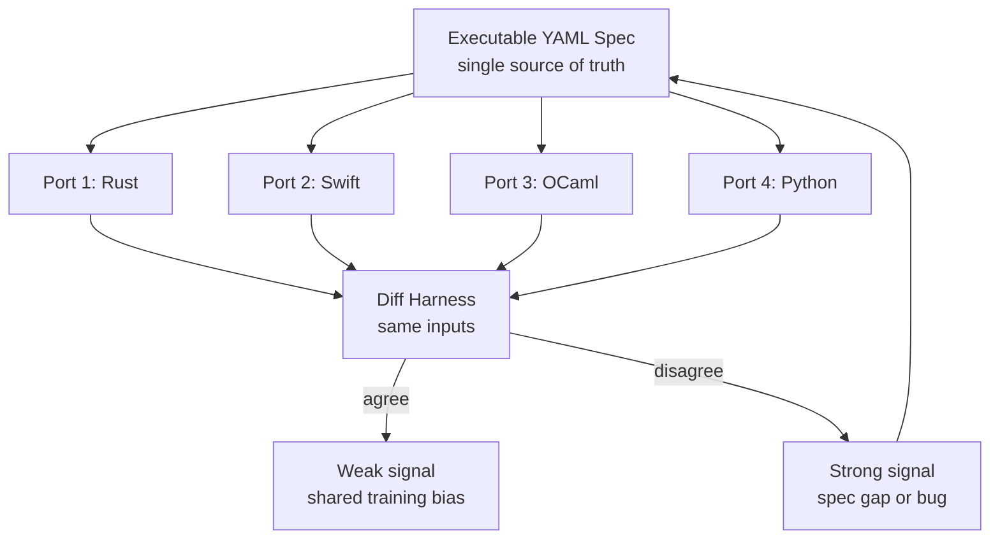

# Parallel Polyglot Ports as a Spec-Ambiguity Oracle

> Generate multiple AI-paired ports from one executable spec and treat divergence as a signal that the spec under-specifies behaviour — not as a fault-tolerance vote.

This workflow pairs an AI coding assistant with a precise executable specification, then has it generate independent ports in different languages or runtimes. Where two ports disagree on observable behavior, the spec is either ambiguous or wrong — and that is the only correctness signal the parallel implementations reliably produce. Jason Hickey reports five ports of a vector-illustration application (Rust, Swift, OCaml, Python, browser) generated from a shared 23,000-line YAML spec in about 120 evening hours by a single developer ([Hickey, 2026](https://arxiv.org/abs/2606.07828)).

## When to use it

The cycle only pays back under all four conditions below. Outside them the maintenance overhead exceeds the disambiguation benefit, and the agreement signal becomes misleading.

- You already need multiple targets — cross-platform reach is a product requirement, not a verification strategy. If WebAssembly or a single runtime can carry the product, write one port and [verify it directly](simulation-replay-testing.md).
- The behavior is YAML-specifiable — pure-function pipelines, parsers, codecs, layout engines, and protocol implementations specify cleanly. UI feel, accessibility heuristics, performance envelopes, concurrency semantics, and security posture do not, and parallel ports cannot test what the spec cannot pin down ([Knight & Leveson, 1986](http://sunnyday.mit.edu/papers/nver-tse.pdf)).
- The team is one person doing greenfield work — the case study is one developer working evenings on a new application. 5-port maintenance against library deprecations and OS-level platform churn has not been demonstrated and scales the cost multiplier accordingly.
- You expect spec ambiguity to dominate code bugs — the workflow optimizes for the spec-is-wrong failure mode. If the harder problem is implementation correctness against a known-good spec, invest in property-based and metamorphic tests against a single port instead.

## The N-version programming revival problem

The Jas case study frames itself as a revival of 1980s N-version programming (NVP), claiming AI pairing now makes the historical cost objection obsolete ([Hickey, 2026](https://arxiv.org/abs/2606.07828)). That framing carries a load-bearing premise the original literature already rejected. NVP's reliability argument depended on the assumption that independent implementations of the same specification fail independently — only then does a voter masking single-version bugs actually improve reliability. Knight and Leveson tested this empirically with 27 independent versions written from the same spec across two universities, ran one million tests, and found a statistically significant lack of failure independence — coincidental errors appeared in independently developed programs ([Knight & Leveson, 1986, IEEE TSE](http://sunnyday.mit.edu/papers/nver-tse.pdf)). Knight's 1990 reply defended the result against rebuttal attempts ([Knight, 1990](http://sunnyday.mit.edu/critics.pdf)).

AI pairing makes the independence problem worse, not better. Frontier coding models share training corpora and inductive biases. Empirical study of independent LLM inference engines reports bug-symptom correlations above 0.9 and root-cause correlations above 0.5 across implementations ([Liu et al., 2025, "A First Look at Bugs in LLM Inference Engines"](https://arxiv.org/pdf/2506.09713)), and 90% of code-LLM failure cases occur because the model "defaults to common patterns in the training data" ([Dinh et al., 2023](https://arxiv.org/pdf/2306.03438)). When two AI-written ports agree, that agreement is weak evidence of correctness. When they disagree, the disagreement is strong evidence the spec did not pin down the behavior they disagree on.

## Why it works

The mechanism that survives review is spec disambiguation through implementation diversity: a precise executable specification compresses ambiguity into a single artifact that humans can read and machines can run, and re-realizing it in genuinely different runtimes surfaces places where the spec did not constrain behavior ([InfoQ — Spec-Driven Development, 2026](https://www.infoq.com/articles/spec-driven-development/); [GitHub Spec Kit launch, 2025](https://github.blog/ai-and-ml/generative-ai/spec-driven-development-with-ai-get-started-with-a-new-open-source-toolkit/)). AI lowers the per-port authoring cost enough that a solo developer can afford four or five realizations whose differences are read as spec feedback ([Hickey, 2026](https://arxiv.org/abs/2606.07828)). The voter mechanism from classical NVP does not survive — Knight and Leveson rejected its independence assumption for human-written versions, and LLM bug-correlation data rejects it more strongly for AI-written ones.

## Three implementation layers

### Layer 1: The executable specification

The spec is the artifact under version control and review; the ports are derived. Use a machine-readable format (YAML, Protobuf, JSON Schema, or a typed DSL) that downstream tooling can validate and execute, not English prose. Externalizing intent into a persistent document the agent re-reads on every compilation cycle is the pattern Spec-Driven Development calls "the spec, not the chat history, as source of truth" ([InfoQ, 2026](https://www.infoq.com/articles/spec-driven-development/)). For the Jas case study the spec is 23,000 lines of YAML covering five language targets ([Hickey, 2026](https://arxiv.org/abs/2606.07828)).

### Layer 2: Port generation in fresh contexts

Generate ports one at a time, each in a fresh agent context, using the same spec as the prompt root. Do not feed a prior port's code as a reference — that defeats the divergence signal by anchoring later ports to earlier choices. Use distinct languages and runtimes (Rust + Swift + OCaml + Python + browser, in the case study) so platform primitives are genuinely different, which makes accidental agreement harder to engineer.

### Layer 3: Diff harness and spec feedback

Run a diff harness over identical inputs. Compare observable artifacts: rendered SVG, exported file bytes, parsed AST, protocol bytes. Record every divergence with the input that triggered it. Treat agreement as suspect (both ports may share a training-data bias per [Dinh et al., 2023](https://arxiv.org/pdf/2306.03438)) and disagreement as the actionable signal. Resolve disagreements by editing the spec, not the ports — if the spec was silent on a behavior, tighten it and regenerate; if one port has a true bug the spec already covered, file it against the model or the prompt. When ports diverge for legitimate platform reasons (Swift structured concurrency versus browser event loop), pick one as canonical and document the legitimate deviation in the spec.

## Triggers and constraints

- Trigger — push to the spec or to any port. The diff harness runs every time, not on a schedule; the spec is the input, the harness is the gate.
- Bound on agent authority — the agent edits ports and may propose spec edits, but spec edits must be [human-reviewed](human-in-the-loop.md). The agent is allowed to converge a port to the spec but never to converge the spec to a port.
- Out-of-scope behaviors — the spec must declare what it does not cover (UI feel, performance envelope, platform-specific concurrency). Behavior outside the declared scope is not a diff-harness finding; it is product judgment carried elsewhere.

## Multi-tool coverage

Tool-agnostic. The workflow does not depend on any specific harness — Claude Code, Copilot, and Cursor can each generate a port given the spec as project context. The diff harness is plain build tooling; it predates AI pairing.

## When this backfires

- Frontier-model homogeneity — when all ports come from closely related LLMs (all GPT-class or all Claude-class), shared training data correlates failures and the differential signal collapses. The case study mixes runtimes but does not mix model families; the workflow's diagnostic value degrades as the model pool narrows ([Liu et al., 2025](https://arxiv.org/pdf/2506.09713); [Dinh et al., 2023](https://arxiv.org/pdf/2306.03438)).
- Spec ambiguity that all ports interpret the same way — when the spec is silent on a behavior and the obvious default is plausible enough that every model picks it, the harness sees agreement and reports green while the application silently does the wrong thing. This is the classical coincidental-error failure mode Knight and Leveson identified ([Knight & Leveson, 1986](http://sunnyday.mit.edu/papers/nver-tse.pdf)).
- Reproducibility tax under model churn — across three frontier coding agents given identical prompts that explicitly demanded reproducible multi-port output, only 68.3% of 300 projects executed as specified, with per-language reproducibility ranging from 89% (Python) downward ([arxiv 2512.22387, 2026](https://arxiv.org/pdf/2512.22387)). Regenerating a port after a model release will often produce a different implementation that re-introduces resolved divergences.
- Maintenance budget under one developer-multiple — a solo developer who can write five ports in 120 hours cannot maintain five ports against API drift, library deprecations, and OS-level platform churn at the same multiplier. The case study reports authoring cost, not steady-state maintenance.
- Differential-testing oracle limits — differential testing rests on a counterpart implementation existing and being trustworthy; LLM-generated oracles tend to capture the actual program behavior instead of the expected behavior ([Fan et al., 2024](https://abhikrc.com/pdf/ISSTA24_Oracle_Guided.pdf); [Mokav, 2024](https://arxiv.org/html/2406.10375v1)). Treat the diff harness as a spec-ambiguity probe, not as a correctness oracle.

## Example

The Jas case study reports five ports from one YAML spec ([Hickey, 2026](https://arxiv.org/abs/2606.07828)):

| Artefact | Size | Role |
|---|---|---|
| Shared YAML spec | 23,000 lines | Single source of truth — versioned, executable |
| Rust port | up to ~95,000 lines | Native target |
| Swift port | up to ~95,000 lines | Apple platforms |
| OCaml port | up to ~95,000 lines | Functional-language target |
| Python port | up to ~95,000 lines | Reference/host integration |
| Browser port | up to ~95,000 lines | Web target |
| Total developer time | ~120 evening hours | One developer, greenfield |

The diff harness operates on observable artifacts (rendered SVG, exported file bytes, parsed AST) and feeds disagreements back into the YAML spec. Per-port native code size varies because each port inherits its language's standard library and idioms — the spec carries the behavior, the port carries the platform.

## Key Takeaways

- AI pairing lowers the cost of multi-language implementation enough to make divergence-as-spec-feedback affordable for solo developers.
- The mechanism that survives review is spec disambiguation, not fault-tolerant voting — the latter was rejected in 1986 and is worse under shared LLM training corpora.
- Use the workflow only when cross-platform reach is already a product requirement and the behaviour is YAML-specifiable; outside those conditions a single port with property-based and metamorphic tests is cheaper and produces a cleaner correctness signal.
- Treat port *agreement* as suspect (correlated training bias) and port *disagreement* as the actionable signal (spec gap or bug).
- The reported five-port case study measures authoring cost, not steady-state maintenance; the cost multiplier under platform churn has not been demonstrated.

## Related

- [Spec-Driven Development with Spec Kit](spec-driven-development.md) — the spec-as-source-of-truth half of this workflow as a standalone practice
- [Verification-Centric Development for AI-Generated Code](verification-centric-development.md) — layered verification gates for AI-generated code where parallel ports are one possible layer
- [Reverse-Engineered Executable Specifications for Agentic Program Repair](../multi-agent/reverse-engineered-executable-specifications.md) — specification inference as a separate stage in a multi-agent pipeline
- [Eval-Driven Development: Write Evals Before Building Agent Features](eval-driven-development.md) — defining success criteria before code, complementary to executable specs
- [Simulation and Replay Testing for Agent Verification](simulation-replay-testing.md) — single-implementation alternative when cross-platform reach is not a requirement
- [Staged Literal Porting with a Per-Stage Numeric Oracle](staged-literal-port-with-numeric-oracle.md) — Adjacent workflow where the oracle is the prior canonical version's output rather than sibling ports' divergence
