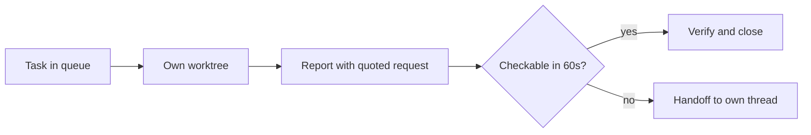

# Per-Task Verification Budget: Size the Task to Fit the Check

> A fixed 30-to-60-second check per agent task is a sizing rule: work that cannot be verified inside the budget does not enter the batch.

Eivind Kjosbakken runs one daily Claude Code session against a ticket queue, and names the volume at which one session per task stops working: "you start having problems once you receive 50 to 100 tasks per day, where you obviously don't want to spin up that many separate coding sessions". His rule for the human end of it is a number: "I find that in most cases, it's worth just spending 30 seconds to 1 minute verifying the work for one task" ([Kjosbakken, Towards Data Science, 2026](https://towardsdatascience.com/how-to-effectively-solve-100-tasks-with-claude-code/)). As a review technique that says almost nothing. As an admission rule it says something exact. A task that cannot be checked inside a minute is not one of these tasks, and it leaves the batch for its own thread.

## Why a fixed budget

With no per-task figure the check inherits whatever attention is left after the queue, and the ticket records the same "verified" either way. A number makes the check schedulable and, more usefully, makes it refusable: you can tell when a task does not fit. [Verification capacity saturation](../verification/verification-capacity-saturation.md) sets out the response set once the checking station is genuinely the constraint, and a per-task budget is the intake-reduction lever in that set.

Start from the observed floor rather than an ideal. In the AIDev dataset of agent-authored pull requests on GitHub, "most AI-generated PRs receive no review and, when reviewed, are largely dominated by AI agents rather than humans" ([Duma et al., arXiv:2605.02273v1](https://arxiv.org/abs/2605.02273v1)). That is a different population from one practitioner's ticket queue, and it is the population the practice competes against. Judge the budget against zero seconds, which is what most agent pull requests in that dataset get.

## Three implementation layers

### Layer 1: one worktree per task

Each task gets its own sub-agent in its own isolated checkout. The source states the instruction plainly: "you instruct Claude Code to spin up sub-agents in separate worktrees so that the sub-agents don't interfere with each other" ([Kjosbakken, 2026](https://towardsdatascience.com/how-to-effectively-solve-100-tasks-with-claude-code/)). The mechanics and their limits are covered in [worktree isolation](worktree-isolation.md) and [lazy worktree isolation](lazy-worktree-isolation.md); what this layer contributes to the budget is that a task's state is never contaminated by a sibling, so the minute you spend is spent on one change.

### Layer 2: a report the check can run from

The budget is unreachable if the reviewer has to reconstruct the request first. The report carries two fields that remove that cost. It quotes the ask unedited, and it points at the thing to click: "It should include the original Slack message or Linear issue quoted verbatim. It should include a link to the exact page where I can test the issue" ([Kjosbakken, 2026](https://towardsdatascience.com/how-to-effectively-solve-100-tasks-with-claude-code/)). [Agent-generated verification reports](../verification/agent-generated-verification-report.md) covers the full artifact and the verdict channel back to the agent.

### Layer 3: the budget as an admission test

Run the steps, decide, record. When the task does not fit, the answer is not a longer budget. It is a different queue: "I ask Claude to make a handoff, because I wanna do bigger tasks in a separate thread" ([Kjosbakken, 2026](https://towardsdatascience.com/how-to-effectively-solve-100-tasks-with-claude-code/)). Triage that call before dispatch rather than at the check, using the tiers in [delegation decision](../patterns/agent-design/delegation-decision.md).

The bound this places on task size is tighter than a minute sounds. In a 32-participant eye-tracking study, reviewers spent "an average time of 15 seconds" on a 6-line snippet, and on a 25-line one "an extra 15 seconds, a 60% increase" once the code was labeled as model-written — putting the unlabeled 25-line baseline at 25 seconds ([Khojah et al., arXiv:2606.26505v1](https://arxiv.org/abs/2606.26505v1)). Those are fixation times, and the authors say so: they "concern fixation time alone, not the full time spent on review". So 25 seconds for 25 lines is a floor, and the real ceiling on task size is tighter than the arithmetic below suggests, not looser. Opening the link, running the steps, and recording a verdict all come out of the same 60 seconds. Tens of lines of reading is the ceiling, and the fixation-time floor means it is an optimistic one.

## Why it works

The causal work happens on the producer side. Fixing the check time makes verification a service with a known duration, so the only free variable left is how much work each item carries, and task decomposition is what moves to fit it. That is why the budget and the handoff rule are the same rule stated twice.

The budget is reachable at all because the report already paid the expensive part. Bird and Bacchelli's interview and survey study at Microsoft concluded that "code and change understanding is the key aspect of code reviewing" ([Bird and Bacchelli, ICSE 2013](https://www.microsoft.com/en-us/research/publication/expectations-outcomes-and-challenges-of-modern-code-review/)). A verbatim request plus an exact test link hands that understanding over, so the minute buys an executed check instead of an orientation.

## When this backfires

- A cheap machine check already covers the change. A test or a CI gate is independent of the producing agent, costs no attention per run, and re-runs on every future change. Spend the minute writing one instead.
- The implementing agent authored the test steps. It chose what your minute checks, so you confirm what was built rather than what was asked. A separate reviewing agent or a gate the producer cannot tune against is the stronger arrangement.
- More seconds are not more depth. The same eye-tracking study found that a cue which bought 33 and 60 percent longer review "does not change the length of saccades within an area of interest" ([Khojah et al., arXiv:2606.26505v1](https://arxiv.org/abs/2606.26505v1)). A budget is another time knob, and time is not what catches defects.
- The recorded verdict carries less than it appears to. Among merged agentic pull requests "15.4% required explicit reviewer involvement", and among rejected ones "only 35.7% of rejected PRs reflected clear agentic failures" ([Peralta et al., arXiv:2605.22534v1](https://arxiv.org/abs/2605.22534v1)).
- Nothing audits adherence. The budget is self-imposed, and under a 100-item queue it decays into a skim while the ticket still reads verified.
- The queue does not divide. One person at 100 tasks and one minute each spends 100 minutes; sharing the budget across a team only helps if the task queue splits with it.

The strongest case against the whole practice is broader than any of these. Monperrus argues that "the naive integration in which agents write code and humans remain the mandatory reviewers is a dead end because it neither provides meaningful assurance nor scales with AI-assisted throughput", and that agents meet the same objectives "at lower cost and higher throughput" ([Monperrus, arXiv:2606.13175v1](https://arxiv.org/abs/2606.13175v1)). If that holds, a fixed human budget is a linear cost against a day that does not grow. The defense is narrow. The budget covers behavior no cheap machine check reaches, and wherever such a check exists, the check wins.

## Triggers and constraints

The cycle runs on a human-initiated daily session rather than a schedule or a push event, because the budget is drawn against one person's attention and has to be started by that person. Three constraints bound it.

- The batch is capped by arithmetic, not judgment. Working minutes available for checking, divided by the per-task budget, is the ceiling on tasks marked done that day.
- The agent's authority stops at the report. It writes the change and the test steps; it does not record the verdict.
- Work that fails the admission test gets dispatched, never dropped. Without a handoff thread to receive it, the budget turns into a reason to under-check big tasks.

The workflow is tool-agnostic. The source implements it in Claude Code, and nothing in the three layers depends on that beyond having per-task isolation and a report the agent can emit.

## Key Takeaways

- Treat the number as an admission rule, not a review technique. A task needing more than a minute leaves the batch and gets its own thread.
- At observed fixation rates, about 25 seconds for 25 lines, a 60-second budget admits tens of lines plus the setup around them — and fixation is a floor on real review time, so treat that as generous. Size tasks to it, or the tick is unearned.
- The budget is only reachable because the report removed the reconstruction. Without the quoted request and the direct test link, the minute goes on orientation.
- Prefer a machine check wherever one exists. It is independent, costs no attention per run, and applies to every future change rather than once.
- A green verdict against the implementing agent's own test steps is weak evidence. It confirms what was built.

## Related

- [Agent-Generated Verification Reports: A Structured Round-Trip for Human Review](../verification/agent-generated-verification-report.md) — the artifact that makes a one-minute check possible
- [Verification Capacity Saturation: Three Levers, One Default](../verification/verification-capacity-saturation.md) — the response set when the checking station is the constraint
- [Worktree Isolation: Parallel Agent Sessions in Safe Sandboxes](worktree-isolation.md) — the per-task sandbox this workflow assumes
- [Developer as CPU Scheduler: Attention Management with Parallel Agents](../human/attention-management-parallel-agents.md) — why attention, not generation, is the scarce resource here
- [Evidence-Bundled Agent PRs: Sizing the Reviewer's Effort](../verification/evidence-bundled-agent-prs.md) — the producer-side bundle for changes too large for a fixed budget
