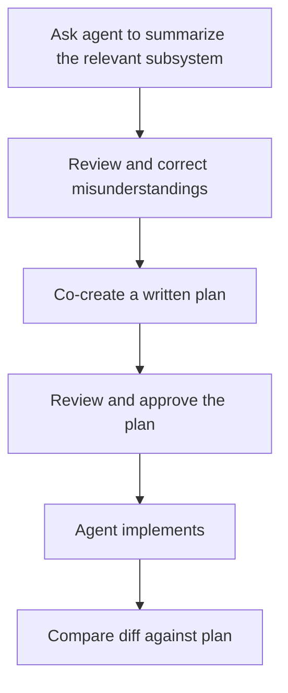
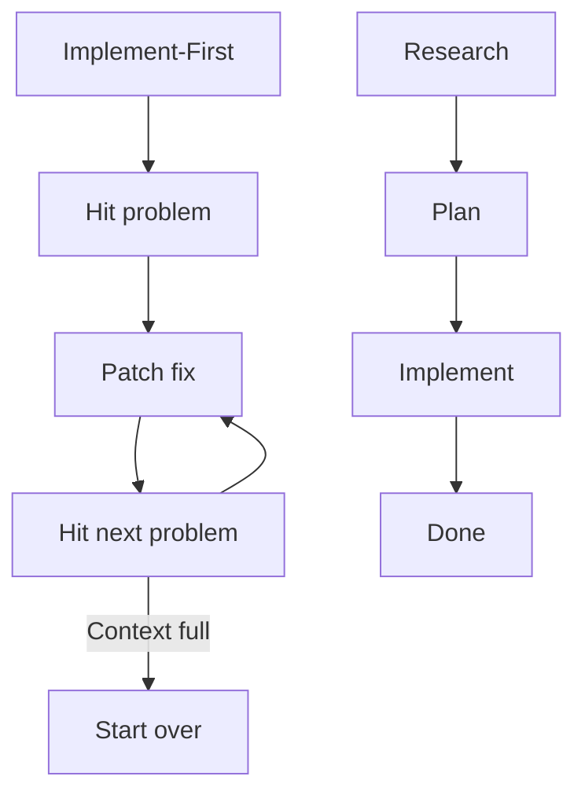

# The Plan-First Loop: Design Before Code

> For non-trivial tasks, ask the agent to summarize how the system works, correct its understanding, co-create a written plan, then implement — never the reverse.

## Why Implementation-First Fails

Jumping straight to "Here is the feature. Here are some files. Please build it." gives the agent insufficient context and no explicit alignment checkpoint. The result compiles but may stray from architectural goals and require significant correction.

[OpenAI's Sora Android team](https://openai.com/index/shipping-sora-for-android-with-codex/) found this precisely. Initial implementation-first prompts produced code that was functional but architecturally inconsistent. Shifting to a plan-first loop gave the team confidence in the direction before implementation began — analogous to how a good design document gives a tech lead confidence in a project.

## The Loop



### Step 1: Summarize Before Touching

Ask the agent to read the relevant files and summarize how the subsystem works — before it proposes any changes. This surfaces what the agent understood, including wrong assumptions, before they become code.

Example prompt:
```
Read the authentication module and summarize how session management works. Do not make any changes yet.
```

### Step 2: Correct Misunderstandings

Review the summary. If the agent misidentified a component's responsibility or missed a critical dependency, correct it explicitly. One correction here prevents multiple correction cycles after implementation.

### Step 3: Co-Create the Plan

Ask the agent to produce a written plan specifying:

- Which files will change and why
- What new state or logic is introduced
- How the change integrates with existing patterns
- What the success criteria are

The plan functions as a mini design document. Reviewing it answers the question "does the agent understand the task?" before implementation cost is incurred. [OpenAI's Sora team](https://openai.com/index/shipping-sora-for-android-with-codex/) described this dynamic as similar to how "a good design document gives a tech lead confidence in a project."

### Step 4: Implement Against the Plan

With an approved plan, the agent implements. Implementation is now execution of a known approach rather than exploratory guessing. Scope drift from the plan is a signal to stop and re-examine, not to continue.

## Iterative Self-Critique Rounds

A single planning pass can miss edge cases, include redundant steps, or sequence operations suboptimally. Adding a self-critique round — where the agent reviews its own plan before execution — catches these issues before they become implementation errors.

### The Three-Round Refinement

**Round 1: Initial plan.** The agent generates a plan using the standard loop above.

**Round 2: Critique.** Ask the agent to review its own plan targeting specific weaknesses:

- Edge cases the plan does not handle
- Redundant steps that can be consolidated
- Ordering inefficiencies (steps that could run in parallel or in a different sequence)
- Alternative approaches that would be simpler or more robust

**Round 3: Consolidate.** The agent incorporates critique findings, validates assumptions and dependencies, and produces a final plan.


### When Self-Critique Adds Value

Self-critique rounds add cost (each round consumes tokens for reasoning). They pay off when:

- The task is complex enough that a single planning pass is unlikely to catch all issues
- Implementation errors are expensive to repair (cross-cutting refactors, database migrations)
- The agent will execute unsupervised for an extended period

For simple, well-scoped tasks with fast feedback loops, a single planning pass is sufficient. Adding critique rounds to a task that takes 30 seconds to implement adds cost without proportional benefit.

### Stacking with Extended Thinking

Self-critique rounds compound with extended thinking and plan mode. Each technique operates at a different layer:

1. **Extended thinking** — deeper reasoning within each round
2. **Plan mode** — structured, read-only exploration before planning
3. **Self-critique** — multi-round refinement across planning passes

In practice, investing additional compute in planning rounds on a mid-tier model can substitute for switching to a more expensive model — the gain comes from reasoning quality at the planning stage, not raw generation power.

## Plans as Files for Long-Horizon Tasks

Context window limits mean that a very long implementation task may span multiple agent sessions or instances. If the plan exists only in conversation history, it cannot seed new sessions.

[The Sora team](https://openai.com/index/shipping-sora-for-android-with-codex/) solved this by saving approved plans to files. A new agent instance reads the plan file at startup, inherits the direction, and continues implementation without needing to reconstruct the original reasoning.

A plan file format:

```markdown
# Feature: Password Reset Flow

## Scope
- api/auth/reset.ts — new endpoint
- api/auth/email.ts — extend with reset template
- tests/auth/reset.test.ts — new test file

## Approach
1. Add POST /auth/reset accepting email
2. Validate against users table, generate time-limited token
3. Call email.ts sendResetEmail(token, email)
4. Add GET /auth/reset/:token to validate and redirect

## Success Criteria
- 200 response with email sent confirmation
- Invalid/expired token returns 400 with specific error
- End-to-end test passes
```

The plan file is version-controlled alongside the code. It serves as both a coordination artifact for multi-session tasks and a lightweight decision record.

## Activating Plan Mode in Claude Code

Claude Code provides [Plan Mode](plan-mode.md) as a built-in permission constraint: the agent may only read files and ask questions until you approve a plan. No write operations are possible until approval.

**During a session**: press `Shift+Tab` twice. The first press activates Auto-Accept mode; the second activates Plan Mode, shown as `⏸ plan mode on` at the bottom of the terminal.

**Using `/plan`**: type `/plan` at the prompt, or pass a description to skip the interactive clarification step:

```
/plan refactor the auth module
```

**Starting a session in Plan Mode**:

```bash
claude --permission-mode plan
```

**Set as default** for a project by adding to `.claude/settings.json`:

```json
{
  "permissions": {
    "defaultMode": "plan"
  }
}
```

Press `Ctrl+G` to open the displayed plan in your editor for direct modification before execution.

Plan Mode is a permission constraint — it restricts what actions the agent may take. Extended thinking is a reasoning depth setting — it affects how much the model reasons before responding. Both can run simultaneously, as described in [Stacking with Extended Thinking](#stacking-with-extended-thinking) above.

## Enforcing Plan-First via System Prompt

Manual Plan Mode requires activation each session. The [`--append-system-prompt` flag](https://code.claude.com/docs/en/cli-reference) embeds the planning requirement directly into the session, so the agent always plans first regardless of how the session starts:

```bash
claude --append-system-prompt "Before executing ANY tool that modifies state (Write, Edit, Bash), you MUST present a plan and WAIT for explicit user approval. Each new user message requires a new plan — previous approvals do not carry over."
```

Key elements of an effective injected planning prompt:

- **Trigger scope**: target only state-changing tools (Write, Edit, Bash); blocking read-only tools adds friction without safety benefit
- **Approval reset rule**: require a new plan for each new user message — prior approvals do not carry over
- **Plan format**: specify which files will change, what each change accomplishes, and any commands that will run

This pattern generalizes to any runtime that supports system prompt customization: `.github/copilot-instructions.md` for Copilot, `.cursor/rules/` for Cursor, or the system prompt parameter directly for API-based agents.

Auto-plan mode is instruction-based, not runtime-enforced. For safety-critical workflows, pair it with `--permission-mode plan` or [deterministic guardrails](../verification/deterministic-guardrails.md).

## Difference from Research-Plan-Implement

The [research-plan-implement pattern](research-plan-implement.md) focuses on information gathering before action. The plan-first loop adds two specific elements: the explicit correction step (where misunderstandings are surfaced and fixed before the plan is written) and the plan-as-file mechanism (for persisting plans across context boundaries). Use both together for complex, multi-session work.

The research phase of that pattern can be delegated to sub-agents. A [Claude Code sub-agent](https://code.claude.com/docs/en/sub-agents) reads and summarizes relevant files without consuming the main agent's context on file traversal — the summary becomes the input to the planning phase.

Without the [research-plan-implement](research-plan-implement.md) structure, a common failure mode is implement-fail-fix: the agent implements, hits a problem from an incorrect assumption, patches that specific problem, then hits the next problem. Each cycle burns context on incremental repair rather than correct implementation. The loop is detectable when the agent produces multiple revisions of the same function or uses error output as its primary source of codebase knowledge.



## When This Backfires

The plan-first loop adds a mandatory checkpoint before every implementation. That checkpoint is valuable when assumptions are uncertain — and pure overhead when they are not.

Specific conditions where plan-first adds cost without proportional benefit:

- **Trivial or already-understood changes.** If the task has one plausible implementation path and the agent has all necessary context, the plan produces no new information. Fixing a typo, bumping a version number, or adding a single line to a config file does not benefit from a summarize-plan-implement loop.
- **Exploratory or debugging sessions.** When the goal is to discover what is wrong rather than to execute a known change, constraining the agent to produce a plan before reading files delays the actual investigation. Discovery-mode work benefits from read-first freedom, not write-last constraints.
- **Rapid-iteration feedback loops.** In a tight test-fix-test cycle — where the feedback loop is shorter than the planning overhead and errors are cheap to reverse — the plan step becomes a speed penalty with no alignment benefit.

In these cases, use direct prompting or Plan Mode selectively on the specific step where scope uncertainty is high, rather than applying the full loop by default.

## Key Takeaways

- Ask the agent to summarize before it plans; plan before it implements.
- Correct misunderstandings at the summary stage — one correction there prevents multiple corrections after implementation.
- Add self-critique rounds for complex tasks: critique for edge cases, redundancies, and ordering, then consolidate into a final plan.
- Self-critique stacks with extended thinking and plan mode to compound planning quality.
- Save plans to files for long-horizon tasks that span multiple agent sessions.
- Compare implementation diffs against the plan, not just against the original task description.
- Activate Plan Mode in Claude Code with `Shift+Tab` twice, `/plan`, or `--permission-mode plan`; press `Ctrl+G` to edit the plan before execution.
- Use `--append-system-prompt` to enforce planning across every session without manual activation; scope the rule to state-changing tools only.
- Delegate the research phase to sub-agents to keep the main agent's context clean.
- The implement-fail-fix loop is the failure mode this pattern prevents — detect it by watching for repeated revisions of the same function.

## Related

- [Session Initialization Ritual](../agent-design/session-initialization-ritual.md)
- [Lay the Architectural Foundation First](architectural-foundation-first.md)
- [Reasoning Budget Allocation](../agent-design/reasoning-budget-allocation.md)
- [Deterministic Guardrails](../verification/deterministic-guardrails.md)
- [Sub-Agents for Fan-Out Research and Context Isolation](../multi-agent/sub-agents-fan-out.md)
- [Context Priming](../context-engineering/context-priming.md)
- [Pre-Execution Codebase Exploration](pre-execution-codebase-exploration.md)
