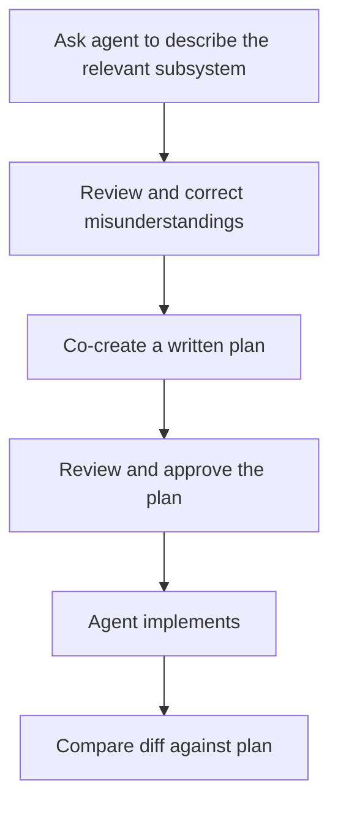
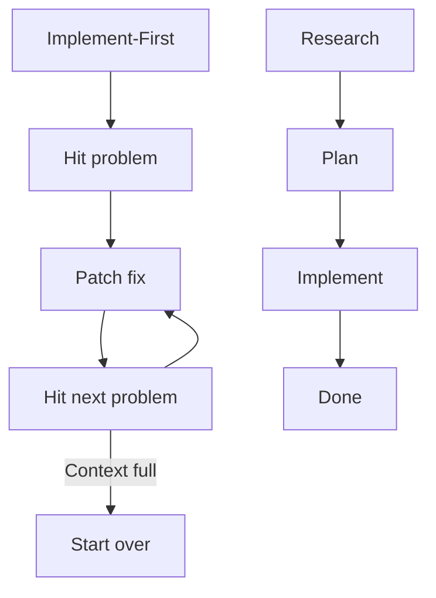

# The Plan-First Loop: Always Design Before Writing Code

> For non-trivial tasks, have the agent describe the system, correct its understanding, and co-design a written plan before it writes code — never the reverse.

Learn it hands-on with the [Plan Before Code lesson](https://learn.agentpatterns.ai/workflows/plan-before-code/) — a guided lesson with quizzes.

## Why implementation-first fails

Jumping straight to "Here is the feature. Here are some files. Please build it." gives the agent [insufficient context](../context-engineering/context-priming.md) and no explicit alignment checkpoint. The result compiles, but it may stray from architectural goals and need heavy correction.

[OpenAI's Sora Android team](https://openai.com/index/shipping-sora-for-android-with-codex/) hit this exact problem. Their first implementation-first prompts produced code that worked but was architecturally inconsistent. Shifting to a plan-first loop gave the team confidence in the direction before implementation began — much as a good design document gives a tech lead confidence in a project.

## The loop


```mermaid
graph TD
    A[Ask agent to describe the relevant subsystem] --> B[Review and correct misunderstandings]
    B --> C[Co-create a written plan]
    C --> D[Review and approve the plan]
    D --> E[Agent implements]
    E --> F[Compare diff against plan]
```

### Step 1: Summarize before touching

Ask the agent to read the relevant files and summarize how the subsystem works — before it proposes any changes. This shows what the agent understood, including wrong assumptions, before they become code.

Example prompt:
```
Read the authentication module and summarize how session management works. Do not make any changes yet.
```

### Step 2: Correct misunderstandings

Review the summary. If the agent misidentified a component's responsibility or [missed a critical dependency](pre-execution-codebase-exploration.md), correct it explicitly. One correction here prevents several correction cycles after implementation.

### Step 3: Co-create the plan

Ask the agent to produce a written plan specifying:

- Which files will change and why
- What new state or logic is introduced
- How the change integrates with existing patterns
- What the success criteria are

The plan works as a mini design document. Reviewing it answers the question "does the agent understand the task?" before you spend implementation effort. [OpenAI's Sora team](https://openai.com/index/shipping-sora-for-android-with-codex/) said this felt similar to how "a good design document gives a tech lead confidence in a project."

### Step 4: Implement against the plan

With an approved plan, the agent implements. Implementation now executes a known approach rather than guessing its way forward. Scope drift from the plan is a signal to stop and re-examine, not to continue.

## Iterative self-critique rounds

A single planning pass can miss edge cases, include redundant steps, or order operations poorly. Add a self-critique round — where the agent reviews its own plan before execution — to catch these issues before they become implementation errors.

### The three-round refinement

Round 1, initial plan. The agent generates a plan using the standard loop above.

Round 2, critique. Ask the agent to review its own plan for specific weaknesses:

- Edge cases the plan does not handle
- Redundant steps that can be merged
- Ordering inefficiencies, such as steps that could run in parallel or in a different sequence
- Alternative approaches that would be simpler or cleaner

Round 3, consolidate. The agent folds in the critique findings, checks assumptions and dependencies, and produces a final plan.


```mermaid
graph LR
    P[Initial Plan] --> CR[Critique Round]
    CR --> C[Consolidate]
    C --> E[Execute]
```

### When self-critique adds value

Self-critique rounds cost tokens, because each round spends them on reasoning. They pay off when:

- The task is complex enough that a single planning pass is unlikely to catch every issue
- Implementation errors are expensive to repair, such as cross-cutting refactors or database migrations
- The agent will run unsupervised for a long stretch

For simple, well-scoped tasks with fast feedback loops, a single planning pass is enough. Adding critique rounds to a task that takes 30 seconds to implement costs more than it returns.

### Stacking with extended thinking

Self-critique rounds compound with extended thinking and plan mode. Each technique works at a different layer:

1. Extended thinking — deeper reasoning within each round
2. Plan mode — structured, read-only exploration before planning
3. Self-critique — multi-round refinement across planning passes

In practice, spending more compute on planning rounds with a mid-tier model can replace switching to a more expensive model. The gain comes from reasoning quality at the planning stage, not raw generation power.

## Plans as files for long-horizon tasks

Context window limits mean a very long implementation task may span several agent sessions or instances. If the plan lives only in conversation history, it cannot seed new sessions.

[The Sora team](https://openai.com/index/shipping-sora-for-android-with-codex/) solved this by saving approved plans to files. A new agent instance reads the plan file at startup, inherits the direction, and continues implementation without needing to reconstruct the original reasoning.

A plan file format:

```markdown
# Feature: Password Reset Flow

## Scope
- api/auth/reset.ts — new endpoint
- api/auth/email.ts — extend with reset template
- tests/auth/reset.test.ts — new test file

## Approach
1. Add POST /auth/reset accepting email
2. Validate against users table, generate time-limited token
3. Call email.ts sendResetEmail(token, email)
4. Add GET /auth/reset/:token to validate and redirect

## Success Criteria
- 200 response with email sent confirmation
- Invalid/expired token returns 400 with specific error
- End-to-end test passes
```

The plan file is version-controlled alongside the code. It serves as both a coordination artifact for multi-session tasks and a lightweight decision record.

## Activating Plan Mode in Claude Code

Claude Code provides [Plan Mode](../tools/claude/plan-mode.md) as a built-in permission constraint: the agent may only read files and ask questions until you approve a plan. No write operations are possible until approval.

To activate during a session, press `Shift+Tab` twice. The first press turns on Auto-Accept mode; the second turns on Plan Mode, shown as `⏸ plan mode on` at the bottom of the terminal.

To use `/plan`, type `/plan` at the prompt, or pass a description to skip the interactive clarification step:

```
/plan refactor the auth module
```

To start a session in Plan Mode:

```bash
claude --permission-mode plan
```

To set it as the default for a project, add this to `.claude/settings.json`:

```json
{
  "permissions": {
    "defaultMode": "plan"
  }
}
```

Press `Ctrl+G` to open the displayed plan in your editor and change it before execution.

Plan Mode is a permission constraint — it restricts what actions the agent may take. Extended thinking is a reasoning depth setting — it affects how much the model reasons before responding. Both can run at the same time, as described in [Stacking with extended thinking](#stacking-with-extended-thinking) above.

## Enforcing plan-first via system prompt

Manual Plan Mode needs activation each session. The [`--append-system-prompt` flag](https://code.claude.com/docs/en/cli-reference) embeds the planning requirement directly into the session, so the agent always plans first regardless of how the session starts:

```bash
claude --append-system-prompt "Before executing ANY tool that modifies state (Write, Edit, Bash), you MUST present a plan and WAIT for explicit user approval. Each new user message requires a new plan — previous approvals do not carry over."
```

An effective injected planning prompt has three key elements:

- Trigger scope: target only state-changing tools (Write, Edit, Bash); blocking read-only tools adds friction without a safety benefit
- Approval reset rule: require a new plan for each new user message — prior approvals do not carry over
- Plan format: specify which files will change, what each change accomplishes, and any commands that will run

This pattern carries over to any runtime that supports system prompt customization: `.github/copilot-instructions.md` for Copilot, `.cursor/rules/` for Cursor, or the system prompt parameter directly for API-based agents.

Auto-plan mode is instruction-based, not runtime-enforced. For safety-critical workflows, pair it with `--permission-mode plan` or [deterministic guardrails](../verification/deterministic-guardrails.md).

## Difference from research-plan-implement

The [research-plan-implement pattern](research-plan-implement.md) focuses on gathering information before action. The plan-first loop adds two specific elements: the explicit correction step, where you surface and fix misunderstandings before the plan is written, and the plan-as-file mechanism, which persists plans across context boundaries. Use both together for complex, multi-session work.

You can delegate the research phase of that pattern to sub-agents. A [Claude Code sub-agent](https://code.claude.com/docs/en/sub-agents) reads and summarizes relevant files without spending the main agent's context on file traversal — the summary becomes the input to the planning phase.

Without the [research-plan-implement](research-plan-implement.md) structure, a common failure mode is implement-fail-fix: the agent implements, hits a problem from a wrong assumption, patches that one problem, then hits the next problem. Each cycle burns context on incremental repair rather than correct implementation. You can spot the loop when the agent produces several revisions of the same function or uses error output as its main source of codebase knowledge.


```mermaid
graph TD
    A[Implement-First] --> B[Hit problem]
    B --> C[Patch fix]
    C --> D[Hit next problem]
    D --> C
    D -->|Context full| E[Start over]

    F[Research] --> G[Plan]
    G --> H[Implement]
    H --> I[Done]
```

## When this backfires

The plan-first loop adds a mandatory checkpoint before every implementation. That checkpoint is valuable when assumptions are uncertain — and pure overhead when they are not.

Plan-first costs more than it returns under these conditions:

- Trivial or already-understood changes. If the task has one plausible implementation path and the agent has all the context it needs, the plan produces no new information. Fixing a typo, bumping a version number, or adding a one-line change to a config file does not benefit from a summarize-plan-implement loop.
- Exploratory or debugging sessions. When the goal is to discover what is wrong rather than to run a known change, forcing the agent to produce a plan before reading files delays the actual investigation. Discovery-mode work benefits from [read-first freedom](pre-execution-codebase-exploration.md), not write-last constraints.
- Rapid-iteration feedback loops. In a tight test-fix-test cycle — where the feedback loop is shorter than the planning overhead and errors are cheap to reverse — the plan step becomes a speed penalty with no alignment benefit.

In these cases, use direct prompting, or apply Plan Mode only to the specific step where scope uncertainty is high, rather than applying the full loop by default.

## FAQ

**When does plan-first cost more than it returns?**

On trivial or already-understood changes where one implementation path exists, in exploratory or debugging sessions where the goal is to discover what is wrong, and in rapid-iteration loops where the feedback cycle is shorter than the planning overhead. In those cases prompt directly, or apply Plan Mode only to the one step where scope uncertainty is high.

**Is `--append-system-prompt` planning actually enforced?**

No. Auto-plan mode is instruction-based, not runtime-enforced: the requirement lives in the prompt, so compliance depends on the model. For safety-critical workflows pair it with `--permission-mode plan`, a permission constraint the runtime applies, or with deterministic guardrails, which enforce the constraint outside the model's discretion.

**Can more planning replace a more expensive model?**

Often, yes. Spending additional compute on planning rounds with a mid-tier model can substitute for switching to a costlier one, because the gain comes from reasoning quality at the planning stage rather than raw generation power. Self-critique rounds do cost tokens, so reserve them for complex work, expensive-to-repair changes, or long unsupervised runs.

**How is this different from research-plan-implement?**

Research-plan-implement focuses on gathering information before acting. The plan-first loop adds two elements on top: the explicit correction step, where you surface and fix the agent's misunderstandings before any plan is written, and the plan-as-file mechanism, which persists an approved plan across context boundaries so a new session inherits the direction.

## Key Takeaways

- Have the agent describe the subsystem before it plans; plan before it implements.
- Correct misunderstandings at the summary stage — one correction there prevents multiple corrections after implementation.
- Add self-critique rounds for complex tasks: critique for edge cases, redundancies, and ordering, then consolidate into a final plan.
- Self-critique stacks with extended thinking and [plan mode](../tools/claude/plan-mode.md) to compound planning quality.
- Save plans to files for long-horizon tasks that span multiple agent sessions.
- Compare implementation diffs against the plan, not just against the original task description.
- Activate Plan Mode in Claude Code with `Shift+Tab` twice, `/plan`, or `--permission-mode plan`; press `Ctrl+G` to edit the plan before execution.
- Use `--append-system-prompt` to enforce planning across every session without manual activation; scope the rule to state-changing tools only.
- Delegate the research phase to sub-agents to keep the main agent's context clean.
- The implement-fail-fix loop is the failure mode this pattern prevents — detect it by watching for repeated revisions of the same function.

## Related

- [Session Initialization Ritual](../patterns/agent-design/session-initialization-ritual.md)
- [Lay the Architectural Foundation First](architectural-foundation-first.md)
- [Reasoning Budget Allocation](../patterns/agent-design/reasoning-budget-allocation.md)
- [Deterministic Guardrails](../verification/deterministic-guardrails.md)
- [Sub-Agents for Fan-Out Research and Context Isolation](../patterns/multi-agent/sub-agents-fan-out.md)
- [Context Priming](../context-engineering/context-priming.md)
- [Pre-Execution Codebase Exploration](pre-execution-codebase-exploration.md)
