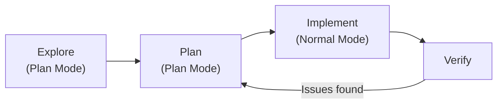

# Plan Mode: Read-Only Exploration Before Implementation

> Restrict the agent to read-only operations so it explores and proposes before it modifies anything.

Plan Mode is a permission mode in Claude Code that blocks all file writes and state-changing shell commands. The agent can read files, search code, and analyze the codebase — but cannot modify anything. This forces a separation between understanding and implementation that catches wrong approaches before they produce wrong code.

## Why It Works

Fixing a plan costs minutes. Fixing an implementation costs context, tokens, and git reverts. Plan Mode makes the agent's understanding of the task visible — if it targets the wrong files, misunderstands the architecture, or picks an approach that conflicts with existing patterns, you see that in the plan, not in a broken diff.

The mechanism is simple: read-only constraints force the agent to ask questions (via `AskUserQuestion`) and propose steps rather than execute them. You review, correct, and approve before switching to implementation.

## How to Activate

| Method | Command |
|--------|---------|
| During a session | **Shift+Tab** (cycles Normal → Auto-Accept → Plan) |
| New session | `claude --permission-mode plan` |
| Headless query | `claude --permission-mode plan -p "Analyze the auth system"` |
| Default for project | Set `"defaultMode": "plan"` in `.claude/settings.json` |

The status bar shows `⏸ plan mode on` when active.

## The Four-Phase Workflow

1. **Explore** — Agent reads the codebase and maps relevant files, functions, and dependencies
2. **Plan** — Agent proposes a step-by-step implementation approach. Press **Ctrl+G** to open the plan in your text editor for direct editing
3. **Implement** — Switch to Normal Mode. Agent executes against the reviewed plan
4. **Verify** — Run tests, review the diff, check for regressions

When a plan is accepted, Claude auto-names the session from the plan content — useful for resuming later.

## Plan Review Checklist

Before approving a plan, verify:

- [ ] Agent identified the correct files to modify
- [ ] Approach matches existing codebase patterns
- [ ] No unnecessary scope creep beyond the task
- [ ] Edge cases and error handling are addressed
- [ ] The plan accounts for tests

## Configuration

| Setting | Effect | Default |
|---------|--------|---------|
| `plansDirectory` | Where plan files are stored | `~/.claude/plans` |
| `showClearContextOnPlanAccept` | Show "clear context" option on plan accept | `false` |
| `useAutoModeDuringPlan` | Use [auto mode](../tools/claude/auto-mode.md) semantics during plan mode | `true` |

Set these in `.claude/settings.json` or via `/config`.

## When to Use vs. Skip

**Use Plan Mode for:**

- Multi-file changes where the agent needs to understand cross-file dependencies
- Unfamiliar codebases where incorrect assumptions are likely
- Tasks with multiple valid approaches where you want to choose the direction
- Refactoring where the scope needs explicit boundaries

**Skip Plan Mode for:**

- Single-file, well-defined changes ("add a null check to line 42")
- Tasks where the implementation path is obvious from context
- Quick fixes where the overhead of planning exceeds the cost of a bad attempt

## Anti-Pattern: Skipping Planning for Complex Tasks

Telling an agent "just implement it" on a multi-file feature leads to implementations that compile but miss architectural intent. The agent picks the first viable approach — which may conflict with existing patterns, miss shared utilities, or duplicate code. The cost of rework exceeds the time a 30-second plan review would have taken.

## Key Takeaways

- **Separation of understanding and implementation** — Plan Mode forces agents to explore and propose before modifying, catching wrong approaches early
- **Cost-effective error prevention** — Fixing a plan costs minutes; fixing a bad implementation costs context, tokens, and git reverts
- **Visibility into agent reasoning** — Read-only constraints make the agent's understanding of tasks explicit and reviewable
- **Context before action** — Use Plan Mode for multi-file changes, unfamiliar codebases, and complex refactoring where architectural understanding is critical

## Related

- [The Plan-First Loop](plan-first-loop.md) — The general pattern of designing before coding, independent of tool-specific features
- [Context Priming](../context-engineering/context-priming.md) — Loading relevant context before implementation; Plan Mode is one mechanism for achieving this
- [Pre-Execution Codebase Exploration](pre-execution-codebase-exploration.md) — Structured exploration of a codebase before making changes
- [Human-in-the-Loop Placement](human-in-the-loop.md) — Where to place human approval gates in agent pipelines; Plan Mode is one mechanism for inserting a review checkpoint before execution

## Sources

- [Claude Code — Common Workflows: Plan Mode](https://code.claude.com/docs/en/common-workflows#use-plan-mode-for-safe-code-analysis)
- [Claude Code — Best Practices: Explore first, then plan, then code](https://code.claude.com/docs/en/best-practices)
- [Claude Code — Settings](https://code.claude.com/docs/en/settings)
