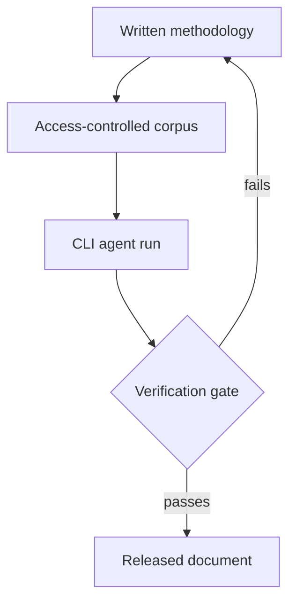

# Porting a Coding-Agent Harness Beyond Engineering

> A CLI agent harness ports to non-engineering work as instructions and context; its build-test-diff oracle does not and must be rebuilt.

A coding-agent harness splits into two halves that travel differently. The instruction layer moves to an adjacent function unchanged: version-controlled plain-text methodology, a reference corpus of prior work, and a step that shows you the change before it lands. The verification layer does not move, because build, test, and diff have no document analogue. Port the first half, then spend what you saved rebuilding the second.

## Why the second half does not travel

GitHub's legal team ran Copilot CLI against contract drafting, DMCA analysis, NDA triage, and risk scoring. The account of it reports that the core programming was plain-language files holding workflow instruction sets, policy reference material, and templates rather than code ([GitHub Blog, 2026-08-04](https://github.blog/ai-and-ml/github-copilot/how-the-github-legal-team-used-copilot-cli-to-streamline-their-workflows/)). Nothing in that description needs a compiler. One adopter states the enabling condition plainly: "If you can clearly define your methodology, your standards, and your output format, GitHub Copilot makes it easy to operationalize that knowledge."

The verification story in the same account is a person reading the output. The tool is positioned as "a structured decision-support system designed to keep human review central," and no automated check is described ([GitHub Blog, 2026-08-04](https://github.blog/ai-and-ml/github-copilot/how-the-github-legal-team-used-copilot-cli-to-streamline-their-workflows/)). That is the gap a developer inherits when they hand their harness over. A code harness can accept agent output without a human reading it because the test suite is decisive, independent of the agent, and cheap next to producing the change. [Oracle-gated delegation](oracle-gated-delegation.md) sets out those three conditions, and document work satisfies none of them by default.

Two measurements say what the missing check would have to catch. A preregistered evaluation of 202 legal research queries found retrieval-grounded commercial tools hallucinated on 17% of queries for Lexis+ AI and 33% for Westlaw AI-Assisted Research, with accuracy at 65% and 41% ([Magesh et al., arXiv:2405.20362v1](https://arxiv.org/abs/2405.20362v1)). On APEX-Agents, a 480-task benchmark written by investment banking analysts, management consultants, and corporate lawyers, the best frontier result was 24.0% pass@1 ([Vidgen et al., arXiv:2601.14242v3](https://arxiv.org/abs/2601.14242v3)).

## Three implementation layers



### Layer 1: Encode the methodology

Ask the adopting function to write down how it already decides, in the shape the agent will consume: standards, decision order, and output format. The artifact is the same one an engineering team already keeps, so start from [setting up an instruction file](../instructions/getting-started-instruction-files.md) and change only the subject matter. This is the elicitation problem covered by [encoding tacit knowledge](encoding-tacit-knowledge.md), and it fails the same way. A practitioner who can only demonstrate the judgment has nothing to put in the file.

Split the result into named steps rather than one long prompt. The legal workflow in the case study decomposed into intake, playbook alignment, risk scoring, evidence verification, escalation routing, and report assembly ([GitHub Blog, 2026-08-04](https://github.blog/ai-and-ml/github-copilot/how-the-github-legal-team-used-copilot-cli-to-streamline-their-workflows/)). Named steps give a check somewhere to attach later, which one prompt does not.

### Layer 2: Settle where the corpus lives

The value comes from prior work, not from the model. The contract tool drew on a library of completed agreements held in an approved, access-controlled internal environment, kept separate from the public repository ([GitHub Blog, 2026-08-04](https://github.blog/ai-and-ml/github-copilot/how-the-github-legal-team-used-copilot-cli-to-streamline-their-workflows/)). Decide where that corpus sits before anyone points an agent at it. A function that has never used version control will not have an answer, and the developer helping them is the one who has to supply it. Give the files one shape per discipline so the agent can join them, as [cross-functional knowledge artifacts](../frameworks/team-os/cross-functional-artifacts.md) sets out.

### Layer 3: Build the replacement gate first

Write the check before the workflow ships rather than after the first bad output. Two substitutes for a test suite are available and both fail in known ways: a fixed rubric is reproducible but rejects valid alternative approaches, while an LLM judge adapts to the response and is unstable and biased ([Lin et al., arXiv:2602.06486](https://arxiv.org/abs/2602.06486)). Where the output leaves the company, the gate stays a named person who reads it, and the workflow gets sized around that person's throughput instead of the agent's.

## Triggers and constraints

| Trigger | What bounds the agent |
|---|---|
| A practitioner runs one workflow on one document | Review before apply, and a session scoped to the corpus you chose |
| A batch run over a queue of intake items | A named reviewer per item, plus a cap on items per run |
| A scheduled or unattended run | Do not use it where a wrong answer reaches anyone outside the team; no oracle exists to catch a silent failure |

## Tool coverage

The reported implementation used GitHub Copilot CLI. Nothing in the three layers depends on which CLI agent runs them, because the portable parts are files, a corpus, and a review step rather than vendor features. Pick the agent the adopting function's colleagues already run, so the people they will ask for help know the tool.

## Why it works

The instruction layer ports because it was never code. It is a context-and-instruction system carried in version-controlled plain text, so the precondition it imposes is a methodology the practitioner can state rather than a codebase ([GitHub Blog, 2026-08-04](https://github.blog/ai-and-ml/github-copilot/how-the-github-legal-team-used-copilot-cli-to-streamline-their-workflows/)).

The verification layer fails to port because its cheapness is a property of code. A compiler and a test suite return a verdict without anyone reading the artifact, and that is what licenses delegation past your own review capacity. Remove them and the check falls back on an expert reading the document, so the cost of confirming an answer climbs toward the cost of producing one. The legal-tool evaluation describes that burden directly: the user has to "click through to cited references, read and understand the relevant sources, assess their authority, and compare them to the propositions the model seeks to support" ([Magesh et al., arXiv:2405.20362v1](https://arxiv.org/abs/2405.20362v1)).

## When this backfires

- No cheap, independent check exists on the output. Where correctness needs a domain expert to read the document end to end, verification costs about what production costs and the economics that justified the harness invert.
- The output leaves the company into a regulated or adversarial setting. A filing, a compliance response, or a customer-facing commitment carries a downside that no time saving offsets.
- The reference corpus has no access-controlled home. The corpus is where the value sits, so a repository without the controls the case study describes converts that value into an exposure path.
- The function cannot state its own methodology. The stated precondition is a defined methodology, standards, and output format; where the judgment stays tacit there is nothing to encode.
- Nobody owns the instruction files after the first enthusiast moves on. Stale guidance still runs, and an engineering team that did not write it cannot maintain it.
- You read the case study as evidence of transfer rather than as an existence proof. It is vendor-authored, covers two named adopters at the company that makes the tool, and reports one number: drafting time down "roughly in half," with no error rate. Its own DMCA project needed "a lot of code, actually" to reach a usable interface ([GitHub Blog, 2026-08-04](https://github.blog/ai-and-ml/github-copilot/how-the-github-legal-team-used-copilot-cli-to-streamline-their-workflows/)).

## Example

The two gates side by side, which is where the porting cost hides. The second is the legal triage pipeline as the case study reports it ([GitHub Blog, 2026-08-04](https://github.blog/ai-and-ml/github-copilot/how-the-github-legal-team-used-copilot-cli-to-streamline-their-workflows/)).

**Before** — the harness on code:

```text
agent edits files -> build -> test suite -> diff review -> merge
verdict from: compiler and tests, with no human read required
```

**After** — the same harness on documents:

```text
intake -> playbook alignment -> risk scoring -> evidence verification
       -> escalation routing -> report assembly -> ??? -> lawyer reads it
verdict from: a named person; the account describes no automated check
```

Six named steps and no check between them and the reader. The question marks are the work. A developer who hands over the harness without a replacement for that step has moved the review burden onto a function with no way to measure it.

## Key Takeaways

- Port the instruction layer unchanged and treat the missing oracle as the real cost of the move.
- Encode the methodology as named steps so a check has somewhere to attach; one long prompt gives you no attachment point.
- Settle the corpus location under access control before the first agent run, not after.
- Pick the replacement gate knowing both options are flawed: a fixed rubric rejects valid alternatives, an LLM judge is unstable and biased ([Lin et al., arXiv:2602.06486](https://arxiv.org/abs/2602.06486)).
- Size a document workflow around reviewer throughput wherever the output leaves the team.
- Weigh the case study against the benchmark: frontier agents cleared 24.0% of professional-services tasks written by lawyers, bankers, and consultants ([Vidgen et al., arXiv:2601.14242v3](https://arxiv.org/abs/2601.14242v3)).

## Related

- [Oracle-Gated Delegation Beyond Your Domain Expertise](oracle-gated-delegation.md) — the three conditions a check must meet before you accept output you cannot review yourself
- [Encoding Tacit Knowledge into Agent Improvement Loops](encoding-tacit-knowledge.md) — how to get a methodology out of a practitioner who applies it without articulating it
- [Rolling Out CLI Coding Agents at Organization Scale](../human/org-scale-cli-agent-rollout.md) — adoption and retention mechanics for the engineering rollout this one sits beside
- [Human-in-the-Loop Placement: Where and How to Supervise](human-in-the-loop.md) — where to put the gate once you accept that it stays a person
- [Runbooks as Agent Instructions: Agent-Followable Ops](runbooks-as-agent-instructions.md) — rewriting human procedures into steps an agent can run end to end
