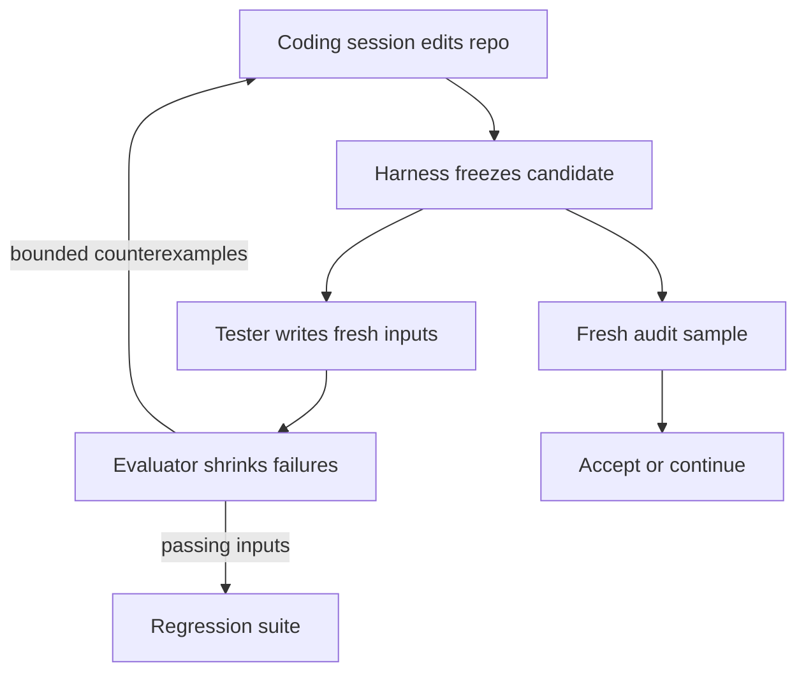

# Post-Commitment Test Generation: Draw the Sample Last

> Tests reused across repair rounds stop being evidence about the implementation they shaped, so draw the audit sample after the candidate is frozen.

Post-commitment test generation splits one testing budget into two parts that answer different questions. During development, a separate testing agent writes fresh inputs after each candidate implementation is frozen, and a trusted evaluator shrinks the failures into counterexamples the coding agent reads next round. At acceptance, the harness draws a new sample from a population fixed before development began, and that sample alone decides whether the implementation ships. The published formulation is Generative Test-Driven Development ([Kato, 2026](https://arxiv.org/abs/2610.02952v1)).

## The adaptive-candidate problem

A test suite that stays still while an agent repairs against it becomes a target. "A program may implement only the exercised cases or special-case their inputs, and an agent with broader access may attempt to change the tests" ([Kato, 2026](https://arxiv.org/abs/2610.02952v1)). The green suite then reports that the exercised cases work, which is true and is not the question anyone asked. Adding more tests does not fix this on its own, because whether a passing result is evidence depends on what the agent learned about those tests while it was being repaired. The general rule underneath is holdout discipline, which the paper carries over from adaptive data analysis, where "repeated feedback can change the validity of conclusions based on a fixed evaluation sample" ([Kato, 2026](https://arxiv.org/abs/2610.02952v1)). The sample that steers the work cannot also be the sample that judges it.

## When this applies

The acceptance half of this workflow needs three things. Without them you get the development loop and not the guarantee that motivates it.

- An oracle for inputs nobody has seen. A reference implementation supplies expected replies for a structured interface such as a parser or a key-value store. For natural-language output the paper substitutes a rubric, a model judge, or human review, and says that whether such an evaluator agrees with intended behavior is a separate question it does not settle ([Kato, 2026](https://arxiv.org/abs/2610.02952v1)).
- A population you fix before development starts. The guarantee is a finite-population statement about a listed set of cases, and the audit is a sample drawn from it.
- A round budget larger than the few rounds that fit a demo. Across all 150 trajectories in the paper's experiment, one reached a failure rate of at most 0.01 after four coding rounds, so three repair rounds leave a large residual failure rate under every policy tested ([Kato, 2026](https://arxiv.org/abs/2610.02952v1)).

The development half carries a narrower condition. It beat inputs a model wrote once from the specification. It did not beat inputs drawn from a generator matched to the target distribution, which is the comparison in [When this backfires](#when-this-backfires).

## Three implementation layers

### Layer 1: Generation after commitment

The coding session edits the repository. The harness then restores protected files and commits the candidate together with its execution configuration, and every later check runs against that snapshot. Only then does the testing agent receive the behavioral contract, the permitted history, and a trace budget, and it returns concrete inputs with no expected outputs. Whether it also gets read access to the candidate's source is a configuration choice, and in the paper's experiment that choice made no measurable difference.

### Layer 2: Reduction and bounded feedback

The evaluator runs each valid, non-duplicate input against both the reference and the candidate. For a failure it finds the shortest failing prefix, then deletes operations while preserving validity and the disagreement, verifying each shorter version before it replaces the previous one. At most a fixed number of reduced failures reach the next coding round, and every passing generated input is kept as a regression test, so a failure found once is checked for the rest of the project.

### Layer 3: Acceptance by fresh audit

Acceptance draws a new sample, sized before the draw, from the population fixed at the start. The coding agent receives the aggregate decision and nothing else: no sampled inputs, no per-requirement results. A condition may additionally require every saved regression test to pass, which can only lower the chance of accepting an inaccurate candidate.

## Why it works

The leak this ordering closes is informational. Each round of feedback tells the coding agent something about the test set that produced it, so the implementation can be shaped toward those cases. "The same feedback that guides development also allows an agent to adapt to the tested examples without satisfying the full behavioral contract" ([Kato, 2026](https://arxiv.org/abs/2610.02952v1)). The paper prices that leak by counting the possible feedback histories over a finite population. On a population of 500 cases with a tolerance of 0.05, a constructed three-region adversary passes a reused hidden set of 131 cases with probability 0.8082, while the same 131 cases drawn after the candidate is frozen accept a failing requirement family with probability at most 0.000292. The first figure allows adaptation through three rounds of feedback and comes from a worst-case candidate class that can realize any per-case loss pattern, so read it as the ceiling on what reuse costs rather than as a typical agent's odds. The second concerns a candidate fixed before sampling. Freezing first is what restores a known distribution: "fresh sampling after candidate commitment supplies an acceptance sample whose conditional distribution is known despite earlier development feedback" ([Kato, 2026](https://arxiv.org/abs/2610.02952v1)).

A weaker second effect acts during development. A frozen model-written generator runs dry as the implementation changes, surfacing 3.40 new counterexamples in round three against 5.37 and 5.77 for the two regenerating policies. "The fixed LLM inputs continue to expose failures, but they supply fewer previously unreported counterexamples as development proceeds" ([Kato, 2026](https://arxiv.org/abs/2610.02952v1)).

## Triggers and constraints

The cycle runs on commitment, not on a clock. The harness's commit of a candidate is what dispatches the testing agent, and nothing that agent produces can enter the next coding round except through the bounded counterexample channel. Two constraints hold the rest in place. The tester never sees audit samples or population results, so adversarial testing shapes development feedback and never the acceptance evidence. The harness, not either agent, owns the snapshot, the protected files, and the sample size. The workflow is tool-agnostic: it governs what each session may read and when the sample is drawn, so it reads the same in Claude Code, Copilot, or Cursor.

## When this backfires

Regenerating tests every round is the part I would not pay for first, and the paper's own numbers are why.

- You already have a distribution-matched generator. A property-based generator frozen before development, drawing from the same distribution as the evaluation set, finished at a 0.298 mean failure rate against 0.274 and 0.279 for the two regenerating policies. The gap is -0.024 with a 95% interval of [-0.097, +0.043] and p=0.534. "Neither dynamic condition has a statistically detectable advantage over Static property, which draws its inputs from the generator that produced the evaluation set and is therefore a strong baseline for this task" ([Kato, 2026](https://arxiv.org/abs/2610.02952v1)).
- Generator-writing is a per-round failure point. In the two regenerating policies, 17 and 13 of 90 generator requests supplied no valid trace, because the generator failed to run, errored, returned only invalid traces, or was truncated at the 8,000-token output cap. Regenerating every round multiplies how often you pay that ([Kato, 2026](https://arxiv.org/abs/2610.02952v1)).
- Showing the tester the candidate's source gained nothing. The source-informed and source-blind policies differed by -0.005, interval [-0.044, +0.034], p=0.810. "Source access produces no detectable additional improvement under this comparison" ([Kato, 2026](https://arxiv.org/abs/2610.02952v1)).
- More tests do not stop a repair from breaking the build. The one-shot model-written condition got worse between rounds three and four when two final repairs broke modules that had been passing, finishing at 0.405 against 0.342 for a condition with no development tests beyond the public example, so that "its final rate is not statistically distinguishable from Public only" ([Kato, 2026](https://arxiv.org/abs/2610.02952v1)). Regression gating catches that class of failure; test volume does not.
- Where there is no oracle, test volume may not move outcomes at all. Across four models on SWE-bench Verified, prompt changes that pushed agents to write more or fewer tests "do not significantly change final outcomes in this setting" ([Chen et al., 2026](https://arxiv.org/abs/2602.07900v2)).

## Example

The paper's experiment is one in-memory key-value store with 61 commands, a 2,072-word specification, and a 620-line reference implementation, run in 30 paired blocks with gpt-4.1-mini as both coder and tester. Every block starts from a shared first-round module at a 0.548 mean failure rate and gets three repair rounds against a private 2,000-trace evaluation set.

Read the result as one task and one model. The headline contrast of -0.131 (p=0.0015) between the source-informed regenerating policy and the one-shot model-written policy leans on three blocks in which the one-shot policy ended with a module failing almost every trace. The median within-block difference is -0.044 and the 10% trimmed mean -0.076. Four further conditions that equalized the trace budget produced intermediate rates with no detectable step between neighbors, so the study "does not attribute the advantage of the dynamic policies to regeneration, to the number of traces, or to the reported history alone" ([Kato, 2026](https://arxiv.org/abs/2610.02952v1)).

## Key Takeaways

- Budget the audit as a separate draw rather than a slice of the development suite. Sampling order, not test count, is what carries the guarantee: 131 cases bound false acceptance at 0.000292 when drawn after the candidate is frozen, and bound it at nothing worth stating once the same cases have been feeding repairs.
- Keep the acceptance sample out of development entirely. Once a case reaches the coding agent, it has stopped being evidence about the code it shaped.
- Save every verified failure as a regression test whether or not you regenerate. That half costs one file and no extra model calls.
- Before building a regeneration loop, try one generator whose input distribution matches production traffic. In the only published head-to-head the two were indistinguishable.

## Related

- [TDD Interaction Models: Throughput Versus Test Quality](tdd-interaction-models.md) — which half of the TDD cycle to hand the agent, and what each split costs in test quality
- [Frozen Task Sets for Affordable Agent A/B Testing](frozen-task-set-agent-ab-testing.md) — the opposite trade, where freezing the task set is correct because you are tuning the harness rather than the code
- [The Test Homogenization Trap](../patterns/anti-patterns/test-homogenization-trap.md) — why one model writing both code and tests yields a suite that shares the code's blind spots
- [Generating Tests From Agent-Written Code](../patterns/anti-patterns/code-first-test-oracle-bias.md) — the related ordering error, where tests derive from the implementation instead of the contract
- [Mutation Testing as a Quality Gate](../verification/mutation-testing-quality-gate.md) — how to tell whether the saved regression tests would notice a regression
