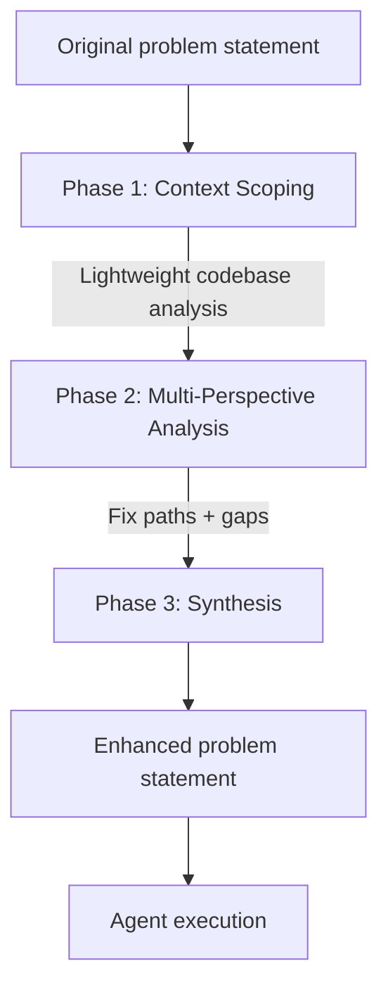

# Pre-Execution Codebase Exploration

> Invest in problem statement quality before launching an agent — a lightweight exploration phase that adds reproduction steps, expected behaviours, and targeted exploration hints improves resolution rates by 20% on SWE-bench Verified.

## The Root Cause of Agent Trajectory Failure

Agent failures on software tasks correlate strongly with underspecified problem statements. When an agent receives a vague task, it over-explores — reading hundreds of files, filling its context with low-signal tokens — or loops on the same fix attempts without evolving its approach. The failure is upstream of agent execution, not inside it. ([arXiv:2603.05744](https://arxiv.org/abs/2603.05744))

Claude Code's official best practices identify the same pattern: agents that "jump straight to coding can produce code that solves the wrong problem," and the recommended remedy is an explicit "Explore first, then plan, then code" workflow before any implementation begins. ([Claude Code best practices](https://code.claude.com/docs/en/best-practices))

## The Pre-Execution Enhancement Process

CodeScout ([arXiv:2603.05744](https://arxiv.org/abs/2603.05744)) defines a three-phase refinement layer that runs before the main agent:



**Phase 1: Context Scoping.** Targeted analysis of codebase structure and constraints — identifying relevant modules, understanding dependencies, establishing the scope of the change. The goal is lightweight: enough to inform the synthesis, not a full exploration.

**Phase 2: Multi-Perspective Analysis.** Examining potential fix paths and exploration opportunities from multiple angles. This surfaces ambiguities and identifies what reproduction steps or expected behaviours are missing from the original statement.

**Phase 3: Synthesis.** Producing an enhanced problem statement that adds reproduction steps, expected behaviours, and targeted exploration hints. The original statement is not replaced — it is augmented with what the agent would otherwise have to discover (or fail to discover) on its own.

## Implementation Modes

**Automated wrapper (pipeline mode).** CodeScout operates as a pre-execution wrapper on top of existing agent scaffolds without modifying them. The same pattern applies to any multi-agent system: add a lightweight pre-execution agent that analyzes the task and rewrites the problem statement before passing it to the main agent. ([arXiv:2603.05744](https://arxiv.org/abs/2603.05744))

[Harness engineering](../agent-design/harness-engineering.md) describes an equivalent pattern: an initializer agent creates a progress file and expands the original directive into granular, testable feature specs before any coding agents execute. ([Anthropic: Effective Harnesses](https://www.anthropic.com/engineering/effective-harnesses-for-long-running-agents))

**Initializer agent for multi-session work.** For long-running tasks, the initializer agent writes an expanded feature spec to a persistent progress file. Each downstream agent reads this file rather than re-expanding the original directive. The expansion cost is paid once. ([Anthropic: Effective Harnesses](https://www.anthropic.com/engineering/effective-harnesses-for-long-running-agents))

**Developer-driven exploration (interactive mode).** Claude Code's [Plan Mode](plan-mode.md) enforces the same principle interactively: a read-only exploration phase surfaces the agent's understanding before any changes are made. The agent reads the codebase, asks clarifying questions, and produces a plan — you review the plan before execution begins. ([Claude Code best practices](https://code.claude.com/docs/en/best-practices))

The "let Claude interview you" pattern extends this: a minimal prompt triggers the agent to interview you using structured questions, then synthesize findings into a spec file before a clean implementation session begins. ([Claude Code best practices](https://code.claude.com/docs/en/best-practices))

**CLAUDE.md as persistent pre-loading.** Codified codebase knowledge in CLAUDE.md pre-loads context for every session without requiring per-task manual expansion. This is the persistent equivalent: invest once in codebase documentation, amortize the benefit across every agent invocation. ([Anthropic: Effective Context Engineering](https://www.anthropic.com/engineering/effective-context-engineering-for-ai-agents))

## What to Add to the Problem Statement

Before you launch an agent on a task, add:

- **Reproduction steps** — the exact sequence that demonstrates the current broken behaviour
- **Expected behaviours** — what correct behaviour looks like, not just what the bug is
- **Targeted exploration hints** — specific files, modules, or functions the agent should examine first

These three additions convert an underspecified task into an actionable spec.

## Results

On SWE-bench Verified, CodeScout achieves a 20% improvement in resolution rates and resolves 27 additional issues compared to baseline. The gain comes from better task framing, not improved agent capability. ([arXiv:2603.05744](https://arxiv.org/abs/2603.05744))

## When This Backfires

The 20% headline figure is an average. Pre-execution enhancement is not universally beneficial, and three failure modes surface in practice:

- **Hint-induced anchoring.** Exploration hints that point at the wrong file or function anchor the agent on an incorrect location. The CodeScout paper acknowledges it "may omit code segments that are important for understanding or resolving an issue but do not require direct modification" — the augmented statement narrows the search and can hide the real fix site. ([arXiv:2603.05744](https://arxiv.org/abs/2603.05744))
- **Diminishing returns with strong runtime agents.** Pairing a weaker augmenter with a stronger agent yields marginal gains — in the CodeScout evaluation, a weak-augmenter + GPT-5-mini combination produced only ~1.0% improvement. The enhancement cost does not amortize when the runtime model is already capable of self-orientation. ([arXiv:2603.05744](https://arxiv.org/abs/2603.05744))
- **Stale or context-mismatched guidance.** Pre-specified exploration hints or skill files that conflict with current project context actively degrade performance. SWE-Skills-Bench found that skills with version-mismatched guidance reduce resolution rates by up to 10% compared to a no-skill baseline. Enhanced problem statements inherit this failure mode when the hints were drafted against an older repository state. ([arXiv:2603.15401](https://arxiv.org/abs/2603.15401))

Use pre-execution enhancement when the underlying task is genuinely underspecified and the augmenter has current repository context. Skip it for trivial changes, for runs on frontier-class models that already orient quickly, and when the hints cannot be kept in sync with the code.

## Example

The two prompts below show a vague task that causes over-exploration versus an enhanced version that adds the three elements the page identifies: reproduction steps, expected behaviour, and exploration hints.

**Vague task — likely to cause over-exploration or looping**

```
Fix the checkout bug.
```

**Enhanced task — produced by a pre-execution agent before the main agent runs**

```
Fix the bug where applying a 100%-off coupon code at checkout raises an
`AttributeError: 'NoneType' object has no attribute 'amount'` in production.

Reproduction steps:
1. Add any item to the cart (e.g. SKU `WIDGET-42`)
2. Proceed to checkout
3. Enter coupon code `FREESHIP100` in the discount field
4. Click "Apply" — the error appears before the order total updates

Expected behaviour:
- Coupon applies successfully; order total updates to $0.00
- No exception is raised; the checkout flow continues to payment

Exploration hints:
- Start with `src/checkout/discount.py` — the `apply_coupon` function is the most likely site
- The `Coupon` model in `src/models/coupon.py` has a nullable `amount` field; check how None is handled
- Relevant tests: `tests/checkout/test_discount.py`
```

The enhanced version lets the agent go directly to `apply_coupon` and `Coupon.amount` rather than reading the entire checkout module. The pre-execution pass pays a small exploration cost once; the main agent's context window is spent on implementation, not discovery.

## Key Takeaways

- Underspecified problem statements are a primary cause of agent failure — agents over-explore or loop without evolution.
- A pre-execution phase adds reproduction steps, expected behaviours, and exploration hints before agent execution begins.
- The same principle applies in three modes: automated wrapper, interactive Plan Mode, and persistent CLAUDE.md documentation.
- Pre-execution enhancement operates on top of existing agent scaffolds — no modification to the main agent is required.
- 20% improvement in resolution rates on SWE-bench Verified; the gain is from [task framing](../fallacies/task-framing-irrelevance-fallacy.md) quality, not agent capability.

## Related

- [The Plan-First Loop: Design Before Code](plan-first-loop.md)
- [The Research-Plan-Implement Pattern](research-plan-implement.md)
- [Spec-Driven Development with Spec Kit](spec-driven-development.md)
- [Agent-Powered Codebase Q&A and Onboarding Workflow](codebase-qa-onboarding.md)
- [Context Priming](../context-engineering/context-priming.md)
- [Session Initialization Ritual](../agent-design/session-initialization-ritual.md)
- [Feature List Files](../instructions/feature-list-files.md)
- [Agent Memory Patterns: Learning Across Conversations](../agent-design/agent-memory-patterns.md)
