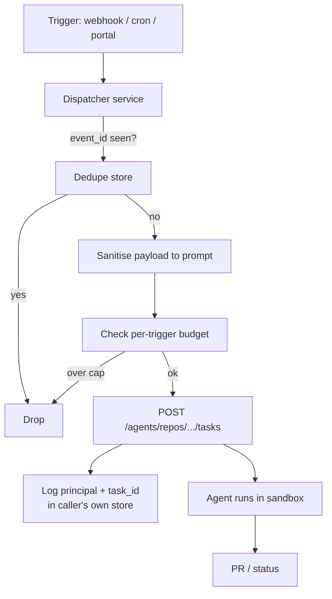

# Programmatic Cloud-Agent Dispatch via REST API and Webhooks

> Dispatching coding agents from REST, webhooks, or cron is safe only when the caller adds dedupe, payload sanitisation, budget caps, and principal logging itself.

Programmatic cloud-agent dispatch is the third invocation principal after the IDE and chat surfaces: any system that can issue an authenticated POST can hand work to a coding agent. GitHub's May 2026 Agent tasks REST API exposes the same control plane the IDE and chat paths use internally, opening the door to cron-triggered release notes, webhook-driven refactors, and internal-portal automation. The plumbing is shipped; the discipline is the caller's problem.

## Preconditions

Adopt this pattern only when all four conditions hold. If any one is missing, stay on a human-mediated surface (IDE, chat `@mention`, issue assignment).

| Condition | Why it is load-bearing |
|-----------|----------------------|
| Caller-side dedupe store keyed by event ID | The API ships no idempotency parameter. Webhook retries and overlapping cron runs each create a new task. ([GitHub Docs](https://docs.github.com/en/copilot/how-tos/use-copilot-agents/cloud-agent/use-cloud-agent-via-the-api), [Svix](https://www.svix.com/resources/webhook-university/reliability/idempotency-and-deduplication/)) |
| Payload-to-prompt sanitisation | Untrusted fields (issue title, commit message, comment body) flow into the prompt; OWASP LLM01 treats agents without humans as widened injection surface. ([OWASP](https://genai.owasp.org/llmrisk/llm01-prompt-injection/)) |
| Per-trigger token budget cap | From 2026-06-01 each task burns AI Credits at published API token rates; a fast-failing loop drains the team allotment. ([GitHub Blog](https://github.blog/news-insights/company-news/github-copilot-is-moving-to-usage-based-billing/)) |
| Out-of-band principal log | The API requires user-to-server tokens; GitHub's audit log attributes every task to the PAT owner regardless of which cron or workflow actually triggered it. ([GitHub Docs](https://docs.github.com/en/copilot/how-tos/use-copilot-agents/cloud-agent/use-cloud-agent-via-the-api)) |

## The Surface

The dispatch endpoint is `POST /agents/repos/{owner}/{repo}/tasks`. The only required body parameter is `prompt`; optional fields are `base_ref`, `model`, and `create_pull_request`. Listing uses `GET /agents/repos/{owner}/{repo}/tasks` (per repo) or `GET /agents/tasks` (across all repos the caller can see). Status is `GET /agents/repos/{owner}/{repo}/tasks/{task-id}`, returning a `state` of `queued`, `in_progress`, `completed`, `failed`, `idle`, `waiting_for_user`, `timed_out`, or `cancelled`. ([GitHub Docs: Using Copilot cloud agent via the API](https://docs.github.com/en/copilot/how-tos/use-copilot-agents/cloud-agent/use-cloud-agent-via-the-api))

Authentication is constrained to user-to-server tokens: a personal access token, an OAuth app token, or a GitHub App user-to-server token. "Server-to-server tokens, such as GitHub App installation access tokens, are not supported." ([GitHub Docs](https://docs.github.com/en/copilot/how-tos/use-copilot-agents/cloud-agent/use-cloud-agent-via-the-api)) That single sentence determines the principal model: a service identity cannot dispatch today; some human's token must.

The API is in public preview as of 2026-05-13 and limited to Copilot Business and Enterprise. Documented use cases: "Fan out refactors or migrations across many repositories from a simple script; Set up new repositories in one click from your company's internal developer portal; Automatically prepare a new release each week, including release notes." ([GitHub Changelog: Start Copilot cloud agent tasks via the REST API](https://github.blog/changelog/2026-05-13-start-copilot-cloud-agent-tasks-via-the-rest-api/))



## Why It Works

The mechanism is plumbing. The IDE, chat, and issue-assignment paths each terminated in an internal call equivalent to `POST /agents/repos/.../tasks`; exposing that endpoint to direct callers removes the human-typing step from the dispatch path. That cuts coordination latency for cases the changelog cites — "automatically prepare a new release each week, including release notes" — because no human has to sit in front of the IDE on Friday afternoon. ([GitHub Changelog](https://github.blog/changelog/2026-05-13-start-copilot-cloud-agent-tasks-via-the-rest-api/))

The cost of removing the human is that the human was doing four jobs implicitly: deduplicating (a human does not click "run" twice by accident), validating input (a human notices when an issue title contains adversarial text), bounding cost (typing speed caps requests per minute), and providing audit attribution (the human's name in the action log matches the human who triggered the action). Each of those four jobs must now be done by the caller. The OWASP LLM01:2025 guidance is explicit: "The LLM Top 10 assumes a human in the loop … In contrast, agents often operate with no human checking each step. The attack surface becomes every tool call, every memory read or write, every agent handoff." ([OWASP Gen AI Security: LLM01:2025](https://genai.owasp.org/llmrisk/llm01-prompt-injection/)) The pattern is the discipline of replacing those four implicit jobs with explicit ones.

## When This Backfires

| Failure | Concrete shape |
|---------|--------------|
| Webhook retry storm | Provider retries on missing 2xx; without a dedupe store keyed by event ID, one push event delivered three times spawns three identical refactor tasks. Industry-standard fix is a SETNX/unique-insert keyed by event ID with TTL exceeding the provider's retry window. ([Svix](https://www.svix.com/resources/webhook-university/reliability/idempotency-and-deduplication/), [Hookdeck](https://hookdeck.com/webhooks/guides/implement-webhook-idempotency)) |
| Untrusted payload reaches the prompt | An attacker who can edit an issue title or commit message plants instructions that flow into the agent when the trigger reads `payload.issue.title` directly. The classic indirect-injection case OWASP covers. ([OWASP](https://genai.owasp.org/llmrisk/llm01-prompt-injection/)) |
| Token-shaped runaway cost | Post-2026-06-01, AI Credits are "consumed based on token usage, including input, output, and cached tokens." A cron job that retriggers on failure can burn the team's monthly allotment in hours without a per-trigger cap. ([GitHub Blog: usage-based billing](https://github.blog/news-insights/company-news/github-copilot-is-moving-to-usage-based-billing/)) |
| PAT rotation breaks the pipeline silently | User-to-server only. The dispatcher must hold a long-lived PAT; rotation or expiry stops every scheduled job until someone notices. Storing the PAT in plaintext leaks every task the dispatcher was authorised to start. |
| Wrong audit attribution | GitHub records the PAT owner as initiator regardless of which cron or workflow triggered the call. Compliance teams cannot distinguish "Alice clicked merge" from "Alice's PAT was used by release-cron at 03:00." Solvable only by logging the originating principal in the dispatcher's own store. |
| Fan-out without concurrency limit | "An autonomous agent completing one task might chain 10 to 50 API calls in seconds … a fixed-window limit either blocks the burst and breaks the workflow, or sets the ceiling high enough to allow it and leaves the API exposed during sustained abuse." Token-shaped budgets and explicit concurrency caps are required. ([Zuplo](https://zuplo.com/blog/rate-limit-ai-agents-beyond-request-counts)) |

## Example

A weekly release-notes job — the use case the changelog calls out — dispatched correctly:

```python
# trigger: cron 0 4 * * 5 (Fridays 04:00)
event_id = f"release-notes:{repo}:{iso_week()}"
if dedupe_store.setnx(event_id, ttl=7*86400) is False:
    return  # already dispatched this week

# sanitise: drop everything except the trusted, fixed prompt template
prompt = "Prepare release notes for the most recent tag. "\
         "List user-facing changes only. Open a draft PR."

# budget gate: hard cap per trigger source
if budget.tokens_consumed_this_month("release-notes-cron") > 200_000:
    alert.fire("release-notes budget exhausted"); return

resp = http.post(
    f"https://api.github.com/agents/repos/{owner}/{repo}/tasks",
    headers={"Authorization": f"Bearer {pat}",
             "Accept": "application/vnd.github+json",
             "X-GitHub-Api-Version": "2026-03-10"},
    json={"prompt": prompt, "base_ref": "main", "create_pull_request": True},
)
task_id = resp.json()["id"]

# out-of-band principal log: which cron, which PAT owner, which task
principal_log.write({"trigger": "release-notes-cron",
                     "pat_owner": pat_owner_login,
                     "task_id": task_id,
                     "dispatched_at": now()})
```

The fixed prompt and explicit `event_id` close two failure modes at once: no payload field can reach the prompt, and a duplicate cron firing within seven days is dropped at the dedupe boundary. The principal log keeps the answer to "what triggered this task" outside GitHub's audit trail, which records only the PAT owner.

## Comparison to Other Invocation Principals

| Principal | Entry point | Implicit safeguards | Loses when bypassed |
|-----------|-------------|--------------------|--------------------|
| IDE | Developer types in editor | Human review of context, typing-speed rate-limit | Coordination latency |
| Chat | `@mention` in Slack/Teams ([Chat-Platform Agent Delegation](chat-platform-agent-delegation.md)) | Channel visibility, human-in-thread | Concentrates trifecta on chat principal |
| Issue assignment | Assign issue to agent ([Issue-to-PR Delegation Pipeline](issue-to-pr-delegation-pipeline.md)) | Human writes issue body, repo-scoped | Issue title injection if untrusted authors |
| REST / webhook / cron | `POST /agents/repos/.../tasks` | None — caller owns all four | All four implicit safeguards |

## Key Takeaways

- The Agent tasks REST API ships the dispatch primitive; safety is caller-side responsibility.
- Required disciplines: dedupe by event ID, sanitise payload-to-prompt, cap tokens per trigger, log the originating principal out of band.
- Auth is user-to-server only — a service identity cannot dispatch today; some human's PAT must, and the audit log will attribute every task to them.
- Billing shifts to token-shaped AI Credits on 2026-06-01; per-trigger caps must move from request-count to token-count to remain meaningful.
- Public preview, Business and Enterprise only — expect the auth model and parameter set to change before GA.

## Related

- [Chat-Platform Agent Delegation](chat-platform-agent-delegation.md) — The chat invocation principal — `@mention` in Slack or Teams with a human in the thread.
- [Issue-to-PR Delegation Pipeline](issue-to-pr-delegation-pipeline.md) — The issue invocation principal — assigning a GitHub issue to an agent and receiving a draft PR.
- [Issue-Tracker Agent Dispatch Surface](issue-tracker-agent-dispatch-surface.md) — The fourth invocation surface — GitHub Issues, Jira, and Linear as the agent control plane.
- [Multi-Repo and No-Repo Automation Templates](multi-repo-no-repo-automation-templates.md) — Caller-side fan-out built on this single-repo dispatch primitive; reuses the dedupe and sanitisation discipline across attached-repo sets.
- [Cloud-Local Agent Handoff](cloud-local-agent-handoff.md) — Moving work between a cloud sandbox and a local clone after the agent finishes.
- [Continuous Autonomous Task Loop](continuous-autonomous-task-loop.md) — Self-directed agent loop that selects, executes, and iterates without external dispatch.
- [Agent Commit Attribution: Signed Commits and Agent Identity](agent-commit-attribution.md) — How to keep the principal trail visible in git history after the agent commits.
- [GitHub Copilot Cloud Agent](../tools/copilot/coding-agent.md) — The cloud-agent surface this dispatch pattern targets when delegating to Copilot.
