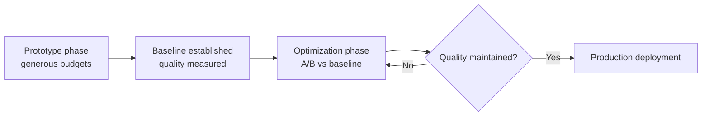

<!-- source: nibzard/awesome-agentic-patterns (Apache 2.0, https://github.com/nibzard/awesome-agentic-patterns) — retain attribution per license -->
---
title: "Prototype Before Optimizing: Establish Quality Baselines Before Token Constraints"
description: "Deferring token cost constraints until after establishing quality baselines avoids locking in suboptimal architectures and ensures optimization targets something measurable."
tags:
  - workflows
  - context-engineering
  - cost-performance
  - tool-agnostic
aliases:
  - no-token-limit magic
  - baseline-first optimization
---

# Prototype Before Optimizing

> Deferring production efficiency constraints until after establishing quality baselines avoids locking in suboptimal architectures — and ensures you have something to regress against.

## The Problem with Early Optimization

Teams often apply token budgets and prompt compression at the start of development, before understanding what high-quality behavior requires. The compressed workflow may look faster while silently degrading quality — there is no baseline to detect the regression.

The [nibzard/awesome-agentic-patterns catalog](https://github.com/nibzard/awesome-agentic-patterns/blob/main/patterns/no-token-limit-magic.md) identifies the root cause: "Teams often optimize token spend too early, forcing prompts and context windows into tight constraints before they understand what high-quality behavior looks like." This hides failure modes and can entrench architectures that only appear functional under constrained conditions.

See also: [Token Preservation Backfire](../anti-patterns/token-preservation-backfire.md) — the failure mode where efficiency instructions create a competing objective that overrides the agent's actual task.

## The Temporal Dimension

Existing budget allocation patterns address structure: what to load and how much reasoning to allocate per phase. This pattern adds a temporal dimension: *when in the development lifecycle* to apply optimization pressure.

Two separate stages with a hard gate between them:

| Phase | Goal | Budget constraint |
|-------|------|------------------|
| Prototype | Discover what quality looks like | Minimal — remove limits that hide failure modes |
| Production | Deliver quality efficiently | Enforce — but only against a measured baseline |

## How to Prototype Without Hiding Failure Modes

During prototyping, the objective is *learning*, not efficiency. Constraints that make the workflow look fast before failure modes surface create false confidence.

**Remove hard token ceilings per call.** Let reasoning run until the model is done, not until a budget is exhausted. If the model hits a limit and produces a truncated result, you learn nothing about the actual failure boundary.

**Enable multiple reasoning passes.** Self-consistency and self-reflection loops enhance reasoning quality but require generous budgets. [Compressing these before understanding them removes the signal that reveals where the workflow actually breaks](https://github.com/nibzard/awesome-agentic-patterns/blob/main/patterns/no-token-limit-magic.md).

**Set temporary spending ceilings per experiment, not per call.** Bound the total cost of a discovery run, not individual responses within it. This caps expenditure without distorting individual outputs.

**Track quality and token consumption together from the start.** Without parallel measurement, you have no basis for the optimization phase.

### What "Generous" Does Not Mean

Unlimited budgets in all phases is not the goal. LangChain's deep agent research found that continuous maximum reasoning compute across all phases scored *lower* (53.9% completion) than structured allocation (66.5%) due to agent timeouts — the model was spending resources on reasoning that didn't improve execution steps ([LangChain: harness engineering for deep agents](https://blog.langchain.com/improving-deep-agents-with-harness-engineering/)).

"Generous" means: don't apply constraints that prevent failure modes from surfacing. It does not mean maximum compute everywhere regardless of phase.

## The Optimization Gate

The shift from prototype to optimization requires a baseline — a documented, reproducible quality measurement. Without it, you cannot distinguish compression that degrades quality from compression that is safe.

The optimization phase runs as A/B comparison:

1. **Define your eval suite** — tasks representative of real production use
2. **Record baseline metrics** — quality scores, completion rates, error rates under unconstrained conditions
3. **Apply one optimization at a time** — token budget reduction, prompt compression, or context pruning
4. **Compare against baseline** — if quality metrics fall below threshold, the optimization is unsafe

[Evaluation-Driven Development for Agent Tools](eval-driven-tool-development.md) covers the prototype-evaluate-analyze-iterate loop that makes this systematic.

## Trade-offs

| | Prototype-first | Optimize-first |
|--|----------------|---------------|
| Upfront cost | Higher inference spend | Lower immediate spend |
| Risk | Budget overrun during discovery | Locking in suboptimal architecture |
| Baseline for regression testing | Established | Absent |
| Failure mode visibility | High — limits don't mask errors | Low — compression hides degradation |

The trade-off is real: higher upfront inference cost for faster baseline discovery and fewer premature architectural choices. Teams on tight budgets can bound total experiment cost per discovery run while keeping per-call limits off.

## Key Takeaways

- Apply token constraints after establishing a quality baseline, not before — you need something to regress against
- During prototyping, remove limits that prevent failure modes from surfacing; set spending ceilings per experiment, not per call
- The optimization phase is an A/B comparison against the baseline, one change at a time
- "Generous budget" means unconstrained per-call limits during discovery, not maximum compute everywhere — continuous maximum reasoning can degrade completion rates due to timeouts
- Track quality and token consumption together from the start; without parallel measurement, optimization targets nothing

## Related

- [Context Budget Allocation: Every Token Has a Cost](../context-engineering/context-budget-allocation.md) — structural allocation: what to load and how much
- [Reasoning Budget Allocation: The Reasoning Sandwich](../agent-design/reasoning-budget-allocation.md) — phase-level allocation: max compute for planning/verification, reduced for execution
- [Evaluation-Driven Development for Agent Tools](eval-driven-tool-development.md) — prototype-evaluate-analyze-iterate loop
- [Eval-Driven Development: Write Evals Before Building Agent Features](eval-driven-development.md) — defining success criteria before building
- [Token Preservation Backfire](../anti-patterns/token-preservation-backfire.md) — the failure mode when efficiency instructions override task completion
- [The Velocity-Quality Asymmetry](velocity-quality-asymmetry.md) — why compounding quality debt reverses velocity gains
- [Prompt Compression: Maximizing Signal Per Token](../context-engineering/prompt-compression.md) — how to compress safely once a baseline exists
