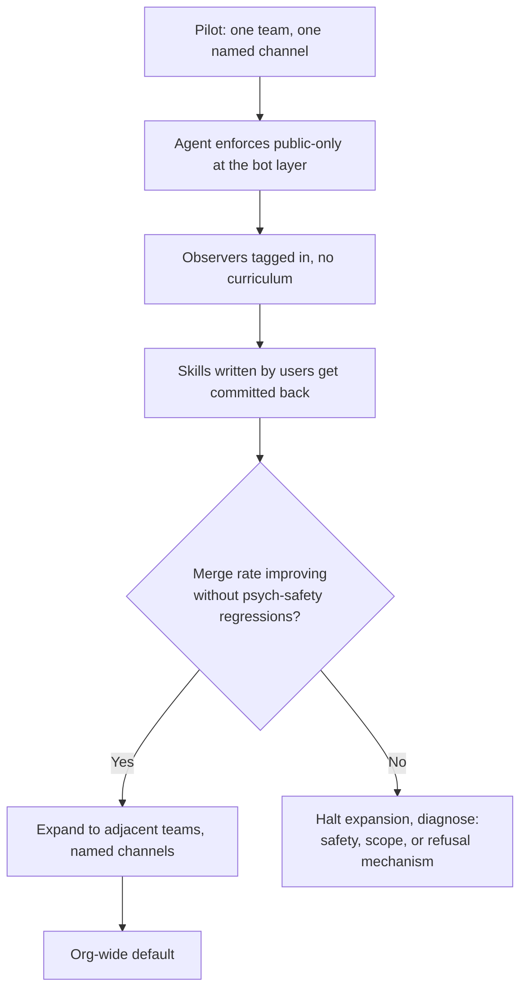

# Public-Channel Agent Work as Lehrwerkstatt

> Force agent conversations into public channels so the team learns from every transcript: high-yield given psychological safety and a sensitive-data-free scope, a surveillance trap otherwise.

## The Mechanism

Default-private agent interactions — IDE chat, terminal sessions, agent DMs — concentrate learning on the prompter. The transcript is thrown away when the session closes; no one else watches a senior engineer scope a request, react to a failed plan, or refine a skill. Knowledge of *how to prompt this particular agent against this particular codebase* stays tacit.

Forcing agent work into public channels makes the conversation a searchable artifact. The same transcript that solves one person's problem becomes the example by which the next N people learn to do the same thing without asking. Tobi Lütke calls the resulting environment a **Lehrwerkstatt** — a teaching workshop. "The whole shop floor is the classroom. You learn by being near the work." ([Simon Willison, *Learning on the Shop Floor*, 11 May 2026](https://simonwillison.net/2026/May/11/learning-on-the-shop-floor/))

Two reinforcing loops drive the gain:

- **Observational learning** — observers who never type still see how senior people scope requests, correct mid-run drift, and react to a failed plan. A support engineer watches a backend engineer get the agent to construct the right log query, then applies the same technique the next day ([ZenML LLMOps Database — Shopify River](https://www.zenml.io/llmops-database/building-a-public-ai-agent-workspace-for-organizational-learning)).
- **Knowledge externalization** — every transcript is searchable. The next person with the same question does not have to ask it; they find it. New hires scroll existing channels to see how requests are scoped before sending their first one ([ZenML LLMOps Database](https://www.zenml.io/llmops-database/building-a-public-ai-agent-workspace-for-organizational-learning)).

## Evidence at Scale

Shopify designed its internal coding agent River with a hard constraint: River declines direct messages and asks the user to create a public Slack channel to begin work. Lütke's own channel `#tobi-working-with-river` has over 100 observers who "react to threads, add color and add context, pick up the torch, help with the reviews, remind me how rusty I am, and importantly, learn from watching" ([Simon Willison](https://simonwillison.net/2026/May/11/learning-on-the-shop-floor/)).

The deployment is not a pilot. In a single 30-day window 5,938 Shopify employees engaged with River across 4,450 public channels, and River authored approximately 1 in 8 merged pull requests in the main monorepo ([ZenML LLMOps Database](https://www.zenml.io/llmops-database/building-a-public-ai-agent-workspace-for-organizational-learning)). The merge rate improved from **36% to 77% over two months** — Shopify attributes the gain not to model swaps but to organizational learning: people watching River work, identifying where it got stuck, and writing the skills and instructions it should have had. A skill written by one team teaching River about the checkout data warehouse was reused by twelve other teams ([ZenML LLMOps Database](https://www.zenml.io/llmops-database/building-a-public-ai-agent-workspace-for-organizational-learning)).

The mechanism is not specific to AI. GitLab's TeamOps handbook documents the same dynamic for human collaboration: "the most effective way to get help is through public channels rather than private ones," with public-by-default treated as the operational norm ([GitLab Handbook — Shared Reality](https://handbook.gitlab.com/teamops/shared-reality/)). Simon Willison draws a third parallel: Midjourney spent its first years with its primary interface as public Discord channels, and credits that forced visibility with the platform's prompt-pattern flywheel ([Simon Willison](https://simonwillison.net/2026/May/11/learning-on-the-shop-floor/)).

## Preconditions

The pattern only works inside a specific operating envelope. Outside it, public-only inverts into a surveillance dynamic.

| Precondition | What it means in practice |
|---|---|
| **Psychological safety** | Asking a basic question, or being seen struggling with the agent, must not carry a career penalty. Without this, engineers reroute work to DMs and undocumented terminals. |
| **Bounded data scope** | The channel topic must exclude customer records, secrets, PHI, and unreleased commercial details. Agents that need that data run in scoped or private channels. |
| **A constant-learner norm** | Lütke names "being a constant learner" as a Shopify core value ([Simon Willison](https://simonwillison.net/2026/May/11/learning-on-the-shop-floor/)); the pattern depends on observers feeling licensed to drop into a stranger's channel and learn. |
| **The agent itself enforces the policy** | River refuses DMs at the agent layer. A documented norm without a refusal mechanism collapses back to private channels within weeks. |

## When the Pattern Backfires

The Away luggage company outlawed private channels and discouraged DMs in pursuit of transparency; the policy is widely reported as having produced a culture of surveillance and intimidation instead, with one episode involving employees fired over comments in the one private channel that did exist ([Forge — At Steph Korey's Away, Banning Private Slack Chats Created a Toxic Culture](https://forge.medium.com/in-a-healthy-company-culture-its-ok-to-vent-in-private-90352200eab)). The lesson is not "do not do public-by-default"; it is "public-by-default without psychological safety becomes the worst version of itself."

Concrete failure conditions to screen for before adopting the pattern:

- **Low psychological safety** — engineers stop asking the questions that produce the best agent outputs because the cost of being seen failing exceeds the cost of failing alone.
- **Regulated or sensitive data** — customer records, secrets, PHI, or live incident details cannot be broadcast to the whole company; default-public inverts the appropriate disclosure scope.
- **Small teams (<10 engineers)** — the diffusion benefit comes from non-participating observers; below ten engineers every conversation already has a known audience and the ceremony adds cost without gain.
- **Active incident response** — incident channels are not the place to experiment publicly with an agent; the pattern's noise floor competes with signal at the worst possible moment.
- **Public question channels go dead under status pressure** — without active norm-setting, even nominally public channels collapse: people prefer to ping experts privately ([Question Base — Slack Knowledge Sharing](https://www.questionbase.com/resources/blog/team/slack-knowledge-sharing-building-trust-scale)).
- **AI-assisted leadership scanning of the same transcripts** — public channels that hold agent work become high-value corpora for executive-level AI summarization tools. Marc Benioff has described using Slack's AI to scan companywide public channels for employee complaints, and AI Now Institute's Amba Kak warns that the practice "results in a chilling effect on what people are saying in the workplace," with the FTC, DOJ, and EEOC each flagging concerns ([Entrepreneur — *Salesforce CEO Marc Benioff Uses AI to Monitor Employee Complaints*, May 2026](https://www.entrepreneur.com/business-news/salesforce-ceo-marc-benioff-uses-ai-to-monitor-employee-conversations)). The Lehrwerkstatt benefit depends on engineers risking visible failure; pair the public-only policy with an explicit no-leadership-scanning commitment, or the second-order surveillance dynamic will collapse the first-order learning loop.

## Rollout Sequence

The order matters. The pattern fails open if the agent does not refuse DMs at the bot layer — every conversation routes back to private the moment friction appears. It also fails if expansion happens before the skill-contribution loop is visible: without observers contributing skills back, the pattern is surveillance with extra steps.

## Relation to Visible Thinking

This is the social-layer analogue of [Visible Thinking in AI-Assisted Development](../human/visible-thinking-ai-development.md). That page is about making the *artifact* — commit, PR, branch name — carry the reasoning trail. Public-channel agent work makes the *in-progress conversation* carry the reasoning trail. Both reduce the cost of catching up on someone else's work without asking them; the conversation version adds the bandwidth of watching live.

This is distinct from [Chat-Platform Agent Delegation](chat-platform-agent-delegation.md). That page covers the delegation *surface* — invoking an agent by `@mention` from a chat platform instead of from the IDE. The Lehrwerkstatt pattern is the *visibility policy* layered on top: once the agent runs in chat, force the conversation to a channel everyone can read.

It is also adjacent to [Encoding Tacit Knowledge into Agent Improvement Loops](encoding-tacit-knowledge.md) — public observation is one mechanism by which the prompting expertise of senior practitioners diffuses into shared skills without an explicit elicitation step.

## Example

Shopify's `#tobi-working-with-river` channel illustrates the pattern at its most extreme: a CEO works on agent-mediated tasks in a channel with over 100 observers who add context, pick up review, and learn by watching. The agent enforces the policy — River "does not respond to direct messages. She politely declines and suggests to create a public channel for you and her to start working in" ([Simon Willison quoting Lütke](https://simonwillison.net/2026/May/11/learning-on-the-shop-floor/)). The measurable effect is the 36%→77% merge-rate gain over two months, attributable to crowdsourced skill refinement rather than model upgrades ([ZenML LLMOps Database](https://www.zenml.io/llmops-database/building-a-public-ai-agent-workspace-for-organizational-learning)).

The minimum viable form for a smaller team: one named channel per agent-using practitioner (e.g., `#alex-with-claude`), the agent configured to refuse DMs with a polite redirect, no curriculum and no required participation. The pattern's value is in the option to observe, not in mandated viewing.

## Key Takeaways

- Public-channel agent work converts every transcript into searchable training material for human observers — the Lehrwerkstatt mechanism.
- The Shopify River deployment provides quantitative support: 5,938 users, 4,450 channels, and a 36%→77% merge-rate gain in two months attributed to organizational learning rather than model swaps.
- The pattern requires psychological safety, bounded data scope, and bot-layer enforcement of the public-only policy; without any one of these it inverts into surveillance.
- Below ~10 engineers the diffusion benefit is too small to justify the ceremony — pick a different mechanism.
- This is the social-layer analogue of visible thinking and a layer on top of chat-platform agent delegation, not a substitute for either.

## Related

- [Visible Thinking in AI-Assisted Development](../human/visible-thinking-ai-development.md) — making artifacts carry the reasoning trail; public-channel work makes the live conversation do the same
- [Chat-Platform Agent Delegation](chat-platform-agent-delegation.md) — the delegation surface this pattern layers a visibility policy on top of
- [Encoding Tacit Knowledge into Agent Improvement Loops](encoding-tacit-knowledge.md) — public observation as a diffusion mechanism for prompting expertise
- [Team Onboarding for Agent Workflows](team-onboarding.md) — onboarding context for adopting the pattern at team scale
