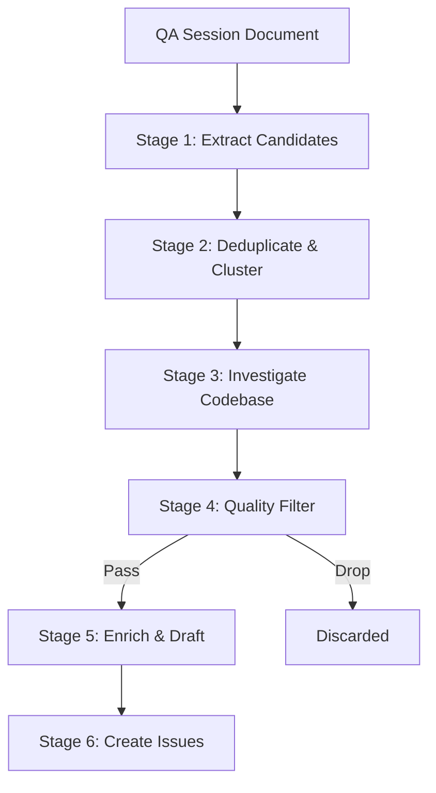

# QA Session to Issues Pipeline

> A multi-stage agent pipeline that transforms raw QA session documents into investigated, context-rich GitHub issues — reducing post-QA triage overhead by automating deduplication, codebase investigation, and quality filtering.

This pipeline starts where [continuous triage](continuous-triage.md) does not: before issues exist. It takes unstructured QA session output — notes, recordings, bug reports — and produces a smaller set of well-formed, codebase-anchored issues ready for human review.

## What the Pipeline Produces

Without investigation, the pipeline just reformats raw notes. The codebase investigation stage is the discriminating filter — each candidate issue gains relevant files, recent commits, and reproduction signals before the quality filter runs. This is what separates the output from a simple reformatting pass.

The GitHub Security Lab's Taskflow Agent demonstrated the practical benefit at scale: from 1,003 pipeline suggestions, 79% were filtered before human review, leaving 21% confirmed as real findings ([GitHub Security Lab](https://github.blog/security/ai-supported-vulnerability-triage-with-the-github-security-lab-taskflow-agent/)).

## Pipeline Stages



### Stage 1: Extract Candidates

Parse the QA session document and extract discrete candidate issues — each with a description, reproduction context, and severity signal. The prompt emphasizes breadth: capture every distinct item without auditing.

Output: a structured list of candidates with no filtering applied.

### Stage 2: Deduplicate and Cluster

Group related candidates (same component, same symptom) into clusters. Duplicates are merged; clusters elect a single representative. This stage runs before codebase investigation to avoid wasting tokens on redundant lookups.

Output: a deduplicated candidate list with cluster membership noted.

### Stage 3: Investigate Codebase

For each candidate, a fresh context window receives:

- The candidate description
- Tool access to search the codebase

The agent identifies relevant files, locates recent changes (git log / blame), and attempts to reproduce the failure path. This stage is **the discriminating filter** — candidates that cannot be anchored to specific code paths are weak signal.

Output: each candidate annotated with file paths, recent commits, and reproduction confidence.

### Stage 4: Quality Filter

A separate prompt evaluates the enriched candidates against explicit criteria:

| Criterion | Keep | Drop |
|-----------|------|------|
| Codebase anchor | File paths found | No relevant files located |
| Reproduction signal | Concrete path identified | Speculation only |
| Not already tracked | Not in open issues | Duplicate of existing issue |
| Severity | P0–P2 | Cosmetic or out-of-scope |

Candidates that fail the filter are discarded with a reason logged. This stage should run as a fresh context — not as a continuation of the investigation stage — to prevent the investigator from self-validating its own findings ([Anthropic: Building Effective Agents](https://www.anthropic.com/engineering/building-effective-agents)).

### Stage 5: Enrich and Draft Issue Bodies

Passed candidates receive a structured issue body:

- Summary (1–2 sentences)
- Reproduction steps (numbered, concrete)
- Relevant files and line references
- Recent commits that may be causally related
- Suggested labels and assignments

Output: draft issue bodies in GitHub-compatible Markdown.

### Stage 6: Create Issues

Bulk-create the drafted issues via the GitHub API, applying labels and assignments from the draft. A summary comment on the original QA session document links to each created issue.

## Key Design Decisions

**Fresh context per stage.** Each stage receives only the output of the prior stage — not the accumulated chain. This prevents context exhaustion on long QA documents and reduces stage-to-stage noise. The GitHub Security Lab Taskflow pipeline stores intermediate results in a database between stages rather than passing through a single prompt ([GitHub Security Lab](https://github.blog/security/ai-supported-vulnerability-triage-with-the-github-security-lab-taskflow-agent/)). See [Loop Strategy Spectrum](../agent-design/loop-strategy-spectrum.md) for when fresh-context vs accumulated-context is the right choice.

**Separate investigator and filter.** The agent that performs codebase investigation should not be the same prompt that makes the keep/drop decision. A fresh context evaluating the annotated candidates functions as triage, not self-validation — directly analogous to the audit stage in the [vulnerability triage pipeline](ai-powered-vulnerability-triage.md).

**Parallel investigation.** Codebase investigation is embarrassingly parallel: each candidate is independent. Use the [orchestrator-worker pattern](../multi-agent/orchestrator-worker.md) to fan out Stage 3 across candidates, then gather results before Stage 4 ([Anthropic: Building Effective Agents](https://www.anthropic.com/engineering/building-effective-agents)).

**Start simple.** Google ADK's recommendation applies directly: "Do not build a nested loop system on day one. Start with a sequential chain, debug it, and then add complexity." ([Google: ADK Multi-Agent Patterns](https://developers.googleblog.com/developers-guide-to-multi-agent-patterns-in-adk/)). A 3-stage collapse (extract → investigate → create) is a valid starting point before adding deduplication and quality filter stages.

## Collapsing the Pipeline

The 6-stage shape is descriptive. In practice:

| Collapsed | Expanded |
|-----------|----------|
| Extract + Deduplicate | Stages 1–2 |
| Investigate + Filter | Stages 3–4 |
| Enrich + Create | Stages 5–6 |

Start at 3 stages. Add the deduplication stage when duplicate candidates become a recurring problem. Add the separate filter stage when investigation quality is high enough that a fresh evaluator adds signal.

## When This Backfires

A skilled triager working a small QA session can produce better-anchored issues in under an hour than this pipeline will, with no orchestration cost. The pipeline pays for itself on sustained volume — if your sessions are small or your triager is strong, the setup tax dominates.

Specific conditions under which the pipeline is the worse choice:

- **Small batches.** Fewer than roughly 10 candidates per session: deduplication and fresh-context fan-out add more overhead than they save versus a direct human pass.
- **Low codebase-anchor yield.** If most QA observations are UX, copy, or process complaints rather than code-path failures, Stage 3 rejects nearly everything and the pipeline becomes an expensive filter for issues a human would have classified on sight.
- **Unstable component boundaries.** Active refactors invalidate `git log` and path-based investigation — recent commits and file locations referenced by Stage 3 mislead rather than inform.
- **Tight dedup thresholds.** Stage 2 can collapse distinct bugs with similar symptoms (two different race conditions that both surface as "payment timeout"), silently destroying signal before Stage 3 runs.
- **Non-deterministic agents handling related tasks.** When the same pipeline also closes, assigns, or escalates issues, implicit assumptions about state and ordering compound across stages ([GitHub: Multi-agent workflows often fail](https://github.blog/ai-and-ml/generative-ai/multi-agent-workflows-often-fail-heres-how-to-engineer-ones-that-dont/)).

## Example

A team runs a QA session against a React + Node API and records 18 observations in a shared document. The pipeline uses Claude Code with GitHub tool access to process them:

**Stage 1 — Extract.** The agent parses the QA document and produces 18 candidate objects:

```json
{ "id": "C-07", "summary": "Checkout fails silently when cart contains expired promo",
  "reproduction": "Add promo SUMMER24, wait for expiry, click checkout",
  "severity": "P1", "component": "checkout" }
```

**Stage 2 — Deduplicate.** Three candidates describe the same symptom (payment timeout on slow connections). The agent clusters them and elects a single representative. Result: 15 unique candidates.

**Stage 3 — Investigate.** Each candidate is dispatched to a fresh agent context with codebase search tools. For C-07, the investigator runs:

```bash
# Find checkout handler
grep -rn "applyPromo\|validatePromo" src/
# Check recent changes
git log --oneline -10 -- src/checkout/promo.ts
```

The agent locates `src/checkout/promo.ts:142` where `isExpired()` returns silently instead of throwing, and identifies commit `a3f91bc` ("skip promo validation for speed") as the likely cause. Nine of 15 candidates get anchored to specific files and commits.

**Stage 4 — Filter.** A separate agent evaluates each annotated candidate. Six of the unanchored candidates are dropped (no codebase evidence or cosmetic-only). Result: 6 candidates pass.

**Stage 5 — Enrich and Stage 6 — Create.** The surviving candidates become GitHub issues via the API:

```bash
gh issue create \
  --title "Checkout fails silently with expired promo code" \
  --label "bug,P1,checkout" \
  --body "## Summary
Silent failure when cart contains expired promo code.

## Reproduction
1. Add promo code SUMMER24 to cart
2. Wait for promo expiry (or mock expiry in test env)
3. Click checkout — no error displayed, order not submitted

## Relevant code
- src/checkout/promo.ts:142 — isExpired() returns without throwing
- Introduced in a3f91bc (skip promo validation for speed)

## Suggested fix
Throw PromoExpiredError in isExpired() and handle in checkout flow."
```

Human review covers 6 issues instead of 18 raw notes. Each issue includes the files to inspect and the commit that likely introduced the problem.

## Key Takeaways

- The codebase investigation stage is the discriminating filter — without it, the pipeline is a reformatter
- Use fresh context windows per stage; store intermediate results in structured form rather than passing accumulated chains
- Separate the investigator from the quality filter to avoid self-validation
- Fan out Stage 3 in parallel across candidates — each lookup is independent
- Start with 3 collapsed stages; add deduplication and filter stages incrementally

## Related

- [Continuous Triage](continuous-triage.md) — automates processing of already-filed issues; this pipeline generates those issues from raw QA artifacts
- [AI-Powered Vulnerability Triage](ai-powered-vulnerability-triage.md) — analogous 3-stage pipeline for security analysis; the fresh-context-per-stage and separate-audit principles apply directly
- [Issue-to-PR Delegation Pipeline](issue-to-pr-delegation-pipeline.md) — what happens after issues are created
- [Oracle Task Decomposition](../multi-agent/oracle-task-decomposition.md)
- [LLM-as-Judge Evaluation](llm-as-judge-evaluation.md)
- [Parallel Agent Sessions](parallel-agent-sessions.md)
