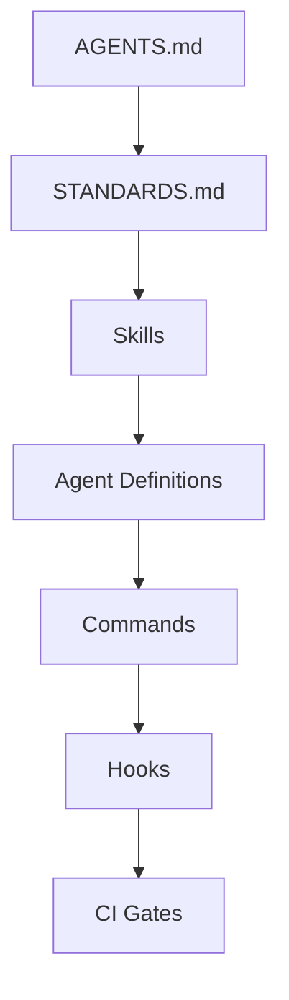

# Repository Bootstrap Checklist: Adding Agent Support to an Existing Repo

> Repository bootstrapping wires agents into an existing codebase in dependency order — project instructions first, then skills, then agent definitions, commands, hooks, and CI gates.

## Why Order Matters

Each layer in the checklist is a dependency for the next. Instructions define what correct output looks like — without them, agents cannot know which patterns to follow or avoid. Skills package the domain knowledge that agent definitions draw on — an agent definition that references a non-existent skill silently degrades to generic behavior. Commands invoke agents by name, so agent definitions must exist before commands can be wired. Hooks and CI gates enforce correctness criteria that only make sense once instructions have established what correct means.

Skipping ahead breaks this chain: adding CI gates before instructions creates enforcement rules with no defined standard to enforce against. Adding hooks before skills means hooks may reject output that would have been correct with domain context in place.

## The Checklist

### Step 1: Project Instructions File

Create `AGENTS.md` in the repository root. This file is the entry point for any agent that opens the project — it tells the agent what the repo is, how it's structured, and what conventions it must follow. The [AGENTS.md open format](https://github.com/agentsmd/agents.md) is a cross-tool convention — a dedicated, predictable place for coding-agent instructions that multiple tools can read from the same file.

The `AGENTS.md` convention uses standard Markdown with any headings you need. Include at minimum:

- Project purpose and architecture overview
- Build and test commands
- Coding conventions (naming, formatting, file layout)
- Commit message format
- What agents should and should not modify

For Claude Code, the equivalent is `CLAUDE.md` at the repo root or `.claude/CLAUDE.md`. [Claude Code loads CLAUDE.md files hierarchically](https://code.claude.com/docs/en/memory#claudemd-files) — the project file is shared with the team via version control and applies to every session.

Keep the file under 200 lines. Longer files consume more context window and reduce adherence — Claude Code's own documentation states that files over this threshold produce lower instruction-following rates ([source](https://code.claude.com/docs/en/memory#claudemd-files)).

### Step 2: Standards File

Create a `STANDARDS.md` (or equivalent) that captures conventions too detailed for `AGENTS.md`:

- Code style rules with examples
- Review checklist items
- Accepted patterns and anti-patterns specific to this codebase

Reference `STANDARDS.md` from `AGENTS.md` using an import or a direct mention so agents can locate it.

### Step 3: Skills for Domain Knowledge

Skills are Markdown files that package repeatable knowledge — domain conventions, workflows, research patterns — that agents load on demand rather than on every session.

Place skills under `.github/skills/` (Copilot convention) or `.claude/skills/` (Claude Code convention). One skill per topic. Examples:

- `conventions.md` — naming rules, file structure decisions
- `testing.md` — how to run tests, what to test, test data setup
- `release.md` — release process, versioning rules

Skills reduce `AGENTS.md` size and improve targeting — an agent working on tests only loads the testing skill, not the full project context.

### Step 4: Agent Definitions

Define agents as named configurations that compose a role from skills. An agent definition specifies: what the agent's task is, which skills it has access to, and what tools it may use.

In Copilot, agent definitions live under `.github/agents/`. In Claude Code, subagents are configured in `.claude/agents/`. Keep each agent scoped to one task — a content agent, a review agent, a test-writing agent — rather than building a general-purpose agent that does everything.

### Step 5: Commands

Commands are user-facing pipeline triggers that orchestrate agents through a task. A command like `review-pr` or `run-tests` invokes a specific agent with specific inputs.

In Copilot, commands live under `.github/copilot-instructions.md` or as prompt files. In Claude Code, commands are Markdown files under `.claude/commands/`. Commands are the interface between the human and the agent layer — they translate intent into structured agent invocations.

### Step 6: Hooks

Hooks run deterministic checks on agent output before it lands in the codebase. They enforce things the instruction files ask for but cannot guarantee.

Add hooks for:

- **Linting** — agents often produce code that passes logic checks but fails style checks
- **Secret detection** — agents may echo back test credentials or example tokens
- **Link validation** — agents writing documentation may include broken URLs
- **Commit message format** — verify conventional commit shape before push

In Claude Code, hooks are configured in `.claude/settings.json` under the `hooks` key. Use pre-commit hooks via Git or CI for cross-tool coverage.

### Step 7: CI Gates

CI validates what hooks catch locally, plus long-running checks that hooks cannot run synchronously:

- Full test suite
- Build verification
- Agent-generated file schema validation (if agents produce structured output)

CI gates create a trust boundary: output that passes CI is safe to merge regardless of whether a human reviewed every line.

## Minimum Viable Agent Infrastructure

Start here before adding anything else:

1. `AGENTS.md` with build commands and key conventions
2. One skill covering the domain knowledge agents need most
3. A pre-commit hook that runs the linter

One instruction file and one skill is more useful on day one than a full framework that takes a week to build.

## When This Order Doesn't Apply

The checklist assumes a greenfield setup — starting from a repo with no agent infrastructure. Several conditions change the calculus:

- **Existing CI already in place**: Most repos already have CI before agents are introduced. Do not remove or delay CI to match the checklist sequence; instead, add instructions (Step 1) and point agents at the existing CI workflow rather than treating Step 7 as future work.
- **Small teams or solo projects**: The full seven-step sequence is overkill for a one-person project. Steps 2, 4, and 5 (standards file, agent definitions, commands) are optional until the project grows enough to need them. Jumping straight from instructions to hooks is defensible.
- **Tool-specific adoption**: If only one tool (e.g., Claude Code) is being onboarded, skip `.github/`-convention steps entirely. The Copilot-specific paths for skills and agent definitions are not relevant until Copilot is also in scope.

## Mermaid: Bootstrap Sequence



## Example

The following shows a minimal but complete bootstrap for a TypeScript project, covering Steps 1, 3, and 6 from the checklist above.

**`AGENTS.md`** (Step 1 — project instructions file):

```markdown
# Project: payments-service

## Architecture
TypeScript monorepo. Services under `src/services/`, shared types under `src/types/`.

## Commands
- Build: `npm run build`
- Test: `npm test`
- Lint: `npm run lint`

## Conventions
- camelCase for variables and functions, PascalCase for types and classes
- All commits must follow Conventional Commits: `feat:`, `fix:`, `chore:`, etc.
- Do not modify `src/types/generated/` — these files are auto-generated
```

**`.claude/skills/testing.md`** (Step 3 — one skill covering the most-needed domain knowledge):

```markdown
# Testing Skill

Use Vitest for unit tests. Test files live alongside source files as `*.test.ts`.
Run a single test file: `npx vitest run src/services/payments.test.ts`
Mock external HTTP calls with `vi.mock('../http-client')`.
Do not use `describe` blocks for single-assertion tests.
```

**`.claude/settings.json`** (Step 6 — pre-commit lint hook):

```json
{
  "hooks": {
    "PreToolUse": [
      {
        "matcher": "Bash",
        "hooks": [
          {
            "type": "command",
            "command": "npm run lint -- --max-warnings 0"
          }
        ]
      }
    ]
  }
}
```

This is the Minimum Viable Agent Infrastructure described above. Add agent definitions (Step 4), commands (Step 5), and CI gates (Step 7) only after agents are producing useful output through the instruction file and skill.

## Key Takeaways

- Add project instructions before anything else — agents without context produce output without context
- Skills reduce instruction file bloat by loading domain knowledge on demand
- Hooks provide deterministic enforcement where instructions only provide guidance
- Start with one instruction file, one skill, and one hook — not the full stack

## Related

- [Context Priming](../context-engineering/context-priming.md)
- [Agent Design Patterns](../tools/copilot/index.md)
- [Agent Environment Bootstrapping](agent-environment-bootstrapping.md)
- [Getting Started: Setting Up Your Instruction File](getting-started-instruction-files.md)
- [Architecting a Central Repo for Shared Agent Standards](central-repo-shared-agent-standards.md)
- [Headless Claude in CI](headless-claude-ci.md)
- [Codebase Readiness for Agents](codebase-readiness.md)
- [Agent-Driven Greenfield Product Development](agent-driven-greenfield.md)
- [The AI Development Maturity Model](ai-development-maturity-model.md)
- [Lay the Architectural Foundation by Hand Before Delegating to Agents](architectural-foundation-first.md)
- [CLI-IDE-GitHub Context Ladder](cli-ide-github-context-ladder.md)
- [Team Onboarding for AI Agent Workflows](team-onboarding.md)
- [Skeleton Projects as Agent Scaffolding](skeleton-projects-as-scaffolding.md)
