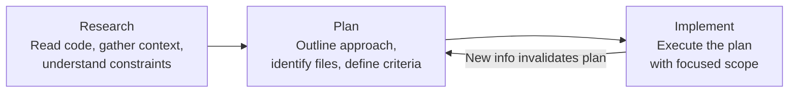
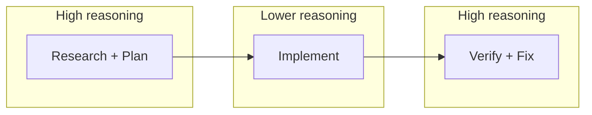
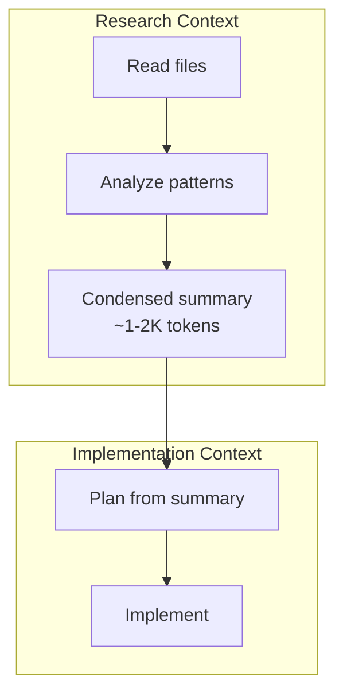

# The Research-Plan-Implement Pattern

> Research the problem, plan the approach, implement the solution. Skipping phases wastes context on rework.

Agents that jump straight to implementation produce code that compiles but misses edge cases, uses wrong patterns, or duplicates existing utilities. The fix is structural: separate information gathering from decision-making from execution.

## The Three Phases



### Research

Gather context before proposing anything. Read relevant code, check documentation, understand constraints and existing patterns. The goal is to build a mental model of the problem space — not to produce output.

What research answers:

- What exists already? (files, functions, patterns, tests)
- What are the constraints? (performance, compatibility, conventions)
- What has been tried before? (git history, related PRs)

### Plan

With research in hand, outline the approach. Identify which files change, what new logic is introduced, how it integrates with existing code, and what success looks like. The plan is a checkpoint — review it before paying the cost of implementation.

### Implement

Execute the plan with focused scope. Implementation becomes mechanical when the research and plan are solid. Deviations from the plan signal missing research, not creative latitude.

The back-edge in the diagram — implementation surfacing new information that invalidates the plan — is a deliberate replan gate, not a bug. The nibzard [Agentic AI Handbook](https://www.nibzard.com/agentic-handbook) describes production agent work as "plan, controlled execution, and replan gates," where gates trigger reassessment rather than silent drift when assumptions break.

## Why This Ordering Matters

The research phase prevents the most expensive failure mode: **implementing against wrong assumptions**. Addy Osmani [reports](https://addyo.substack.com/p/the-80-problem-in-agentic-coding) that successful agent-assisted developers spend roughly 70% of effort on problem definition and verification, 30% on execution — inverting traditional ratios.

The cost asymmetry is stark:

| Phase | Cost of error |
|-------|--------------|
| Research | Re-read a file (seconds) |
| Plan | Rewrite a paragraph (minutes) |
| Implementation | Revert, re-plan, re-implement (burns context window) |

## The Reasoning Sandwich

LangChain's [harness engineering research](https://blog.langchain.com/improving-deep-agents-with-harness-engineering/) found that allocating maximum reasoning effort at the beginning (planning) and end (verification) — with lower reasoning during implementation — improved benchmark scores to 66.5%. The implementation phase doesn't need creative problem-solving; it needs disciplined execution of a known approach. See [Reasoning Budget Allocation](../agent-design/reasoning-budget-allocation.md) for the full pattern breakdown.



## Tool-Specific Implementations

This pattern isn't just a best practice — it's built into tool infrastructure.

**Claude Code** provides three mechanisms:

- **Plan Mode** (`Shift+Tab`) — read-only exploration that blocks writes during research and planning
- **Explore subagent** — Haiku-powered, read-only agent for codebase investigation without polluting main context
- **Compact mode** (`/compact`) — summarizes conversation history to free context budget before implementation begins

**OpenAI's Harness team** structures agent execution as a sequential pipeline: `research → spec → feature-list → implementation`, with each phase producing versioned artifacts that feed subsequent stages ([source](https://alexlavaee.me/blog/openai-agent-first-codebase-learnings)).

**Manus** uses `todo.md` files updated step-by-step to keep objectives in the model's recent attention span, preventing [lost-in-the-middle](../context-engineering/lost-in-the-middle.md) issues during long tasks ([source](https://manus.im/blog/Context-Engineering-for-AI-Agents-Lessons-from-Building-Manus)).

## Sub-Agents Isolate Phases

Each phase can run in a separate agent or sub-agent. This is the key [context engineering](../context-engineering/context-engineering.md) benefit: research findings are condensed into a summary (often 1,000–2,000 tokens) before entering the implementation context. The main agent never pays the token cost of reading every file the research agent examined.

Anthropic's [long-running agent harness](https://www.anthropic.com/engineering/effective-harnesses-for-long-running-agents) uses a two-agent architecture — an **initializer agent** for environment setup and research, and a **coding agent** for incremental implementation. The structural separation prevents research from consuming the implementation budget.



## Anti-Pattern: Implement First, Fix Later

The inverse pattern — start coding, discover problems, backtrack — burns context on rework. Each failed attempt consumes tokens that could have been spent on implementation. In long-running tasks, this leads to half-finished features spread across context windows with no clear thread connecting them.

Signs you're in implement-first mode:

- Agent asks clarifying questions *after* writing code
- Multiple reverts in a single session
- Agent re-reads files it already examined because earlier findings were pushed out of context

## When This Backfires

The pattern assumes research compounds — more reading yields a better plan. That assumption breaks in several conditions:

- **Well-mapped domains** — when the task is a routine change in familiar code, a research phase produces a summary the implementer already knew. The token cost of the summary outweighs any correction it provides.
- **Stale or wrong research summaries** — a condensed summary the implementer cannot audit cheaply can confidently omit a relevant constraint, seeding the plan with a silent false assumption that is harder to recover from than implementing first and hitting the constraint directly.
- **Fast feedback loops** — when tests run in seconds and failures are compile or runtime errors, try-and-fix can converge faster than plan-and-verify. The pattern shines when errors are expensive to surface, not when the environment surfaces them for free.
- **Open-ended exploration** — early prototyping benefits from discovering the problem shape through code. A plan written before the shape is known ossifies premature structure.

The pattern pays off when wrong assumptions are expensive: unfamiliar code, irreversible actions, long implementation phases where backtracking burns a large context window. Trivial, well-understood, or cheaply-reversible work is better served by implement-first.

## When to Skip Phases

Not every task needs all three phases. Claude Code's own documentation notes that planning should be skipped when "you could describe the diff in one sentence."

| Task complexity | Phases needed |
|----------------|---------------|
| Add a null check | Implement only |
| Fix a bug with known root cause | Plan → Implement |
| Multi-file feature in unfamiliar code | Research → Plan → Implement |
| Cross-system refactoring | Research → Plan → Implement → Verify → Re-plan |

## Example

Add a rate-limiter middleware to an unfamiliar Express API codebase.

**Research phase** — the agent reads the project before proposing anything:

```
> Read server/app.ts, server/middleware/, and package.json
> Check git log for prior rate-limiting attempts
> Search for existing uses of express-rate-limit or similar

Findings:
- server/middleware/auth.ts already wraps express middleware
- express-rate-limit is in devDependencies but unused
- PR #47 attempted rate limiting but was reverted (broke WebSocket upgrade)
```

**Plan phase** — outline the approach using research findings:

```
Plan:
1. Create server/middleware/rate-limit.ts following the auth.ts pattern
2. Use express-rate-limit (already a dependency)
3. Apply to /api/* routes only — skip /ws/* to avoid the PR #47 regression
4. Add integration test in server/__tests__/rate-limit.test.ts
5. Success criteria: 429 response after 100 req/min from same IP
```

**Implement phase** — execute the plan mechanically:

```bash
# Create middleware (pattern matches auth.ts)
cat > server/middleware/rate-limit.ts << 'EOF'
import rateLimit from 'express-rate-limit';
export const apiLimiter = rateLimit({
  windowMs: 60_000,
  max: 100,
  standardHeaders: true,
  message: { error: 'Rate limit exceeded' },
});
EOF

# Mount on API routes only
# Edit server/app.ts — add apiLimiter to /api/* router

# Test
npm test -- --grep "rate-limit"
```

Without the research phase, the agent would have missed the WebSocket constraint from PR #47 and repeated the same reverted mistake.

## Key Takeaways

- **Separate information gathering from execution** — research, plan, then implement as distinct phases to catch wrong assumptions before they become wrong code
- **Front-load reasoning** — allocate maximum effort to problem definition and planning; implementation becomes mechanical when the plan is solid
- **Use sub-agents for phase isolation** — research in a separate context prevents exploration from consuming the implementation budget
- **Skip phases deliberately** — trivial changes don't need research; the pattern applies to non-trivial work where wrong assumptions are expensive

## Related

- [Plan Mode](plan-mode.md) — Claude Code's built-in read-only mode that enforces the research/plan phase
- [The Plan-First Loop](plan-first-loop.md) — The general pattern of designing before coding
- [Pre-Execution Codebase Exploration](pre-execution-codebase-exploration.md) — Structured exploration before making changes
- [Context Priming](../context-engineering/context-priming.md) — Loading relevant context before implementation
- [7 Phases of AI Development](7-phases-ai-development.md) — The outer feature lifecycle in which this per-task loop runs

## Sources

- [Claude Code Best Practices — Explore first, then plan, then code](https://code.claude.com/docs/en/best-practices)
- [Claude Code Sub-agents](https://code.claude.com/docs/en/sub-agents)
- [Effective Context Engineering for AI Agents (Anthropic)](https://www.anthropic.com/engineering/effective-context-engineering-for-ai-agents)
- [Effective Harnesses for Long-Running Agents (Anthropic)](https://www.anthropic.com/engineering/effective-harnesses-for-long-running-agents)
- [Improving Deep Agents with Harness Engineering (LangChain)](https://blog.langchain.com/improving-deep-agents-with-harness-engineering/)
- [Context Engineering for AI Agents (Manus)](https://manus.im/blog/Context-Engineering-for-AI-Agents-Lessons-from-Building-Manus)
- [The 80% Problem in Agentic Coding (Addy Osmani)](https://addyo.substack.com/p/the-80-problem-in-agentic-coding)
- [OpenAI Agent-First Codebase Learnings](https://alexlavaee.me/blog/openai-agent-first-codebase-learnings)
- [The Agentic AI Handbook: Production-Ready Patterns (nibzard)](https://www.nibzard.com/agentic-handbook)
