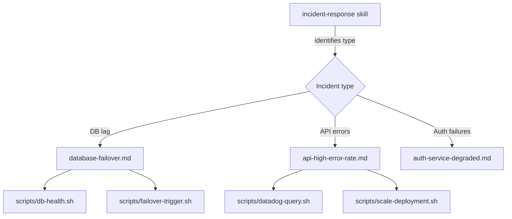

# Runbooks as Agent Instructions

> Runbooks written for humans fail for agents: implicit context, ambiguous decision points, and actions that assume cognitive inference. The fix is not a new format — it is an audit workflow that identifies each failure mode and applies the correct transformation.

Brian Scanlan's team at Intercom set a concrete goal: all operational runbooks followable by Claude within 6 weeks [unverified]. The constraint surfaces the core problem — most runbooks are written as memory aids for experienced operators, not as executable instructions.

## Why Human Runbooks Fail for Agents

Human runbooks fail for agents in three distinct ways:

| Failure mode | Example | Agent's problem |
|---|---|---|
| Implicit action | "Check the dashboard" | No tool to call, no success criterion |
| Ambiguous condition | "If load looks high..." | Cannot evaluate a vague threshold |
| Assumed context | "Restart the usual way" | No access to [tribal knowledge](../anti-patterns/implicit-knowledge-problem.md) |

Each failure mode requires a different fix. An audit step before rewriting identifies which failure applies to each step.

## The Audit Workflow

Before rewriting anything, audit each runbook step against three questions:

1. **Can the agent invoke this?** If the step requires clicking a UI, calling a named API, or running a shell command, the agent needs the exact invocation — endpoint, flags, expected output format.
2. **Can the agent evaluate this condition?** Decision points ("if this looks wrong") must become explicit conditionals with a measurable signal and a threshold.
3. **Does the step depend on knowledge the agent doesn't have?** Service topology, escalation contacts, system quirks — these must be declared explicitly or loaded via a references directory.

Steps that fail question 1 need tool-call replacements. Steps that fail question 2 need explicit conditionals. Steps that fail question 3 need supporting context injected.

## Before and After: Step Transformations

**Implicit action → explicit tool call**

Before:
```
Check the API error rate in Datadog
```

After:
```bash
datadog-query.sh service=api metric=error_rate window=5m
# Expected: value < 0.01 (1%)
# If above threshold: proceed to step 4
```

**Ambiguous condition → explicit conditional**

Before:
```
If load looks high, scale up the service
```

After:
```
If CPU utilization > 80% for 3 consecutive minutes:
  kubectl scale deployment/api --replicas=$(current_replicas + 2)
```

**Assumed context → declared reference**

Before:
```
Escalate to the on-call if needed
```

After:
```
If unresolved after 15 minutes:
  Page primary on-call via: pagerduty-alert.sh team=platform severity=high
  Include: incident start time, steps attempted, current metric values
```

## Packaging as a Skill

The correct container for an agent-executable runbook is a SKILL.md file with `disable-model-invocation: true`. This setting means the agent knows the runbook exists but only executes it when explicitly invoked — the human on-call triggers the runbook, the agent does not decide to run it autonomously.

```
.claude/skills/
  runbooks/
    database-failover.md          # SKILL.md for DB failover
    api-high-error-rate.md        # SKILL.md for API errors
    auth-service-degraded.md      # SKILL.md for auth issues
    scripts/
      datadog-query.sh
      pagerduty-alert.sh
      kubectl-scale.sh
```

A routing runbook at the top level directs the agent to the relevant sub-skill based on incident type — this is the [progressive disclosure pattern](../agent-design/progressive-disclosure-agents.md) applied to incident response:

```markdown
# Skill: Incident Response

disable-model-invocation: true

## Available runbooks
- database-failover: DB replica lag, connection pool exhaustion, failover
- api-high-error-rate: 5xx spikes, latency degradation, circuit breaker trips
- auth-service-degraded: login failures, token validation errors, SSO issues

Read only the runbook that matches the current incident type.
```

The `scripts/` directory holds the executable shell commands referenced in runbook steps, replacing "run the query" with an actual script the agent can invoke.

## Routing Architecture



The routing runbook loads only ~100 tokens at session start. The specific runbook body (~2000–5000 tokens) loads only when the relevant incident type is identified. Supporting scripts load only when invoked.

## Multi-Step State Tracking

For incidents spanning multiple sessions or requiring human handoffs, the runbook should include a progress file pattern. The agent writes a structured state file after completing each step:

```markdown
## Progress tracking
After each step, append to /tmp/incident-{timestamp}.md:
  - Step number and name
  - Command executed
  - Output summary
  - Next step

This file is the handoff artifact if the session ends or a different operator continues.
```

This is equivalent to the feature list and progress file pattern described in [Anthropic's harness engineering documentation](https://www.anthropic.com/engineering/effective-harnesses-for-long-running-agents) for long-running agents. See [Goal Monitoring and Progress Tracking](../agent-design/goal-monitoring-progress-tracking.md) for the full pattern.

## Adoption Driver: Measurable Goals

The Intercom approach — "all runbooks followable by Claude within 6 weeks" [unverified] — works because it is binary and auditable. A runbook either passes or fails the agent-followable test. Vague goals ("improve our runbooks") produce inconsistent effort. A binary test with a deadline produces a complete audit.

Operationally: assign one engineer to run each runbook against an agent in a test environment. Any step the agent fails to execute or evaluate becomes a tracked rewrite item. This surfaces the actual failure distribution across the runbook library before any rewriting begins.

## Key Takeaways

- Audit before rewriting: identify whether each failing step has an implicit action, an ambiguous condition, or assumed context — each requires a different fix
- Replace implicit actions with exact tool calls including expected output format and success criteria
- Replace ambiguous conditions with measurable thresholds and explicit branching logic
- Package rewritten runbooks as SKILL.md files with `disable-model-invocation: true` — the human triggers, the agent executes
- Use a routing skill to direct the agent to the relevant runbook sub-skill without loading all runbooks into context
- A binary pass/fail test ("can the agent follow this runbook end-to-end?") is a more effective adoption driver than qualitative improvement goals

## Related

- [Progressive Disclosure for Agent Definitions](../agent-design/progressive-disclosure-agents.md)
- [Separation of Knowledge and Execution](../agent-design/separation-of-knowledge-and-execution.md)
- [Human-in-the-Loop Placement](human-in-the-loop.md)
- [Agent Skills: Cross-Tool Task Knowledge Standard](../standards/agent-skills-standard.md)
- [Circuit Breakers for Agent Loops](../observability/circuit-breakers.md)
- [Incident Log Investigation Skill](incident-log-investigation-skill.md)
- [Trajectory Logging via Progress Files and Git History](../observability/trajectory-logging-progress-files.md)
