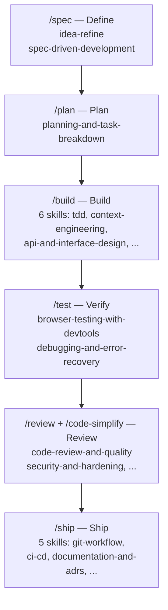

# SDLC-Phase Skill Taxonomy: Full-Lifecycle Skill Libraries

> Organize a skill library around SDLC phases so phase-entry commands activate only the relevant skills — keeping selection deterministic as the library grows past the five-skill personal scale.

## The Selection Problem at Project Scale

A personal skill library of five focused skills works because descriptions stay orthogonal. At 20+ skills, overlapping descriptions cause nondeterministic selection: the model cannot reliably distinguish `code-review-and-quality` from `debugging-and-error-recovery` when both apply to a broken build ([source](https://www.anthropic.com/engineering/code-execution-with-mcp)). The fix is structural, not editorial — partition skills by lifecycle phase so the active set at any point is small and orthogonal.

SDLC-phase taxonomy is the organizing principle: skills group into six phases, and slash commands act as phase entry points that narrow the active context to that phase's skills. [`addyosmani/agent-skills`](https://github.com/addyosmani/agent-skills) (14.6k stars, MIT, marketplace-distributed) is a worked example of this approach.

## Phase Taxonomy

Six phases, 20 skills, 7 commands:



| Phase | Command | Skills | Organizing principle |
|-------|---------|--------|----------------------|
| Define | `/spec` | idea-refine, spec-driven-development | "Spec before code" |
| Plan | `/plan` | planning-and-task-breakdown | "Small, atomic tasks" |
| Build | `/build` | incremental-implementation, tdd, context-engineering, source-driven-development, frontend-ui-engineering, api-and-interface-design | "One slice at a time" |
| Verify | `/test` | browser-testing-with-devtools, debugging-and-error-recovery | "Tests are proof" |
| Review | `/review`, `/code-simplify` | code-review-and-quality, code-simplification, security-and-hardening, performance-optimization | "Improve code health" |
| Ship | `/ship` | git-workflow-and-versioning, ci-cd-and-automation, deprecation-and-migration, documentation-and-adrs, shipping-and-launch | "Faster is safer" |

Build has the highest skill density (six) but the skills are auto-activated by task type: designing an API triggers `api-and-interface-design`; building UI triggers `frontend-ui-engineering`. The phase command narrows the candidate set; task context narrows it further.

## SKILL.md Structural Elements

Each skill in a production SDLC library shares a consistent anatomy that enforces process rather than providing reference material:

- **Trigger conditions** — explicit "When to Use" criteria so auto-activation fires correctly
- **Step-by-step process** — the workflow the agent must follow, not just what it should know
- **Rationalizations table** — common shortcuts paired with documented rebuttals (e.g., "We can add tests later" → "Tests written after implementation verify the implementation, not the requirement")
- **Verification requirements** — non-negotiable proof gates before proceeding (tests passing, build output, runtime data)

The rationalizations table is the highest-signal element: it converts process guidelines into enforcement. Without it, agents follow the described workflow unless the task context suggests a shortcut is acceptable.

Agent personas (code-reviewer, test-engineer, security-auditor) complement the skill library as reusable reviewer perspectives, loaded on demand independent of the phase taxonomy.

## Multi-Tool Portability

The same SKILL.md assets work across eight agent surfaces:

| Tool | Path |
|------|------|
| Claude Code | Plugin marketplace: `/plugin marketplace add addyosmani/agent-skills` |
| Cursor | `.cursor/rules/` |
| Gemini CLI | Native skill install |
| Windsurf | Rules configuration |
| OpenCode | AGENTS.md with skill tool |
| GitHub Copilot | Personas in `.github/copilot-instructions.md` |
| Kiro IDE | `.kiro/skills/` |
| Generic agents | Plain Markdown in system prompt |

Portability varies by tool: Cursor requires `.cursor/rules/` placement (not native SKILL.md loading); Copilot uses personas rather than skill files. The [Agent Skills standard](https://agentskills.io) provides a common format across compatible tools, but test portability per tool — don't assume it.

## When This Works and When It Doesn't

**Where SDLC taxonomy adds value:**

- Teams with a recognizable lifecycle cadence (spec → implementation → review → deploy) at project scale (roughly 5–20 developers)
- Libraries at or above 15–20 skills where selection ambiguity is already a problem
- Public or open-source libraries distributed for cross-team or community use

**Where it adds cost without value:**

- Solo developers or small projects — five skills covering observed failure modes outperform a pre-built taxonomy
- Continuous delivery without distinct phase ceremonies — commands map to phases that don't exist in the actual workflow
- Specialized domains (ML pipelines, embedded systems, data engineering) — the Build phase skills assume web/API context; many may be inapplicable, degrading auto-activation accuracy
- Multi-tool teams primarily using Copilot — the persona-based portability path misses verification gates and rationalizations tables

## Example

Installing `addyosmani/agent-skills` in Claude Code:

```bash
/plugin marketplace add addyosmani/agent-skills
```

After installation, running `/spec` activates the Define phase skills (`idea-refine`, `spec-driven-development`). The agent structures requirements as a PRD before any code is written. Running `/build` later activates six Build-phase skills; if the task involves API contract design, `api-and-interface-design` fires automatically.

A team forking this library for a specialized domain replaces inapplicable skills (e.g., `frontend-ui-engineering` → a domain-specific skill), preserving the phase taxonomy and command set while narrowing the skill pool to their actual stack.

## Key Takeaways

- SDLC-phase taxonomy solves selection ambiguity at project scale by partitioning skills into six phases, each with a command entry point
- Phase commands narrow the active skill set; task-type auto-activation narrows it further — deterministic selection without explicit invocation
- SKILL.md rationalizations tables convert process guidelines into enforcement
- Multi-tool portability varies by tool — Claude Code and native SKILL.md-compatible tools get full fidelity; Copilot and Cursor use reduced-fidelity translations
- The pattern fits teams with recognizable SDLC phases; it adds overhead for solo developers, continuous delivery teams, and specialized domains

## Related

- [Daily-Use Skill Library](daily-use-skill-library.md) — personal scale, 5 skills
- [Enterprise Skill Marketplace](enterprise-skill-marketplace.md) — enterprise distribution, MDM
- [Skill Library Evolution](../tool-engineering/skill-library-evolution.md) — library lifecycle governance
- [Skill Authoring Patterns](../tool-engineering/skill-authoring-patterns.md) — authoring rules
- [Plugin and Extension Packaging](../standards/plugin-packaging.md) — plugin packaging spec
- [Cross-Tool Translation](../human/cross-tool-translation.md) — multi-tool portability
- [Agent Skills Standard](../standards/agent-skills-standard.md) — SKILL.md format specification
