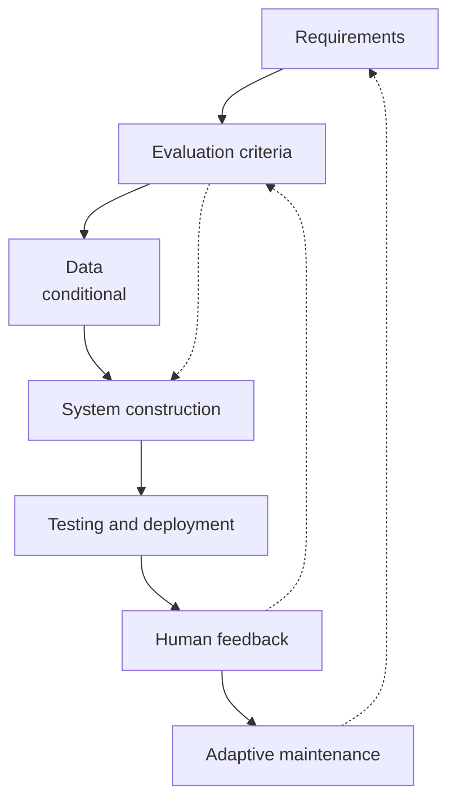

# How Teams Build SE Agents: A Seven-Stage Build Loop

> Teams building SE agents run a seven-stage loop in which effort moves from writing code to specifying, evaluating, and reviewing it.

Building a software engineering agent reorganizes the process around it. A mixed-methods study of 20 practitioners across 12 organizations found a recurring seven-stage loop and five process shifts. A survey of 80 more practitioners validated both ([How Do Practitioners Build SE Agents?](https://arxiv.org/abs/2607.10856)). All of it follows from one fact: when writing code stops being the constraint, the next one becomes visible. Bottlenecks shift rather than disappear.

## Why conventional process does not carry over

An SE agent is software, but its behavior does not come from its code. It emerges from the model, prompts, tools, context, and execution environment ([arXiv:2607.10856](https://arxiv.org/abs/2607.10856)). Teams that run a conventional pipeline against it hit two failures. Deterministic test gates cannot certify output that varies between identical runs. And a finished-then-verified sequence puts the check after the point where it could have steered anything.

This is not specific to one study. Evaluation built around fixed benchmarks and static test suites fails to capture emergent behavior. It also cannot support continuous adaptation across the lifecycle. So evaluation has to become a continuous governing function rather than a terminal checkpoint ([Evaluation-Driven Development and Operations of LLM Agents](https://arxiv.org/abs/2411.13768)).

## Who this applies to

Read this loop as a map for teams shipping agentic systems, not for teams that only use one. Three conditions bound it.

The sample is narrow. The study recruited people who build SE agents, weighted toward large technology companies — 15 of the 20 interviewees — in applied-scientist and research-engineer roles. The authors state that the findings may not transfer to smaller firms, non-technical organizations, or general users ([arXiv:2607.10856](https://arxiv.org/abs/2607.10856)).

Some stages are conditional. Data acts as a substrate for evaluation and, where teams adapt models, for training. Teams that build their agent through prompt engineering alone often needed no training-data pipeline, so data was not a universal sequential stage ([arXiv:2607.10856](https://arxiv.org/abs/2607.10856)).

The evidence is a snapshot. Interviews ran from February to May 2026, and the authors flag temporal validity as a limitation because models and tools change quickly ([arXiv:2607.10856](https://arxiv.org/abs/2607.10856)).

## The seven-stage loop

The seven components form an iterative loop rather than a one-way pipeline. Evaluation results, operational feedback, and provider model changes all return teams to earlier stages. Of the survey respondents, 91% agreed the loop reflects how SE agents get built ([arXiv:2607.10856](https://arxiv.org/abs/2607.10856)). The loop is tool-agnostic — no stage depends on which agent you build with.

What distinguishes each stage ([arXiv:2607.10856](https://arxiv.org/abs/2607.10856)):

- Requirements serve two audiences: the human team, and the agents that consume the requirements as input. Some teams made specifications more explicit and agent-readable as a result.
- Evaluation sets the criteria for judging agent behavior. It differs from testing: testing verifies deterministic correctness, evaluation assesses variable behavior and task capability.
- Data covers benchmarks, ground truth, operational traces, and golden patches mined from real commits. Manual collection and labeling remained necessary even where agents helped gather it.
- System construction follows cheapest-first escalation. Teams start with an existing API or open-source model and prompting. They then move to adaptation such as LoRA, supervised fine-tuning, preference optimization, or continued pre-training. Few organizations pre-train a foundation model. Spanning every level sits the harness — context, memory, tools, skills, permissions, and orchestration.
- Testing and deployment run both checks on an iteration before it ships.
- Human feedback arrives through internal dogfooding, human review, validator agents, closed beta releases, and controlled A/B tests.
- Adaptive maintenance handles provider-side model releases. A release can expand capabilities, expose new failure modes, or make parts of the existing harness unnecessary.

## Where the effort moves

The study measured agreement with five process shifts on a five-point scale ([arXiv:2607.10856](https://arxiv.org/abs/2607.10856)):

| Shift | Agreement | Average |
|-------|-----------|---------|
| Effort is both unmasked and created | 95% | 4.46 |
| Implementation becomes cheaper | 84% | 4.01 |
| Evaluation increasingly steers development | 82% | 4.10 |
| Specifications become central engineering artifacts | 77% | 3.90 |
| Role boundaries shrink | 71% | 3.81 |

The strongest result is not that work got faster. It is that work moved. As coding shrank, long-standing effort in requirements, coordination, and deployment became more visible. Meanwhile reviewing generated code and evaluating agent behavior created work that did not exist before. One participant put the unmasking plainly: "Writing code isn't the slow bit, it never was" ([arXiv:2607.10856](https://arxiv.org/abs/2607.10856)).

## Why it works

Effort relocates rather than disappears because the artifacts that control correctness migrate out of code. When behavior comes from the model, prompt, context, and tools, those become the things you engineer. That is why participants version and test prompts, skills, and context definitions alongside code ([arXiv:2607.10856](https://arxiv.org/abs/2607.10856)).

Non-determinism supplies the second half of the mechanism. The same model, scaffold, and version can run twice and produce different scores, so verification cannot be a one-time gate ([arXiv:2607.10856](https://arxiv.org/abs/2607.10856)). It has to become a recurring signal that steers each iteration. That is the causal reason evaluation moves from final check to the thing that organizes development. This is a constraint result rather than a productivity result: cheapening one stage exposes the next binding constraint. It holds whether or not the net speed-up is real.

## When this backfires

You use agents but do not build them. The data and evaluation stages presuppose benchmarks, ground truth, and training pipelines. A product team consuming a coding agent has no model strategy to escalate and no eval corpus to curate. Importing the full loop adds ceremony without value.

Your task already has a trustworthy oracle. The evaluation stage exists because agent output often has no valid signal. Where existing tests genuinely encode correctness, ordinary test-driven development is cheaper. The risk is believing you have one when you do not. Participants described teams treating existing tests as the oracle even when those tests encoded outdated criteria and rejected better solutions ([arXiv:2607.10856](https://arxiv.org/abs/2607.10856)).

You cannot staff evaluation. Participants described evaluation as the hardest and most resource-intensive part of building an agent, with dedicated research and data-science teams behind it ([arXiv:2607.10856](https://arxiv.org/abs/2607.10856)). A two-person team cannot fund that.

The acceleration premise is contested. That implementation gets cheaper rests on self-report: 16 of 20 interviewees said implementation was faster, and none reported a slowdown ([arXiv:2607.10856](https://arxiv.org/abs/2607.10856)). A randomized controlled trial found the opposite in a comparable population. Sixteen experienced open-source developers completed 246 tasks. They took 19% longer with AI tools, while estimating afterwards that AI had made them 20% faster ([Measuring the Impact of Early-2025 AI on Experienced Open-Source Developer Productivity](https://arxiv.org/abs/2507.09089)). The developers who felt faster were measured slower. That trial covered early-2025 tooling, so it bounds the claim rather than refuting it. Do not treat self-reported speed-up as evidence of throughput.

The prescriptions age. Scaffolding built around a model's current weaknesses turns into drag when the model improves. Participants named the pattern directly: "Today's design pattern may be tomorrow's anti-pattern" ([arXiv:2607.10856](https://arxiv.org/abs/2607.10856)). See [Harness Impermanence: Build Scaffolding To Be Deleted](../patterns/agent-design/harness-impermanence.md).

The weakest answers concern comprehension. Practices addressing the gap between generated code and developer understanding drew the lowest effectiveness ratings in the study, at 53.9% for delegating maintenance back to AI. The authors concede the problem remains unresolved ([arXiv:2607.10856](https://arxiv.org/abs/2607.10856)).

## Example

The clearest case of a metric breaking is code volume. In one organization studied, AI-generated code grew from roughly four million lines a year to a projected fifteen million lines a month. The organization could not translate that increase into business value ([arXiv:2607.10856](https://arxiv.org/abs/2607.10856)). The participant responsible described the number as a warning rather than a target: "It is like a canary in a coal mine. If that number goes up, that should give us some attention. I do not think it is something we should performance-manage on."

The team-level cost is what makes the metric misleading. An individual developer generating code quickly can look faster while creating review and maintenance work for everyone downstream. Of the survey respondents, 85% agreed that coding agents increase observable output without clarifying its value, the highest agreement of any challenge in the study. Only 65.8% rated treating code volume as a diagnostic signal rather than a target as very effective or essential. Even the recommended response is unsettled ([arXiv:2607.10856](https://arxiv.org/abs/2607.10856)).

## Key Takeaways

- The loop has seven stages — requirements, evaluation, data, system construction, testing and deployment, human feedback, adaptive maintenance — and 91% of surveyed practitioners recognized it.
- Effort relocation is the best-supported finding at 95% agreement, and it does not depend on agents making anyone faster.
- Evaluation and specifications become the artifacts that control correctness, because an agent's behavior comes from model, prompt, context, and tools rather than hand-written code.
- Data and model adaptation are conditional stages; teams building prompt-only agents can skip both.
- Treat the cheaper-implementation claim with care: it is self-reported, and a randomized trial measured a 19% slowdown in a comparable population.

## Related

- [Eval-Driven Development: Write Evals Before Building Agent Features](eval-driven-development.md) — the evaluation stage of this loop as a standalone practice
- [Spec-Driven Development with Spec Kit](spec-driven-development.md) — treating specifications as the persistent source of truth
- [When Developers Understand Less of Their Own Codebase](../patterns/anti-patterns/comprehension-debt.md) — the review burden this loop shifts downstream
- [Harness Impermanence: Build Scaffolding To Be Deleted](../patterns/agent-design/harness-impermanence.md) — why scaffolding built for today's model becomes drag
- [The Implicit Knowledge Problem for AI Coding Agents](../patterns/anti-patterns/implicit-knowledge-problem.md) — why agents retrieve what was written but not what was left unsaid
