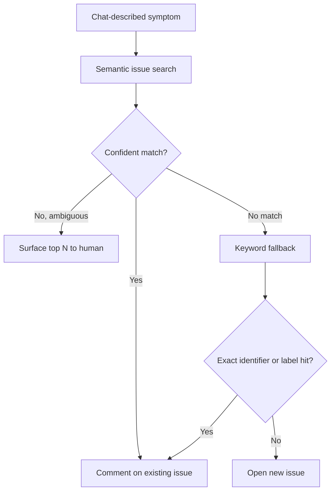

# Semantic Issue Search from Chat vs Query Syntax

> Natural-language issue search resolves a chat-described symptom to an existing issue when paraphrasing dominates; fall back to keyword filters for exact tokens, audits, and freshness.

Semantic issue search lets you describe an issue in chat — "the flaky test about timezone parsing" — and resolve it to a real issue number without switching to the issues UI. The pattern only beats `is:issue` query syntax under specific conditions; outside those, keyword search is faster, more precise, and more reproducible. GitHub shipped this in Copilot Chat on the web on 2026-05-20 across all Copilot plans, surfacing issues that are "semantically related even when they are worded differently" ([GitHub Changelog](https://github.blog/changelog/2026-05-20-semantic-issue-search-in-copilot-chat)).

## When To Use It

Pick natural-language semantic search when the query is dominated by intent rather than exact tokens:

- **Symptom-to-issue lookup**: you remember what the bug *does*, not how the report was worded ("auth fails on Safari after token refresh").
- **Duplicate detection before opening a new issue**: a paraphrased description is exactly the shape an embedding index handles well.
- **Triage on an unfamiliar repo**: you do not know the project's preferred labels, components, or wording conventions.
- **Conversational scoping inside an existing chat**: the agent is already in the chat surface; switching out to the issues UI breaks the loop.

## When To Skip It

Stay on keyword / Boolean search when literal precision, completeness, or determinism dominate:

- **Exact identifier lookup** — `#1234`, `ERR_TIMEOUT_001`, `v2.3.1-beta`, stack-trace tokens. Dense embeddings collapse rare tokens because pooling "destroys lexical identity for specific strings"; a query for `ERR_SSL_VERSION_OR_CIPHER_MISMATCH` resolves to "document about SSL errors" rather than the exact match ([TianPan: Hybrid Search in Production](https://tianpan.co/blog/2026-04-12-hybrid-search-production-bm25-dense-embeddings)).
- **Audit and governance queries** — `is:open label:security no:assignee created:>2026-01-01` must return a complete, deterministic set so a maintainer can verify nothing was silently dropped. Re-ranking is opaque by design ([Castor: Natural Language Search Precision](https://www.castordoc.com/ai-strategy/how-to-improve-precision-in-natural-language-search)).
- **Live incident triage** — embedding indexes update on a lag. An issue filed minutes ago may not yet be retrievable; `gh search issues label:incident sort:created-desc` hits the live API ([unified.to: Enterprise-Grade Semantic Search](https://unified.to/blog/how_to_build_enterprise_grade_semantic_search_in_2026_that_actually_works_at_scale)).
- **Cross-repo or org-wide scope** — the 2026-05-20 GA scopes the feature to repository-level on the web surface; multi-repo workflows still need `gh search issues` ([GitHub Changelog](https://github.blog/changelog/2026-05-20-semantic-issue-search-in-copilot-chat)).
- **Reproducible scripted queries** — semantic ranking can return different results on different days as the index updates. Scheduled triage jobs need stable result sets.

## Triage Loop: Find Before Create

The most leveraged use of semantic issue search is duplicate detection inside an agent triage loop. The GitHub Copilot SDK Issue Triage Agent already runs this shape: on every newly opened issue it searches the existing corpus for similar reports and closes confirmed duplicates ([DeepWiki: Issue Triage Agent](https://deepwiki.com/github/copilot-sdk/9.2-authentication-and-billing)).

The branch at `C` and `G` is load-bearing: blindly creating an issue without the semantic check yields duplicates; blindly trusting the semantic match without a keyword fallback misses recently-filed or exact-identifier issues that the embedding index has not indexed or cannot resolve.

## Cross-Tool Availability

The retrieval shape generalises beyond Copilot Chat, but the tooling does not yet. The official GitHub MCP server exposes `search_issues`, `list_issues`, and `issue_read` — all keyword/JQL-style, no semantic retrieval ([github/github-mcp-server](https://github.com/github/github-mcp-server)). To get natural-language issue search inside Claude Code or Cursor today, you need either a third-party MCP server (for example, CalumJS's GitHub Issue Finder MCP surfaces semantic issue search to any MCP client) or you roll your own embedding index over the issues corpus ([Skywork: GitHub Issue Finder MCP](https://skywork.ai/skypage/en/github-insights-issue-finder/1978279244158406656)).

A separate design exists: Atlassian Intelligence translates a natural-language Jira query into JQL rather than running pure embedding retrieval, so the result is still a structured query the user can read, edit, and re-run deterministically ([eesel: Atlassian Intelligence search using natural language](https://www.eesel.ai/blog/atlassian-intelligence-search-using-natural-language)). The trade-off is the inverse of pure semantic search — predictable and auditable, but constrained to what JQL can express.

## Why It Works

Embedding models map paraphrases of the same intent to nearby vectors in a learned latent space, so a description like "the flaky test about timezone parsing" lands close to an issue titled "DST transition causes ParseTest.testWeekRollover intermittent failure" even though the two share no surface tokens. Dense retrieval scores by vector distance rather than token overlap, which buys recall on intent-similar but lexically dissimilar pairs ([Towards Data Science: Hybrid Search and Re-Ranking in Production RAG](https://towardsdatascience.com/hybrid-search-and-re-ranking-in-production-rag/)). The same pooling that lets the model generalise across phrasings is what destroys lexical identity for rare tokens — which is why production retrieval systems almost universally combine BM25 with dense retrieval and a cross-encoder reranker rather than going all-in on either: hybrid retrieval followed by neural reranking reaches Recall@5 of 0.816 versus 0.695 for fused alone and 0.644 for BM25 alone ([Towards Data Science](https://towardsdatascience.com/hybrid-search-and-re-ranking-in-production-rag/)). GitHub has not disclosed the model or index behind Copilot Chat issue search, so the public-facing description stops at "dense embedding retrieval over an issues corpus."

## When This Backfires

- **Trusting a single semantic hit for duplicate detection**: the announcement does not document whether closed issues are indexed or how recency affects ranking, and pure dense retrieval is known to miss exact-token matches. A duplicate-detection workflow that relies only on semantic search will silently leak duplicates of recently-closed or terse-titled issues. Pair it with a keyword pass.
- **Reproducibility breakage in scripted triage**: scheduled workflows that read the top-N results from a semantic query get non-deterministic outputs as the index updates. If the script asserts on result identity, it will flake.
- **Cross-repo and audit drift**: assuming the chat surface covers your full triage scope. The GA is repository-level; an org-wide security sweep still needs `gh search issues` with explicit filters.
- **Silent recall failure on exact tokens**: rare strings — error codes, IDs, version strings — disappear into the pooled vector representation. The user sees results but cannot tell that the real match was dropped, because the system never surfaces a "no exact match" signal ([TianPan](https://tianpan.co/blog/2026-04-12-hybrid-search-production-bm25-dense-embeddings)).
- **Loss of debuggability**: when keyword search misses, you adjust terms or boolean structure; when semantic search misses, "users are often unsure whether a missing result reflects a gap in coverage, a prompt interpretation issue, or a retrieval limitation" ([Castor](https://www.castordoc.com/ai-strategy/how-to-improve-precision-in-natural-language-search)).

## Key Takeaways

- Use natural-language issue search for symptom-to-issue lookup and duplicate detection where the chat surface is already open.
- Fall back to `is:issue` query syntax or `gh search issues` for exact identifiers, audit queries, live incident triage, cross-repo scope, and any scripted workflow that needs deterministic results.
- Wrap semantic search in a triage loop that checks for a confident match before opening a new issue, and pairs the semantic hit with a keyword pass before treating it as authoritative.
- Claude Code and Cursor reach the same pattern today only through third-party MCP servers — the official GitHub MCP server exposes keyword search only.

## Related

- [Backlog Triage as a Named Agent Skill](backlog-triage-skill.md) — Where the find-before-create loop lives inside a triage state machine.
- [Continuous Triage](continuous-triage.md) — Scheduled triage cadence that needs the deterministic fallback path described here.
- [QA Session to Issues Pipeline](qa-session-to-issues-pipeline.md) — Upstream of triage: where chat-described symptoms originate.
- [Issue-to-PR Delegation Pipeline](issue-to-pr-delegation-pipeline.md) — Downstream consumer of cleanly de-duplicated issues.
