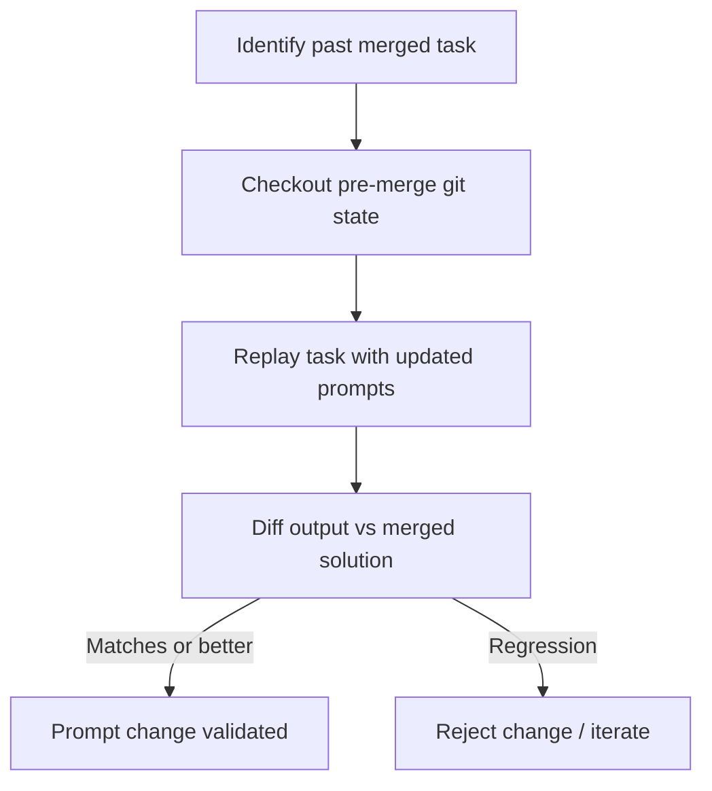

# Simulation and Replay Testing for Agent Workflows

> Validate agent prompt changes by replaying a past task in isolation and diffing the result against what was actually merged.

## The Problem

When you change an agent's instructions, how do you know the change improves output? Intuition and manual testing on new tasks are unreliable — new tasks have different context, different difficulty, and different success criteria. You cannot compare them cleanly to the previous agent's performance.

Simulation and replay testing solves this by using the past as the test fixture.

## Why It Works

Replay testing eliminates confounding variables. A new task varies in complexity, context, and success criteria, making before/after comparisons unreliable. A past task fixes all of these: the inputs are known, the expected output is known (what was merged), and the only variable is the updated instructions. Because git preserves the repository state at every commit, you can reconstruct the exact conditions of any prior run and replay them deterministically from the prompt's perspective — the task context is frozen even if the model output varies.

## The Technique

The core loop:

1. Identify a task that was previously completed and merged — a known-good outcome
2. Roll back to the git state just before that task was completed (the "before" state)
3. Replay the task using the updated agent instructions
4. Diff the agent's output against what was actually merged

If the updated agent produces the same or better output, the prompt change is validated. If it regresses, the change is rejected before it reaches production.



## Using Worktrees for Isolation

Git worktrees allow multiple working trees from the same repository ([`git worktree add`](https://git-scm.com/docs/git-worktree) is a standard git feature since Git 2.5). Simulation runs in an isolated worktree so it does not interfere with the main working directory or other parallel simulations.

```bash
# Create an isolated worktree at the pre-merge commit
git worktree add ../sim-test <pre-merge-commit-sha>

# Run the task in the isolated worktree
cd ../sim-test
# ... invoke agent with updated prompts ...

# Compare output to the merged solution
git diff <pre-merge-commit-sha> <merge-commit-sha> -- <target-files>
```

Multiple simulations can run in parallel across separate worktrees — one for each prompt variant being evaluated.

## What "Better" Means

Define success criteria before running the simulation, not after:

- **Structural match** — the output follows the same shape as the merged solution
- **Content match** — key claims, code paths, or decisions align
- **Regression check** — the updated agent does not omit things the original agent got right
- **Improvement** — the updated agent catches something the original missed

Automated diff scoring (line count, structural similarity) is a starting point for flagging obvious regressions. Human judgment on the diff is still required for qualitative assessment.

## Regression Testing Agent Behavior

Simulation replay is most valuable for regression testing:

- After a prompt change that fixes a known failure, verify it doesn't break passing cases
- After updating a skill file, replay several past tasks that used the skill
- After tool configuration changes, verify the agent still reaches the correct outcome

A library of "golden" past tasks — completed, merged, and known-good — forms a regression suite for agent behavior, analogous to snapshot testing in software.

## Integration with the Content Pipeline

In a content pipeline (research → draft → review → publish), simulation replay lets you test individual stage prompts:

- Change the researcher's instructions → replay a past research task → compare findings against what was merged
- Change the reviewer's format → replay a past review → compare structured output against the previous review

Each stage has an independently testable input/output boundary.

## Limitations

- Simulation tests past conditions, not future ones — novel task types may not be represented in the golden library
- Replay is not deterministic: the same agent instructions on the same task may produce different output on each run — LLMs sample stochastically by default, so temperature > 0 means results vary
- A "better" output is easier to define for structured tasks (code, structured documents) than for open-ended ones

## Key Takeaways

- Use past merged tasks as test fixtures — the merged solution is the known-good baseline
- Worktrees provide isolation for replay runs without affecting the main working directory
- Define success criteria before running the simulation to avoid post-hoc rationalization
- Parallel simulations across worktrees let you test multiple prompt variants simultaneously
- Build a library of golden past tasks to form a regression suite for agent behavior

## Example

You update a researcher agent's instructions to add a "related pages" step. Before shipping, you want to verify the change doesn't break existing behavior.

1. Find a past merged task — say, the PR that added `docs/workflows/content-pipeline.md` (merge commit `abc1234`, pre-merge commit `def5678`).

2. Create an isolated worktree at the pre-merge state:

    ```bash
    git worktree add ../sim-test def5678
    ```

3. Replay the researcher task in the worktree using the updated instructions:

    ```bash
    cd ../sim-test
    claude --prompt "Research and draft docs/workflows/content-pipeline.md using the updated researcher instructions in .claude/agents/researcher.md"
    ```

4. Diff the agent's output against the merged solution:

    ```bash
    git diff def5678 abc1234 -- docs/workflows/content-pipeline.md
    ```

5. Review the diff: if the updated agent produces equivalent content plus the new "related pages" additions, the prompt change is validated. If it drops sections the original got right, reject and iterate.

## Related

- [Incremental Verification: Check at Each Step, Not at the End](../verification/incremental-verification.md)
- [Worktree Isolation for Parallel Agent Work](worktree-isolation.md)
- [Layered Accuracy Defense](../verification/layered-accuracy-defense.md)
- [Red-Green-Refactor with Agents: Tests as the Spec](../verification/red-green-refactor-agents.md)
- [Eval-Driven Development](eval-driven-development.md)
- [Entropy Reduction Agents](entropy-reduction-agents.md)
- [Evaluation-Driven Development for Agent Tools](eval-driven-tool-development.md)
- [LLM-as-Judge Evaluation with Human Spot-Checking](llm-as-judge-evaluation.md)
