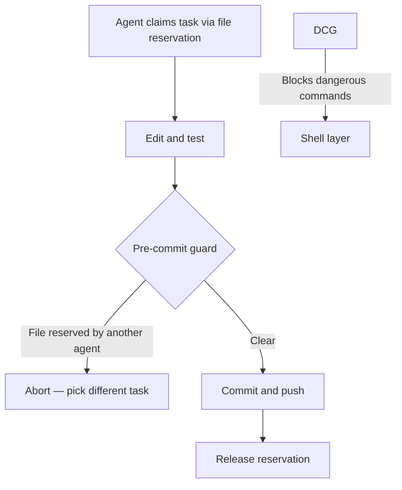

# Single-Branch Git for Agent Swarms

> Feature branches work for humans reviewing PRs one at a time. At 10+ parallel agents making frequent small commits, branching becomes the bottleneck. Single-branch git with mechanical coordination guards is the alternative — but only when the guards are in place first.

!!! warning "Conflicts with Claude Code's official recommendation"
    Claude Code's documented best practice is [worktree isolation](worktree-isolation.md) — one worktree per agent, one branch per task. The single-branch model described here is a direct counterpoint from the Agent Flywheel methodology, which explicitly rejects worktrees as "a bad pattern." Both positions have real tradeoffs. This page presents both.

## Why Branches Break at Scale

The standard branch-per-feature model assumes a small number of long-lived branches with human reviewers. At 10+ parallel agents each making frequent small commits, three failure modes compound:

| Problem | Mechanism |
|---------|-----------|
| **Merge conflicts grow combinatorially** | With n agents each touching shared files, potential conflicts scale with agent count. The author's operational experience puts the threshold at 10+ agents. |
| **Rebase burns agent context** | Resolving merge conflicts and rebasing branches consumes context that should be spent on implementation. An agent that spends half its context window on git hygiene is half as productive. |
| **Logical conflicts survive textual merges** | A function signature change on one branch and a new callsite on another merge cleanly but fail to compile. On a single branch, the second agent sees the change immediately and adapts. Branches hide this class of conflict until merge time. |

## The Single-Branch Model

All agents commit directly to `main`. Task exclusivity and safety come from three mechanical substitutes for branch isolation:

### 1. Advisory File Reservations with TTL

Each agent registers a reservation file listing the files it intends to modify, plus a TTL timestamp. The reservation is advisory — other agents check it before starting work, not a hard lock enforced by the OS.

**TTL expiry is the key property**: if an agent crashes, its reservation expires and another agent can proceed without manual intervention. Hard locks from crashed agents require human cleanup; TTL-expiring advisory locks degrade gracefully.

Workflow per agent:

1. Pull latest from main
2. Write reservation file: `reservations/<agent-id>.json` with files list and TTL
3. Edit and test
4. Commit and push immediately (small commits reduce conflict window)
5. Delete reservation file

### 2. Pre-Commit Guard

A git hook that runs before each commit. It reads the active reservation files, checks whether any committed files are reserved by a different agent, and rejects the commit if there is a conflict. This catches the case where two agents claim the same file — one of them fails fast rather than silently overwriting.

### 3. Destructive Command Guard (DCG)

A shell-level interceptor that mechanically blocks dangerous operations:

| Blocked command | Why |
|----------------|-----|
| `git reset --hard` | Destroys uncommitted work |
| `git clean -fd` | Removes untracked files without recovery path |
| `git push --force` | Rewrites shared history |
| `git checkout --` | Discards working tree changes |
| `rm -rf` | Unrecoverable file deletion |
| `DROP TABLE` | Database destruction |

**The origin story**: On December 17, 2025, an agent ran `git checkout --` on uncommitted work. Files were recovered via `git fsck --lost-found`, but the incident proved that instructions alone do not prevent execution — mechanical enforcement does. DCG was built the next day.

Instructions tell agents not to run dangerous commands. DCG prevents it regardless of what the agent decides.

## Required Pre-Conditions

Single-branch is not a universal upgrade from worktrees. It is specifically designed for a pre-partitioned bead swarm where:

| Pre-condition | Why it matters |
|--------------|---------------|
| **Coordination infrastructure exists** (Agent Mail or equivalent) | Advisory reservations require a messaging layer to notify agents when reservations conflict |
| **DCG is installed and active** | Without mechanical enforcement, single-branch is strictly riskier than branching |
| **Agents are fungible** | All agents read the same AGENTS.md and can pick up any task. Specialist agents become single points of failure — if the "auth specialist" writes a function signature another agent immediately builds on, a conflict on main breaks both. Fungible agents adapt to any change they encounter. |
| **Work is pre-partitioned into beads** | Independent, small tasks that agents can pick up, complete, and commit in short cycles. Long-running agent sessions with large uncommitted diffs defeat the model. |

## Worktrees vs. Single-Branch: When to Use Each

| Factor | Worktree isolation | Single-branch |
|--------|-------------------|---------------|
| **Agent count** | Low to medium (1–10) | High (10+) |
| **Task independence** | Variable — isolation handles overlap | Must be high — overlap causes conflicts |
| **Review required per change** | Yes — each worktree generates a PR | No — agents commit directly to main |
| **Coordination infrastructure** | Not required | Required (Agent Mail, DCG, guards) |
| **Claude Code native support** | Yes — `isolation: worktree` in sub-agent config | No native support |
| **Context spent on git** | Higher — branching, PR creation, rebase | Lower — pull, commit, push |
| **Failure mode** | Diverged branches, merge queue strain | Conflict on main, requires fast detection |

Claude Code's documented recommendation is worktrees. If you are running fewer than ~10 parallel agents, or if your tasks have variable overlap, worktrees are the lower-risk starting point.

## Key Takeaways

- Feature branches create merge overhead that grows with agent count; single-branch keeps all agents synchronized on a live shared view of the codebase.
- Three mechanical guards replace branch isolation: advisory file reservations with TTL expiry, a pre-commit guard, and a Destructive Command Guard at the shell level.
- The DCG exists because instructions do not prevent execution — the December 2025 incident proved this in production.
- Single-branch requires coordination infrastructure, fungible agents, and pre-partitioned work to be safe. Without those pre-conditions, it is strictly riskier than branching.
- Worktrees (Claude Code's recommendation) and single-branch (Agent Flywheel's recommendation) reflect genuinely different architectural positions with different tradeoff profiles — choose based on your agent count and coordination infrastructure.

## Unverified Claims

- The "O(n²) merge conflicts" framing is stated as operational experience by the Agent Flywheel author; no formal analysis or controlled study is cited.
- The "10+" threshold where branches become problematic is based on personal experience running 10–25 parallel agents; no comparative benchmark exists.
- Agent Mail, bv (the reservation tool), and DCG are tools in the Agent Flywheel ecosystem; adoption beyond that ecosystem is unverified.

## Related

- [Worktree Isolation](worktree-isolation.md)
- [File-Based Agent Coordination](../multi-agent/file-based-agent-coordination.md)
- [Beads: Structured Task Graphs as External Agent Memory](../agent-design/beads-task-graph-agent-memory.md)
- [Parallel Agent Sessions](parallel-agent-sessions.md)
- [Idempotent Agent Operations](../agent-design/idempotent-agent-operations.md)
- [Rollback-First Design](../agent-design/rollback-first-design.md)
- [Developer Attention Management with Parallel Agents](../human/attention-management-parallel-agents.md)
- [Headless Claude in CI](headless-claude-ci.md)
