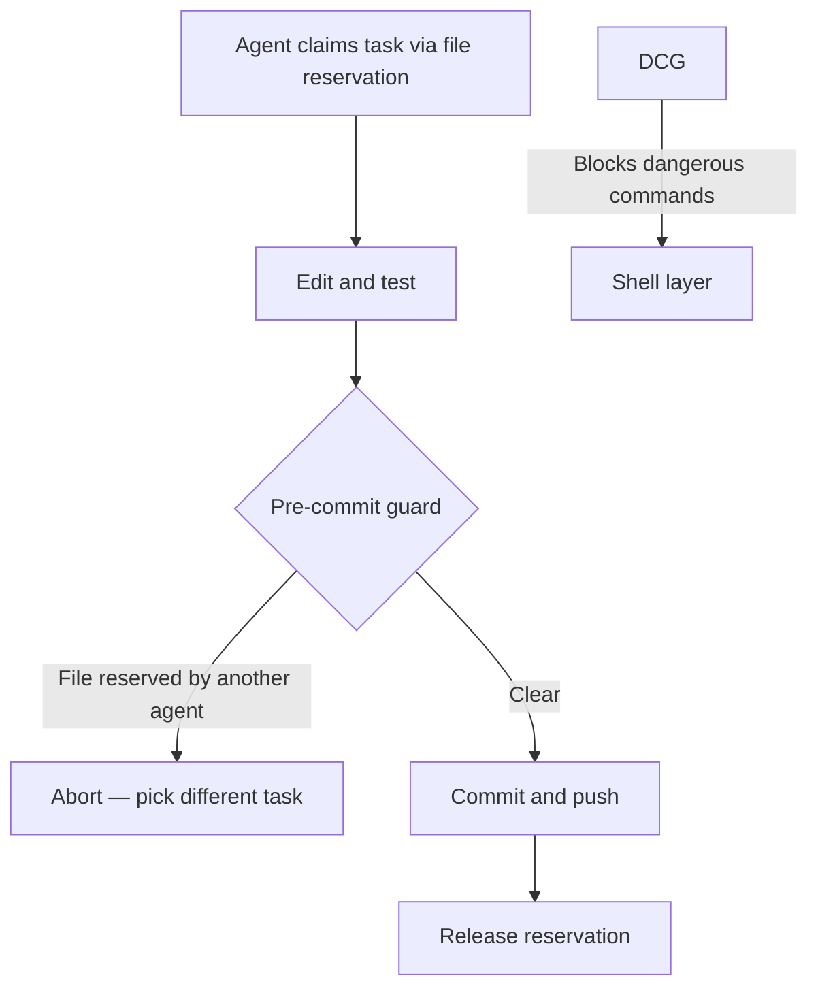

# Single-Branch Git for Agent Swarms

> At 10+ parallel agents committing small changes, branching becomes the bottleneck. Single-branch git with mechanical guards is the alternative — if guards exist first.

Related lesson: [Sandboxes for Swarms](https://learn.agentpatterns.ai/workflows/sandboxes-for-swarms/) covers this concept in a hands-on lesson with quizzes.

!!! warning "Conflicts with Claude Code's official recommendation"
    Claude Code's documented best practice is [worktree isolation](worktree-isolation.md) — one worktree per agent, one branch per task. The single-branch model described here is a direct counterpoint from the [Agent Flywheel methodology](https://agent-flywheel.com/core-flywheel), which rejects worktrees in favor of all agents committing directly to `main`. Industry practitioner guides [default to worktrees](https://nx.dev/blog/git-worktrees-ai-agents) for parallel agents; single-branch is the contrarian position.

## Why branches break at scale

The standard branch-per-feature model assumes a small number of long-lived branches with human reviewers. As agent count rises, three failure modes compound — the [Agent Flywheel complete guide](https://agent-flywheel.com/complete-guide) reports this breakdown at 10+ parallel agents making frequent small commits:

| Problem | Mechanism |
|---------|-----------|
| Merge conflicts grow with agent count | With n agents each touching shared files, the potential conflict surface scales with the number of concurrent branches. Practitioner guides that rely on worktree isolation [cap their recommendation at 3–5 parallel agents](https://superset.sh/blog/parallel-coding-agents-guide) for this reason. Beyond that, the codebase's ability to absorb parallel changes becomes the bottleneck, not agent capacity. |
| Rebase burns agent context | Resolving merge conflicts and rebasing branches consumes context that should go to implementation. An agent that spends half its context window on git hygiene is 50% as productive. |
| Logical conflicts survive textual merges | A function signature change on one branch and a new callsite on another merge cleanly but fail to compile. On a single branch, the second agent sees the change at once and adapts. Branches hide this class of conflict until merge time. |

## The single-branch model

All agents commit directly to `main`. Task exclusivity and safety come from three mechanical substitutes for branch isolation:

```mermaid
graph TD
    A[Agent claims task via file reservation] --> B[Edit and test]
    B --> C{Pre-commit guard}
    C -->|File reserved by another agent| D[Abort — pick different task]
    C -->|Clear| E[Commit and push]
    E --> F[Release reservation]
    G[DCG] -->|Blocks dangerous commands| H[Shell layer]
```

### 1. Advisory file reservations with TTL

Each agent registers a reservation file. It lists the files the agent intends to modify, plus a TTL timestamp. The reservation is advisory: other agents check it before starting work, but the OS does not enforce a hard lock. The [MCP Agent Mail coordination layer](https://mcpagentmail.com/) implements this pattern with date-partitioned messages and advisory locking for safe concurrent access.

TTL expiry is what makes this work. If an agent crashes, its reservation expires and another agent can proceed without manual intervention. Hard locks from crashed agents need human cleanup. TTL-expiring advisory locks degrade gracefully.

The workflow for each agent runs in five steps:

1. Pull the latest from main.
2. Write a reservation file, `reservations/<agent-id>.json`, with the files list and TTL.
3. Edit and test.
4. Commit and push at once. Small commits reduce the conflict window.
5. Delete the reservation file.

### 2. Pre-commit guard

A git hook that runs before each commit. It reads the active [reservation files](../multi-agent/file-based-agent-coordination.md), checks whether any committed files are reserved by a different agent, and rejects the commit if there is a conflict. This catches the case where two agents claim the same file — one of them fails fast rather than silently overwriting.

### 3. Destructive command guard (DCG)

A shell-level interceptor that mechanically blocks dangerous operations. The [Agent Flywheel core flywheel guide](https://agent-flywheel.com/core-flywheel) lists DCG as one of the three mechanisms that replaces branch isolation:

| Blocked command | Why |
|----------------|-----|
| `git reset --hard` | Destroys uncommitted work |
| `git clean -fd` | Removes untracked files without recovery path |
| `git push --force` | Rewrites shared history |
| `git checkout --` | Discards working tree changes |
| `rm -rf` | Unrecoverable file deletion |
| `DROP TABLE` | Database destruction |

Instructions tell agents not to run dangerous commands. DCG prevents it regardless of what the agent decides. This is the same failure mode behind [stale `.git/index.lock` recovery](https://www.augmentcode.com/guides/git-worktrees-parallel-ai-agent-execution): when an agent crashes mid-operation, the surrounding system has to recover mechanically, not through agent instructions.

## Required pre-conditions

Single-branch is not a universal upgrade from worktrees. It is built for a pre-partitioned bead swarm where:

| Pre-condition | Why it matters |
|--------------|---------------|
| Coordination infrastructure exists (Agent Mail or equivalent) | Advisory reservations need a messaging layer to notify agents when reservations conflict |
| DCG is installed and active | Without mechanical enforcement, single-branch is strictly riskier than branching |
| Agents are fungible | All agents read the same AGENTS.md and can pick up any task. Specialist agents become single points of failure. If the "auth specialist" writes a function signature another agent builds on, a conflict on main breaks both. Fungible agents adapt to any change they encounter. |
| Work is pre-partitioned into [Code-Native Memory Substrates](../agent-design/code-native-memory-substrates.md) | Independent, small tasks that agents can pick up, complete, and commit in short cycles. Long-running agent sessions with large uncommitted diffs defeat the model. |

## Worktrees vs single-branch: when to use each

| Factor | Worktree isolation | Single-branch |
|--------|-------------------|---------------|
| Agent count | Low to medium (1–10) | High (10+) |
| Task independence | Variable — isolation handles overlap | Must be high — overlap causes conflicts |
| Review required per change | Yes — each worktree generates a PR | No — agents commit directly to main |
| Coordination infrastructure | Not required | Required (Agent Mail, DCG, guards) |
| Claude Code native support | Yes — `isolation: worktree` in sub-agent config | No native support |
| Context spent on git | Higher — branching, PR creation, rebase | Lower — pull, commit, push |
| Failure mode | Diverged branches, merge queue strain | Conflict on main, requires fast detection |

Claude Code's documented recommendation is worktrees. If you are running fewer than ~10 parallel agents, or if your tasks have variable overlap, worktrees are the lower-risk starting point.

## Key Takeaways

- Feature branches create merge overhead that grows with agent count; single-branch keeps all agents synchronized on a live shared view of the codebase.
- Three mechanical guards replace branch isolation: advisory file reservations with TTL expiry, a pre-commit guard, and a Destructive Command Guard at the shell level.
- The DCG exists because instructions do not prevent execution — only [mechanical blocks at the shell layer](../verification/deterministic-guardrails.md) do.
- Single-branch requires coordination infrastructure, fungible agents, and pre-partitioned work to be safe. Without those pre-conditions, it is strictly riskier than branching.
- Worktrees (Claude Code's recommendation) and single-branch (Agent Flywheel's recommendation) reflect genuinely different architectural positions with different tradeoff profiles — choose based on your agent count and coordination infrastructure.

## Related

- [Worktree Isolation](worktree-isolation.md)
- [File-Based Agent Coordination](../multi-agent/file-based-agent-coordination.md)
- [Code-Native Memory Substrates](../agent-design/code-native-memory-substrates.md)
- [Parallel Agent Sessions](parallel-agent-sessions.md)
- [Idempotent Agent Operations](../agent-design/idempotent-agent-operations.md)
- [Rollback-First Design](../agent-design/rollback-first-design.md)
- [Developer Attention Management with Parallel Agents](../human/attention-management-parallel-agents.md)
- [Headless Claude in CI](headless-claude-ci.md)
