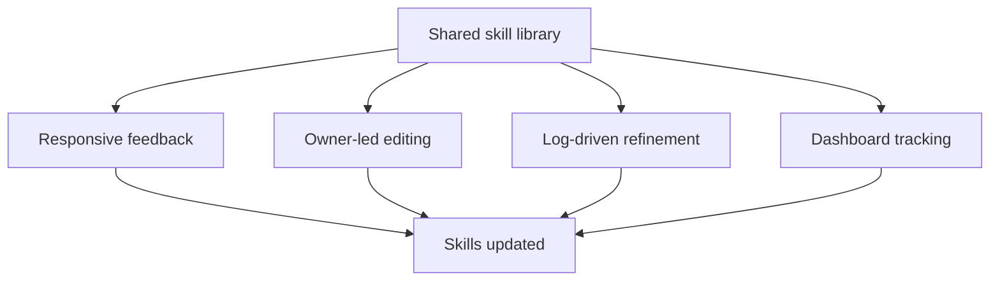

# Skill Library Refinement Loops

> Four complementary feedback mechanisms that together keep a team's shared skill library accurate and useful — no single loop catches every failure class.

A skill library shared across a team degrades in a different way than a single skill degrades. Individual skills fail on output quality or trigger precision — problems the [skill eval loop](../tools/claude/skill-eval-loop.md) addresses. Shared libraries fail on a different axis: skills that worked well for the author become wrong, under-used, or invisible to the people who need them most. No eval run catches this.

Will Larson's [Iterative prompt and skill refinement](https://lethain.com/agents-iterative-refinement/) describes four feedback loops that together close the gap. Each catches a different failure class; running only one leaves blind spots.

## The Four Loops

### Loop 1 — Responsive Feedback

A dedicated channel (e.g., `#ai` on Slack) where anyone can report issues with skills in real-time. The skill owner skims it daily.

**What it catches**: edge cases, real-world failures, and confusion the author never anticipated — the widest possible input from people using skills in production workflows.

**What it misses**: low-visibility failures where users silently work around a broken skill rather than reporting it; structural problems that accumulate slowly; quantitative signal on which skills matter most.

**When to use**: always — this is the baseline loop for any team with a shared skill library.

### Loop 2 — Owner-Led Editing

Store skill prompts in editable documents (Notion, Google Docs, or any wiki accessible to the whole team) rather than burying them in a private repo. Embed links to the prompt directly in workflow outputs so users can propose edits in-context.

**What it catches**: incremental improvements from users who know what the skill should do but lack repo access; wording issues and missing cases that users notice during a workflow session.

**What it misses**: systemic failures; failures invisible to casual users; problems requiring deep technical investigation.

**When to use**: always, combined with Loop 1 — the two lowest-cost loops that together cover the majority of organic improvement opportunities.

### Loop 3 — Log-Driven Refinement

Route production logs (e.g., via a [Datadog MCP integration](https://docs.datadoghq.com/bits_ai/mcp_server/)) into the skill repository. A central AI team applies this to platform-level skills — those used across many workflows by many teams.

**What it catches**: failure patterns not reported through Slack; systematic errors that emerge at volume; cross-workflow inconsistencies only visible in aggregate.

**What it misses**: failures that don't produce loggable errors (e.g., subtly wrong output the model accepts silently); anything a dashboard metric can't represent.

**When to use**: when a central team maintains platform-level skills used across multiple workflows. The infrastructure investment (observability stack with MCP integration) is not justified for a 5-person team with a handful of skills.

### Loop 4 — Dashboard Tracking

Monitor per-skill invocation counts, error rates, and workflow run frequency. Use the data to prioritise which skills to review and improve first.

**What it catches**: dead skills with zero invocations; high-error skills hiding in the long tail; usage patterns that contradict assumptions about which skills matter.

**What it misses**: output quality problems — a skill invoked 500 times per week may be producing wrong results on a large fraction of those runs. See [Enterprise Skill Marketplace](enterprise-skill-marketplace.md) for the telemetry gap between usage frequency and output quality.

**When to use**: when the skill library is large enough that intuition about which skills need attention is unreliable — typically 20+ skills or multiple workflow teams.

## Failure Classes by Loop

| Failure class | Responsive | Owner-led | Log-driven | Dashboard |
|---|---|---|---|---|
| Edge cases from real use | ✓ | — | — | — |
| Wording / trigger issues | ✓ | ✓ | — | — |
| Systematic errors at volume | — | — | ✓ | — |
| Dead or neglected skills | — | — | — | ✓ |
| High-error-rate skills | — | — | ✓ | ✓ |
| Prioritisation signal | — | — | — | ✓ |

The anti-pattern is treating any single row as sufficient coverage.

## Scaling the Loop Set

Not every team needs all four loops. Cost grows from left to right: Loops 1–2 require only a channel and a wiki; Loops 3–4 require observability infrastructure.

| Team size / context | Recommended loops |
|---|---|
| Small team, handful of skills | 1 + 2 |
| Mid-size team, 20+ skills | 1 + 2 + 4 |
| Central AI team, platform-level skills | All four |

Start with Loops 1 and 2. Add Loop 4 when the library grows large enough that prioritisation by intuition fails. Add Loop 3 only when the infrastructure is already in place and the failure patterns it catches are actually occurring.

## Relationship to Other Patterns

- **Skill eval loop** — evaluates output quality for a single skill in isolation. Loops 1–4 operate at the organisational level, not the per-skill level.
- **Content & skills audit** — detects URL staleness and navigation drift. Orthogonal: staleness audits don't capture user-reported failures or usage data.
- **Enterprise skill marketplace** — covers distribution and OTel usage telemetry. Dashboard tracking (Loop 4) overlaps; the marketplace page focuses on the telemetry gap between invocation count and output quality.
- **Continuous agent improvement** — observe-categorise-update-verify loop for individual agent configurations. The refinement loops pattern applies the same principle at the team/library scale.

## Key Takeaways

- No single feedback mechanism catches all skill failure classes — the anti-pattern is assuming your Slack channel (or your dashboards) covers everything
- Loops 1 and 2 are the baseline for any shared skill library and require no infrastructure beyond a channel and a wiki
- Loop 3 (log-driven) earns its cost only for platform-level skills maintained by a central team with an observability stack already in place
- Loop 4 (dashboard) adds prioritisation signal; pair it with quality evals — invocation count alone does not measure output correctness
- Add loops as the library grows; don't build the full infrastructure stack for a five-skill team

## Related

- [Skill Eval Loop](../tools/claude/skill-eval-loop.md) — per-skill output quality and trigger precision evals
- [Content & Skills Audit Workflow](content-skills-audit.md) — URL staleness and navigation drift detection
- [Enterprise Skill Marketplace](enterprise-skill-marketplace.md) — distribution, OTel telemetry, and quality maintenance at scale
- [Continuous Agent Improvement](continuous-agent-improvement.md) — observe-categorise-update-verify loop for individual agent configs
- [Daily-Use Skill Library](daily-use-skill-library.md) — building a personal skill library
- [Skill Library Evolution](../tool-engineering/skill-library-evolution.md) — lifecycle governance, versioning, and pruning
