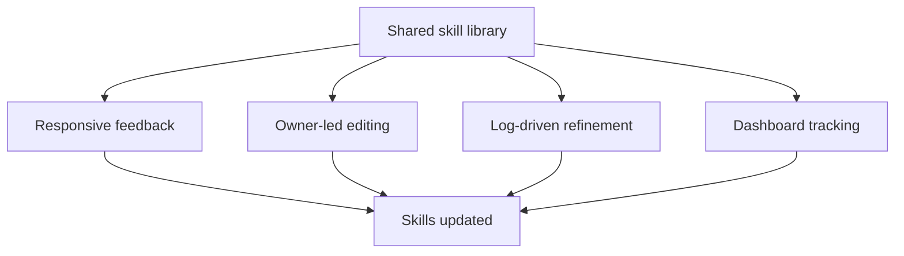

# Skill Library Refinement Loops

> Four complementary feedback mechanisms that together keep a team's shared skill library accurate and useful — no single loop catches every failure class.

A skill library shared across a team degrades in a different way than a single skill degrades. Individual skills fail on output quality or trigger precision — problems [skill evals](../verification/skill-evals.md) and the Claude-specific [skill eval loop](../tools/claude/skill-eval-loop.md) address. Shared libraries fail on a different axis: skills that worked well for the author become wrong, under-used, or invisible to the people who need them most. No eval run catches this.

Will Larson's [Iterative prompt and skill refinement](https://lethain.com/agents-iterative-refinement/) describes four feedback loops that together close the gap. Each catches a different failure class; running only one leaves blind spots.

## The four loops

```mermaid
graph TD
    A[Shared skill library] --> B[Responsive feedback]
    A --> C[Owner-led editing]
    A --> D[Log-driven refinement]
    A --> E[Dashboard tracking]
    B --> F[Skills updated]
    C --> F
    D --> F
    E --> F
```

### Loop 1 — Responsive feedback

A dedicated channel (for example, `#ai` on Slack) where anyone can report problems with skills in real time. The skill owner skims it daily.

What it catches: edge cases, [real-world failures](continuous-agent-improvement.md), and confusion the author never anticipated. This is the widest input you can get from people using skills in production workflows.

What it misses: low-visibility failures where users silently work around a broken skill rather than report it. It also misses structural problems that build up slowly, and it gives no quantitative signal on which skills matter most.

When to use: always. This is the baseline loop for any team with a shared skill library.

### Loop 2 — Owner-led editing

Store skill prompts in editable documents (Notion, Google Docs, or any wiki the whole team can reach) rather than burying them in a private repo. Embed links to the prompt directly in workflow outputs so users can propose edits in context.

What it catches: small improvements from users who know what the skill should do but lack repo access. It also catches wording problems and missing cases that users notice during a workflow session.

What it misses: systemic failures, failures invisible to casual users, and problems that need deep technical investigation.

When to use: always, paired with Loop 1. These are the two lowest-cost loops, and together they cover most organic improvement opportunities.

### Loop 3 — Log-driven refinement

Route production logs (for example, through a [Datadog MCP integration](https://docs.datadoghq.com/bits_ai/mcp_server/)) into the skill repository. A central AI team applies this to platform-level skills, the ones used across many workflows by many teams.

What it catches: failure patterns not reported through Slack, systematic errors that emerge at volume, and cross-workflow inconsistencies you can only see in aggregate.

What it misses: failures that produce no loggable error, for example subtly wrong output the model accepts silently. It also misses anything a dashboard metric cannot represent.

When to use: when a central team maintains platform-level skills used across many workflows. The infrastructure cost, an observability stack with MCP integration, is not worth it for a 5-person team with a handful of skills.

### Loop 4 — Dashboard tracking

Monitor per-skill invocation counts, error rates, and workflow run frequency. Use the data to decide which skills to review and improve first. The [OpenTelemetry GenAI semantic conventions](https://opentelemetry.io/docs/specs/semconv/gen-ai/) define standard attributes (operation name, model, token counts, error types) that make this instrumentation portable across observability vendors.

What it catches: dead skills with zero invocations, high-error skills hiding in the long tail, and usage patterns that contradict your assumptions about which skills matter.

What it misses: output quality problems. A skill invoked 500 times a week may be producing wrong results on a large share of those runs. See [Enterprise Skill Marketplace](enterprise-skill-marketplace.md) for the telemetry gap between usage frequency and output quality.

When to use: when the library is large enough that intuition about which skills need attention is unreliable, typically 20 or more skills or several workflow teams.

## Failure classes by loop

| Failure class | Responsive | Owner-led | Log-driven | Dashboard |
|---|---|---|---|---|
| Edge cases from real use | ✓ | — | — | — |
| Wording / trigger issues | ✓ | ✓ | — | — |
| Systematic errors at volume | — | — | ✓ | — |
| Dead or neglected skills | — | — | — | ✓ |
| High-error-rate skills | — | — | ✓ | ✓ |
| Prioritization signal | — | — | — | ✓ |

The anti-pattern is treating any single row as full coverage.

## Scaling the loop set

Not every team needs all four loops. Cost grows from left to right. Loops 1 and 2 need only a channel and a wiki. Loops 3 and 4 need observability infrastructure.

| Team size / context | Recommended loops |
|---|---|
| Small team, handful of skills | 1 + 2 |
| Mid-size team, 20+ skills | 1 + 2 + 4 |
| Central AI team, platform-level skills | All four |

Start with Loops 1 and 2. Add Loop 4 when the library grows large enough that prioritization by intuition fails. Add Loop 3 only when the infrastructure is already in place and the failure patterns it catches actually occur.

## Relationship to other patterns

- Skill eval loop — evaluates output quality for a single skill in isolation. Loops 1 to 4 operate at the organizational level, not the per-skill level.
- Content and skills audit — detects URL staleness and navigation drift. It is orthogonal: staleness audits do not capture user-reported failures or usage data.
- Enterprise skill marketplace — covers distribution and OTel usage telemetry. Dashboard tracking (Loop 4) overlaps. The marketplace page focuses on the telemetry gap between invocation count and output quality.
- Continuous agent improvement — observe-categorize-update-verify loop for individual agent configurations. The refinement loops pattern applies the same principle at the team and library scale.

## Key Takeaways

- No single feedback mechanism catches all skill failure classes — the anti-pattern is assuming your Slack channel (or your dashboards) covers everything
- Loops 1 and 2 are the baseline for any shared skill library and require no infrastructure beyond a channel and a wiki
- Loop 3 (log-driven) earns its cost only for platform-level skills maintained by a central team with an observability stack already in place
- Loop 4 (dashboard) adds prioritization signal; pair it with quality evals — invocation count alone does not measure output correctness
- Add loops as the library grows; don't build the full infrastructure stack for a five-skill team

## Related

- [Skill Eval Loop](../tools/claude/skill-eval-loop.md) — per-skill output quality and trigger precision evals
- [Enterprise Skill Marketplace](enterprise-skill-marketplace.md) — distribution, OTel telemetry, and quality maintenance at scale
- [Continuous Agent Improvement](continuous-agent-improvement.md) — observe-categorize-update-verify loop for individual agent configs
- [Daily-Use Skill Library](daily-use-skill-library.md) — building a personal skill library
- [Skill Library Evolution](../tool-engineering/skill-library-evolution.md) — lifecycle governance, versioning, and pruning
- [Introspective Skill Generation](introspective-skill-generation.md) — mining recurring corrections to generate new skills; complements Loops 1 and 3
- [SDLC-Phase Skill Taxonomy](sdlc-skill-taxonomy.md) — organizing a shared library by SDLC phase so selection stays deterministic at scale
- [Skill Authoring Patterns](../tool-engineering/skill-authoring-patterns.md) — the canonical home for skill authoring rules these loops feed back into
