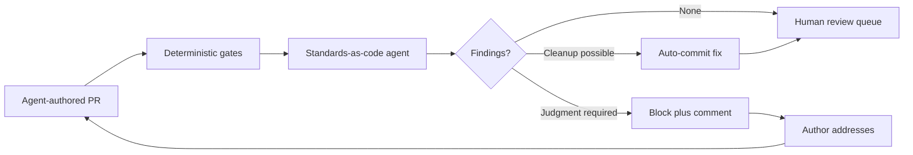

# AI Slop as a Process Problem: Encoding Quality Standards as Pipeline Gates

> Reframe AI-generated slop as a process gap — a per-PR agent gate enforcing version-controlled standards, sized to agent throughput.

## The Framing Shift

AI-generated slop is a process gap, not a discipline failure. The agent ships low-quality code because nothing in the pipeline catches it before merge, not because the human approving the PR was careless. Continue's Patrick Erichsen argues this is the same misdiagnosis teams made before CI/CD existed: blame the developer for the broken build, when the actual fix is to remove "did this break?" from individual carefulness and place it inside an automated pipeline ([Erichsen, Continue, 2026-02-27](https://blog.continue.dev/ai-slop-team-sport)).

This is a *workflow* — encode the standards, run a per-PR agent reviewer against them, triage what it flags, refine the standards from triage outcomes. The empirical case for the shift is the 2025 DORA finding that a 90% increase in AI adoption coincided with a 91% increase in code review time, a 154% increase in PR size, and a ~9% climb in bug rates: reviewer attention is the binding constraint, and adding more headcount does not scale with agent output ([Google Cloud — 2025 DORA Report](https://cloud.google.com/blog/products/ai-machine-learning/announcing-the-2025-dora-report)).

## Why the People-Problem Framing Fails Under Agent Throughput

Pre-CI/CD code review worked when one engineer pushed a few dozen lines a day. Manual vigilance scaled because volume was low. AI throughput collapses that equilibrium. A causal study of 806 Cursor-adopting repositories versus 1,380 matched controls found a 281% spike in lines added in month one, and the velocity gain fades within three months while static-warning rate (+30%) and complexity (+42%) persist for six months or more ([He et al., MSR 2026](https://arxiv.org/abs/2511.04427)). DORA 2025 records a 154% increase in PR size against unchanged reviewer headcount ([Google Cloud — 2025 DORA Report](https://cloud.google.com/blog/products/ai-machine-learning/announcing-the-2025-dora-report)); the asymmetry compounds with every PR.

"Be more careful" is an exhortation that cannot scale. The only scaling primitive is the same one Humble and Farley named in 2010: move the standard off the individual and into automation that runs every time ([Humble & Farley, *Continuous Delivery*, 2010](https://www.scirp.org/reference/referencespapers?referenceid=2241209)).

Developer perception lines up with the process framing. An empirical study of 1,154 Reddit and Hacker News posts, coded for review friction under a tragedy-of-the-commons lens, supplies the human-perception evidence that practitioners experience AI "slop" as a shared review-burden problem rather than an individual-discipline lapse ([developer-perception study of AI slop, 2026](https://arxiv.org/abs/2603.27249)).

## Three Implementation Layers

### Layer 1: Standards-as-Code

Encode each quality expectation as a version-controlled, machine-readable rule. Continue's prescription is a markdown file per standard, checked into the repo alongside the code it governs ([Erichsen, Continue, 2026-02-27](https://blog.continue.dev/ai-slop-team-sport)). Two flavours of rule coexist:

- **Deterministic** — linters, type-checkers, complexity budgets, dependency policies. Fast, no false-negative risk on rule-expressible criteria.
- **Judgment-driven** — natural-language rules executed by an LLM agent against the PR diff. Cover the criteria a senior engineer would catch on review but that no linter encodes.

The split mirrors the [entropy-reduction-agents](entropy-reduction-agents.md) split between architectural tests and LLM-based scanning — the same two-track design, applied at PR time rather than on a schedule.

### Layer 2: Per-PR Agent Gate



A reviewer agent runs on every pull request before any human looks at it. Continue's anti-slop agent illustrates the shape: scoped to single-file changes per execution, makes targeted cleanup commits or no-ops if the PR is clean, and integrates as a standard CI check ([Erichsen, Continue, 2026-02-09](https://blog.continue.dev/fight-code-slop-with-continuous-ai)). This is the per-PR specialisation of the broader [Continuous AI](continuous-ai-agentic-cicd.md) pattern — pre-merge enforcement rather than scheduled scanning.

### Layer 3: Triage Loop on Encoded Standards

The gates are not static. Every false positive triaged by a human is a signal that the rule is mis-tuned; every real defect the gate missed is a signal that a new rule is needed. The cycle: encode, enforce, triage, refine. Without the refinement step the gates calcify into noise — the same outcome the people-problem framing produces. Off-the-shelf tools run with default rule sets generate overwhelming volumes of irrelevant warnings — an empirical study of SAST tools on real vulnerability-contributing commits found at least 76% of the warnings raised on vulnerable functions were irrelevant to the actual defect ([Charoenwet et al., 2024](https://arxiv.org/abs/2407.12241)). Tuning rules to the codebase is what lifts the gate's signal-to-noise ratio above the level a reviewer will keep acting on.

The triage loop is what distinguishes a working process gate from a CI-badge theatre.

## Triggers and Constraints

| Trigger | Constraint |
|---|---|
| Pull-request opened or updated | Gate runs read-only on diff; cannot push autonomous commits to protected branches |
| Standards file changed | Gate re-runs against the most recent open PRs to surface newly-violated cases |
| Manual dispatch | Engineer can re-trigger after addressing findings without amending the PR |

The pattern shares the [Continuous AI](continuous-ai-agentic-cicd.md) "safe outputs" constraint: the agent produces a reviewable artifact (block, comment, single-file cleanup commit) and never merges autonomously. The human approval gate is preserved; what changes is that humans triage findings rather than performing line-by-line inspection.

## Multi-Tool Coverage

The pattern is tool-agnostic at the architectural level. The implementation surface differs only in how the per-PR agent is wired:

- **GitHub Copilot coding agent**: invoke via a workflow YAML that runs the agent on `pull_request` events with read-only repo permissions and write-scoped to PR comments.
- **Claude Code**: use `claude-code-action` in a GitHub Actions workflow on `pull_request`, with `allowed_tools` constrained to read and PR-comment write operations — the same pattern documented in [Continuous AI (Agentic CI/CD)](continuous-ai-agentic-cicd.md).
- **Cursor**: the agent runs in CI rather than the editor; Cursor's editor-side review remains the developer-side complement, not a substitute for the pre-merge gate.

All three converge on the same architecture: standards-as-code in the repo, agent reviewer in CI, human triage of flagged items.

## Example

A minimal GitHub Actions workflow that runs a standards-as-code review on every pull request. The agent reads version-controlled standards files and posts review comments without merging.

```yaml
name: standards-review

on:
  pull_request:
    types: [opened, synchronize, reopened]

jobs:
  review:
    runs-on: ubuntu-latest
    permissions:
      contents: read
      pull-requests: write

    steps:
      - uses: actions/checkout@v4

      - name: Run standards-as-code review
        uses: anthropics/claude-code-action@beta
        with:
          anthropic_api_key: ${{ secrets.ANTHROPIC_API_KEY }}
          prompt: |
            Read every file under .standards/*.md as the encoded
            team standards. Review the PR diff against each standard
            in turn. For each violation:
              1. Post an inline review comment on the offending line.
              2. Quote the standard being violated.
              3. Propose a concrete fix.
            If a standard is ambiguous, comment with the ambiguity and
            do not flag the line.
          allowed_tools: "Read,mcp__github__add_comment_to_pending_review"
```

The `.standards/` directory holds one markdown file per standard — naming conventions, error-handling rules, test-coverage expectations. Adding a standard is a PR; refining one is a PR; the rules evolve under the same review discipline as the code they govern.

## When This Backfires

The process-vs-people reframe holds at scale but is conditional on the rule set, the gate count, and the deployment context. Specific failure conditions:

- **Under-tuned rules** — vague encoded standards produce high false-positive rates. When the bulk of a tool's warnings are irrelevant to the change under review, reviewers learn to ignore the agent ([Charoenwet et al., 2024](https://arxiv.org/abs/2407.12241)). The mechanism only fires when the gate's signal-to-noise ratio exceeds the human reviewer's.
- **Gate proliferation** — wiring multiple overlapping AI reviewers (anti-slop agent plus several vendor tools) produces conflicting suggestions, and teams running several reviewers at once report diminishing returns from reconciling them ([Aviator — "How to Avoid AI Code Slop"](https://www.aviator.co/blog/how-to-avoid-ai-code-slop/)). Pick one authoritative gate or arbitrate explicitly between them.
- **Tiny teams or one-off projects** — for a solo engineer on a prototype, the standards authoring, agent maintenance, and false-positive triage cost more than the slop they prevent. Manual review at low throughput remains the cheaper equilibrium.
- **Formal-verification regimes** — regulated software (medical, finance, aviation) already runs deterministic sign-off chains and external audit. An LLM-graded standards agent introduces a non-deterministic gate the auditor cannot accept as evidence. The CI/CD analogy holds; the LLM-judge mechanism specifically does not.
- **Gate-as-substitute-for-spec** — adopting automated gates to defer writing real requirements ships the same slop with a passing CI badge. The mechanism only works when the encoded standards reflect actual quality criteria; encoding nothing precise yields nothing useful.
- **Missing triage loop** — gates that never get refined calcify into noise. Without a feedback channel from human triage back to the standards files, the false-positive rate grows until reviewers ignore the gate entirely — the same outcome the people-problem framing produces.

A reasonable steelman of the opposing view: AI-era quality fails not because the pipeline lacks gates but because reviewers lack the judgment to act on the volume the pipeline produces, and adding more automated gates compounds noise. The 2025 DORA framing — "AI amplifies what's already there" — supports a culture-and-discipline interpretation as much as a process one ([Google Cloud — 2025 DORA Report](https://cloud.google.com/blog/products/ai-machine-learning/announcing-the-2025-dora-report)). The reframe is most defensible at organisations where review headcount is already saturated; it is least defensible where the team is small enough that one engineer holds every standard in their head.

## Why It Works

Gate-based enforcement decouples quality assurance from per-developer attention budget — the binding constraint as agent throughput rises. Pre-CI/CD, every defect required some human to notice; the cost of noticing scaled linearly with code volume. CI/CD capped the human cost at *triage of flagged items* instead of *vigilant inspection of every change* ([Humble & Farley, 2010](https://www.scirp.org/reference/referencespapers?referenceid=2241209)). The same shift applies to AI-generated PRs: a per-PR agent reviewer with rule-encoded team standards performs the "what would a senior engineer catch" pass deterministically, regardless of reviewer cognitive state or inbound PR volume ([Erichsen, Continue, 2026-02-27](https://blog.continue.dev/ai-slop-team-sport)).

The empirical backing is the DORA finding that AI adoption simultaneously inflates review time and PR size: reviewer attention is the bottleneck the gates relax ([2025 DORA Report](https://cloud.google.com/blog/products/ai-machine-learning/announcing-the-2025-dora-report)). The mechanism fires only when the encoded rules are sharp enough that the gate's signal-to-noise ratio exceeds the human reviewer's. Under-tuned gates leave the attention bottleneck unchanged.

## Key Takeaways

- AI slop ships when the pipeline lacks per-PR enforcement, not because the approver was careless — the same reframe CI/CD applied to broken builds
- Encode standards as version-controlled markdown rules, gate every PR with an agent reviewer, refine the rules from human triage of flagged items
- The mechanism scales because it caps human cost at triage rather than inspection; agent throughput no longer overruns reviewer attention
- Failure conditions are sharp: under-tuned rules, gate proliferation, tiny teams, formal-verification regimes, and missing triage loops each collapse the gate back into noise
- The pattern is the per-PR specialisation of [Continuous AI](continuous-ai-agentic-cicd.md) and the pre-merge counterpart to [entropy-reduction-agents](entropy-reduction-agents.md) — both layers belong in a mature workflow

## Related

- [Continuous AI (Agentic CI/CD)](continuous-ai-agentic-cicd.md) — the broader pattern this workflow specialises for pre-merge enforcement
- [Entropy Reduction Agents](entropy-reduction-agents.md) — the scheduled-scan counterpart that catches drift between PRs
- [Velocity-Quality Asymmetry](velocity-quality-asymmetry.md) — empirical case for why AI throughput demands process-level QA scaling
- [Verification-Centric Development](verification-centric-development.md) — the layered-gate vocabulary this workflow plugs into
- [Agent-Laundered Bug Reports](../anti-patterns/agent-laundered-bug-reports.md) — adjacent anti-pattern where LLM rewriting bypasses observation discipline upstream of the gate
