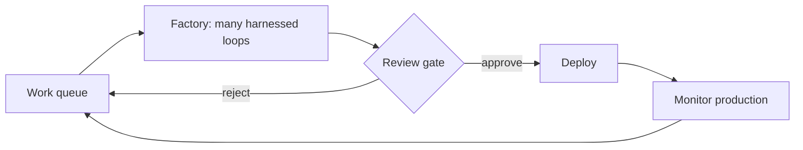

# The Software Factory Model: Industrializing Agent Loops

> A software factory is many harnessed agent loops draining through one review gate, and its throughput is bounded by verification, not generation.

A software factory is many harnessed agent loops, fed by a queue of work and drained through one human review gate into production ([Osmani, "Software Factories, Light and Dark", 2026](https://addyosmani.com/blog/software-factories/); [Substack permalink](https://addyo.substack.com/p/software-factories-light-and-dark)). It is not a bigger agent; it is an org chart made of loops. The model pays off under one condition, so lead with it: you can hand a loop as much autonomy as you can cheaply and reliably verify, and not one inch more. Industrialize the loops whose output a machine can check for near-zero cost; keep a person reading the output wherever a wrong call is expensive. Ignore that condition and the factory industrializes [comprehension debt](../patterns/anti-patterns/comprehension-debt.md) instead of software.

## The bottleneck was never generation

The constraint in a software factory is not how much code it produces. Generation, tests, static analysis, and scanning all run at near-zero marginal cost and scale effortlessly. The one expensive box that resists scaling is the review gate, where human judgment lives ([Osmani, 2026](https://addyosmani.com/blog/software-factories/)). Back pressure is the rule that follows: unbounded generation meets a narrow verification neck, so speeding up generation only deepens the pile at the neck. What a high-volume factory without trustworthy gates produces is not more good code but a surplus of bad pull requests.

Continue's teams describe the same shape from the other side. The instinct to answer AI slop with faster review is the wrong fix; the structural fix is checks that gate every pull request, because as the factory produces more code faster, the reliability of the checking system becomes load-bearing infrastructure ([Dunn, Continue, 2026](https://blog.continue.dev/spaghetti-software-factory)). This page sits above the [loop-engineering](../loop-engineering/loop-engineering.md) section: the loops are the units, and the factory is the production model that composes them.

## Three layers: loop, harness, factory

### Layer 1: the loop

A loop is one agent doing a single job on repeat: gather context, take an action, check the result, and go again until a condition is met ([Osmani, 2026](https://addyosmani.com/blog/software-factories/)). It is the smallest unit of agentic work. The [three loops of agentic coding](../loop-engineering/three-loops-agentic-coding.md) name the nested inner and outer versions this model builds on.

### Layer 2: the harness

A harness is the walls around a loop: the sandbox it runs in, the tools it can reach, the memory that survives between runs, and the gates that decide what done means ([Osmani, 2026](https://addyosmani.com/blog/software-factories/)). The loop is the behavior; the harness is the environment that behavior runs inside. A raw model with no harness spins forever.

### Layer 3: the factory and its review gate

The factory is many harnessed loops running at once against a work queue, with intent from engineers and signals from production feeding the queue, and every change draining through automated checks and one review gate before deploy ([Osmani, 2026](https://addyosmani.com/blog/software-factories/)). Monitoring turns production back into signals, closing the loop. Every box but the review gate is nearly free; the gate is where the cost concentrates.

## Light and dark factories

The real design decision is where the lights go. A dark factory ships code no human has read, verified only by the machines that built it — the software version of a lights-out manufacturing floor. It is easy to reach at first, because the missing review step makes perceived throughput feel suddenly higher, but it takes on comprehension debt as fast as it can, tests green the whole way ([Osmani, 2026](https://addyosmani.com/blog/software-factories/)). The reckoning is quiet and late: Osmani reports a fully automated factory run for about four months with no human reading the code, which then needed painstaking manual debugging to recover.

A lit factory is the same pipeline with the lights left on where judgment lives. Agents still do most of the building, but a human reads the output before it ships, and judgment moves upstream to product, design, and architecture — reviewing a two-hundred-line plan instead of chasing two thousand lines of generated code to find what the decision even was ([Osmani, 2026](https://addyosmani.com/blog/software-factories/)). The person never left the factory; they moved from the line to the end of it, owning the outer loop: deciding whether it is the right fix, verifying the diagnosis, approving, and carrying the consequences of being wrong.

Vercel runs a lit factory on its AI SDK repo: one agent per task type, and human review mandatory on every merge ([Vercel, 2026-08-12](https://vercel.com/blog/building-a-software-factory-for-ai-sdk)). Four weeks in, its agents authored 25 to 35% of the pull requests merged each week, and closed over 75% of the issues closed in July. Open issues fell from a peak of 1,022 in late June to 844 by early August.

## Triggers and constraints

A loop earns lights-out status only when its check is cheap, high-frequency, and hard to fake; the danger is setting every switch to the same mode.

| Loop character | Switch | Constraint |
|---|---|---|
| Check is cheap, high-frequency, hard to fake (type gate, property test, rubric-backed review agent) | Lights-out | Autonomy allowed only while the oracle answers immediately and does not drift over time |
| Wrong answer is expensive and only a person can catch it (auth, billing, public API contract, large blast radius) | Lights-on | A human reads and approves before merge; move judgment upstream to design |
| Long or brownfield loop (past ~20 steps, or a decade-old codebase) | Lights-on | Short loops verify cheaply; long ones hide mistakes in the corners |

Set all the switches dark and you tear it all down months later; set all of them lit and the review gate becomes a bottleneck where nobody ships ([Osmani, 2026](https://addyosmani.com/blog/software-factories/)). The skilled job is placing each switch, not choosing one global mode.

## Multi-tool coverage

The model is tool-agnostic at the architecture level. The harness differs by tool — Claude Code, Codex, and Copilot each supply their own sandbox, tools, and memory — but the switch-placement decision is the same across all of them. One caveat is shared: the most capable coding agents are reinforcement-trained against their own harness and tools, fluent with the idioms of the trade but not with long-term maintainability, so the architectural safety net that catches their mistakes has to live outside the model ([Osmani, 2026](https://addyosmani.com/blog/software-factories/)). Good types, test seams, short call stacks, and well-defined component boundaries are that net, doing a second job as cheap, hard-to-fake verification.

## Example

A low-risk loop that earns the dark: a nightly cron that fixes exactly one anti-pattern — a lint violation or a needlessly optional prop — commits, and opens one small pull request on its own, so the team wakes to a slightly better codebase and a diff short enough to read ([Osmani, 2026](https://addyosmani.com/blog/software-factories/)). The check is deterministic, the blast radius is one file, and the pull request stays legible. Scale the same shape to auth or billing without a human reader and the loop no longer earns its lights-out status.

## Why it works

The factory works because the pipeline is now almost entirely near-zero-cost and scalable across generation, tests, and scanning, so throughput is bounded by one expensive, non-scaling resource: human judgment at the review gate ([Osmani, 2026](https://addyosmani.com/blog/software-factories/)). That asymmetry is why back pressure is load-bearing: autonomy can expand only as far as verification is cheap, and no further. When the checks are sharp and hard to fake, judgment moves upstream and the human cost caps at reading plans and approving, not inspecting every diff. The failure the model prevents is well-measured: the MAST study of more than 1,600 annotated multi-agent traces found per-framework failure rates of 41% to 87%, dominated by specification ambiguity and verification gaps ([Cemri et al., NeurIPS 2025](https://arxiv.org/abs/2503.13657)) — exactly the surface a trustworthy review gate governs.

## When this backfires

- Cheap but untrustworthy verification. Thin or flaky tests and green-only oracles let a high-volume factory manufacture defects at scale; the gate passes slop, and the agent reads that slop as the standard and writes more like it ([Dunn, Continue, 2026](https://blog.continue.dev/spaghetti-software-factory)).
- Long or brownfield loops run dark. Three to six months into a complex system, the factory drowns in unread code, and [trajectory-minimizing code](../patterns/anti-patterns/codeslop-trajectory-minimization.md) compounds faster than anyone cleans it up ([Osmani, 2026](https://addyosmani.com/blog/software-factories/)).
- High-stakes surfaces left dark. Auth, billing, and public API contracts need a human reader; automating their review away is where the danger concentrates.
- The checking system outgrows a side project. A home-grown check pipeline drifts and fossilizes without intervention-rate metrics and a feedback loop, until someone asks to turn it off ([Dunn, Continue, 2026](https://blog.continue.dev/spaghetti-software-factory)).
- The whole ambition is a repeat trap. The 1968 dream of industrialized software production has mostly fallen flat before, because ideas resist being stamped out like parts ([Osmani, 2026](https://addyosmani.com/blog/software-factories/)); a factory that removes the judgment that made the work sound reproduces that failure at higher speed.

## Key Takeaways

- A software factory is many harnessed agent loops draining through one review gate — an org chart made of loops, not a bigger agent.
- Verification, not generation, is the binding constraint; back pressure caps a loop's autonomy at what can be cheaply and reliably verified.
- The design decision is per-loop: lights-out where the check is cheap and hard to fake, lights-on where a wrong call is expensive and only a person can catch it.
- The dark factory's cost is comprehension debt taken on with the tests green — a quiet, late reckoning, not a dramatic failure.
- Setting every switch to the same mode is the core mistake; placing each switch is the skilled, unautomatable job.

## Related

- [Factory Over Assistant: Orchestrating Parallel Agent Fleets](factory-over-assistant.md) — the operational shift and infrastructure this model frames from above
- [The Three Loops of Agentic Coding](../loop-engineering/three-loops-agentic-coding.md) — the inner and outer loops the factory composes
- [Comprehension Debt](../patterns/anti-patterns/comprehension-debt.md) — the liability a dark factory accumulates as tests stay green
- [AI Slop as a Process Problem](slop-as-process-problem.md) — encoding standards as the per-PR gate that supplies back pressure
- [Model Economics of Agent Swarms](../patterns/multi-agent/model-economics-agent-swarms.md) — the token-cost view of running many loops at once
- [Verification Capacity Saturation](../verification/verification-capacity-saturation.md) — the levers available once the review gate is the station that saturates
