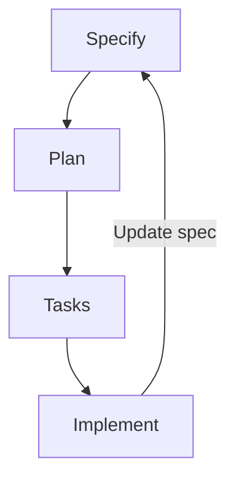

# Spec-Driven Development with Spec Kit

> Write a Markdown specification that captures project intent, then compile it into code through structured agent phases — making the spec, not the chat history, the source of truth.

## The Problem

Chat-based coding loses design decisions across interactions. Each new session starts without knowledge of prior architectural choices, naming conventions, or rejected approaches. Agents re-derive context from code that may not reflect the original intent, or they hallucinate conventions that contradict earlier decisions.

Spec-driven development addresses this by externalizing intent into a persistent document the agent reads on every compilation cycle.

## The Workflow

GitHub's [Spec Kit](https://github.com/github/spec-kit) formalizes the approach into phases, each producing Markdown artifacts that feed the next ([Spec-Driven Development with AI](https://github.blog/ai-and-ml/generative-ai/spec-driven-development-with-ai-get-started-with-a-new-open-source-toolkit/)).



**Specify** — Describe requirements in terms of user journeys and success criteria. Focus on *what* and *why*, not technology choices. The agent generates a detailed specification capturing who uses the system and what outcomes matter.

**Plan** — Provide architecture constraints, stack preferences, and non-functional requirements. The agent creates a technical plan respecting legacy systems, compliance rules, or performance targets.

**Tasks** — The agent decomposes the plan into small, reviewable units. Each task is concrete and testable — "create a user registration endpoint that validates email format" rather than "build the auth system."

**Implement** — The agent executes tasks sequentially. You review focused changes rather than large code dumps.

Spec Kit supports 23+ agents including Copilot, Claude Code, Cursor, and Gemini via slash commands (`/speckit.specify`, `/speckit.plan`, `/speckit.tasks`, `/speckit.implement`) ([github/spec-kit AGENTS.md](https://github.com/github/spec-kit/blob/main/AGENTS.md)).

## The Specification File

The core artifact is `main.md` — a structured Markdown document that mixes natural language requirements with embedded formal definitions ([Spec-Driven Development: Markdown as a Programming Language](https://github.blog/ai-and-ml/generative-ai/spec-driven-development-using-markdown-as-a-programming-language-when-building-with-ai/)).

A spec file typically contains:

- **User stories and behavioral sequences** — numbered interaction flows describing exact system behavior
- **Data contracts** — database schemas, API shapes, and state machines expressed in code blocks within Markdown
- **UI descriptions** — ASCII mockups or structured layout descriptions
- **Constraints** — performance budgets, security requirements, technology restrictions

The compilation prompt (`compile.prompt.md`) instructs the agent to read `main.md` and produce or update the implementation files. For smaller specs, agents detect changes automatically. For larger specs, you focus the agent on specific sections.

## Why Specs Persist Intent

The spec solves the same problem as [feature list files](../instructions/feature-list-files.md) and progress files, but at the project-intent level rather than the task level.

| Mechanism | Scope | Persists |
|-----------|-------|----------|
| Chat history | Single session | Decisions, reasoning |
| Progress files | Cross-session | Task status, blockers |
| Feature list files | Feature tracking | Acceptance criteria, pass/fail state |
| Specification file | Project intent | Design decisions, data contracts, behavioral requirements |

Anthropic's context engineering research identifies structured note-taking as critical for preserving intent across context resets ([Effective Context Engineering](https://www.anthropic.com/engineering/effective-context-engineering-for-ai-agents)). The specification file is the most comprehensive form of this pattern — it captures not just *what* was decided but *why*, in a format the agent re-reads every cycle.

## Trade-Offs

**Writing specs is harder than writing code for some problems.** Articulating requirements with the precision agents need can be more difficult than implementing the feature directly. Spec-driven development pays off most on projects where requirements are complex enough that losing context mid-implementation is the primary failure mode ([Spec-Driven Development: Markdown as a Programming Language](https://github.blog/ai-and-ml/generative-ai/spec-driven-development-using-markdown-as-a-programming-language-when-building-with-ai/)).

**Compilation slows as specs grow.** Larger specification files take longer to compile and consume more context window. The mitigation is modularization — breaking specs into multiple files scoped to subsystems ([Spec-Driven Development: Markdown as a Programming Language](https://github.blog/ai-and-ml/generative-ai/spec-driven-development-using-markdown-as-a-programming-language-when-building-with-ai/)).

**JSON outperforms Markdown for machine-readable tracking.** Anthropic's harness research found that models are less likely to inappropriately modify JSON files compared to Markdown files ([Effective Harnesses for Long-Running Agents](https://www.anthropic.com/engineering/effective-harnesses-for-long-running-agents)). For feature status tracking alongside specs, structured JSON remains more reliable than Markdown checklists.

**Specs drift from implementation and mislead agents when stale.** Static specs go out of sync with evolving code — a problem several 2025–2026 practitioner reports identify as the dominant failure mode. Isoform notes that "reality changes faster than specs do," and that keeping specs synchronized with code creates a maintenance tax that grows with system complexity ([Isoform, 2025](https://isoform.ai/blog/the-limits-of-spec-driven-development)). Augment Code argues that a stale spec misleads agents more dangerously than a stale design doc misleads humans, because agents execute the plan confidently without flagging divergence ([Augment Code, 2026](https://www.augmentcode.com/blog/what-spec-driven-development-gets-wrong)). Kent Beck's critique goes further: writing the entire specification before implementation encodes the assumption that nothing learned during implementation should change the spec, which contradicts how software actually evolves ([Kindred, 2026](https://brandonkindred.medium.com/same-patterns-new-hype-spec-driven-development-5183d8e8f704)). Treat the spec as a living artifact updated each cycle, not a frozen contract — and favor the approach for stable contracts and well-understood domains over exploratory work with evolving requirements.

## Ideal Use Cases

Spec Kit identifies three scenarios where the approach delivers the most value ([Spec-Driven Development with AI](https://github.blog/ai-and-ml/generative-ai/spec-driven-development-with-ai-get-started-with-a-new-open-source-toolkit/)):

- **Greenfield projects** — ensures the agent builds the intended solution rather than a generic pattern
- **Feature work in existing systems** — encodes architectural constraints so agents extend rather than bolt on
- **Legacy modernization** — captures essential business logic in a clean spec without inheriting technical debt

## Example

The following shows a minimal `main.md` specification for a user registration feature, demonstrating how user journeys, data contracts, and constraints are embedded together in a single file that the agent re-reads on every compilation cycle.

````markdown
# User Registration — Spec

## User Journey
1. User visits /register and submits email + password
2. System validates email format and password strength (min 8 chars, one digit)
3. System creates account and sends verification email
4. User clicks link in email; account is activated

## Data Contract
```sql
CREATE TABLE users (
  id UUID PRIMARY KEY DEFAULT gen_random_uuid(),
  email TEXT UNIQUE NOT NULL,
  password_hash TEXT NOT NULL,
  verified_at TIMESTAMPTZ,
  created_at TIMESTAMPTZ DEFAULT now()
);
```

## Constraints
- Passwords must never be stored in plaintext; use bcrypt with cost factor 12
- Verification tokens expire after 24 hours
- Registration endpoint must return 201 on success, 422 on validation failure
````

The corresponding `compile.prompt.md` tells the agent to read `main.md` and produce or update `src/auth/register.ts` and `src/auth/register.test.ts` accordingly. When a constraint changes (e.g. the expiry window shifts to 48 hours), updating `main.md` is the single edit — the next compile cycle propagates it to code and tests.

Running `/speckit.tasks` against this spec decomposes it into reviewable units:

```
1. Create users table migration (migration/001_users.sql)
2. Implement password hashing utility (src/auth/hash.ts)
3. Implement registration endpoint (src/auth/register.ts)
4. Implement verification token generation and email send
5. Write integration tests for success and error paths
```

Each task is concrete and independently verifiable, matching the **Tasks** phase of the Specify → Plan → Tasks → Implement workflow.

## Key Takeaways

- Spec-driven development externalizes project intent into a Markdown file that persists across agent sessions, eliminating context loss as the primary failure mode
- The four-phase workflow (specify, plan, tasks, implement) decomposes ambiguous requirements into testable implementation units
- Specifications complement rather than replace formal artifacts like types and tests — use both for maximum precision

## Related

- [Specification as Prompt](../instructions/specification-as-prompt.md)
- [Feature List Files](../instructions/feature-list-files.md)
- [WRAP Framework for Agent Instructions](../instructions/wrap-framework-agent-instructions.md)
- [Plan-First Loop](../workflows/plan-first-loop.md)
- [Agent-Driven Greenfield Product Development](agent-driven-greenfield.md)
- [Multi-Agent RAG Spec-to-Test](../verification/multi-agent-rag-spec-to-test.md)
- [Spec Complexity Displacement](../anti-patterns/spec-complexity-displacement.md) — the failure mode when specs become code-adjacent
- [Bootstrapping Coding Agents](../emerging/bootstrapping-coding-agents.md) — the theoretical extension where the spec alone is sufficient to regenerate the implementation
