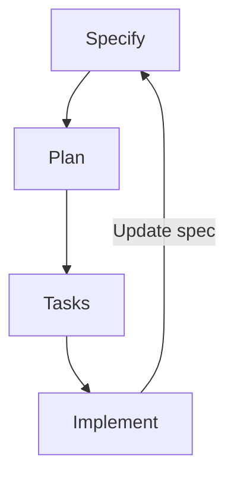

# Spec-Driven Development with Spec Kit

> Spec-driven development externalizes project intent into a Markdown specification that agents compile into code, making the spec the persistent source of truth.

## The problem

Chat-based coding loses design decisions between sessions. Each new session starts without the prior architectural choices, naming conventions, or rejected approaches. Agents [re-derive context](../context-engineering/context-priming.md) from code that may not reflect the original intent, or they invent conventions that contradict earlier decisions.

Spec-driven development fixes this. It moves intent into a persistent document the agent reads on every compilation cycle.

## The workflow

GitHub's [Spec Kit](https://github.com/github/spec-kit) formalizes the approach into phases, each producing Markdown artifacts that feed the next ([Spec-Driven Development with AI](https://github.blog/ai-and-ml/generative-ai/spec-driven-development-with-ai-get-started-with-a-new-open-source-toolkit/)).


```mermaid
graph TD
    A[Specify] --> B[Plan]
    B --> C[Tasks]
    C --> D[Implement]
    D -->|Update spec| A
```

Specify — Describe requirements as user journeys and success criteria. Focus on what the system does and why, not technology choices. The agent generates a [detailed specification](../instructions/specification-as-prompt.md) that captures who uses the system and what outcomes matter.

Plan — Provide architecture constraints, stack preferences, and non-functional requirements. The agent creates a technical plan that respects legacy systems, compliance rules, or performance targets.

Tasks — The agent [decomposes the plan into small, reviewable units](../patterns/multi-agent/oracle-task-decomposition.md). Each task is concrete and testable — "create a user registration endpoint that validates email format" rather than "build the auth system."

Implement — The agent runs the tasks one at a time. You review focused changes rather than large code dumps.

Spec Kit supports 23+ agents including Copilot, Claude Code, Cursor, and Gemini via slash commands (`/speckit.specify`, `/speckit.plan`, `/speckit.tasks`, `/speckit.implement`) ([github/spec-kit AGENTS.md](https://github.com/github/spec-kit/blob/main/AGENTS.md)).

## The specification file

The core artifact is `main.md` — a structured Markdown document that mixes natural-language requirements with embedded formal definitions ([Spec-Driven Development: Markdown as a Programming Language](https://github.blog/ai-and-ml/generative-ai/spec-driven-development-using-markdown-as-a-programming-language-when-building-with-ai/)).

A spec file usually contains:

- User stories and behavioral sequences — numbered interaction flows that describe exact system behavior
- Data contracts — database schemas, API shapes, and state machines written as code blocks within Markdown
- UI descriptions — ASCII mockups or structured layout descriptions
- Constraints — performance budgets, security requirements, technology restrictions

The compilation prompt (`compile.prompt.md`) tells the agent to read `main.md` and produce or update the implementation files. For smaller specs, agents detect changes on their own. For larger specs, you point the agent at specific sections.

## Why specs persist intent

The spec solves the same problem as [feature list files](../instructions/feature-list-files.md) and progress files, but at the project-intent level rather than the task level.

| Mechanism | Scope | Persists |
|-----------|-------|----------|
| Chat history | Single session | Decisions, reasoning |
| Progress files | Cross-session | Task status, blockers |
| Feature list files | Feature tracking | Acceptance criteria, pass/fail state |
| Specification file | Project intent | Design decisions, data contracts, behavioral requirements |

Anthropic's context engineering research identifies structured note-taking as critical for preserving intent across context resets ([Effective Context Engineering](https://www.anthropic.com/engineering/effective-context-engineering-for-ai-agents)). The specification file is the fullest form of this pattern. It captures not just what was decided but why, in a format the agent re-reads every cycle.

Microsoft frames the spec as a shared source of truth for humans and AI alike — the artifact both parties agree on before either starts, so AI-native engineering becomes an align-then-execute loop rather than an improvise-per-prompt one ([Microsoft Developer Blog — Spec-Driven Development and AI-Native Engineering](https://developer.microsoft.com/blog/spec-driven-development-ai-native-engineering)).

## Trade-offs

Writing specs is harder than writing code for some problems. Stating requirements with the precision agents need can be harder than building the feature directly. Spec-driven development pays off most on projects where requirements are complex enough that losing context mid-implementation is the primary failure mode ([Spec-Driven Development: Markdown as a Programming Language](https://github.blog/ai-and-ml/generative-ai/spec-driven-development-using-markdown-as-a-programming-language-when-building-with-ai/)).

Compilation slows as specs grow. Larger specification files take longer to compile and use more of the context window. The fix is to split specs into several files, each scoped to a subsystem ([Spec-Driven Development: Markdown as a Programming Language](https://github.blog/ai-and-ml/generative-ai/spec-driven-development-using-markdown-as-a-programming-language-when-building-with-ai/)).

JSON beats Markdown for machine-readable tracking. Anthropic's harness research found that models are less likely to wrongly modify JSON files than Markdown files ([Effective Harnesses for Long-Running Agents](https://www.anthropic.com/engineering/effective-harnesses-for-long-running-agents)). For feature-status tracking alongside specs, structured JSON stays more reliable than Markdown checklists.

Specs drift from implementation and mislead agents when stale. Static specs go out of sync with evolving code — a problem several 2025–2026 practitioner reports identify as the dominant failure mode. Isoform notes that "reality changes faster than specs do," and that keeping specs synchronized with code creates a maintenance tax that grows with system complexity ([Isoform, 2025](https://isoform.ai/blog/the-limits-of-spec-driven-development)). Augment Code argues that a stale spec misleads agents more dangerously than a stale design doc misleads humans, because agents follow the plan confidently without flagging divergence ([Augment Code, 2026](https://www.augmentcode.com/blog/what-spec-driven-development-gets-wrong)). Kent Beck's critique goes further: writing the entire specification before implementation assumes that nothing learned during implementation should change the spec, which contradicts how software actually evolves ([Kindred, 2026](https://brandonkindred.medium.com/same-patterns-new-hype-spec-driven-development-5183d8e8f704)). Treat the spec as a living artifact updated each cycle, not a frozen contract — and favor the approach for stable contracts and well-understood domains over exploratory work with evolving requirements.

Spec ceremony can be slower than iterative prompting for the same feature. Scott Logic rebuilt a feature from a hobby app using Spec Kit and compared it to iterative prompting: Spec Kit took 3.5+ hours and produced 2,577 lines of specification — much of it redundant — while iterative prompting finished the same feature in 23 minutes with comparable bug counts ([Scott Logic, 2025](https://blog.scottlogic.com/2025/11/26/putting-spec-kit-through-its-paces-radical-idea-or-reinvented-waterfall.html)). Their framing — "waterfall in Markdown" — argues that the structured phases bring back the up-front design overhead that agile workflows were built to remove. The implication is narrower than the headline: spec ceremony pays off when requirements are genuinely complex and stable, but for small, well-scoped changes the four-phase pipeline adds overhead that outweighs the context-persistence benefit.

## Ideal use cases

Spec Kit identifies three scenarios where the approach helps most ([Spec-Driven Development with AI](https://github.blog/ai-and-ml/generative-ai/spec-driven-development-with-ai-get-started-with-a-new-open-source-toolkit/)):

- Greenfield projects — the agent builds the intended solution rather than a generic pattern
- Feature work in existing systems — encodes architectural constraints so agents extend the system rather than bolt on to it
- Legacy modernization — captures essential business logic in a clean spec without inheriting technical debt

## Example

Here is a minimal `main.md` specification for a user registration feature. It shows how user journeys, data contracts, and constraints sit together in one file that the agent re-reads on every compilation cycle.

````markdown
# User Registration — Spec

## User Journey
1. User visits /register and submits email + password
2. System validates email format and password strength (min 8 chars, one digit)
3. System creates account and sends verification email
4. User clicks link in email; account is activated

## Data Contract
```sql
CREATE TABLE users (
  id UUID PRIMARY KEY DEFAULT gen_random_uuid(),
  email TEXT UNIQUE NOT NULL,
  password_hash TEXT NOT NULL,
  verified_at TIMESTAMPTZ,
  created_at TIMESTAMPTZ DEFAULT now()
);
```

## Constraints
- Passwords must never be stored in plaintext; use bcrypt with cost factor 12
- Verification tokens expire after 24 hours
- Registration endpoint must return 201 on success, 422 on validation failure
````

The matching `compile.prompt.md` tells the agent to read `main.md` and produce or update `src/auth/register.ts` and `src/auth/register.test.ts` to match. When a constraint changes (for example, the expiry window shifts to 48 hours), you edit `main.md` once — the next compile cycle propagates the change to code and tests.

Running `/speckit.tasks` against this spec decomposes it into reviewable units:

```
1. Create users table migration (migration/001_users.sql)
2. Implement password hashing utility (src/auth/hash.ts)
3. Implement registration endpoint (src/auth/register.ts)
4. Implement verification token generation and email send
5. Write integration tests for success and error paths
```

Each task is concrete and independently verifiable, matching the Tasks phase of the Specify → Plan → Tasks → Implement workflow.

## FAQ

**When is spec ceremony slower than just prompting iteratively?**

On small, well-scoped changes. Scott Logic rebuilt one hobby-app feature both ways: Spec Kit took over 3.5 hours and produced 2,577 lines of specification, much of it redundant, while iterative prompting finished the same feature in 23 minutes with comparable bug counts. The four-phase pipeline pays off when requirements are genuinely complex and stable.

**What goes wrong when the spec and the code drift apart?**

A stale spec misleads agents more dangerously than a stale design doc misleads humans, because agents follow the plan confidently without flagging divergence. Practitioner reports call this the dominant failure mode: reality changes faster than specs do, and keeping them synchronized is a maintenance tax that grows with system complexity. Treat the spec as a living artifact.

**Should feature status live inside the specification file?**

Keep it separate and structured. Anthropic's harness research found models are less likely to wrongly modify JSON files than Markdown files, so structured JSON stays more reliable than Markdown checklists for feature-status tracking. The Markdown spec holds project intent — user journeys, data contracts, UI descriptions, and constraints — while status tracking sits beside it in JSON.

**What slows compilation down as a project grows?**

Specification size. Larger spec files take longer to compile and consume more of the context window on every cycle. The fix is splitting the specification into several files, each scoped to a subsystem, then pointing the agent at specific sections; only smaller specs let the agent detect the changed parts on its own.

## Key Takeaways

- Spec-driven development externalizes project intent into a Markdown file that persists across agent sessions, eliminating context loss as the primary failure mode
- The four-phase workflow (specify, plan, tasks, implement) decomposes ambiguous requirements into testable implementation units
- Specifications complement rather than replace formal artifacts like types and tests — use both for maximum precision

## Related

- [Specification as Prompt](../instructions/specification-as-prompt.md)
- [Feature List Files](../instructions/feature-list-files.md)
- [WRAP Framework for Agent Instructions](../instructions/wrap-framework-agent-instructions.md)
- [Plan-First Loop](plan-first-loop.md)
- [Agent-Driven Greenfield Product Development](agent-driven-greenfield.md)
- [Multi-Agent RAG Spec-to-Test](../verification/multi-agent-rag-spec-to-test.md)
- [Spec Complexity Displacement](../patterns/anti-patterns/spec-complexity-displacement.md) — the failure mode when specs become code-adjacent
- [Bootstrapping Coding Agents](../emerging/bootstrapping-coding-agents.md) — the theoretical extension where the spec alone is sufficient to regenerate the implementation
