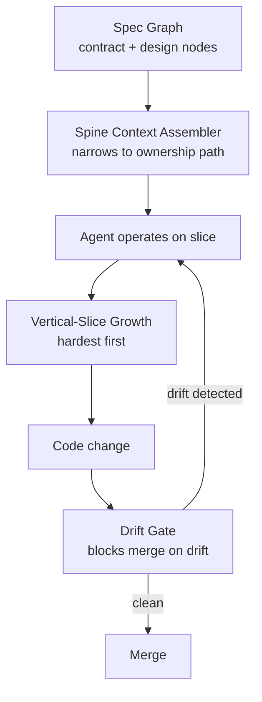

# Spec-Anchored Drift-Gated Architecture (Spec Growth Engine)

> Make spec-code divergence a blocking merge gate and narrow each agent to one ownership path in a machine-readable spec graph.

This workflow applies only under three conditions: a codebase large enough that whole-repo context degrades agent output, a specification mature enough that a blocking drift gate produces real signal rather than false-positive noise, and a domain where contracts are stable enough that gating merges on spec adherence does not amount to brittleness tax. Outside those bounds the maintenance cost of the spec graph exceeds the benefit. Within them, the four-component framework (spec graph, spine context assembler, vertical-slice growth protocol, drift gate) closes two failure modes simultaneously — context explosion and silent spec-code drift — without the overhead of heavyweight processes like RUP or MDA ([Grabowski, 2026](https://arxiv.org/abs/2606.27045)).

## The two failure modes

Existing spec-driven approaches like [Spec-Driven Development with Spec Kit](spec-driven-development.md) treat the specification as a compile source — a Markdown document the agent reads on every cycle. That posture closes one failure mode (chat-history-as-context loss) but leaves two open ([Grabowski, 2026](https://arxiv.org/abs/2606.27045)):

- Context explosion — the agent must reason over an entire repository at once, degrading output quality as the context window fills. Practitioner reports describe the same effect at the monorepo scale: "as a codebase grows past the agent's effective context window, it forgets older decisions and silently contradicts them" ([Augment Code, 2026](https://www.augmentcode.com/guides/multi-agent-ai-systems)).
- Silent spec-code drift — code evolves, the specification does not, and the divergence becomes invisible until it is costly to repair. The 2026 SDD tooling survey flags drift as the single blind spot across sixteen frameworks ([Spec-Driven Tool Landscape](https://specdriven.com/landscape/)). Augment Code's framing: "a stale spec misleads agents more dangerously than a stale design doc misleads humans, because agents follow the plan confidently without flagging divergence" ([Augment Code, 2026](https://www.augmentcode.com/blog/what-spec-driven-development-gets-wrong)).

The framework attacks both through orthogonal mechanisms.

## Spec graph and context assembly (layers 1-2)

### Layer 1: Spec graph with contract/design separation

The spec is not one Markdown file. It is a machine-readable graph whose nodes each carry an explicit contract (observable behavior, invariants, interface) and an explicit design (how the contract is realised). The separation is a direct application of Parnas information hiding — the contract is what consumers depend on; the design is what changes without breaking them ([Grabowski, 2026](https://arxiv.org/abs/2606.27045)). The structural prior art is the C4 model and Architecture Decision Records, which the paper cites as the established practice this layer extends to AI agents.

The graph format is implementation-defined — a node might be a YAML file with `contract:` keys for declared interface and invariants and `design:` keys for chosen implementation. What matters is that each node is addressable, edges encode dependency direction, and the contract half is machine-checkable.

### Layer 2: Spine context assembler — narrow to one ownership path

For any task, the assembler walks the spec graph from the touched node up to the spine and back down only along the ownership path — the sequence of nodes the change is authorised to modify. The agent loads that slice into context, not the whole graph. This is the same posture that nested AGENTS.md takes in monorepos: Codex builds an instruction chain "from your global ~/.codex/AGENTS.md plus every AGENTS.md along the path from your git root to your current directory" ([Codegateway, 2026](https://www.codegateway.dev/en/blog/agents-md-playbook-2026)). The shift it codifies is "from repo-wide defaults to path-aware defaults" ([d4b, 2026](https://www.d4b.dev/blog/2026-04-03-ai-agents-in-monorepos-what-to-configure-differently-from-a-single-product-repo)).

The spec graph generalises that file-system convention into a structured graph the assembler can traverse mechanically — ownership is declared in the graph, not inferred from CODEOWNERS.

## Growth protocol and drift gate (layers 3-4)

### Layer 3: Vertical-slice growth protocol — hardest first

Implementation proceeds in vertical slices that cut through the spec graph end-to-end, ordered hardest first. The pattern is Walking Skeleton: build the thinnest end-to-end path first, then thicken it. Ordering the hardest slice first surfaces architectural risk early, before downstream slices anchor on assumptions the hardest slice will invalidate ([Grabowski, 2026](https://arxiv.org/abs/2606.27045)). The Reflexion lineage in the paper's prior art means each completed slice updates the spec graph with what was learned, not just with what was built.

### Layer 4: Drift gate — block the merge on divergence

A deterministic CI check compares the post-change code against the contract half of every touched spec node — typically a signature-equivalence check on declared interfaces plus property or contract tests on declared invariants. If a contract has shifted without a corresponding spec change — or the inverse, a spec change without a corresponding code update — the merge is blocked. The structural prior art is architectural fitness functions: ArchUnit for the JVM, Dependency Cruiser for TypeScript, both of which "as CI gates catch cyclic dependencies and permission drift that no other layer touches" ([Augment Code, 2026](https://www.augmentcode.com/guides/ai-agent-pre-merge-verification)). Independent SDD tooling has converged on the same direction: Spec Kit shipped `/speckit.reconcile` for post-hoc drift reconciliation, OpenSpec proposes changes through delta specs (ADDED / MODIFIED / REMOVED) merged into the source of truth on archive ([Spec Kit vs OpenSpec](https://intent-driven.dev/knowledge/spec-kit-vs-openspec/)), and Tessl marketed "zero spec drift by construction" before pivoting away ([Spec-Driven Tool Landscape](https://specdriven.com/landscape/)).

## Triggers and constraints

- Trigger — every code change. The gate runs at PR-open and at every push to the PR branch.
- Bound on agent authority — the agent may edit code or propose spec changes, but both updates land in the same PR; the gate compares the post-change spec against the post-change code. A code-only PR that drifts the contract fails; a spec-only PR that does not match the still-current code also fails. The gate is symmetric.
- Rollout posture — start in advisory mode. The Augment Code guidance: "if your specs have accumulated drift, a premature hard gate will over-block and erode team trust in the system — start with advisory mode while you audit and tighten your specs" ([Augment Code, 2026](https://www.augmentcode.com/guides/ai-agent-pre-merge-verification)).

## Multi-tool coverage

Tool-agnostic. The spec graph is implementation-defined, the spine context assembler is a deterministic graph walk, the vertical-slice protocol is process, and the drift gate is CI. Claude Code, Copilot, and Cursor can each operate on a spec-graph slice given the assembler output as project context. The framework's value lies in the artifact and the gate, not in any one agent harness.

The closest practitioner-shipped surface today is nested AGENTS.md in Codex, Copilot CLI, and Cursor — the file-system path is the de facto ownership path, and `chat.useNestedAgentsMdFiles` is the assembler ([Codegateway, 2026](https://www.codegateway.dev/en/blog/agents-md-playbook-2026)). The Spec Growth Engine generalises this to a graph that does not map one-to-one to directories, so cross-cutting concerns can be expressed as edges rather than as duplicate files.

## When This Backfires

- Early-stage or exploratory work — when requirements are still being discovered, a blocking drift gate locks in premature contracts. Scott Logic rebuilt one feature with Spec Kit (3.5+ hours, 2,577 lines of spec) versus iterative prompting (23 minutes) and reported comparable bug counts — the spec ceremony was waterfall in Markdown ([Scott Logic, 2025](https://blog.scottlogic.com/2025/11/26/putting-spec-kit-through-its-paces-radical-idea-or-reinvented-waterfall.html)). The drift gate sharpens this overhead by codifying it as a merge block.
- Weak or stale specs at rollout — flipping the gate from advisory to blocking before auditing spec quality produces false positives that destroy trust in the gate. The recommended posture is advisory mode until the spec corpus is known-clean ([Augment Code, 2026](https://www.augmentcode.com/guides/ai-agent-pre-merge-verification)).
- Small or single-package codebases — ownership-path scoping pays back only when whole-repo context is the bottleneck. Below that scale the spec-graph maintenance cost dominates with no context-window win, and the equivalent benefit is already available through a single AGENTS.md or CLAUDE.md ([d4b, 2026](https://www.d4b.dev/blog/2026-04-03-ai-agents-in-monorepos-what-to-configure-differently-from-a-single-product-repo)).
- Genuinely cross-cutting concerns — features that legitimately span multiple ownership paths (auth, observability, cross-service migrations) cannot be scoped to one slice without spec-graph contortions. Modelling them as edges or as explicit cross-cutting nodes shifts the problem rather than solving it.
- Maintenance tax on the spec graph itself — Isoform's critique generalises: "reality changes faster than specs do," and keeping specs synchronized with code creates a maintenance tax that grows with system complexity ([Isoform, 2025](https://isoform.ai/blog/the-limits-of-spec-driven-development)). The drift gate does not eliminate that tax; it relocates it from "noticed at production incident" to "noticed at PR review." If the team cannot fund the relocation, the gate becomes a blocker the team starts routing around.

## Example

Consider a hypothetical multi-package web service with auth, payment, and inventory subsystems. The spec graph carries one node per public contract — `auth.session-token`, `payment.charge`, `inventory.reservation` — and one node per design choice that consumers do not depend on (`auth.session-store-redis`, `payment.idempotency-key-format`). An agent assigned to "rotate the session token signing key" gets the spine assembler output: `auth.session-token` contract + `auth.session-store-redis` design + the dependency edges that touch them. The `payment` and `inventory` subtrees do not load. A PR that changes signing-key handling in `auth.session-store-redis` but leaves the `auth.session-token` contract untouched passes the drift gate — design changed, contract did not, no consumer break. A second PR that mutates the `auth.session-token` interface without updating the contract node fails the gate until either the spec is updated (a deliberate breaking change with consumer notification) or the implementation reverts.

The advisory-mode rollout means the first month emits drift findings as PR comments rather than blocks; once the false-positive rate drops below the team's tolerance the gate flips to blocking.

The pattern this workflow composes — separating contract from implementation and gating a CI step on adherence to the contract — does not yet have a dedicated `docs/patterns/` page in this repo. Until one lands, the `docs/agent-design/` and `docs/context-engineering/` siblings linked below are the closest building blocks.

## Key Takeaways

- The framework only pays back under three conditions: a large enough repo for ownership-path scoping to win on context, a spec corpus already audited for accuracy, and contracts stable enough that the gate is not a brittleness tax.
- Context explosion and silent spec-code drift are orthogonal failure modes; the spine context assembler and the drift gate address them independently.
- Drift gating is corroborated by independent SDD tooling (Spec Kit `/speckit.reconcile`, OpenSpec delta specs) — the direction is real practice, not just paper theory.

## Related

- [Spec-Driven Development with Spec Kit](spec-driven-development.md) — the spec-as-compile-source predecessor this framework extends with drift gating and ownership-path scoping
- [Verification-Centric Development for AI-Generated Code](verification-centric-development.md) — the broader posture of layered verification that the drift gate is one specific layer of
- [Parallel Polyglot Ports as a Spec-Ambiguity Oracle](parallel-polyglot-ports-spec-oracle.md) — a complementary spec-disambiguation workflow that uses port divergence to find spec gaps
- [Sparse-Checkout Worktrees for Monorepo Agent Isolation](../tools/claude/sparse-paths-monorepo-isolation.md) — the file-system equivalent of the spine context assembler for Claude Code
- [Coding Agent Scope Expansion: When to Extend Beyond the Codebase](../agent-design/coding-agent-scope-expansion.md) — the broader question of agent scope of which ownership-path scoping is one tactical answer
