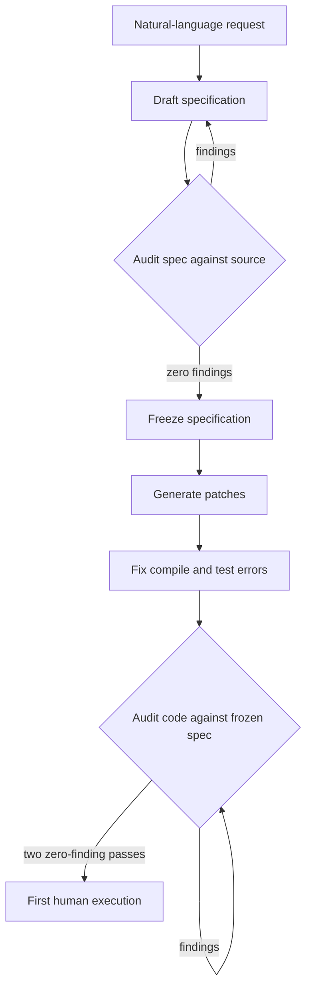

# Specification-First Convergence Without a Test Oracle

> With no test to tell right from wrong, freeze a specification as the referent and audit the code against it until two passes find nothing.

Specification-first convergence substitutes a written specification for a missing test oracle. An agent drafts the specification, re-audits it against the real source code until the audits stop producing findings, and freezes it. Code is then generated against that frozen document and audited back against it in fresh sessions until two consecutive passes return zero findings. Correctness is argued from repeated conformance to a fixed referent rather than from a green suite or a human reading the diff.

The evidence is one instrumented case study published with a declared competing interest: the author's company designed and distributes the agent used ([Abenhaim, 2026](https://arxiv.org/abs/2608.12440v1)). Treat it as a protocol worth trying under the conditions below, not a measured success rate.

## The missing-oracle problem

Two failures meet on a large refactor. Review stops scaling first: telemetry across more than 10,000 developers shows AI-assisted work producing 98% more pull requests but 91% longer review times, with delivery metrics flat ([Farrag, 2026](https://arxiv.org/abs/2605.01160v1)). Past a certain change size the case study argues review stops being a quality gate at all, because no reviewer holds the entire dependency graph of such a change in working memory ([Abenhaim, 2026](https://arxiv.org/abs/2608.12440v1)).

Tests would normally take over, and sometimes they cannot. The dominant evaluation paradigm for coding agents assumes an oracle: [SWE-bench](https://arxiv.org/abs/2310.06770) scores a patch by whether it passes a held-out, human-written test suite, so the correct behavior is encoded before the agent starts ([Abenhaim, 2026](https://arxiv.org/abs/2608.12440v1)). In the reported case the goal was that a streaming generation survive the closing of its UI panel and reattach on reopening with no loss or duplication of tokens, across a 717,725-line TypeScript codebase of 3,648 files. No test could be held out, because the behavior did not exist before the change.

## When this applies

Three conditions have to hold together.

No oracle exists for the target behavior. Where a reference implementation, a transpilation source, or a held-out suite is available, use it instead: [oracle-gated delegation](oracle-gated-delegation.md) covers that case and costs far less.

The change is past the size where review works. The reported operation touched 189 files in one commit, 31 of them new ([Abenhaim, 2026](https://arxiv.org/abs/2608.12440v1)).

The specification can be frozen. The argument rests on auditing successive drafts against one unchanging document, so requirements that move during implementation break it: consecutive passes then compare against different referents.

## Three implementation layers

The case study names five phases (ideate, specify, refine, code, verify), which group into the three loops below. Each phase runs in its own session, so only the artifact crosses the boundary. That is [discrete phase separation](../patterns/agent-design/discrete-phase-separation.md) applied to a refactor, with the specification as the artifact that carries between phases.

### Layer 1: Specification refinement

The agent turns the request into a formal specification, then re-analyzes that specification against the real source code and rewrites it. Fourteen such cycles averaging 35 minutes each produced roughly 85 corrections and expanded scope from 110 to 160 affected files as previously unnoticed dependencies were identified. Cycle 14 returned no findings, so the cycle-13 document became the frozen reference ([Abenhaim, 2026](https://arxiv.org/abs/2608.12440v1)).

### Layer 2: Atomic implementation

Asked to implement the frozen specification, the agent declined the request in its original form, reporting that "a partial implementation would have left the repository in an inconsistent state and violated the specification's atomicity requirement". It proposed a ten-step decomposition; three segments were requested instead and accepted, running 2 hours 21 minutes in total. Compilation, typing, and unit-test failures were corrected in a separate session, a deliberate design choice to keep those signals visible ([Abenhaim, 2026](https://arxiv.org/abs/2608.12440v1)).

### Layer 3: Conformance verification

Fresh sessions compare the code against the frozen document and correct what deviates. This targets architectural conformity, not compilation validity. Seventeen cycles produced 116 code corrections, and across all 31 audit passes 201 defects were corrected before any human ran the code ([Abenhaim, 2026](https://arxiv.org/abs/2608.12440v1)).

## The stopping rule

Verification continued until two consecutive cycles returned zero findings, at cycles 16 and 17. Phase 2 ran end to end without the program being executed once, and the first manual execution came after the seventeenth cycle ([Abenhaim, 2026](https://arxiv.org/abs/2608.12440v1)).

The per-cycle counts are the part worth studying: they do not decay smoothly. Verification cycles produced 10, 12, 9, 21, 2, 7, 8, 13, 6, 3, 3, 4, 4, 4, 10, 0, 0 corrections in order. Cycle 15 turned up ten defects after three consecutive cycles of four.

That matters because the default for iterative loops points the other way. In generate-validate-repair loops driven by an executable check, most achievable gains land in the first three or four rounds, which is why [bounded repair-loop iterations](../verification/bounded-repair-loop-iterations.md) recommends capping there. A four-round cap applied to this verification loop would have stopped with defects still in the code. The referent explains the difference: a repair loop reads a deterministic signal and goes quiet once the signal does, while an audit loop re-samples a model's conformance judgment, which errs in both directions ([Jin and Chen, 2026](https://arxiv.org/abs/2603.00539v1)).

## Why it works

Control moves from after generation to before it, and the referent stays fixed. Each verification session is a fresh context comparing code against a document written and frozen before that code existed, which supplies the external comparison point self-correction otherwise lacks. On reasoning tasks, models correcting their own responses without external feedback struggle to improve and sometimes degrade ([Huang et al., 2024](https://arxiv.org/abs/2310.01798v2)). Freezing the specification is what converts self-review into comparison against something.

The two loops also differ in unit cost, which is why they are separate layers. As the case study puts it, "a defect caught in the specification costs a paragraph to fix, the same defect caught after generation costs a set of interdependent code changes" ([Abenhaim, 2026](https://arxiv.org/abs/2608.12440v1)). Neither loop asks the model to be reliable on any single pass. Repetition against a fixed target is the mechanism.

## Triggers and constraints

Every phase is manual. The operator confirms scope after ideation, relaunches or freezes after each refinement cycle, confirms each implementation segment, and accepts the corrections or stops at two consecutive zero-finding passes ([Abenhaim, 2026](https://arxiv.org/abs/2608.12440v1)). Nothing here runs on a schedule or a push event, and the agent's authority is bounded by the frozen document rather than by a permission list.

Nothing in the protocol depends on a particular tool. It constrains session structure and the referent, so any agent that can hold a long specification in context and run fresh sessions can execute it.

## When this backfires

An oracle is available or cheap to build. Where the goal is pinning current behavior rather than checking it against intent, [regression and characterization testing](../verification/derived-specification-test-generation.md) already treat the running implementation as the oracle, and that referent costs pennies to re-run and survives into every later change. The case study leaned on such a signal itself, running the pre-existing unit suite after the change and reporting no regression ([Abenhaim, 2026](https://arxiv.org/abs/2608.12440v1)), so only the new behavior lacked an oracle.

The audit step is an operation LLMs misjudge. Asked whether an implementation conforms to a natural-language requirement, models frequently misclassify correct code as non-compliant, and more detailed prompting raises the misjudgment rate rather than improving judgement quality ([Jin and Chen, 2026](https://arxiv.org/abs/2603.00539v1)). A zero-finding pass is therefore consistent with a saturated detector as much as with a clean codebase. [Structured two-stage verification](../verification/llm-static-verification-natural-language-requirements.md) is the mitigation: mine discrete checkable rules from the specification, then judge each one in isolation.

The change is small enough to review. Below the size where review stops functioning, 31 audit passes cost more than a colleague reading the diff. The reported three-day operation consumed USD 2,430 in model inference ([Abenhaim, 2026](https://arxiv.org/abs/2608.12440v1)).

The model is weaker than the one characterized. The case study reports a specific frontier model in extended reasoning mode and states that the protocol's behavior with weaker models is not characterized there ([Abenhaim, 2026](https://arxiv.org/abs/2608.12440v1)).

The evidence base is thin, and the paper says so first. Its limitations name a single case, no control condition, self-reported results from the author who designed the tool, a closed-source codebase that cannot be replayed, and a definition of "no bug observed" covering first execution, roughly thirty subsequent sessions, and the automated test suite, which it states is not a proof of absence of latent defects ([Abenhaim, 2026](https://arxiv.org/abs/2608.12440v1)).

## Key takeaways

- Freeze the specification before generating, and audit the code against that frozen document rather than against current intent.
- Audit the specification against the source code first, because that is where defects are cheapest to remove.
- Do not carry the three-to-four-round repair-loop cap into an audit loop; the reported correction counts rose again at cycle 15.
- Two consecutive zero-finding passes is a stopping rule, not a correctness proof, and the conformance judgment underneath it is unreliable.
- One self-reported case with declared competing interests is grounds to try the protocol on a bounded change, not to adopt it as policy.

## Related

- [Oracle-Gated Delegation Beyond Your Domain Expertise](oracle-gated-delegation.md) — the same delegation question when a decisive mechanical check does exist.
- [Spec-Driven Development with Spec Kit](spec-driven-development.md) — keeping intent in a document rather than in chat history.
- [Discrete Phase Separation](../patterns/agent-design/discrete-phase-separation.md) — the single-agent building block each phase here relies on.
- [LLM Static Verification Against Natural-Language Requirements](../verification/llm-static-verification-natural-language-requirements.md) — structuring the audit step so conformance judgment degrades less.
- [Bounded Repair-Loop Iterations](../verification/bounded-repair-loop-iterations.md) — the iteration cap this verification loop does not obey.
