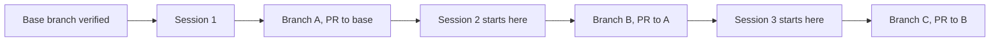

# Stacked Agent Sessions on Unmerged Feature Branches

> Each new agent session branches off the previous session's unmerged branch, so a long modernization lands as an ordered stack of reviewable pull requests.

A stacked agent session starts from the branch an earlier session produced, not from main. The earlier work is already applied in the working tree, so the new session treats it as ground truth instead of re-deriving or conflicting with it. Each session opens its own pull request targeting the branch below it, and the chain lands on main from the bottom up.

Use this when a change breaks into slices that depend on each other. It pays under four conditions: the base branch matches what is deployed, the slices are genuinely dependent, the bottom of the stack gets reviewed promptly, and your platform's stacking support holds the chain.

## Why stack sessions

A modernization that spans weeks lands as several dependent slices rather than one change. GitHub's senior director for developer advocacy, modernizing a 2014 dashboard she built herself — React 15, Less, and era-appropriate react-bootstrap — reports that the first attempt was abandoned because it had been founded on the wrong base branch, and that what worked was "a series of tasks in the same repository, where each session builds off each other" ([Stacked sessions and pull requests in the GitHub Copilot app](https://github.blog/ai-and-ml/github-copilot/stacked-sessions-and-pull-requests-in-the-github-copilot-app/)).

Without stacking, the branch topology leaves two options. Wait for each PR to merge before starting the next session, and review latency sets your throughput. Or start the next session from main, where the previous session's work is absent by construction — the agent reasons against a tree that does not contain it, and the two changes meet for the first time at merge.

Stacking removes the wait without removing the review. Work continues on top of an unmerged branch while the branch below it sits in review.

## Three implementation layers



### Layer 1: verify the base

Check what is actually deployed before the first session, not after. The source case shows the cost of skipping this: a partially modernized `dev` branch carried the deployed features while the new work targeted `main`, and the divergence invalidated the session built on it ([GitHub Blog](https://github.blog/ai-and-ml/github-copilot/stacked-sessions-and-pull-requests-in-the-github-copilot-app/)). A wrong base does not cost you one session. It costs you every session above the mistake.

### Layer 2: found each session on the previous branch

Point the new session at the previous session's branch, then let it work. In GitHub Copilot's cloud agent you pick the starting branch when you assign the task: "Choose which branch Copilot should start from. Whether you want Copilot to work off a feature branch, a bug fix branch, or any other starting point" ([GitHub Changelog, 2025-09-24](https://github.blog/changelog/2025-09-24-pick-the-repository-and-base-branch-when-assigning-issues-to-copilot/)).

Check what your tool's worktree command defaults to, because some default against you here. Claude Code creates new worktrees from the repository's default branch, and `worktree.baseRef` accepts only `fresh` or `head`: "You can't set `worktree.baseRef` to a branch name. To start a worktree from a specific existing branch, create it with git directly" ([Claude Code worktrees](https://code.claude.com/docs/en/worktrees)). Claude Code subagent worktrees inherit the same default, so a delegated session drops out of the stack silently unless you set the base. Plain `git worktree add <path> -b <name>` behaves differently, branching from current HEAD, which is why the explicit form below names the base branch.

### Layer 3: stack the pull requests

Each session opens a PR targeting the branch below it. GitHub's native support treats this as "an ordered series of pull requests that each represent focused layers of your change", and when you merge part of a stack "the pull requests above it stay open and automatically rebase and retarget" ([GitHub Changelog, 2026-07-30](https://github.blog/changelog/2026-07-30-stacked-pull-requests-are-now-in-public-preview/)). Without native support, retarget each PR by hand as the layer below it merges.

## Triggers and constraints

Start a stacked session when the previous session's output is committed and pushed, and the next slice reads from it. Do not start one from a dirty tree — the new session needs a stable base to reason against, which is the isolation property described in [ACID for Agent Repository State](../patterns/agent-design/acid-for-agent-repository-state.md).

Two constraints bound the agent's authority in each session. Scope each session to one slice, so its PR stays inside the reviewable-size envelope documented in [Agent-Driven PR Slicing](../code-review/agent-driven-pr-slicing.md). And never let a session rewrite history below its own base, because every branch above inherits the rewrite.

## Tool coverage

The mechanism is base-branch selection plus session scoping, so it is tool-agnostic. Alongside the hosted branch picker above, two commands cover any agent that runs against a local checkout:

```bash
# Session N+1 on the branch session N produced
git worktree add ../project-next previous-branch

# Or start from the pull request itself (Claude Code)
claude --worktree "#1234"
```

`--worktree "#1234"` fetches `pull/<number>/head` from origin ([Claude Code worktrees](https://code.claude.com/docs/en/worktrees)), which is the stacked-session primitive without any stacking product. Either route gives the session its own checkout, so the layers do not overwrite each other's files — the isolation property covered in [Worktree Isolation](worktree-isolation.md).

## Why it works

The chain breaks the dependency between review and progress. Because the next session is founded on the previous session's branch rather than main, it starts from a tree that already contains that work, so the agent neither re-derives those decisions nor conflicts with them, and the engineer keeps moving while the earlier PR waits for review ([GitHub Blog](https://github.blog/ai-and-ml/github-copilot/stacked-sessions-and-pull-requests-in-the-github-copilot-app/)). The chain also keeps each PR small enough to review, and reviewer attention is the dominant cost on agent-authored PRs — the evidence for that sits in [Agent PR Volume vs. Value](../code-review/agent-pr-volume-vs-value.md) and [Agent-Authored PR Integration](../code-review/agent-authored-pr-integration.md).

## When this backfires

- The bottom PR sits unreviewed. Auto-rebase and retarget rescue a partially merged stack ([GitHub Changelog](https://github.blog/changelog/2026-07-30-stacked-pull-requests-are-now-in-public-preview/)), but nothing rescues a stack whose base layer never gets read. Every change requested at the bottom propagates upward through each branch.
- The slices are not actually dependent. Independent passes gain nothing from a chain and cost you a dependency graph plus several open PRs. Land them on main in sequence instead.
- The platform stacking is immature. GitHub's is public preview as of 2026-07-30, with merge queue support still rolling out ([GitHub Changelog](https://github.blog/changelog/2026-07-30-stacked-pull-requests-are-now-in-public-preview/)). Users of the preview report merges landing only the bottom layer, required status checks that never report because the PR is evaluated against its literal base rather than the stack base, a merge button that stays green when a rebase is required, no stack reordering on the web, and no merging of intermediate stages ([community discussion 201439](https://github.com/orgs/community/discussions/201439)).
- A tool default silently unstacks a session. A Claude Code worktree created without setting the base branches from the repository's default branch, so a session you believe is stacked is a fresh branch off main that will collide with the layer it was meant to build on ([Claude Code worktrees](https://code.claude.com/docs/en/worktrees)).

## Example

Abandon-and-reroot is the recovery path, not an exception. When the base turns out to be wrong, close the doomed PR, start a fresh session on the correct branch, and carry the earlier decisions across rather than discarding them.

In the source case, the author discovered the deployment ran from `dev`, not `main`, then asked: "Let's close this and start a new session as a fresh branch off of dev, yes." Copilot closed PR #573 and created a fresh session branched off `dev` to port the styling and accessibility work, after which a react-bootstrap removal session stacked on top of the port ([GitHub Blog](https://github.blog/ai-and-ml/github-copilot/stacked-sessions-and-pull-requests-in-the-github-copilot-app/)).

The decisions survive; only the branch topology changes. That is why rerooting is cheaper than restarting.

## Key Takeaways

- Found each session on the previous session's unmerged branch so work continues while earlier PRs wait for review.
- Verify the base branch against what is deployed before the first session — a wrong base invalidates every session above it.
- Some agent worktree tooling (Claude Code) branches from the repository's default branch unless told otherwise — check your tool's default and set the base explicitly, or the session is not stacked.
- Treat abandon-and-reroot as the standard recovery: close the PR, reroot the session, carry the decisions across.
- Skip the stack when the slices are independent, when the bottom layer will not be reviewed promptly, or when your platform's stacking support cannot hold the chain.

## Related

- [Agent-Driven PR Slicing](../code-review/agent-driven-pr-slicing.md) — the inverse operation: one finished branch split into several PRs at review time
- [Agent-Authored PR Integration](../code-review/agent-authored-pr-integration.md) — why reviewer engagement, not correctness, decides whether an agent PR merges
- [Agent PR Volume vs. Value](../code-review/agent-pr-volume-vs-value.md) — the reviewer-attention cost that motivates keeping each layer small
- [ACID for Agent Repository State](../patterns/agent-design/acid-for-agent-repository-state.md) — the commit and isolation discipline each session in the stack depends on
- [Concurrent Agent Pull Requests and Merge-Conflict Cost](concurrent-agent-pr-merge-conflicts.md) — what happens when agent branches run in parallel instead of in a chain
